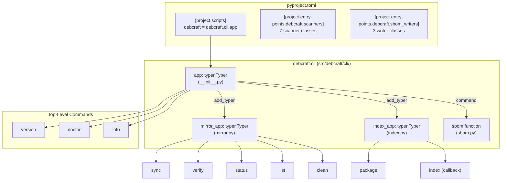

# Design Document: CLI Resync

## Overview

This design covers resynchronizing the `debcraft` CLI entry point so that all commands introduced across milestones M0–M7 are properly registered, discoverable, and functional. The existing implementation already contains the necessary command definitions and sub-app registrations — the design focuses on ensuring correctness of the wiring, validating entry points, and establishing a test harness that guarantees the full command surface is accessible.

The CLI is built on Typer with Rich for output formatting. The entry point is `debcraft.cli:app` (a `typer.Typer` instance), registered as a console script in `pyproject.toml`. Sub-apps (`mirror`, `index`) are added via `app.add_typer()`, while the `sbom` command is registered via `app.command()`.

### Current State

The `src/debcraft/cli/__init__.py` module already:
- Creates the top-level `app = typer.Typer(...)` instance
- Imports and registers `mirror_app` from `debcraft.cli.mirror`
- Imports and registers `index_app` from `debcraft.cli.index`
- Imports and registers the `sbom` function from `debcraft.cli.sbom`
- Defines `version`, `doctor`, and `info` commands inline
- Defines a `main` callback handling `--verbose` and bare invocation

The resync work is primarily about **verification and validation** — ensuring this wiring is complete, correct, and tested.

## Architecture



### Design Decisions

1. **No structural changes needed**: The existing `__init__.py` already registers all commands and sub-apps in the correct order. The resync is about hardening, not restructuring.

2. **Lazy imports preserved**: The current pattern of importing sub-app modules after `app` creation (with `# noqa: E402`) is intentional — it prevents circular imports and ensures `app` exists before registration. This pattern is correct and should be preserved.

3. **Entry point validation via tests**: Rather than adding runtime validation of entry points (which would slow startup), correctness is ensured through property-based tests that verify all declared entry points are resolvable.

## Components and Interfaces

### CLI Entry Point (`src/debcraft/cli/__init__.py`)

The central module that wires the complete command surface:

| Component | Type | Responsibility |
|-----------|------|---------------|
| `app` | `typer.Typer` | Top-level CLI application |
| `main` callback | Function | Global options (`--verbose`), bare invocation handler |
| `version` | Command | Display version string |
| `doctor` | Command | Environment health checks |
| `info` | Command | Display environment details |
| `mirror_app` | Sub-App | Mirror management commands |
| `index_app` | Sub-App | Repository indexing commands |
| `sbom` | Command | SBOM generation |

### Sub-App: Mirror (`src/debcraft/cli/mirror.py`)

| Sub-Command | Description |
|-------------|-------------|
| `sync` | Synchronize configured repositories |
| `verify` | Checksum verification of cached files |
| `status` | Display mirror status metrics |
| `list` | List configured repositories |
| `clean` | Remove unreferenced cache files |

### Sub-App: Index (`src/debcraft/cli/index.py`)

| Sub-Command | Description |
|-------------|-------------|
| (default callback) | Index all/specified repositories |
| `package` | Look up package metadata |

### Entry Points (`pyproject.toml`)

| Group | Entry Points | Count |
|-------|-------------|-------|
| `project.scripts` | `debcraft = "debcraft.cli:app"` | 1 |
| `debcraft.scanners` | directory, docker, oci, iso, qcow2, img, ami | 7 |
| `debcraft.sbom_writers` | spdx_3_0, spdx_2_3, cyclonedx | 3 |

### Interface: Command Registration Contract

Each command or sub-app must satisfy:
1. **Importable without error** from its declared module path
2. **Registered on `app`** before the first invocation
3. **Produces help text** when invoked with `--help`
4. **Appears in parent `--help`** output with a description

## Data Models

This feature operates on CLI metadata rather than domain data. The relevant data structures are:

### DoctorCheck (existing)

```python
@dataclass
class DoctorCheck:
    name: str
    passed: bool
    message: str
    details: str | None = None
```

### EnvironmentInfo (existing)

```python
@dataclass
class EnvironmentInfo:
    version: str
    python_version: str
    python_path: Path
    platform: str
    architecture: str
    package_location: Path
    venv_path: Path | None
```

### Expected Command Surface (validation reference)

```python
EXPECTED_TOP_LEVEL_COMMANDS = {"version", "doctor", "info", "sbom"}
EXPECTED_SUB_APPS = {"mirror", "index"}
EXPECTED_MIRROR_SUBCOMMANDS = {"sync", "verify", "status", "list", "clean"}
EXPECTED_INDEX_SUBCOMMANDS = {"package"}  # plus the default index callback

EXPECTED_SCANNER_ENTRY_POINTS = {"directory", "docker", "oci", "iso", "qcow2", "img", "ami"}
EXPECTED_WRITER_ENTRY_POINTS = {"spdx_3_0", "spdx_2_3", "cyclonedx"}
```

### OutputFormat (existing enum used by sbom)

```python
class OutputFormat(str, Enum):
    SPDX_3_0 = "spdx_3_0"
    SPDX_2_3 = "spdx_2_3"
    CYCLONEDX = "cyclonedx"
```

## Correctness Properties

*A property is a characteristic or behavior that should hold true across all valid executions of a system — essentially, a formal statement about what the system should do. Properties serve as the bridge between human-readable specifications and machine-verifiable correctness guarantees.*

### Property 1: Format validation accepts only valid formats

*For any* string value, the SBOM format validation function SHALL accept the string if and only if it is a member of the supported format set `{spdx_3_0, spdx_2_3, cyclonedx}`. Invalid strings SHALL be rejected with an appropriate error, and the valid set SHALL remain unchanged.

**Validates: Requirements 4.2, 4.3**

### Property 2: Help accessibility for all registered commands

*For any* command path in the set of registered commands (top-level commands, sub-app commands, and sub-app sub-commands), invoking that command path with `--help` SHALL exit with code 0 and SHALL NOT produce import errors or tracebacks in the output.

**Validates: Requirements 5.3, 5.4, 5.5, 7.2**

### Property 3: Entry point resolution for all declared plugins

*For any* entry point declared in the `debcraft.scanners` or `debcraft.sbom_writers` groups in pyproject.toml, loading the entry point via `importlib.metadata.entry_points()` and calling `.load()` SHALL resolve to an importable class without raising `ImportError` or `AttributeError`.

**Validates: Requirements 6.2, 6.3, 6.4**

## Error Handling

### Import Errors at Registration Time

If a sub-app module fails to import during `__init__.py` execution, the entire CLI will fail to start. This is by design — a broken import indicates a code issue that must be fixed, not a runtime condition to handle gracefully.

**Mitigation**: Property 2 and Property 3 tests catch these issues before deployment.

### Invalid Format Values (sbom)

The `_validate_formats` function checks format strings against `OutputFormat` values. Invalid formats produce a user-friendly error listing the invalid values and valid options, then exit with code 1.

### Missing Artifact / Unwritable Output Dir (sbom)

Validated upfront before the workflow executes. Errors produce descriptive messages and non-zero exit codes.

### No Repositories Configured (mirror sync/clean)

Both `sync` and `clean` check for empty config.repositories before proceeding. If empty, they display an error message and exit with code 1.

### Database Not Found (mirror verify/status, index package)

Commands that query databases handle the missing-database case gracefully:
- `mirror verify`: exits with error if mirror.db doesn't exist
- `mirror status`: shows "never" for last sync and 0 for counts
- `index package`: exits with error if metadata.db doesn't exist

### Global Verbose Flag Errors

The `--verbose` flag only controls logger configuration. It cannot fail independently.

## Testing Strategy

### Test Framework

- **pytest** with `typer.testing.CliRunner` for CLI invocation
- **Hypothesis** (already in dev dependencies) for property-based tests
- Tests placed in existing directory structure:
  - Unit tests: `tests/unit/test_cli.py` (extended)
  - Property tests: `tests/properties/infrastructure/test_cli_registration_properties.py`

### Unit Tests (Example-Based)

| Test | Validates |
|------|-----------|
| `test_version_displays_current_version` | Req 1.1 |
| `test_doctor_all_checks_pass` | Req 1.2, 1.4 |
| `test_doctor_reports_failure_exit_code_1` | Req 1.3 |
| `test_info_displays_all_fields` | Req 1.5 |
| `test_help_lists_all_top_level_commands` | Req 5.1 |
| `test_help_lists_all_sub_apps` | Req 5.2 |
| `test_mirror_help_lists_subcommands` | Req 5.5 |
| `test_index_help_lists_subcommands` | Req 5.5 |
| `test_bare_invocation_shows_help` | Req 7.3 |
| `test_verbose_with_no_subcommand_shows_help` | Req 7.4 |
| `test_verbose_sets_debug_level` | Req 7.1 |
| `test_sbom_no_format_defaults_to_all` | Req 4.4 |
| `test_sbom_missing_artifact_exits_nonzero` | Req 4.7 |
| `test_mirror_sync_no_repos_exits_nonzero` | Req 2.8 |
| `test_cli_app_is_typer_instance` | Req 6.1 |

### Property-Based Tests

Each property test uses Hypothesis with minimum 100 iterations.

| Property Test | Property | Tag |
|--------------|----------|-----|
| `test_format_validation_accepts_only_valid_formats` | Property 1 | Feature: cli-resync, Property 1: Format validation accepts only valid formats |
| `test_all_commands_produce_help` | Property 2 | Feature: cli-resync, Property 2: Help accessibility for all registered commands |
| `test_all_entry_points_resolve` | Property 3 | Feature: cli-resync, Property 3: Entry point resolution for all declared plugins |

**Property test library**: Hypothesis (already configured in pyproject.toml dev dependencies)

**Configuration**: Each property test runs with `@settings(max_examples=100)` minimum.

### Integration Tests

| Test | Validates |
|------|-----------|
| `test_mirror_sync_with_config` | Req 2.1 |
| `test_mirror_verify_with_seeded_db` | Req 2.2, 2.3 |
| `test_mirror_status_output` | Req 2.4 |
| `test_mirror_list_output` | Req 2.5 |
| `test_mirror_clean_removes_unreferenced` | Req 2.6 |
| `test_mirror_clean_abort` | Req 2.7 |
| `test_index_with_verified_files` | Req 3.1 |
| `test_index_repository_filter` | Req 3.2 |
| `test_index_package_lookup` | Req 3.3 |
| `test_index_no_verified_files` | Req 3.4 |
| `test_sbom_generation_workflow` | Req 4.1 |
| `test_sbom_output_dir_creation` | Req 4.5 |
