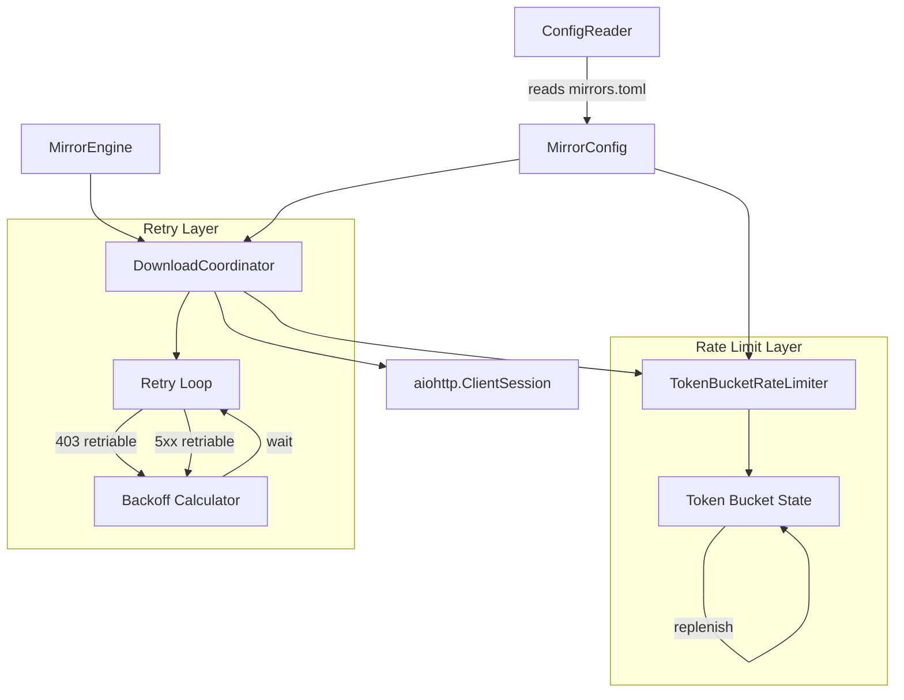

# Design Document: Client-Side Rate Limiting

## Overview

This design introduces a token bucket rate limiter to the debcraft mirror download client to prevent CloudFront CDN rate-limiting (HTTP 403) during bulk mirror operations. The solution operates at three levels:

1. **Proactive throttling** — A token bucket limiter gates outgoing requests to stay below CDN thresholds.
2. **Reactive retry** — HTTP 403 responses are reclassified as retriable rate-limit signals with aggressive backoff.
3. **Configuration** — Rate-limit parameters are exposed in `mirrors.toml` so operators can tune throughput without code changes.

The design preserves the existing download coordinator's architecture (frozen dataclasses, asyncio, aiohttp) and integrates the rate limiter as an injected dependency rather than modifying the HTTP layer directly.

## Architecture



### Key Design Decisions

1. **Token bucket over sliding window**: The token bucket algorithm naturally accommodates bursts (up to `burst_size` requests can fire immediately) while maintaining steady-state throughput — matching CDN rate-limit behavior which typically allows short bursts but penalizes sustained high rates.

2. **Rate limiter as a separate class**: Keeping `TokenBucketRateLimiter` independent of `DownloadCoordinator` enables unit testing of rate-limiting logic in isolation using pure time-based properties, and allows future reuse for other HTTP operations.

3. **403 reclassification via a new error class**: Rather than special-casing status code 403 inline, a new `HttpRateLimitError` exception class (inheriting from `DownloadError`) makes the retry loop's branching explicit and preserves the existing error hierarchy conventions.

4. **Separate backoff parameters for 403 vs 5xx**: CDN rate limits require longer recovery windows than transient server errors. Parameterizing the backoff function avoids coupling the two retry strategies.

5. **Acquire-before-request model**: Every HTTP request (including retries) must acquire a token before firing. This ensures that retry storms after a 403 wave don't immediately re-trigger rate limits.

## Components and Interfaces

### TokenBucketRateLimiter

A new class at `src/debcraft/infrastructure/mirror/rate_limiter.py`.

```python
class TokenBucketRateLimiter:
    """Async token bucket rate limiter for HTTP request throttling."""

    def __init__(self, rate: float, burst_size: int) -> None:
        """Initialize with tokens-per-second rate and max burst capacity."""
        ...

    async def acquire(self, timeout: float = 60.0) -> None:
        """Acquire a single token. Blocks until available or timeout.

        Raises:
            RateLimitTimeoutError: If token not acquired within timeout.
        """
        ...

    def cancel_waiters(self) -> None:
        """Cancel all tasks currently waiting to acquire a token."""
        ...
```

**Internal state:**
- `_tokens: float` — current available tokens (starts at `burst_size`)
- `_max_tokens: int` — maximum token count (`burst_size`)
- `_rate: float` — tokens replenished per second
- `_last_replenish: float` — monotonic timestamp of last replenishment
- `_lock: asyncio.Lock` — serializes token operations
- `_waiters: list[asyncio.Future]` — pending acquire calls for cancellation

### HttpRateLimitError

A new exception class in `src/debcraft/infrastructure/mirror/errors.py`.

```python
class HttpRateLimitError(DownloadError):
    """Raised when an HTTP 403 response indicates CDN rate limiting.

    Rate-limit errors are retriable with extended backoff.
    """

    def __init__(
        self,
        url: str,
        status_code: int = 403,
        retry_count: int = 0,
        cause: Exception | None = None,
    ) -> None:
        self.status_code = status_code
        super().__init__(url, f"HTTP {status_code} rate limit", retry_count, cause)
```

### RateLimitTimeoutError

A new exception in `src/debcraft/infrastructure/mirror/errors.py`.

```python
class RateLimitTimeoutError(MirrorError):
    """Raised when a token cannot be acquired within the timeout period."""

    def __init__(self, timeout: float, cause: Exception | None = None) -> None:
        super().__init__(
            f"Rate limiter token not acquired within {timeout}s timeout",
            cause,
        )
```

### Modified: MirrorConfig

Two new fields added to the frozen dataclass:

```python
@dataclass(frozen=True)
class MirrorConfig:
    repositories: list[RepositoryConfig] = field(default_factory=list)
    download_timeout: int = 300
    max_connections_per_repo: int = 20
    max_total_connections: int = 60
    rate_limit_rps: float = 50.0  # NEW
    rate_limit_burst: int | None = None  # NEW: None means "use max_connections_per_repo"
```

The `rate_limit_burst` default of `None` is resolved at runtime to `max_connections_per_repo` (matching Requirement 2.4). This avoids field-ordering issues with frozen dataclasses.

### Modified: DownloadCoordinator

Key changes to the existing class:

1. Accept an optional `rate_limiter: TokenBucketRateLimiter | None` parameter in `__init__`.
2. Before each HTTP request (in `_attempt_download`), call `await self._rate_limiter.acquire()`.
3. In `download_file`, catch `HttpRateLimitError` in the retry loop alongside `HttpServerError`.
4. Split `_compute_backoff_delay` into a parameterized helper accepting base/max/jitter arguments.
5. In `close()`, call `rate_limiter.cancel_waiters()` to release blocked tasks.
6. Log effective rate-limit config at DEBUG level at the start of `download_batch`.

### Modified: ConfigReader

1. Parse `rate_limit_rps` from `[settings]` as a float (default 50.0).
2. Parse `rate_limit_burst` from `[settings]` as an int (default: `max_connections_per_repo`).
3. Add validation: `1 <= rate_limit_rps <= 1000`, `1 <= rate_limit_burst <= 200`.
4. Reject non-numeric values with a clear error message.

### Modified: _attempt_download

The status code branching changes from:

```python
if 400 <= status < 500:
    raise HttpClientError(...)
```

to:

```python
if status == 403:
    raise HttpRateLimitError(url=url, status_code=status, retry_count=attempt)
if 400 <= status < 500:
    raise HttpClientError(url=url, status_code=status, retry_count=attempt)
```

### Modified: download_file retry loop

The retry loop exception handling expands to:

```python
except HttpClientError:
    raise  # Still non-retriable for non-403 4xx
except HttpRateLimitError as exc:
    last_error = exc
    if attempt < _MAX_ATTEMPTS - 1:
        delay = _compute_backoff_delay(
            attempt, base=5.0, maximum=60.0, jitter_factor=0.5
        )
        # ... log and sleep
except (HttpServerError, NetworkError, ...) as exc:
    last_error = exc
    if attempt < _MAX_ATTEMPTS - 1:
        delay = _compute_backoff_delay(
            attempt, base=1.0, maximum=30.0, jitter_factor=0.25
        )
        # ... log and sleep
```

## Data Models

### Configuration Schema (mirrors.toml)

```toml
[settings]
download_timeout = 300
max_connections_per_repo = 20
max_total_connections = 60
rate_limit_rps = 50        # requests per second (1-1000)
rate_limit_burst = 20      # max burst size (1-200, default: max_connections_per_repo)
```

### Token Bucket Internal State

| Field | Type | Description |
|-------|------|-------------|
| `_tokens` | `float` | Current available tokens |
| `_max_tokens` | `int` | Maximum token capacity (burst_size) |
| `_rate` | `float` | Tokens added per second |
| `_last_replenish` | `float` | `time.monotonic()` timestamp |
| `_lock` | `asyncio.Lock` | Serializes acquire/replenish |
| `_waiters` | `list[asyncio.Future]` | Pending tasks for cancellation |

### Backoff Parameters

| Context | Base (s) | Max (s) | Jitter Factor |
|---------|----------|---------|---------------|
| 5xx / Network errors | 1.0 | 30.0 | 0.25 |
| 403 Rate-limit | 5.0 | 60.0 | 0.50 |

### Backoff Formula

```
delay = min(base * 2^attempt, max) + random.uniform(0, computed_delay * jitter_factor)
total = min(delay, max)
```

For 403 with jitter_factor=0.5:
- Attempt 0: base=5s, jitter up to 2.5s → range [5, 7.5]
- Attempt 1: base=10s, jitter up to 5s → range [10, 15]


## Correctness Properties

*A property is a characteristic or behavior that should hold true across all valid executions of a system — essentially, a formal statement about what the system should do. Properties serve as the bridge between human-readable specifications and machine-verifiable correctness guarantees.*

### Property 1: Token bucket replenishment computes correctly

*For any* valid rate (1–1000), burst_size (1–200), initial token count, and non-negative elapsed time, the number of tokens after replenishment SHALL equal `min(current_tokens + rate * elapsed_time, burst_size)`. Additionally, upon initialization, the token count SHALL equal `burst_size`.

**Validates: Requirements 1.5, 1.6**

### Property 2: Token bucket acquire blocks when empty and times out

*For any* token bucket with zero available tokens and a configured rate, calling acquire SHALL block until at least one token is replenished. If the replenishment time exceeds the 60-second timeout, acquire SHALL raise `RateLimitTimeoutError`. When tokens are available (count ≥ 1), acquire SHALL return in under 1 millisecond.

**Validates: Requirements 1.2, 1.3, 1.4**

### Property 3: Token bucket enforces maximum request rate

*For any* configured rate R and burst_size B, if N requests are issued where N > B, the minimum time to complete all N acquire calls SHALL be at least `(N - B) / R` seconds, ensuring the sustained request rate never exceeds R requests per second.

**Validates: Requirements 1.1**

### Property 4: Rate limit config parsing round-trip

*For any* numeric value in [1, 1000] written as `rate_limit_rps` and any integer in [1, 200] written as `rate_limit_burst` in a valid TOML `[settings]` section, parsing the configuration SHALL produce a `MirrorConfig` with those exact values. When `rate_limit_burst` is omitted, it SHALL default to the value of `max_connections_per_repo`.

**Validates: Requirements 2.1, 2.2, 2.4**

### Property 5: Rate limit config validation rejects invalid values

*For any* `rate_limit_rps` value less than 1 or greater than 1000, or any `rate_limit_burst` value less than 1 or greater than 200, or any non-numeric value in either field, the configuration validator SHALL produce at least one error message indicating the accepted range or expected type.

**Validates: Requirements 2.5, 2.6, 2.7**

### Property 6: HTTP 403 is retriable with 3 total attempts

*For any* download URL that consistently returns HTTP 403, the Download_Coordinator SHALL make exactly 3 HTTP requests (1 initial + 2 retries), proving 403 is classified as retriable. In contrast, for any non-403 4xx status code, exactly 1 request SHALL be made.

**Validates: Requirements 3.1, 3.3**

### Property 7: Exhausted 403 retries produce correct failure result

*For any* download URL that returns HTTP 403 on all 3 attempts, the returned `DownloadResult` SHALL have `success=False`, `status_code=403`, a non-empty error message describing rate-limit failure, and `retry_count` equal to the number of retries performed (2).

**Validates: Requirements 3.4**

### Property 8: Successful 403 retry reports correct attempt number

*For any* download URL where the server returns 403 for the first N attempts (N ∈ {1, 2}) and then succeeds, the returned `DownloadResult` SHALL have `success=True` and `retry_count` equal to N (the zero-indexed attempt on which success occurred).

**Validates: Requirements 3.5**

### Property 9: 403 retry cleans up .part file before retrying

*For any* download that receives an HTTP 403 response, the `.part` file created during that failed attempt SHALL be deleted before the backoff wait begins. After all retries are exhausted without success, no `.part` file SHALL remain on disk.

**Validates: Requirements 3.6**

### Property 10: 403 backoff delay bounds

*For any* attempt number N (0-indexed), the computed backoff delay for a 403 rate-limit response SHALL fall within the range `[min(5 * 2^N, 60), min(min(5 * 2^N, 60) * 1.5, 60)]` seconds. The base delay SHALL be 5 seconds, the maximum SHALL be 60 seconds, and jitter SHALL be between 0 and 50% of the computed base delay.

**Validates: Requirements 5.1, 5.2, 5.3**

### Property 11: Rate limiter acquire is called before every HTTP request

*For any* batch of download tasks with a total of M HTTP requests (including retries), the rate limiter's `acquire` method SHALL be called exactly M times, ensuring all requests — both initial attempts and retries — are throttled.

**Validates: Requirements 4.1, 4.3**

## Error Handling

### Error Classification

| HTTP Status | Error Class | Retriable | Backoff |
|-------------|------------|-----------|---------|
| 403 | `HttpRateLimitError` | Yes (3 attempts) | 5s base, 60s max, 50% jitter |
| 400-499 (non-403) | `HttpClientError` | No | N/A |
| 500-599 | `HttpServerError` | Yes (3 attempts) | 1s base, 30s max, 25% jitter |
| Connection error | `NetworkError` | Yes (3 attempts) | 1s base, 30s max, 25% jitter |
| Token timeout | `RateLimitTimeoutError` | No | N/A |

### Error Propagation

1. **RateLimitTimeoutError** — If acquire times out (60s), the request is not sent. The error propagates up to the batch handler, which records a failed `DownloadResult`.
2. **HttpRateLimitError** — Caught in the retry loop. After exhausting retries, a failed `DownloadResult` is returned with `status_code=403`.
3. **Cancellation on close** — When `DownloadCoordinator.close()` is called, all pending `acquire()` waiters are cancelled via `cancel_waiters()`. This raises `asyncio.CancelledError` in waiting tasks, which propagates through the TaskGroup and terminates the batch cleanly.

### Partial File Cleanup

The existing .part file cleanup in `_attempt_download` already handles 403 because `HttpRateLimitError` is raised in the same location as `HttpClientError` (after the status code check), and the `except (HttpClientError, HttpServerError)` block already cleans up. With the new code, the 403 check happens before the generic 4xx check, and the `.part` cleanup in the `except aiohttp.ClientError` and explicit `if part_path.exists(): part_path.unlink()` patterns cover it.

## Testing Strategy

### Property-Based Tests (Hypothesis)

The project already uses Hypothesis extensively. All property tests will use `hypothesis>=6.100` with a minimum of 100 examples per property (200 for pure math properties).

**Library**: Hypothesis (already in dev dependencies)
**Configuration**: `@settings(max_examples=200)` for pure functions, `@settings(max_examples=50, deadline=None)` for async tests with I/O.

Each property test is tagged with:
```python
"""Feature: client-rate-limiting, Property N: {property_text}"""
```

### Test File Organization

| File | Properties Covered |
|------|-------------------|
| `tests/properties/infrastructure/test_rate_limiter_properties.py` | Properties 1, 2, 3 |
| `tests/properties/infrastructure/test_rate_limit_config_properties.py` | Properties 4, 5 |
| `tests/properties/infrastructure/test_rate_limit_retry_properties.py` | Properties 6, 7, 8, 9, 10, 11 |

### Unit Tests (Example-Based)

| Test | Requirement |
|------|-------------|
| Default rate_limit_rps is 50 when omitted | 2.3 |
| Debug log emitted at batch start with rps/burst values | 4.4 |
| cancel_waiters unblocks waiting tasks | 4.5 |
| Active downloads not interrupted during throttling | 4.2 |

### Strategies (Hypothesis)

```python
# Rate config values
rate_strategy = st.floats(min_value=1.0, max_value=1000.0, allow_nan=False, allow_infinity=False)
burst_strategy = st.integers(min_value=1, max_value=200)
attempt_strategy = st.integers(min_value=0, max_value=2)

# Invalid config values
invalid_rate_strategy = st.one_of(
    st.floats(max_value=0.99),
    st.floats(min_value=1000.01),
)
invalid_burst_strategy = st.one_of(
    st.integers(max_value=0),
    st.integers(min_value=201),
)

# Time simulation
elapsed_time_strategy = st.floats(min_value=0.0, max_value=120.0, allow_nan=False, allow_infinity=False)
```

### Integration Tests

- End-to-end batch download with rate limiting enabled, verifying no 403 storms
- Coordinator close during active throttling releases waiters
- Concurrent downloads share global rate limiter instance
