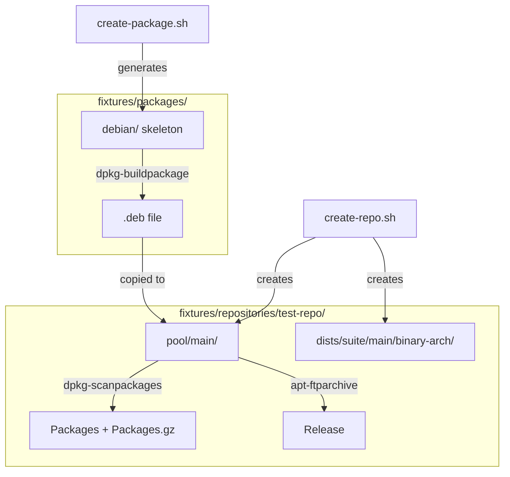

# Design Document: Debian Test Repositories

## Overview

This feature provides two self-contained shell scripts — `create-package.sh` and `create-repo.sh` — that generate minimal Debian packages and APT repositories for testing debcraft's repository parsing, package analysis, and mirror synchronization. The scripts live in the `fixtures/` directory and produce artifacts small enough to commit to git.

The design is inspired by geofft's "newpackage" and "fakerepo" utilities: generate the absolute minimum viable Debian packaging artifacts using standard tools (`dpkg-buildpackage`, `dpkg-scanpackages`, `apt-ftparchive`).

### Design Decisions

1. **Shell scripts over Python**: The scripts wrap dpkg/apt tooling that is inherently shell-oriented. Keeping them as bash scripts avoids introducing a Python dependency for fixture generation and makes them usable outside the debcraft virtualenv.

2. **Two separate scripts**: Package creation and repository assembly are orthogonal concerns. Separating them allows creating packages without assembling a full repository, and populating repositories from pre-built packages.

3. **Regeneration over storage**: Rather than committing large binary .deb files, the scripts are committed alongside a small set of pre-built artifacts. A `Makefile` or wrapper script enables full regeneration when tools are available.

4. **Debhelper 7 compat level**: The lowest compat level that supports the minimal `dh $@` rules pattern, producing the smallest possible packages.

## Architecture



### Directory Layout

```
fixtures/
├── create-package.sh          # Package skeleton generator
├── create-repo.sh             # Repository assembler
├── Makefile                   # Convenience targets for regeneration
├── README.md                  # Usage documentation
├── packages/
│   └── {name}-{version}/      # Generated package source trees
│       └── debian/
│           ├── control
│           ├── changelog
│           ├── rules
│           └── compat
└── repositories/
    └── {repo-name}/
        ├── pool/
        │   └── main/
        │       └── {first-letter}/{package-name}/
        │           └── {name}_{version}_{arch}.deb
        └── dists/
            └── {suite}/
                ├── Release
                └── main/
                    └── binary-{arch}/
                        ├── Packages
                        └── Packages.gz
```

## Components and Interfaces

### create-package.sh

**Purpose**: Generate a minimal Debian package skeleton and optionally build it.

**Interface**:
```bash
./create-package.sh [OPTIONS] PACKAGE_NAME

Options:
  -v, --version VERSION      Package version (default: 1.0-1)
  -a, --arch ARCHITECTURE    Architecture (default: all)
  -d, --depends DEPENDS      Comma-separated dependencies
  -D, --description TEXT     Package description
  -o, --output-dir DIR       Output directory (default: fixtures/packages/)
  -b, --build                Also build the .deb file
  -h, --help                 Show usage
```

**Behavior**:
1. Validates that `PACKAGE_NAME` follows Debian naming rules (lowercase, alphanumeric + hyphens)
2. Creates `{output-dir}/{name}-{version}/debian/` directory
3. Generates `control`, `changelog`, `rules`, `compat` files
4. If `--build` is specified, invokes `dpkg-buildpackage -us -uc -b` in the source tree
5. Exits with error code 1 and descriptive message if required tools are missing

**Generated File Contents**:

`debian/control`:
```
Source: {name}
Section: misc
Priority: optional
Maintainer: Test <test@example.com>
Build-Depends: debhelper (>= 7)
Standards-Version: 3.9.8

Package: {name}
Architecture: {arch}
Depends: {depends}
Description: {description}
```

`debian/rules`:
```makefile
#!/usr/bin/make -f
%:
	dh $@
```

`debian/compat`:
```
7
```

`debian/changelog`:
```
{name} ({version}) unstable; urgency=low

  * Test package

 -- Test <test@example.com>  Mon, 01 Jan 2024 00:00:00 +0000
```

### create-repo.sh

**Purpose**: Create an APT repository structure and generate metadata from pool contents.

**Interface**:
```bash
./create-repo.sh [OPTIONS] REPO_NAME

Options:
  -s, --suite SUITE          Suite name (default: stable)
  -a, --arch ARCHITECTURES   Comma-separated architectures (default: amd64)
  -c, --component COMPONENT  Component name (default: main)
  -o, --output-dir DIR       Output directory (default: fixtures/repositories/)
  -p, --add-package DEB      Add a .deb to the pool (repeatable)
  -m, --generate-metadata    Generate Packages/Release indexes
  -h, --help                 Show usage
```

**Behavior**:
1. Creates the directory structure: `pool/{component}/` and `dists/{suite}/{component}/binary-{arch}/` for each architecture
2. If `--add-package` is specified, copies .deb files into pool using Debian naming conventions (`pool/{component}/{first-letter}/{package-name}/`)
3. If `--generate-metadata` is specified:
   - Runs `dpkg-scanpackages` to generate `Packages` files
   - Compresses to `Packages.gz` using gzip
   - Runs `apt-ftparchive release` to generate `Release` file with Date, Architectures, and Components fields
4. Exits with error code 1 if required tools are missing

### Pool Naming Convention

Files are placed in the pool following standard Debian conventions:
- Regular packages: `pool/{component}/{first-letter}/{package-name}/{filename}`
- Library packages (lib*): `pool/{component}/{first-four-letters}/{package-name}/{filename}`

Examples:
- `hello_1.0-1_all.deb` → `pool/main/h/hello/hello_1.0-1_all.deb`
- `libfoo_2.0-1_amd64.deb` → `pool/main/libf/libfoo/libfoo_2.0-1_amd64.deb`

### Makefile

Convenience targets for common operations:

```makefile
.PHONY: all clean packages repos

all: packages repos

packages:
	./create-package.sh --build -v 1.0-1 hello
	./create-package.sh --build -v 2.0-1 -a amd64 libfoo
	./create-package.sh --build -v 1.0-1 -d "hello" depends-on-hello

repos:
	./create-repo.sh -a amd64,arm64 -p packages/hello_1.0-1_all.deb \
	    -p packages/libfoo_2.0-1_amd64.deb -m test-repo

clean:
	rm -rf packages/*/
	rm -rf repositories/*/
```

## Data Models

### Package Metadata (debian/control fields)

| Field | Type | Default | Constraints |
|-------|------|---------|-------------|
| Package | string | (required) | `[a-z0-9][a-z0-9.+\-]+` |
| Architecture | string | "all" | Valid Debian arch or "all"/"any" |
| Version | string | "1.0-1" | Valid Debian version format |
| Depends | string | "" | Comma-separated package relations |
| Description | string | "Test package" | Non-empty string |
| Section | string | "misc" | Fixed |
| Priority | string | "optional" | Fixed |
| Maintainer | string | "Test \<test@example.com\>" | Fixed |

### Repository Structure

| Component | Path Pattern | Purpose |
|-----------|-------------|---------|
| Pool | `pool/{component}/{prefix}/{name}/` | Binary package storage |
| Packages | `dists/{suite}/{component}/binary-{arch}/Packages` | Package index |
| Packages.gz | `dists/{suite}/{component}/binary-{arch}/Packages.gz` | Compressed index |
| Release | `dists/{suite}/Release` | Archive metadata |

### Release File Fields

| Field | Value |
|-------|-------|
| Origin | debcraft-test |
| Label | debcraft-test |
| Suite | {suite} |
| Codename | {suite} |
| Date | RFC 2822 formatted UTC timestamp |
| Architectures | Space-separated architecture list |
| Components | {component} |
| Description | Debcraft test repository |

## Correctness Properties

*A property is a characteristic or behavior that should hold true across all valid executions of a system — essentially, a formal statement about what the system should do. Properties serve as the bridge between human-readable specifications and machine-verifiable correctness guarantees.*

### Property 1: Package skeleton completeness

*For any* valid Debian package name, running the Package_Creator shall produce a directory containing exactly the files `debian/control`, `debian/changelog`, `debian/rules`, and `debian/compat`.

**Validates: Requirements 1.1**

### Property 2: Control file reflects arguments

*For any* valid combination of package name, architecture, version, dependencies, and description arguments, the generated `debian/control` file shall contain those exact values in the corresponding fields (Package, Architecture, Depends, Description) and the `debian/changelog` shall contain the version.

**Validates: Requirements 1.3, 1.5, 6.1, 6.2**

### Property 3: Repository directory structure

*For any* valid combination of repository name, suite name, and set of architectures, the Repository_Creator shall produce a directory tree containing `pool/main/` and `dists/{suite}/main/binary-{arch}/` for each specified architecture.

**Validates: Requirements 3.1, 3.2, 3.5**

### Property 4: Pool naming convention

*For any* valid .deb filename with a package name, the file shall be placed in the pool at `pool/{component}/{prefix}/{package-name}/` where prefix is the first four characters for packages starting with "lib" and the first character otherwise.

**Validates: Requirements 3.6**

### Property 5: Metadata regeneration idempotence

*For any* repository with a fixed set of .deb files in the pool, running metadata generation twice in succession shall produce identical Packages and Release file contents.

**Validates: Requirements 4.5**

### Property 6: Release file parsability

*For any* generated repository, the Release file shall parse successfully with debcraft's `ReleaseParser` and the resulting `ReleaseMetadata` shall have non-null `date`, `architectures`, and a non-empty `files` list.

**Validates: Requirements 8.2**

## Error Handling

| Scenario | Behavior |
|----------|----------|
| Missing `dpkg-buildpackage` | Exit code 1, message: "Error: dpkg-buildpackage not found. Install dpkg-dev." |
| Missing `dpkg-scanpackages` | Exit code 1, message: "Error: dpkg-scanpackages not found. Install dpkg-dev." |
| Missing `apt-ftparchive` | Exit code 1, message: "Error: apt-ftparchive not found. Install apt-utils." |
| Missing `gzip` | Exit code 1, message: "Error: gzip not found." |
| Invalid package name | Exit code 1, message: "Error: Invalid package name '{name}'. Must match [a-z0-9][a-z0-9.+\\-]+" |
| No package name argument | Exit code 1, show usage |
| No repo name argument | Exit code 1, show usage |
| .deb file not found for --add-package | Exit code 1, message: "Error: File not found: {path}" |
| Output directory not writable | Exit code 1, message: "Error: Cannot write to {dir}" |

All error messages are written to stderr. The scripts use `set -euo pipefail` for strict error handling.

## Testing Strategy

### Unit Tests (pytest)

Example-based tests that verify specific behaviors:

- **Default values**: Architecture defaults to "all", version defaults to "1.0-1", suite defaults to "stable"
- **Supported architectures**: Verify "all", "amd64", "arm64", "any" all produce valid skeletons
- **Multiple versions**: Same package name with different versions creates distinct outputs
- **Script existence**: Verify scripts exist at expected fixture paths
- **README content**: Verify documentation covers commands and directory layout

### Property-Based Tests (hypothesis)

Property tests validate universal behaviors across generated inputs:

- **Property 1**: Generate random valid package names → verify skeleton file completeness
- **Property 2**: Generate random args (name, arch, version, deps, description) → verify control file content
- **Property 3**: Generate random repo configs (name, suite, arch list) → verify directory structure
- **Property 4**: Generate random package names → verify pool path follows naming convention
- **Property 5**: Generate fixed pool contents → verify metadata regeneration is idempotent
- **Property 6**: Generate repositories → verify Release file parses with ReleaseParser

**Configuration**:
- Minimum 100 iterations per property test
- Each test tagged with: `Feature: debian-test-repos, Property {N}: {title}`
- Properties 1-4 test the script's output parsing logic (can use Python helpers that replicate script behavior)
- Properties 5-6 require actual Debian tools and should be marked `@pytest.mark.integration`

### Integration Tests

Tests requiring actual Debian tools (dpkg-dev, apt-utils):

- Build a .deb from generated skeleton, verify size < 5KB
- Create complete single-package repo, verify total size < 20KB
- Configure as `file://` APT source, run `apt-get update` with `Acquire::AllowInsecureRepositories=true`

These tests are marked with `@pytest.mark.integration` and skipped when tools are unavailable.

### Test Data Generators (hypothesis strategies)

```python
from hypothesis import strategies as st

# Valid Debian package names
package_names = st.from_regex(r"[a-z][a-z0-9.+\-]{1,30}", fullmatch=True)

# Valid Debian version strings
versions = st.from_regex(r"[0-9]+\.[0-9]+\-[0-9]+", fullmatch=True)

# Valid architectures
architectures = st.sampled_from(["all", "any", "amd64", "arm64", "i386", "armhf"])

# Architecture sets (for multi-arch repos)
arch_sets = st.lists(architectures, min_size=1, max_size=4, unique=True)

# Suite names
suites = st.sampled_from(["stable", "unstable", "testing", "bookworm", "trixie"])

# Dependency strings
dependencies = st.lists(
    st.from_regex(r"[a-z][a-z0-9\-]{1,20}", fullmatch=True),
    min_size=0, max_size=3
).map(", ".join)

# Descriptions (safe ASCII)
descriptions = st.text(
    alphabet=st.characters(whitelist_categories=("L", "N", "Z")),
    min_size=1, max_size=80
).filter(lambda s: s.strip())
```
