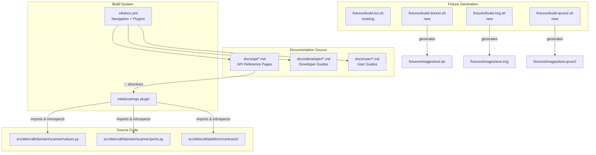

# Design Document: Documentation Resync and Expansion

## Overview

This design addresses the expansion of DebCraft's MkDocs-based documentation site to cover all supported artifact types, provide developer-focused code samples for additional scanners, introduce a plugin authoring guide, and auto-generate SDK API reference pages from source code docstrings using mkdocstrings.

The existing documentation has a solid foundation: a user guide index, a developer getting-started page, one detailed scanner guide (ISO), and an architecture overview. This expansion fills three gaps:

1. **User-facing guides** for Docker, IMG, and QCOW2 artifact scanning (ISO already has CLI coverage via the existing developer guide)
2. **Developer guides** for Docker scanner internals, IMG/QCOW2 scanner internals, and custom scanner plugin authoring
3. **Auto-generated API reference** for platform contracts, domain scanner ports, and scanner value objects

Additionally, new fixture scripts will be created for Docker, IMG, and QCOW2 artifacts (the ISO fixture already exists), and the MkDocs navigation will be updated to surface all new content.

### Design Decisions

| Decision | Rationale |
|----------|-----------|
| Use mkdocstrings with Google docstring style | Already configured in `mkdocs.yml`; all source code follows this convention |
| One user guide page per artifact type | Matches the pattern users expect (one topic per page); keeps pages focused and linkable |
| Developer guides follow the ISO scanner guide pattern | Consistency with established documentation structure (Introduction → Prerequisites → How It Works → Mermaid diagram → Code Example → Running → Extending) |
| Fixture scripts use standard Debian tools only | Avoids requiring Docker or special runtimes; keeps CI and developer setup minimal |
| QCOW2 fixture derives from IMG fixture | Matches the actual relationship (QCOW2 wraps a raw disk image); avoids duplication |
| API reference uses `::: module.path` directives | Standard mkdocstrings approach; renders class signatures, docstrings, and type annotations automatically |

## Architecture

The documentation expansion integrates into the existing MkDocs site without changing any application source code. The architecture has three layers:



### Build Flow

1. Fixture scripts generate minimal test artifacts in `fixtures/images/`
2. Documentation pages reference these fixtures for CLI examples and code samples
3. `mkdocs build --strict` validates all pages, cross-references, and mkdocstrings directives
4. The mkdocstrings plugin imports Python modules at build time to render API docs

## Components and Interfaces

### User Guide Pages

| File | Artifact Type | Key Content |
|------|---------------|-------------|
| `docs/user/iso.md` | ISO | CLI examples, prerequisites (no root), fixture reference, error behavior |
| `docs/user/docker.md` | Docker | CLI examples, `docker save` workflow, layer merging explanation, output format, error behavior |
| `docs/user/img.md` | IMG | CLI examples, guestfs dependency, `debcraft doctor` verification, filesystem fallback |
| `docs/user/qcow2.md` | QCOW2 | CLI examples, libguestfs requirement, QCOW2 vs IMG guidance, diagnostic messages |

Each user guide page follows a consistent structure:
- Introduction and use case
- Prerequisites
- CLI invocation examples (with expected output)
- How it works (brief, user-level)
- Error handling and diagnostics
- Fixture reference

### Developer Guide Pages

| File | Topic | Key Content |
|------|-------|-------------|
| `docs/developer/docker-scanner.md` | Docker scanner internals | Three-stage process, whiteout semantics, Mermaid diagram, runnable code sample |
| `docs/developer/disk-image-scanner.md` | IMG/QCOW2 scanners | GuestfsInspector protocol, two-stage fallback, shared infrastructure, code sample |
| `docs/developer/writing-a-scanner.md` | Plugin authoring | ArtifactScanner protocol, entry-point registration, WorkflowContext usage, Artifact/ScanResult docs |

Developer guides follow the established ISO scanner guide pattern:
1. Introduction
2. Prerequisites
3. How It Works (with subsections)
4. Mermaid diagram
5. Code Example (self-contained, runnable)
6. Running the Example (with expected output)
7. Extending

### API Reference Pages

| File | Module | Content |
|------|--------|---------|
| `docs/api/index.md` | — | API reference overview and navigation |
| `docs/api/contracts.md` | `debcraft.platform.contracts` | Workflow, WorkflowContext, CancellationToken, ProgressReporter, EventBus, Logger, Container, Scope, ResourceManager, ConfigurationService |
| `docs/api/scanner-ports.md` | `debcraft.domain.scanner.ports` | ArtifactScanner, ContentsIndexPort, PackageLookupPort, GuestfsInspector |
| `docs/api/scanner-values.md` | `debcraft.domain.scanner.values` | Artifact, ArtifactType, ScanResult, IdentifiedPackage, EnrichedPackage, PackageEnrichment |

Each API page uses mkdocstrings `::: module.path` directives with options:

```yaml
::: debcraft.platform.contracts
    options:
      show_root_heading: true
      members_order: source
```

### Fixture Scripts

| Script | Output | Size Limit | Tools Required |
|--------|--------|-----------|----------------|
| `fixtures/build-iso.sh` (existing) | `test.iso` | ~50 KB | `genisoimage` |
| `fixtures/build-docker.sh` (new) | `test.tar` | ≤100 KB | `tar` (coreutils) |
| `fixtures/build-img.sh` (new) | `test.img` | ≤4 MB | `dd`, `mkfs.ext4` (e2fsprogs) |
| `fixtures/build-qcow2.sh` (new) | `test.qcow2` | ≤100 KB | `qemu-img` (qemu-utils) |

All fixture scripts follow the pattern established by `build-iso.sh`:
- Shebang + `set -euo pipefail`
- Tool presence check with actionable error message
- Staging directory with trap-based cleanup
- Deterministic output (same inputs → same outputs)
- Idempotent execution

### MkDocs Navigation Structure

```yaml
nav:
  - Home: index.md
  - Architecture:
      - architecture/index.md
  - Specifications:
      - specifications/index.md
  - ADR:
      - adr/index.md
      - Template: adr/template.md
  - Developer Guide:
      - developer/index.md
      - Getting Started: developer/getting-started.md
      - ISO Scanner: developer/iso-scanner.md
      - Docker Scanner: developer/docker-scanner.md
      - Disk Image Scanner: developer/disk-image-scanner.md
      - Writing a Scanner: developer/writing-a-scanner.md
  - User Guide:
      - user/index.md
      - ISO Scanning: user/iso.md
      - Docker Scanning: user/docker.md
      - IMG Scanning: user/img.md
      - QCOW2 Scanning: user/qcow2.md
  - API Reference:
      - api/index.md
      - Platform Contracts: api/contracts.md
      - Scanner Ports: api/scanner-ports.md
      - Scanner Values: api/scanner-values.md
```

## Data Models

This feature introduces no new runtime data models. All artifacts are static documentation files (Markdown) and shell scripts.

### Documentation Page Metadata

Each Markdown page implicitly carries:
- **File path**: Position in `docs/` hierarchy determines URL structure
- **Navigation entry**: Declared in `mkdocs.yml` `nav` section
- **Cross-references**: Internal links (`[text](../path.md)`) validated at build time

### Fixture Script Contract

Each fixture script produces:
- **Input**: None (self-contained)
- **Output**: A single file at `fixtures/images/test.<ext>`
- **Dependencies**: Listed in comments at script top
- **Exit codes**: 0 on success, non-zero with stderr message on failure

### mkdocstrings Directive Model

Each API reference page contains directives following this pattern:

```markdown
::: debcraft.module.path
    options:
      show_root_heading: true
      members_order: source
      docstring_style: google
```

The mkdocstrings plugin resolves these at build time by:
1. Importing the Python module
2. Introspecting classes, functions, and their type annotations
3. Parsing docstrings (Google convention)
4. Rendering HTML with signatures, descriptions, and cross-references

## Correctness Properties

*A property is a characteristic or behavior that should hold true across all valid executions of a system — essentially, a formal statement about what the system should do. Properties serve as the bridge between human-readable specifications and machine-verifiable correctness guarantees.*

### Why Property-Based Testing Does Not Apply

This feature produces **static documentation** (Markdown files), **shell scripts** (fixture generators), and **build configuration** (mkdocs.yml navigation). There are no pure functions with varying inputs, no parsers or serializers being authored, and no business logic with universal properties suitable for property-based testing. The fixture scripts accept no parameters and produce deterministic output. Validation is achieved through build tools (`mkdocs build --strict`) and content assertions rather than randomized input generation.

Instead of universally quantified property tests, this feature relies on the following **build-time invariants** that serve as correctness guarantees:

### Property 1: Documentation Build Succeeds

`mkdocs build --strict` completes with exit code 0 and zero warnings for all new and existing pages, confirming that all navigation entries resolve, all internal links are valid, and all mkdocstrings directives produce rendered output.

**Validates: Requirements 9.4, 10.1, 10.2**

### Property 2: Fixture Scripts Are Idempotent

For each fixture script, executing it N times (N ≥ 2) produces byte-identical output at the expected path without errors or leftover temporary files.

**Validates: Requirements 11.8**

### Property 3: Fixture Scripts Fail Gracefully on Missing Tools

For each fixture script, when a required tool is absent from `$PATH`, the script exits with a non-zero code and prints to stderr a message naming the missing tool and how to install it — without producing partial output files.

**Validates: Requirements 11.9**

### Property 4: All Navigation Entries Resolve to Existing Files

Every path listed in the `mkdocs.yml` `nav` section corresponds to an existing Markdown file under `docs/`, verified by `mkdocs build --strict` reporting zero file-not-found warnings.

**Validates: Requirements 9.1, 9.2, 9.3, 9.4**

### Property 5: API Reference Pages Render All Exported Symbols

For each API reference page, the set of symbols rendered by mkdocstrings is a superset of the module's `__all__` list (where defined), ensuring no public API surface is undocumented.

**Validates: Requirements 8.2, 8.3, 8.4, 8.6**

### Property 6: Fixture Outputs Meet Size Constraints

Each fixture script produces output not exceeding its size limit (100 KB for Docker/QCOW2, 4 MB for IMG), preventing repository bloat.

**Validates: Requirements 11.2, 11.5**

## Error Handling

### Fixture Script Errors

Each fixture script handles errors following the pattern established by `build-iso.sh`:

| Error Condition | Behavior |
|----------------|----------|
| Required tool not installed | Exit code 1, stderr message naming the missing tool and install command |
| Output directory not writable | Exit code 1, stderr message from `mkdir -p` failure |
| Temporary directory creation fails | Exit code 1, immediate failure from `set -e` |
| Intermediate command failure | Exit code non-zero, propagated by `set -euo pipefail` |
| Cleanup on failure | `trap` ensures staging directory is removed even on error |

### MkDocs Build Errors

| Error Condition | Behavior |
|----------------|----------|
| Missing Markdown file referenced in nav | `mkdocs build --strict` exits non-zero with file-not-found warning |
| Broken internal link | `mkdocs build --strict` exits non-zero with broken-link warning |
| Unresolvable mkdocstrings directive | Build failure with import error identifying the module path |
| Missing Python module for API docs | `mkdocstrings` reports import error, build fails in strict mode |
| Symbol without docstring | Page renders signature and type annotations; no build failure |

### Code Sample Errors

Developer guide code samples handle errors gracefully:
- If the fixture file doesn't exist, the sample prints an actionable error and exits with code 1
- If required dependencies are missing (e.g., `pycdlib`), Python raises `ImportError` with the module name
- All async code uses `asyncio.run()` which propagates exceptions with full tracebacks

## Testing Strategy

### Why Property-Based Testing Does Not Apply

This feature creates **static documentation content** (Markdown files), **shell scripts** (fixture generators), and **configuration** (mkdocs.yml updates). There are no pure functions with varying inputs, no parsers or serializers being authored, and no business logic with universal properties. The fixture scripts take no parameters and produce deterministic output. Validation is achieved through build tools (`mkdocs build --strict`) and content assertions.

Property-based testing is not appropriate here. Instead, the testing strategy uses:
- **Smoke tests** for build validation
- **Integration tests** for fixture script execution and API doc generation
- **Example-based tests** for documentation content assertions

### Test Categories

#### 1. Build Validation (Smoke Tests)

These verify the documentation site builds without errors:

```bash
# Primary validation — catches broken links, missing files, unresolved references
mkdocs build --strict

# Verify exit code
echo $?  # Must be 0
```

Run as part of CI on every documentation change.

#### 2. Fixture Script Tests (Integration)

Validate that each fixture script:
- Produces output at the expected path (`fixtures/images/test.<ext>`)
- Output is within size limits (100 KB for Docker/QCOW2, 4 MB for IMG)
- Output has correct internal structure (manifest.json in Docker tarball, ext4 in IMG, QFI magic in QCOW2)
- Script is idempotent (running twice produces identical output)
- Missing tool dependencies produce actionable error messages

```bash
# Example: validate Docker fixture structure
fixtures/build-docker.sh
tar tf fixtures/images/test.tar | grep -q "manifest.json"
tar tf fixtures/images/test.tar | grep -q "layer.tar"
```

#### 3. Documentation Content Tests (Example-Based)

Validate that each documentation page contains required content:

| Test | Validates |
|------|-----------|
| ISO user guide contains CLI example with `debcraft sbom` | Req 1.2 |
| Docker user guide documents whiteout semantics (.wh. prefix) | Req 2.3 |
| IMG user guide lists `python3-guestfs` dependency | Req 3.3 |
| QCOW2 user guide compares QCOW2 vs IMG usage | Req 4.4 |
| Docker scanner guide has sections in correct order | Req 5.1 |
| Plugin guide documents entry-point registration | Req 7.4 |
| API reference page renders all `__all__` symbols | Req 8.2 |

These can be implemented as pytest tests that read the Markdown files and assert content presence:

```python
def test_docker_user_guide_documents_whiteout_semantics():
    content = Path("docs/user/docker.md").read_text()
    assert ".wh." in content
    assert ".wh..wh..opq" in content
```

#### 4. Code Sample Validation (Integration)

Verify that developer guide code samples are syntactically valid and produce expected output when run against fixtures:

```bash
# Generate fixture
fixtures/build-docker.sh

# Run code sample (from developer guide)
python docs/developer/docker_scanner_example.py
# Expected output: base-files 13.5 amd64
```

#### 5. Navigation Validation

Verify mkdocs.yml nav structure includes all expected pages:

```python
import yaml


def test_navigation_includes_all_user_guides():
    config = yaml.safe_load(Path("mkdocs.yml").read_text())
    nav = config["nav"]
    user_guide = next(s for s in nav if "User Guide" in s)
    pages = user_guide["User Guide"]
    assert any("iso" in str(p).lower() for p in pages)
    assert any("docker" in str(p).lower() for p in pages)
    assert any("img" in str(p).lower() for p in pages)
    assert any("qcow2" in str(p).lower() for p in pages)
```

### Test Execution

| Test Type | Runner | Trigger |
|-----------|--------|---------|
| Build validation | `mkdocs build --strict` | CI on docs/ changes |
| Fixture integration | pytest (integration marker) | CI on fixtures/ changes |
| Content assertions | pytest (unit marker) | CI on docs/ changes |
| Code sample validation | pytest (integration marker) | CI on docs/developer/ or fixtures/ changes |
| Navigation validation | pytest (unit marker) | CI on mkdocs.yml changes |

### CI Integration

Add documentation build validation to the existing CI pipeline:

```yaml
- name: Build documentation
  run: mkdocs build --strict

- name: Run documentation tests
  run: pytest tests/docs/ -m "unit" --run
```

Fixture integration tests should be gated behind tool availability (e.g., skip if `qemu-img` not installed).
