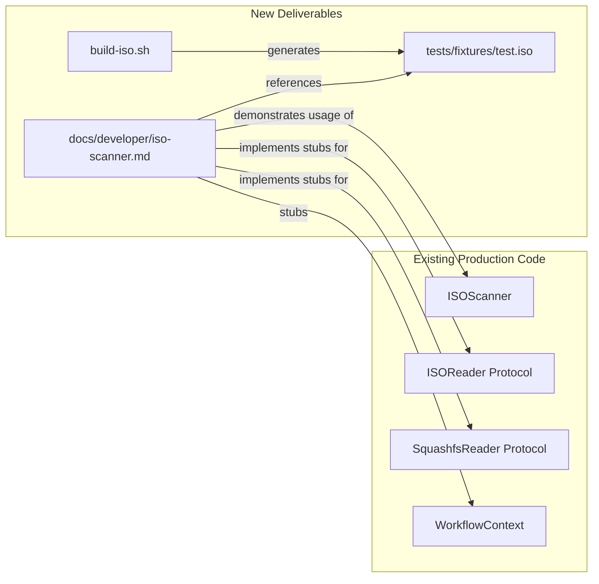

# Design Document: ISO Scanner Documentation & Fixture

## Overview

This design covers a developer-facing documentation page and a companion build script that together provide a working, end-to-end example of the `ISOScanner`. The deliverables are:

1. A shell script (`tests/fixtures/build-iso.sh`) that produces a tiny, valid ISO 9660 image containing a synthetic `var/lib/dpkg/status` file.
2. A documentation page (`docs/developer/iso-scanner.md`) with explanatory prose and a self-contained Python code example that scans the fixture ISO.
3. A navigation entry in `mkdocs.yml` placing the new page in the Developer Guide section.

The design prioritizes reproducibility (idempotent script), minimal dependencies (standard Debian tooling), and clarity (inline-commented code example).

## Architecture

The feature does not introduce new runtime modules. It adds static assets (docs, script, generated fixture) that reference existing production code:



The code example in the documentation implements minimal protocol-compliant stubs that satisfy `ISOReader`, `SquashfsReader`, `ContentsIndexPort`, and `PackageLookupPort`, then invokes `ISOScanner.scan()` against the fixture ISO.

## Components and Interfaces

### 1. Build Script (`tests/fixtures/build-iso.sh`)

**Purpose:** Generate a reproducible tiny ISO with a valid dpkg status file.

**Tool selection: `genisoimage`**

Rationale: `genisoimage` is the de facto standard on Debian systems (`apt install genisoimage`). It's simpler to invoke for basic ISO creation than `xorriso`, which targets more advanced use cases (hybrid boot, EFI). The script only needs to pack a directory tree into an ISO 9660 image — `genisoimage` does this in a single command.

**Algorithm:**
1. Check for required tools (`genisoimage`). If missing, print diagnostic to stderr and exit 1.
2. Create a temporary staging directory.
3. Write a synthetic `var/lib/dpkg/status` file with one package entry (package: `base-files`, version: `13.5`, arch: `amd64`, status: `install ok installed`).
4. Run `genisoimage -quiet -J -R -V "DEBCRAFT_TEST" -o <output> <staging>`.
5. Clean up the staging directory.
6. Ensure output directory `tests/fixtures/` exists (create with `mkdir -p`).

**Idempotency:** The script writes the same `var/lib/dpkg/status` content every run. The `-V` volume label is fixed. The only variation is filesystem metadata (timestamps) in the ISO header, which is acceptable per requirements.

**Design decisions:**
- Single synthetic package (`base-files`) keeps the fixture tiny (~50–100 KB).
- No squashfs layer in the fixture — the ISO uses the "direct rootfs" path (strategy fallback step b), which is simpler to generate and still exercises the scanner's primary dpkg-parsing code path.
- The script is placed at `tests/fixtures/build-iso.sh` since it produces `tests/fixtures/test.iso` and follows the project's existing pattern where the root-level `fixtures/` directory handles repository/package generation while `tests/fixtures/` holds test-specific assets.

### 2. Documentation Page (`docs/developer/iso-scanner.md`)

**Sections:**
1. **Introduction** — What the ISO scanner does, when to use it.
2. **Prerequisites** — Generate the fixture ISO, install pycdlib.
3. **How It Works** — Scanning strategy fallback chain with a diagram.
4. **Code Example** — Full runnable Python script.
5. **Running the Example** — Shell commands to execute.
6. **Extending** — Pointers to implement a real SquashfsReader, custom ports.

### 3. Code Example (embedded in documentation)

The code example implements:

| Component | Implementation approach |
|-----------|------------------------|
| `ISOReader` | Uses `pycdlib` to open/list/read ISO 9660 files. Translates pycdlib's Joliet or Rock Ridge paths to the expected interface. |
| `SquashfsReader` | Stub that raises `FileNotFoundError` on all operations (the fixture has no squashfs, so this path is never reached for the happy-path demo). |
| `ContentsIndexPort` | Stub returning an empty dict (filesystem fallback never reached when dpkg status exists). |
| `PackageLookupPort` | Stub returning `None` (same reasoning). |
| `WorkflowContext` | Minimal stub with a no-op `ProgressReporter`, uncancelled `CancellationToken`, and dummy `logger`/`event_bus`/`resources`/`scope`. |

**Why pycdlib for ISOReader:** It's a pure-Python ISO 9660 library (no C dependencies), widely available on PyPI, and suitable for reading the simple fixture ISO without mount operations. The documentation will note it as an optional dependency for the example only — it is not a production dependency of debcraft.

### 4. MkDocs Navigation Update

Add to `mkdocs.yml`:
```yaml
  - Developer Guide:
      - developer/index.md
      - Getting Started: developer/getting-started.md
      - ISO Scanner: developer/iso-scanner.md
```

This places "ISO Scanner" immediately after "Getting Started" as required.

## Data Models

No new domain data models are introduced. The feature uses the existing:

- `Artifact(type=ArtifactType.ISO, path="tests/fixtures/test.iso", options={})`
- `ScanResult` — returned by the scanner with `packages`, `strategy`, `diagnostics`, etc.
- `IdentifiedPackage` — individual package entries parsed from dpkg status.

The synthetic dpkg status file in the fixture uses the canonical format:

```
Package: base-files
Status: install ok installed
Priority: required
Section: admin
Architecture: amd64
Version: 13.5
Description: Debian base system miscellaneous files
```

## Error Handling

| Scenario | Handling |
|----------|----------|
| Missing `genisoimage` tool | Script exits 1, prints tool name to stderr |
| `tests/fixtures/` directory absent | Script creates it with `mkdir -p` |
| Fixture ISO not found at runtime | Code example prints error message naming the file and directing user to run `build-iso.sh` |
| Invalid ISO (corrupted file) | `ISOScanner` returns empty `ScanResult` with diagnostic — demonstrated in docs prose |
| `pycdlib` not installed | Import error caught in example, message directs user to `pip install pycdlib` |

## Correctness Properties

This feature does not introduce runtime logic with meaningful input variation suitable for property-based testing. The deliverables are a shell script, a documentation page, and a configuration change. Instead of PBT properties, correctness is verified through deterministic assertions:

### Property 1: ISO Validity

**Validates: Requirements 1.1**

The output of `build-iso.sh` is always a valid ISO 9660 image (verifiable via `file` command output containing "ISO 9660").

### Property 2: Content Preservation

**Validates: Requirements 1.2**

The `var/lib/dpkg/status` file embedded in the ISO always contains exactly the fields `Package`, `Status`, `Version`, and `Architecture` with their expected values.

### Property 3: Idempotency

**Validates: Requirements 1.5**

Two consecutive runs of `build-iso.sh` produce ISO images with identical directory trees and identical `var/lib/dpkg/status` content.

### Property 4: Navigation Reachability

**Validates: Requirements 4.3**

The mkdocs build completes without errors and the ISO Scanner page is present in the generated site.

## Testing Strategy

**PBT applicability assessment:** This feature consists of a shell script, a documentation page, and a mkdocs configuration change. There are no pure functions with meaningful input variation, no data transformations, and no business logic to validate with property-based testing. PBT does not apply.

**Appropriate testing approaches:**

1. **Build script validation (smoke test):**
   - Run `build-iso.sh` and confirm exit code 0.
   - Run `file tests/fixtures/test.iso` and assert output contains "ISO 9660".
   - Parse the ISO and verify `var/lib/dpkg/status` contains the expected package entry.
   - Test idempotency: run twice, diff the dpkg status content.

2. **Documentation build (integration test):**
   - Run `mkdocs build --strict` and confirm exit code 0 (validates nav links, page rendering).
   - Confirm `site/developer/iso-scanner/index.html` is generated.

3. **Code example verification (example-based test):**
   - Extract and run the code example as a standalone script after generating the fixture.
   - Assert it prints the expected package name/version/architecture.

These tests can be added to CI as a dedicated job or integrated into existing test targets.
