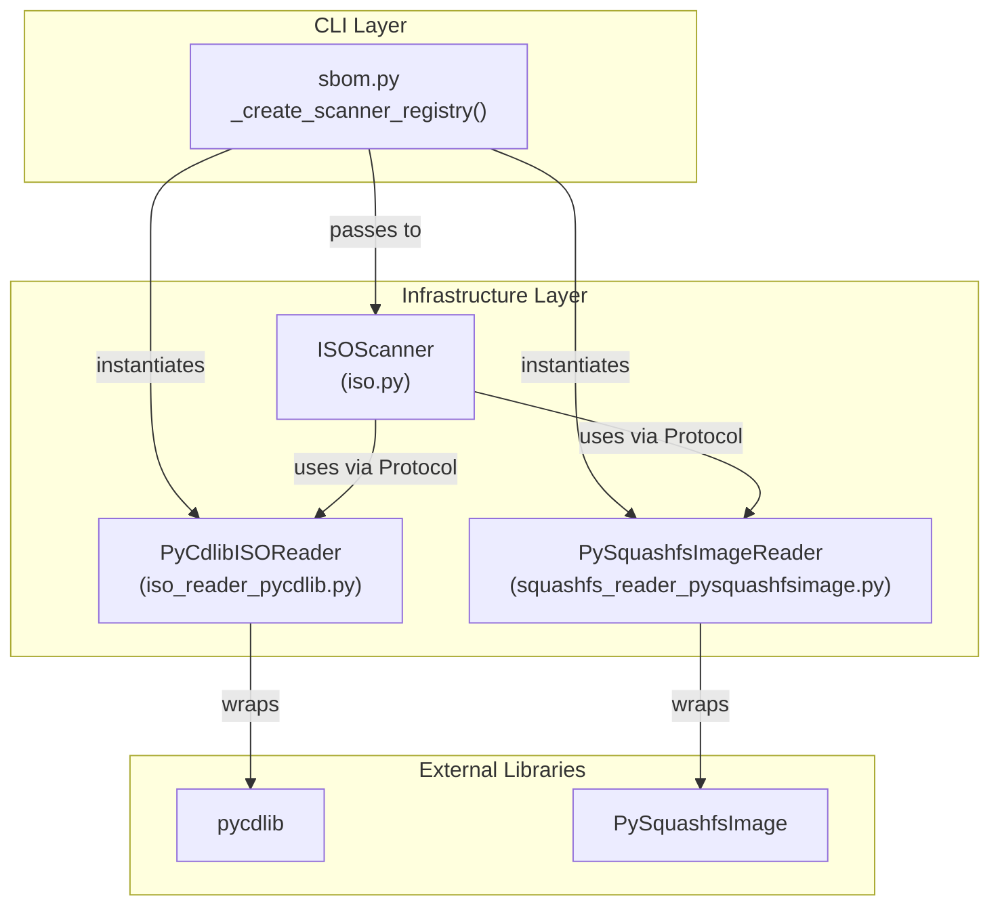

# Design Document: ISO & SquashFS Reader Adapters

## Overview

This design replaces the no-op `_NoOpISOReader` and `_NoOpSquashfsReader` stubs in the CLI scanner registry with production implementations backed by real libraries. The two new adapter classes — `PyCdlibISOReader` and `PySquashfsImageReader` — live in the infrastructure layer, conform to the existing `ISOReader` and `SquashfsReader` Protocol interfaces, and require no mount operations or root privileges.

**Key design decisions:**

1. **pycdlib** for ISO 9660 reading — pure-Python, supports Rock Ridge extensions, active maintenance, already demonstrated in the project's developer documentation.
2. **PySquashfsImage** for squashfs reading — pure-Python, lightweight, supports squashfs 4.0 little-endian (the format used by Debian/Ubuntu live ISOs), accepts file-like objects including `io.BytesIO` for in-memory operation.
3. Both adapters are thin wrappers translating library-specific APIs into the Protocol-defined interface. Error mapping converts library exceptions to `OSError` / `FileNotFoundError` as required by the Protocol contracts.
4. CLI wiring replaces the no-op instances with production instances in `_create_scanner_registry()`, with a guarded import that raises `ImportError` if dependencies are missing.

## Architecture



**Layer responsibilities:**

- **CLI layer** (`sbom.py`): Instantiates concrete adapters and injects them into `ISOScanner`. Handles `ImportError` if libraries are absent.
- **Infrastructure layer** (new adapter modules): Translates between library APIs and Protocol interfaces. Maps exceptions. Manages resource lifecycle.
- **Domain layer** (unchanged): `ISOScanner` depends only on the Protocol interfaces — no modification required.

**Import-linter compliance:** The new adapter modules live under `debcraft.infrastructure.scanners`, which is already permitted to import third-party libraries. The domain layer imports nothing from infrastructure. The contracts layer imports nothing from infrastructure.

## Components and Interfaces

### Component 1: PyCdlibISOReader

**Module:** `src/debcraft/infrastructure/scanners/iso_reader_pycdlib.py`

```python
class PyCdlibISOReader:
    """ISOReader implementation backed by pycdlib with Rock Ridge support."""

    def __init__(self) -> None: ...
    def open(self, path: str) -> None: ...
    def list_dir(self, path: str) -> list[str]: ...
    def read_file(self, path: str) -> bytes: ...
    def close(self) -> None: ...
```

**Internal state:**
- `_iso: pycdlib.PyCdlib | None` — the open ISO handle, or `None` when closed.

**Behavior:**

| Method | Behavior |
|--------|----------|
| `open(path)` | Creates a `PyCdlib()` instance, calls `.open(path)`. On any `pycdlib` exception or `OSError`, re-raises as `OSError`. |
| `list_dir(path)` | Normalizes `path` to an absolute Rock Ridge path (`"/" + path.strip("/")` or `"/"` for empty string). Calls `_iso.list_children(rr_path=...)`. Filters out `.` and `..` entries. Returns decoded Rock Ridge basenames. Raises `FileNotFoundError` if path doesn't exist or is a file. |
| `read_file(path)` | Normalizes path to `"/" + path.strip("/")`. Opens via `_iso.open_file_from_iso(rr_path=...)`. Reads all bytes. Raises `FileNotFoundError` if path doesn't exist or is a directory. |
| `close()` | Calls `_iso.close()` if `_iso` is not `None`, then sets `_iso = None`. Safe to call multiple times. |

**Exception mapping:**
- `pycdlib.PyCdlibInvalidInput` → `FileNotFoundError`
- `pycdlib.PyCdlibInvalidISO` → `OSError`
- Generic `Exception` from pycdlib during open → `OSError`

### Component 2: PySquashfsImageReader

**Module:** `src/debcraft/infrastructure/scanners/squashfs_reader_pysquashfsimage.py`

```python
class PySquashfsImageReader:
    """SquashfsReader implementation backed by PySquashfsImage."""

    def __init__(self) -> None: ...
    def open(self, data: bytes) -> None: ...
    def read_file(self, path: str) -> bytes: ...
    def list_dir(self, path: str) -> list[str]: ...
    def close(self) -> None: ...
```

**Internal state:**
- `_image: SquashFsImage | None` — the open squashfs image handle.
- `_open: bool` — tracks whether an image is currently open (for double-open detection).

**Behavior:**

| Method | Behavior |
|--------|----------|
| `open(data)` | If already open, raises `OSError("Reader already has an image open")`. Validates `data` is non-empty. Creates `io.BytesIO(data)`, passes to `SquashFsImage.from_fd()` or equivalent. On invalid squashfs data, raises `OSError`. |
| `read_file(path)` | Normalizes path (strips leading `/`). Navigates the squashfs inode tree. If path points to a directory, raises `FileNotFoundError`. If path doesn't exist, raises `FileNotFoundError`. Returns file content bytes. |
| `list_dir(path)` | Normalizes path (strips leading `/`, empty string = root). Navigates inode tree. If path points to a file, raises `FileNotFoundError`. If path doesn't exist, raises `FileNotFoundError`. Returns list of basenames (excluding path separators). |
| `close()` | Sets `_image = None` and `_open = False`. Safe to call multiple times or without prior open. |

**Exception mapping:**
- Invalid magic / parse errors from PySquashfsImage → `OSError`
- Path not found in inode tree → `FileNotFoundError`

### Component 3: CLI Wiring Update

**Module:** `src/debcraft/cli/sbom.py` (modification to `_create_scanner_registry()`)

The existing no-op classes (`_NoOpISOReader`, `_NoOpSquashfsReader`) are replaced with imports of the production adapters. A try/except guards the import:

```python
try:
    from debcraft.infrastructure.scanners.iso_reader_pycdlib import PyCdlibISOReader
    from debcraft.infrastructure.scanners.squashfs_reader_pysquashfsimage import PySquashfsImageReader
except ImportError as exc:
    raise ImportError(f"Missing dependency for ISO scanning: {exc.name}. Install it with: uv add {exc.name}") from exc
```

The `ISOScanner` instantiation becomes:

```python
ISOScanner(
    iso_reader=PyCdlibISOReader(),
    squashfs_reader=PySquashfsImageReader(),
    contents_port=contents_port,
    package_port=package_port,
)
```

## Data Models

No new domain data models are introduced. The adapters operate on:

- **Input to ISOReader:** `str` (filesystem path to ISO file)
- **Input to SquashfsReader:** `bytes` (raw squashfs image data, extracted from ISO by `ISOScanner._find_squashfs()`)
- **Output from both readers:** `bytes` (file contents) or `list[str]` (directory entry names)

**Internal pycdlib data structures** (not exposed):
- `pycdlib.PyCdlib` — ISO handle object
- `pycdlib.dr.DirectoryRecord` — individual directory entries returned by `list_children()`

**Internal PySquashfsImage data structures** (not exposed):
- `SquashFsImage` — parsed squashfs filesystem object
- Inode entries representing files and directories within the image

**Path normalization contract:**
- Both readers accept paths without leading slashes (e.g., `"live/filesystem.squashfs"`, `"var/lib/dpkg/status"`)
- Both readers accept paths with leading slashes and treat them equivalently
- `list_dir("")` returns root-level entries
- Returned entry names are bare basenames without path separators


## Correctness Properties

*A property is a characteristic or behavior that should hold true across all valid executions of a system — essentially, a formal statement about what the system should do. Properties serve as the bridge between human-readable specifications and machine-verifiable correctness guarantees.*

### Property 1: ISO directory listing entries are bare names

*For any* directory within an ISO image, all entries returned by `PyCdlibISOReader.list_dir()` SHALL be bare basenames containing no "/" character, and SHALL never include "." or ".." entries.

**Validates: Requirements 2.5, 10.3**

### Property 2: ISO path round-trip composability

*For any* directory `D` within an ISO image and *for any* entry `E` returned by `PyCdlibISOReader.list_dir(D)`, the composed path (`D + "/" + E` when D is non-empty, or `E` when D is empty) SHALL be a valid argument to either `read_file()` (returning bytes without raising) or `list_dir()` (returning a list without raising).

**Validates: Requirements 10.1**

### Property 3: Squashfs directory listing entries are bare names

*For any* directory within a squashfs image, all entries returned by `PySquashfsImageReader.list_dir()` SHALL be bare basenames containing no "/" character.

**Validates: Requirements 10.4**

### Property 4: Squashfs path round-trip composability

*For any* directory `D` within a squashfs image and *for any* entry `E` returned by `PySquashfsImageReader.list_dir(D)`, the composed path (`D + "/" + E` when D is non-empty, or `E` when D is empty) SHALL be a valid argument to either `read_file()` (returning bytes without raising) or `list_dir()` (returning a list without raising).

**Validates: Requirements 10.2**

### Property 5: Squashfs leading-slash path normalization

*For any* valid file path `P` within a squashfs image, `read_file("/" + P)` SHALL return the same bytes as `read_file(P)`, and for any valid directory path `P`, `list_dir("/" + P)` SHALL return the same entries as `list_dir(P)`.

**Validates: Requirements 5.5, 6.5**

### Property 6: Squashfs invalid data rejection

*For any* byte sequence that does not begin with a valid squashfs superblock magic number, `PySquashfsImageReader.open(data)` SHALL raise an `OSError`.

**Validates: Requirements 4.2**

## Error Handling

### PyCdlibISOReader Error Strategy

| Scenario | Exception Raised | Recovery |
|----------|-----------------|----------|
| File path doesn't exist on disk | `OSError` from `open()` | ISOScanner catches, returns empty ScanResult with diagnostic |
| File is not valid ISO 9660 | `OSError` from `open()` | Same as above |
| Path not found inside ISO | `FileNotFoundError` from `list_dir()`/`read_file()` | ISOScanner catches, continues to next strategy |
| Path is a file, not directory | `FileNotFoundError` from `list_dir()` | ISOScanner treats as file, not directory |
| Path is a directory, not file | `FileNotFoundError` from `read_file()` | ISOScanner skips entry |
| Calling methods after close | `AttributeError` or `OSError` | Caller error — not expected in normal flow |

**Design rationale:** pycdlib raises its own `PyCdlibInvalidInput` and `PyCdlibInvalidISO` exceptions. The adapter catches these and re-raises as the standard exceptions expected by the Protocol docstrings. This keeps the domain layer free of pycdlib-specific exception handling.

### PySquashfsImageReader Error Strategy

| Scenario | Exception Raised | Recovery |
|----------|-----------------|----------|
| Empty bytes provided | `OSError` from `open()` | ISOScanner catches, returns empty ScanResult with diagnostic |
| Invalid squashfs magic/data | `OSError` from `open()` | Same as above |
| Double open (already open) | `OSError` from `open()` | Programming error — defensive check |
| File path not found | `FileNotFoundError` from `read_file()` | ISOScanner catches, falls back to filesystem analysis |
| Directory path not found | `FileNotFoundError` from `list_dir()` | ISOScanner stops recursion at that branch |
| Path is directory, expected file | `FileNotFoundError` from `read_file()` | ISOScanner skips |
| Path is file, expected directory | `FileNotFoundError` from `list_dir()` | ISOScanner treats as leaf file |

### CLI Wiring Error Handling

- **Missing dependency:** `ImportError` raised at `_create_scanner_registry()` call time with a message identifying the missing package and install command.
- **Rationale:** Fail-fast at CLI startup rather than silently falling back to no-op behavior, which would produce empty SBOMs without explanation.

## Testing Strategy

### Unit Tests (Example-Based)

**PyCdlibISOReader unit tests** (using a small fixture ISO created with `genisoimage`):
- `test_open_valid_iso` — opens fixture ISO without exception
- `test_open_nonexistent_path_raises_oserror` — nonexistent path → OSError
- `test_open_invalid_file_raises_oserror` — random bytes file → OSError
- `test_close_without_open` — no exception
- `test_close_then_operations_raise` — close then list_dir/read_file raises
- `test_list_dir_root` — list_dir("") returns expected root entries
- `test_list_dir_subdirectory` — list_dir("var/lib") returns expected entries
- `test_list_dir_nonexistent_raises` — FileNotFoundError
- `test_list_dir_on_file_raises` — FileNotFoundError
- `test_read_file_valid` — returns expected bytes
- `test_read_file_nonexistent_raises` — FileNotFoundError
- `test_read_file_on_directory_raises` — FileNotFoundError
- `test_path_with_and_without_leading_slash` — equivalent results

**PySquashfsImageReader unit tests** (using a small fixture squashfs created with `mksquashfs`):
- `test_open_valid_squashfs` — opens fixture without exception
- `test_open_empty_bytes_raises_oserror` — OSError
- `test_open_invalid_bytes_raises_oserror` — random bytes → OSError
- `test_open_when_already_open_raises_oserror` — double-open → OSError
- `test_close_without_open` — no exception
- `test_close_releases_resources` — after close, internal state is cleared
- `test_list_dir_root` — list_dir("") returns expected root entries
- `test_list_dir_subdirectory` — list_dir("var/lib") returns expected entries
- `test_list_dir_nonexistent_raises` — FileNotFoundError
- `test_list_dir_on_file_raises` — FileNotFoundError
- `test_read_file_valid` — returns expected bytes
- `test_read_file_nonexistent_raises` — FileNotFoundError
- `test_read_file_on_directory_raises` — FileNotFoundError
- `test_leading_slash_equivalence` — read_file("/var/lib/dpkg/status") == read_file("var/lib/dpkg/status")

**CLI wiring tests:**
- `test_scanner_registry_uses_production_readers` — verify type of readers
- `test_missing_dependency_raises_importerror` — mock import failure

### Property-Based Tests (Hypothesis)

Property-based tests use the **Hypothesis** library (already in dev dependencies) with a minimum of 100 iterations per property. Each test uses a real fixture (small ISO or squashfs image with known structure) and generates random valid paths within it to exercise the properties.

**Test file:** `tests/property/infrastructure/test_iso_squashfs_readers_properties.py`

| Property | Test Strategy | Generator |
|----------|--------------|-----------|
| Property 1: ISO bare names | Walk all directories in fixture ISO, check each entry | Exhaustive walk (no random generation needed — property verified over all entries) |
| Property 2: ISO round-trip | For randomly selected directories from fixture, compose paths | `st.sampled_from(all_directories_in_iso)` |
| Property 3: Squashfs bare names | Walk all directories in fixture squashfs | Exhaustive walk |
| Property 4: Squashfs round-trip | For randomly selected directories from fixture, compose paths | `st.sampled_from(all_directories_in_squashfs)` |
| Property 5: Squashfs slash normalization | For randomly selected file/dir paths, test with/without leading slash | `st.sampled_from(all_paths_in_squashfs)` |
| Property 6: Invalid data rejection | Generate random byte sequences | `st.binary(min_size=0, max_size=1024)` filtered to exclude valid squashfs magic |

**Configuration:**
- `@settings(max_examples=100)`
- Tag format: `# Feature: iso-squashfs-readers, Property N: <property text>`

### Test Fixtures

Two small fixture images are needed:

1. **`fixtures/images/test.iso`** — already exists (created by `fixtures/build-iso.sh`), contains a bare `var/lib/dpkg/status` with a single package entry. Has nested directory structure for path tests.

2. **`fixtures/images/test.squashfs`** — new fixture, created by a build script `fixtures/build-squashfs.sh`. Contains:
   - `var/lib/dpkg/status` with a synthetic package entry
   - A nested directory tree (`usr/bin/`, `etc/`) for directory listing tests
   - A small text file for read verification

Both fixtures are small (< 100 KB) and committed to the repository for reproducible CI runs.

### Integration Tests

- End-to-end test scanning the fixture ISO through `ISOScanner` with production readers
- Verifies the full pipeline: ISO open → squashfs search → dpkg parse → package list

### Protocol Conformance

Static type checking via `basedpyright` and `mypy` (both configured in `pyproject.toml`) will verify that `PyCdlibISOReader` structurally conforms to `ISOReader` Protocol and `PySquashfsImageReader` conforms to `SquashfsReader` Protocol at development time.
