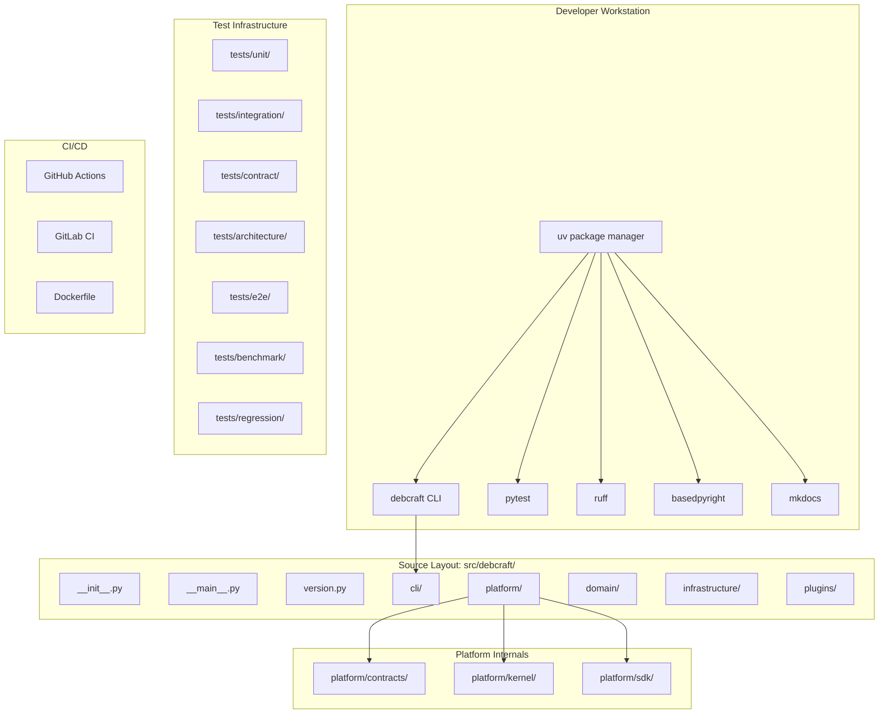
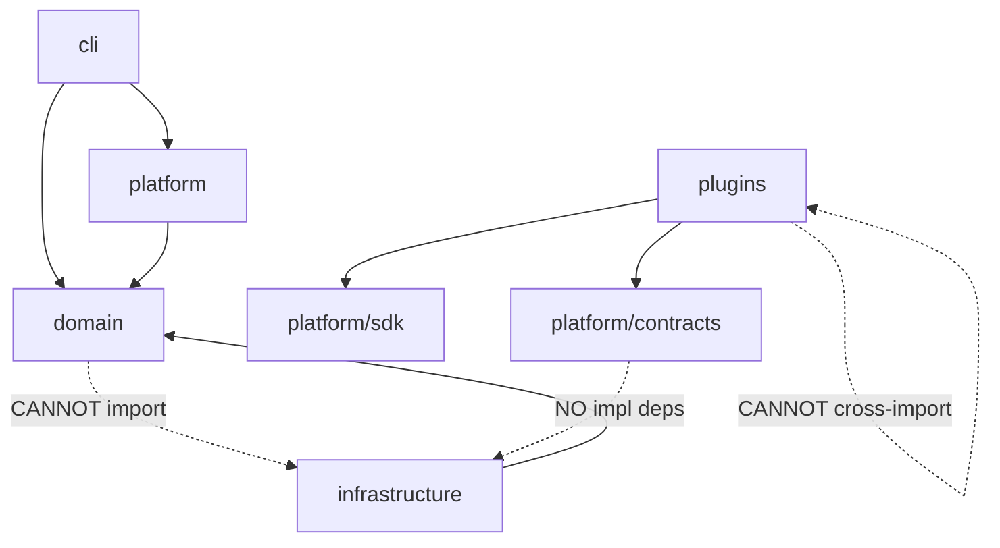

# Design Document: M0 Engineering Foundation

## Overview

Milestone M0 establishes the engineering infrastructure for DebCraft with zero business logic. It produces a fully functional development environment where all tooling commands succeed immediately. The design prioritizes convention over configuration, using well-established Python ecosystem tools (uv, Ruff, BasedPyright, pytest, MkDocs) configured to enforce the Google Python Style Guide.

The foundation is built around these principles:
- **Immediate usability**: Every file is functional, no placeholder TODOs
- **Cross-platform**: pathlib.Path throughout, CI on 3 OS variants
- **Layered architecture**: Domain, infrastructure, platform, and plugin boundaries enforced by automated tests
- **Standards compliance**: PEP 621, EARS patterns, Google style

## Architecture



### Layer Dependency Rules



## Components and Interfaces

### 1. Project Configuration (`pyproject.toml`)

The central configuration file manages:
- PEP 621 project metadata (name, version, description, Python requirement, dependencies)
- Build system configuration (Hatchling backend)
- Tool configurations for Ruff, BasedPyright, pytest, and coverage

```toml
[project]
name = "debcraft"
version = "0.1.0"
description = "Artifact Intelligence Platform for Debian-based ecosystems"
requires-python = ">=3.13"
dependencies = [
    "typer>=0.12",
    "rich>=13.0",
    "sqlalchemy>=2.0",
    "aiohttp>=3.9",
]

[project.scripts]
debcraft = "debcraft.cli:app"

[build-system]
requires = ["hatchling"]
build-backend = "hatchling.build"

[dependency-groups]
dev = [
    "ruff>=0.8",
    "basedpyright>=1.20",
    "pytest>=8.0",
    "pytest-cov>=5.0",
    "pytest-asyncio>=0.24",
    "coverage>=7.0",
    "mkdocs>=1.6",
    "mkdocs-material>=9.5",
    "mkdocstrings[python]>=0.26",
    "import-linter>=2.0",
    "bandit>=1.7",
    "pre-commit>=3.8",
]
```

### 2. CLI Module (`src/debcraft/cli/`)

Built with Typer and Rich. Provides three commands:

```python
# src/debcraft/cli/__init__.py
import typer

app = typer.Typer(name="debcraft", help="DebCraft - Artifact Intelligence Platform")

@app.command()
def version() -> None:
    """Display the current DebCraft version."""

@app.command()
def doctor() -> None:
    """Check environment health and report status."""

@app.command()
def info() -> None:
    """Display configuration and environment information."""
```

**`version` command**: Reads from `debcraft.version.VERSION` and prints it using Rich.

**`doctor` command**: Performs checks:
- Python version >= 3.13
- Writable temp directory
- Writable current directory

Reports each check as PASS/FAIL with Rich formatting.

**`info` command**: Displays:
- DebCraft version
- Python version and path
- Platform (OS, architecture)
- Package installation location
- Virtual environment path

### 3. Version Module (`src/debcraft/version.py`)

Single source of truth for the version string:

```python
"""DebCraft version definition."""

VERSION: str = "0.1.0"
```

### 4. Entry Point (`src/debcraft/__main__.py`)

Enables `python -m debcraft` execution:

```python
"""Enable execution via python -m debcraft."""

from debcraft.cli import app

app()
```

### 5. Ruff Configuration

```toml
[tool.ruff]
target-version = "py313"
line-length = 100
src = ["src", "tests"]

[tool.ruff.lint]
select = [
    "E",    # pycodestyle errors
    "W",    # pycodestyle warnings
    "F",    # pyflakes
    "I",    # isort
    "N",    # pep8-naming
    "D",    # pydocstyle
    "UP",   # pyupgrade
    "B",    # flake8-bugbear
    "A",    # flake8-builtins
    "C4",   # flake8-comprehensions
    "SIM",  # flake8-simplify
    "TCH",  # flake8-type-checking
    "ANN",  # flake8-annotations
    "S",    # flake8-bandit
    "RUF",  # ruff-specific
]
ignore = [
    "D100",   # Missing docstring in public module (init files)
    "D104",   # Missing docstring in public package
    "ANN101", # Missing type annotation for self
    "ANN102", # Missing type annotation for cls
]

[tool.ruff.lint.pydocstyle]
convention = "google"

[tool.ruff.lint.per-file-ignores]
"tests/**/*.py" = ["S101", "D103", "ANN"]
```

### 6. BasedPyright Configuration

```toml
[tool.basedpyright]
include = ["src"]
pythonVersion = "3.13"
typeCheckingMode = "standard"
reportMissingTypeStubs = false
```

### 7. Pytest Configuration

```toml
[tool.pytest.ini_options]
testpaths = ["tests"]
addopts = "-m 'unit and not slow' --strict-markers"
markers = [
    # Type markers
    "unit: Unit tests (fast, isolated)",
    "integration: Integration tests (may need external resources)",
    "contract: Contract tests (API boundary verification)",
    "architecture: Architecture compliance tests",
    "benchmark: Performance benchmark tests",
    "regression: Regression tests for fixed bugs",
    "e2e: End-to-end tests",
    # Feature markers
    "repository: Repository operations",
    "package: Package analysis",
    "dep5: DEP-5 copyright parsing",
    "license: License detection and normalization",
    "spdx: SPDX document generation",
    "cyclonedx: CycloneDX SBOM generation",
    "docker: Docker image analysis",
    "oci: OCI image operations",
    "iso: ISO image operations",
    "qcow2: QCOW2 image operations",
    "ami: AMI image operations",
    "mirror: Repository mirroring",
    "workflow: Workflow orchestration",
    "plugin: Plugin system",
    "storage: Storage operations",
    "database: Database operations",
    # Environment markers
    "sqlite: Requires SQLite",
    "network: Requires network access",
    "filesystem: Requires filesystem operations",
    "aws: Requires AWS credentials",
    "container: Requires container runtime",
    "cross_platform: Must work on all platforms",
    "linux_only: Linux-specific test",
    "windows_only: Windows-specific test",
    "macos_only: macOS-specific test",
    # Speed markers
    "slow: Slow-running test",
    "serial: Must run serially",
    "parallel: Safe for parallel execution",
]
```

### 8. Architecture Compliance

Architecture tests use `import-linter` configured in `pyproject.toml` and custom AST-based tests:

```toml
[tool.importlinter]
root_packages = ["debcraft"]

[[tool.importlinter.contracts]]
name = "Domain independence"
type = "forbidden"
source_modules = ["debcraft.domain"]
forbidden_modules = ["debcraft.infrastructure"]

[[tool.importlinter.contracts]]
name = "Contracts purity"
type = "forbidden"
source_modules = ["debcraft.platform.contracts"]
forbidden_modules = ["debcraft.infrastructure", "debcraft.plugins"]

[[tool.importlinter.contracts]]
name = "Plugin isolation"
type = "independence"
modules = ["debcraft.plugins"]
```

Custom AST-based tests verify:
- No mutable module-level state (list, dict, set assignments at module scope without `Final`)
- Plugin cross-import prevention (supplements import-linter)

### 9. CI/CD Configuration

**GitHub Actions** (`.github/workflows/ci.yml`):
- Trigger: push to main, pull requests
- Matrix: ubuntu-latest, windows-latest, macos-latest
- Steps: checkout → install uv → uv sync → ruff format --check → ruff check → basedpyright → pytest (unit) → pytest -m architecture

**GitLab CI** (`.gitlab-ci.yml`):
- Stages: lint, typecheck, test
- Uses uv for dependency installation
- Runs on default Linux runner

**Dockerfile**:
- Base: python:3.13-slim
- Installs uv, syncs dependencies
- Entry point: pytest

### 10. Documentation Configuration

**`mkdocs.yml`**:
```yaml
site_name: DebCraft Documentation
theme:
  name: material
  features:
    - navigation.sections
    - navigation.expand
    - content.code.copy
plugins:
  - search
  - mkdocstrings:
      handlers:
        python:
          options:
            docstring_style: google
nav:
  - Home: index.md
  - Architecture: architecture/
  - Specifications: specifications/
  - ADR: adr/
  - Developer Guide: developer/
  - User Guide: user/
```

### 11. Supporting Files

| File | Purpose |
|------|---------|
| `.editorconfig` | UTF-8, LF, 4-space Python indent, 2-space YAML indent |
| `.gitattributes` | Line ending normalization (LF for text, binary for images) |
| `.python-version` | Pin Python 3.13 for pyenv/uv detection |
| `.pre-commit-config.yaml` | Ruff format, Ruff lint, BasedPyright hooks |
| `CHANGELOG.md` | Keep-a-Changelog format, initial Unreleased section |
| `CONTRIBUTING.md` | Development setup with uv, coding standards reference |
| `SECURITY.md` | Vulnerability reporting process |

## Data Models

This milestone has no persistent data models. The only structured data is:

### Doctor Check Result

```python
@dataclass
class DoctorCheck:
    """Result of a single doctor check."""

    name: str
    passed: bool
    message: str
    details: str | None = None
```

### Info Display Data

```python
@dataclass
class EnvironmentInfo:
    """Environment information for the info command."""

    version: str
    python_version: str
    python_path: Path
    platform: str
    architecture: str
    package_location: Path
    venv_path: Path | None
```

These are simple value objects used exclusively by the CLI commands — no serialization or persistence required.

## Error Handling

Since M0 contains no business logic, error handling is minimal and focused on the CLI:

### CLI Error Handling

| Scenario | Behavior |
|----------|----------|
| Python version < 3.13 | `doctor` reports FAIL with descriptive message; does not crash |
| Non-writable directory | `doctor` reports FAIL for that check; continues other checks |
| Missing Rich library | Graceful fallback not needed — Rich is a hard dependency |
| Unknown CLI command | Typer displays help text automatically |
| Keyboard interrupt | Clean exit with no traceback (Typer handles this) |

### Architecture Test Errors

- Import violations: Test fails with a clear message identifying the violating import
- Mutable global state: Test fails identifying the module and variable name

### CI Pipeline Errors

- Any stage failure halts the pipeline (fail-fast behavior)
- Error output from tools (Ruff, BasedPyright, pytest) is captured in CI logs

## Testing Strategy

### Why Property-Based Testing Does NOT Apply

This milestone consists entirely of:
- **Configuration files** (pyproject.toml, mkdocs.yml, CI YAML) — declarative, no logic
- **Simple CLI commands** — deterministic output for fixed inputs
- **Structural checks** — file existence, import analysis
- **Tool integration** — verifying external tools pass on our code

There are no pure functions with varying inputs, no parsers/serializers, no data transformations, and no universal properties. PBT would add no value here.

### Test Approach

**Unit Tests** (`tests/unit/`):
- CLI command output verification (version, doctor, info)
- Doctor check logic with mocked environments
- Version module imports correctly

**Architecture Tests** (`tests/architecture/`):
- Import boundary enforcement via import-linter contracts
- Custom AST-based mutable global state detection
- Plugin isolation verification

**Integration Tests** (CI-level):
- `uv sync` succeeds
- `uv run ruff check src/ tests/` passes
- `uv run ruff format --check src/ tests/` passes
- `uv run basedpyright src/` passes
- `uv run debcraft version` produces output
- `uv run mkdocs build` succeeds

**Smoke Tests**:
- File structure verification (all expected files/directories exist)
- Configuration correctness (pyproject.toml has required fields)
- No TODO placeholders in generated code

### Test Execution

```bash
# Default: unit tests only (fast)
uv run pytest

# Architecture compliance
uv run pytest -m architecture

# All tests
uv run pytest -m "unit or architecture"

# With coverage
uv run pytest --cov=debcraft --cov-report=html
```

### Coverage Target

- Minimum 90% line coverage for `src/debcraft/cli/`
- Architecture tests cover all defined contracts
- No coverage requirement for `__init__.py` files (they're trivial)
