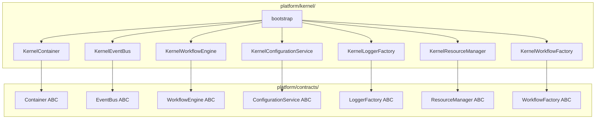
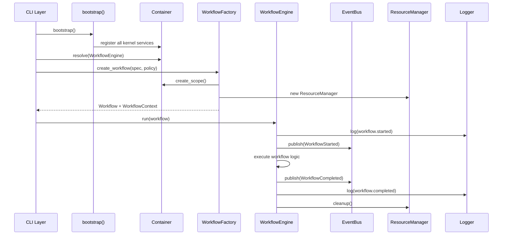

# Design Document: M1 Platform Kernel

## Overview

Milestone M1 delivers the domain-agnostic runtime kernel for DebCraft. It provides seven core components — dependency injection, event dispatch, workflow orchestration, configuration management, structured logging, resource lifecycle management, and execution policies — that compose through constructor injection at application startup. The kernel contains zero Debian-specific logic; it is a general-purpose async application framework.

Design principles:
- **No third-party DI framework** — lightweight, custom implementation using Python type introspection
- **asyncio-native** — all I/O operations use coroutines; the event bus supports async handlers
- **Contracts-first** — abstract interfaces in `platform/contracts/`, implementations in `platform/kernel/`
- **Immutability by default** — frozen dataclasses for events, configuration, and policies
- **Deterministic cleanup** — `AsyncExitStack` for resource lifecycle management
- **Standard library preference** — `tomllib`, `logging`, `asyncio`, `pathlib` over third-party equivalents

## Architecture



### Component Interaction at Runtime



### Module Layout

```
src/debcraft/platform/
├── __init__.py
├── contracts/
│   ├── __init__.py          # Re-exports all ABCs
│   ├── container.py         # Container, Scope ABCs
│   ├── events.py            # EventBus, DomainEvent ABCs
│   ├── workflow.py          # WorkflowEngine, Workflow, WorkflowFactory ABCs
│   ├── configuration.py     # ConfigurationService ABC
│   ├── logging.py           # LoggerFactory, Logger ABCs
│   ├── resources.py         # ResourceManager ABC
│   └── policies.py          # ExecutionPolicy dataclass
└── kernel/
    ├── __init__.py           # Re-exports bootstrap
    ├── container.py          # KernelContainer, KernelScope
    ├── events.py             # KernelEventBus, DomainEvent dataclass
    ├── workflow.py           # KernelWorkflowEngine, KernelWorkflowFactory
    ├── configuration.py      # KernelConfigurationService
    ├── logging.py            # KernelLoggerFactory, formatters
    ├── resources.py          # KernelResourceManager
    ├── policies.py           # ExecutionPolicy frozen dataclass
    └── bootstrap.py          # bootstrap() function
```

## Components and Interfaces

### 1. Dependency Injection Container

The container resolves services by inspecting `__init__` type annotations and recursively resolving dependencies. It supports three lifetimes and detects circular dependencies via a resolution stack.

```python
# platform/contracts/container.py
from abc import ABC, abstractmethod
from typing import TypeVar, overload

T = TypeVar("T")


class Scope(ABC):
    """A bounded lifetime context owning scoped service instances."""

    @abstractmethod
    def resolve(self, service_type: type[T]) -> T:
        """Resolve a service within this scope."""
        ...

    @abstractmethod
    async def close(self) -> None:
        """Dispose all scoped instances."""
        ...


class Container(ABC):
    """Dependency injection container with constructor injection."""

    @abstractmethod
    def register_singleton(self, interface: type[T], implementation: type[T] | None = None) -> None:
        """Register a service with singleton lifetime."""
        ...

    @abstractmethod
    def register_transient(self, interface: type[T], implementation: type[T] | None = None) -> None:
        """Register a service with transient lifetime."""
        ...

    @abstractmethod
    def register_scoped(self, interface: type[T], implementation: type[T] | None = None) -> None:
        """Register a service with scoped lifetime."""
        ...

    @abstractmethod
    def register_instance(self, interface: type[T], instance: T) -> None:
        """Register a pre-built instance as a singleton."""
        ...

    @abstractmethod
    def resolve(self, service_type: type[T]) -> T:
        """Resolve a service by its interface type."""
        ...

    @abstractmethod
    def create_scope(self) -> Scope:
        """Create a child scope inheriting singleton registrations."""
        ...
```

**Implementation strategy (`kernel/container.py`)**:
- Registration stores a mapping of `type → (implementation_type, lifetime_enum)`
- Resolution inspects `__init__.__annotations__` (excluding `return`) to determine constructor parameters
- A `_resolution_stack: set[type]` detects circular dependencies — if the type being resolved is already in the stack, raise `CircularDependencyError`
- Singleton instances are cached in a `dict[type, Any]`
- Scoped instances live in the `KernelScope` which inherits the parent container's singleton cache

### 2. Event Bus

The event bus dispatches typed domain events to registered handlers. Handler isolation ensures one failing handler doesn't affect others.

```python
# platform/contracts/events.py
from abc import ABC, abstractmethod
from collections.abc import Callable, Coroutine
from dataclasses import dataclass, field
from datetime import UTC, datetime
from typing import Any, TypeVar
from uuid import UUID, uuid4

E = TypeVar("E", bound="DomainEvent")


@dataclass(frozen=True)
class DomainEvent:
    """Base class for all domain events."""

    event_type: str
    timestamp: datetime = field(default_factory=lambda: datetime.now(UTC))
    correlation_id: UUID = field(default_factory=uuid4)


# Type alias for event handlers
EventHandler = Callable[[Any], None] | Callable[[Any], Coroutine[Any, Any, None]]


class EventBus(ABC):
    """In-process publish/subscribe event bus."""

    @abstractmethod
    def subscribe(self, event_type: type[E], handler: EventHandler) -> None:
        """Register a handler for a specific event type."""
        ...

    @abstractmethod
    def unsubscribe(self, event_type: type[E], handler: EventHandler) -> None:
        """Remove a handler for a specific event type."""
        ...

    @abstractmethod
    async def publish(self, event: DomainEvent) -> None:
        """Dispatch an event to all registered handlers."""
        ...
```

**Implementation strategy (`kernel/events.py`)**:
- `_handlers: dict[type, list[EventHandler]]` maintains insertion-ordered lists
- `publish()` iterates handlers in order; uses `inspect.iscoroutinefunction()` to determine if a handler needs `await`
- Exception in a handler is caught, logged, and does not interrupt dispatch to remaining handlers
- Correlation ID from the event is propagated — handlers receive the full event object containing the ID
- Publishing to an event type with zero handlers is a no-op (no error)

### 3. Workflow Engine

The workflow engine manages lifecycle states and integrates with the event bus, logger, and resource manager.

```python
# platform/contracts/workflow.py
from abc import ABC, abstractmethod
from dataclasses import dataclass, field
from datetime import datetime
from enum import Enum
from typing import Any
from uuid import UUID


class WorkflowState(Enum):
    """Workflow lifecycle states."""

    CREATED = "created"
    RUNNING = "running"
    COMPLETED = "completed"
    FAILED = "failed"
    CANCELLED = "cancelled"


@dataclass(frozen=True)
class WorkflowSummary:
    """Summary report generated when a workflow reaches a terminal state."""

    workflow_name: str
    start_time: datetime
    end_time: datetime
    final_state: WorkflowState
    error_details: str | None = None


class CancellationToken:
    """Cooperative cancellation mechanism."""

    def __init__(self) -> None:
        self._cancelled: bool = False

    @property
    def is_cancelled(self) -> bool:
        """Check if cancellation has been requested."""
        return self._cancelled

    def cancel(self) -> None:
        """Request cancellation."""
        self._cancelled = True


class ProgressReporter(ABC):
    """Interface for reporting workflow progress."""

    @abstractmethod
    def report(self, percentage: float, message: str = "") -> None:
        """Report progress with percentage (0-100) and optional message."""
        ...


class WorkflowContext:
    """Context provided to workflows during execution."""

    def __init__(
        self,
        scope: Any,  # Scope from container
        cancellation_token: CancellationToken,
        progress_reporter: ProgressReporter,
        resource_manager: Any,  # ResourceManager
        logger: Any,  # Logger
        event_bus: Any,  # EventBus
    ) -> None:
        self.scope = scope
        self.cancellation_token = cancellation_token
        self.progress = progress_reporter
        self.resources = resource_manager
        self.logger = logger
        self.event_bus = event_bus


class Workflow(ABC):
    """Base class for workflow implementations."""

    @property
    @abstractmethod
    def name(self) -> str:
        """The workflow name."""
        ...

    @abstractmethod
    async def execute(self, context: WorkflowContext) -> None:
        """Execute the workflow logic."""
        ...


class WorkflowEngine(ABC):
    """Orchestrates workflow lifecycle."""

    @abstractmethod
    async def run(self, workflow: "Workflow") -> WorkflowSummary:
        """Execute a workflow through its full lifecycle."""
        ...

    @abstractmethod
    async def cancel(self, workflow_id: UUID) -> None:
        """Request cancellation of a running workflow."""
        ...

    @abstractmethod
    async def shutdown(self, timeout_seconds: float) -> None:
        """Gracefully shut down all running workflows."""
        ...


class WorkflowFactory(ABC):
    """Creates workflow instances with dependencies."""

    @abstractmethod
    def create(self, workflow_type: type["Workflow"], **kwargs: Any) -> "Workflow":
        """Create a workflow instance with injected dependencies."""
        ...
```

**Implementation strategy (`kernel/workflow.py`)**:
- `KernelWorkflowEngine` holds a reference to EventBus, LoggerFactory, and Container
- On `run()`: transitions Created→Running, executes workflow, transitions to terminal state
- Publishes `WorkflowStartedEvent`, `WorkflowCompletedEvent`, `WorkflowFailedEvent`, or `WorkflowCancelledEvent` on transitions
- SIGINT handling via `asyncio.get_event_loop().add_signal_handler()` triggers cancellation token for all tracked workflows
- Timeout enforcement: uses `asyncio.wait_for()` with `timeout_seconds` from the execution policy
- Retry logic: wraps workflow step execution in a retry loop with exponential backoff

### 4. Configuration Subsystem

```python
# platform/contracts/configuration.py
from abc import ABC, abstractmethod
from typing import TypeVar

T = TypeVar("T")


class ConfigurationService(ABC):
    """Loads, merges, and provides typed configuration."""

    @abstractmethod
    def get_section(self, section_type: type[T]) -> T:
        """Retrieve a typed configuration section."""
        ...

    @abstractmethod
    def register_section(self, section_key: str, section_type: type[T]) -> None:
        """Register a configuration section type for plugin use."""
        ...

    @abstractmethod
    def reload(self) -> None:
        """Reload configuration from all sources (startup only)."""
        ...
```

**Implementation strategy (`kernel/configuration.py`)**:
- Load order: built-in defaults → `~/.config/debcraft/config.toml` → `.debcraft.toml` → env vars → CLI args
- Uses `tomllib.loads()` for TOML parsing
- Environment variable mapping: `DEBCRAFT_SECTION__KEY` → `{"section": {"key": value}}`
- Deep-merges dicts at each layer; later layers override earlier ones
- Produces frozen dataclass instances for each registered section type
- Validation runs on construction of each section dataclass (via `__post_init__`)
- On syntax error: raises `ConfigurationError` with file path and error position

### 5. Logging Framework

```python
# platform/contracts/logging.py
from abc import ABC, abstractmethod
from uuid import UUID


class Logger(ABC):
    """Structured logger with component context."""

    @abstractmethod
    def debug(self, message: str, **kwargs: object) -> None: ...

    @abstractmethod
    def info(self, message: str, **kwargs: object) -> None: ...

    @abstractmethod
    def warning(self, message: str, **kwargs: object) -> None: ...

    @abstractmethod
    def error(self, message: str, **kwargs: object) -> None: ...

    @abstractmethod
    def with_correlation_id(self, correlation_id: UUID) -> "Logger":
        """Return a child logger with the correlation ID attached."""
        ...


class LoggerFactory(ABC):
    """Creates Logger instances scoped to components."""

    @abstractmethod
    def get_logger(self, component: str) -> Logger:
        """Create a logger for the named component."""
        ...
```

**Implementation strategy (`kernel/logging.py`)**:
- Wraps Python's `logging` module — each `Logger` maps to a `logging.Logger` with a component name
- Custom `HumanFormatter`: `TIMESTAMP LEVEL COMPONENT MESSAGE [correlation_id=...]`
- Custom `JsonFormatter`: JSON object with fields `timestamp`, `level`, `component`, `message`, `correlation_id`, `extra`
- Correlation ID stored via `contextvars.ContextVar[UUID | None]` — set at workflow start, cleared at end
- The `with_correlation_id()` method returns a new logger instance bound to that ID (using a logging Filter)
- Rich integration: when Rich live display is active, route logs through Rich's `Console` handler to avoid display corruption

### 6. Resource Manager

```python
# platform/contracts/resources.py
from abc import ABC, abstractmethod
from contextlib import AbstractAsyncContextManager, AbstractContextManager
from typing import TypeVar

T = TypeVar("T")


class ResourceManager(ABC):
    """Manages lifecycle of workflow resources with deterministic cleanup."""

    @abstractmethod
    async def acquire_async(self, resource: AbstractAsyncContextManager[T]) -> T:
        """Acquire an async context-managed resource."""
        ...

    @abstractmethod
    def acquire_sync(self, resource: AbstractContextManager[T]) -> T:
        """Acquire a synchronous context-managed resource."""
        ...

    @abstractmethod
    async def cleanup(self) -> None:
        """Clean up all acquired resources in reverse order."""
        ...
```

**Implementation strategy (`kernel/resources.py`)**:
- Wraps `contextlib.AsyncExitStack`
- `acquire_async()` calls `stack.enter_async_context(resource)`
- `acquire_sync()` calls `stack.enter_context(resource)`
- `cleanup()` calls `await stack.aclose()` which unwinds in reverse order
- Individual cleanup failures are caught and logged; remaining resources are still cleaned
- Each `KernelResourceManager` instance is owned by a single `WorkflowContext`

### 7. Execution Policies

```python
# platform/contracts/policies.py
from dataclasses import dataclass


@dataclass(frozen=True)
class ExecutionPolicy:
    """Immutable execution policy controlling operational behavior."""

    max_concurrency: int = 4
    retry_count: int = 0
    retry_backoff_seconds: float = 1.0
    timeout_seconds: float = 300.0
    fail_fast: bool = True
```

**Design decisions**:
- Frozen dataclass guarantees immutability — any attempt to assign after construction raises `FrozenInstanceError`
- Default values represent safe production defaults
- Loaded from `[execution]` TOML section by ConfigurationService
- Per-workflow overrides via `WorkflowFactory.create(..., policy=custom_policy)`
- Injected into the Container as a singleton so workflows can access defaults

### 8. Bootstrap Function

```python
# platform/kernel/bootstrap.py
from debcraft.platform.contracts import (
    ConfigurationService,
    Container,
    EventBus,
    LoggerFactory,
    ResourceManager,
    WorkflowEngine,
    WorkflowFactory,
)
from debcraft.platform.kernel.configuration import KernelConfigurationService
from debcraft.platform.kernel.container import KernelContainer
from debcraft.platform.kernel.events import KernelEventBus
from debcraft.platform.kernel.logging import KernelLoggerFactory
from debcraft.platform.kernel.resources import KernelResourceManager
from debcraft.platform.kernel.workflow import KernelWorkflowEngine, KernelWorkflowFactory


def bootstrap() -> Container:
    """Register all kernel services and return the configured container."""
    container = KernelContainer()

    container.register_singleton(ConfigurationService, KernelConfigurationService)
    container.register_singleton(EventBus, KernelEventBus)
    container.register_singleton(LoggerFactory, KernelLoggerFactory)
    container.register_singleton(WorkflowEngine, KernelWorkflowEngine)
    container.register_singleton(WorkflowFactory, KernelWorkflowFactory)
    container.register_scoped(ResourceManager, KernelResourceManager)

    return container
```

## Data Models

### Domain Events

```python
@dataclass(frozen=True)
class DomainEvent:
    """Base domain event."""

    event_type: str
    timestamp: datetime = field(default_factory=lambda: datetime.now(UTC))
    correlation_id: UUID = field(default_factory=uuid4)


@dataclass(frozen=True)
class WorkflowStartedEvent(DomainEvent):
    """Published when a workflow transitions to Running."""

    event_type: str = "workflow.started"
    workflow_name: str = ""
    workflow_id: UUID = field(default_factory=uuid4)


@dataclass(frozen=True)
class WorkflowCompletedEvent(DomainEvent):
    """Published when a workflow transitions to Completed."""

    event_type: str = "workflow.completed"
    workflow_name: str = ""
    workflow_id: UUID = field(default_factory=uuid4)
    duration_seconds: float = 0.0


@dataclass(frozen=True)
class WorkflowFailedEvent(DomainEvent):
    """Published when a workflow transitions to Failed."""

    event_type: str = "workflow.failed"
    workflow_name: str = ""
    workflow_id: UUID = field(default_factory=uuid4)
    error_message: str = ""


@dataclass(frozen=True)
class WorkflowCancelledEvent(DomainEvent):
    """Published when a workflow transitions to Cancelled."""

    event_type: str = "workflow.cancelled"
    workflow_name: str = ""
    workflow_id: UUID = field(default_factory=uuid4)
```

### Configuration Data Models

```python
@dataclass(frozen=True)
class LoggingConfig:
    """Configuration for the logging subsystem."""

    level: str = "INFO"
    format: str = "human"  # "human" or "json"


@dataclass(frozen=True)
class ExecutionConfig:
    """Configuration for default execution policies."""

    max_concurrency: int = 4
    retry_count: int = 0
    retry_backoff_seconds: float = 1.0
    timeout_seconds: float = 300.0
    fail_fast: bool = True


@dataclass(frozen=True)
class PlatformConfig:
    """Top-level platform configuration."""

    logging: LoggingConfig = field(default_factory=LoggingConfig)
    execution: ExecutionConfig = field(default_factory=ExecutionConfig)
```

### Workflow Summary

```python
@dataclass(frozen=True)
class WorkflowSummary:
    """Generated when a workflow reaches a terminal state."""

    workflow_name: str
    start_time: datetime
    end_time: datetime
    final_state: WorkflowState
    error_details: str | None = None
```

### Service Registration Model (Internal)

```python
class Lifetime(Enum):
    """Service lifetime within the container."""

    SINGLETON = "singleton"
    TRANSIENT = "transient"
    SCOPED = "scoped"


@dataclass
class ServiceRegistration:
    """Internal registration record."""

    interface: type
    implementation: type
    lifetime: Lifetime
```


## Correctness Properties

*A property is a characteristic or behavior that should hold true across all valid executions of a system — essentially, a formal statement about what the system should do. Properties serve as the bridge between human-readable specifications and machine-verifiable correctness guarantees.*

### Property 1: Singleton resolution identity

*For any* service registered with singleton lifetime, resolving it N times (N ≥ 2) from the same container SHALL return the same object identity every time.

**Validates: Requirements 1.1, 1.8**

### Property 2: Transient resolution distinctness

*For any* service registered with transient lifetime, resolving it N times (N ≥ 2) SHALL return N distinct object instances (no two share identity).

**Validates: Requirements 1.2**

### Property 3: Scoped resolution isolation

*For any* service registered with scoped lifetime, resolving it within the same scope always returns the same instance, while resolving it from a different scope returns a distinct instance.

**Validates: Requirements 1.3, 1.8**

### Property 4: Constructor injection resolution

*For any* service whose `__init__` declares typed parameters that each have registrations in the container, resolving that service SHALL produce an instance whose injected dependencies are instances of the declared parameter types.

**Validates: Requirements 1.4, 1.6**

### Property 5: Circular dependency detection

*For any* set of service registrations that form a dependency cycle (A→B→...→A), resolving any service in the cycle SHALL raise `CircularDependencyError` before any constructor is invoked.

**Validates: Requirements 1.5**

### Property 6: Scope disposal completeness

*For any* scope containing N scoped service instances, closing the scope SHALL invoke the disposal method on all N instances.

**Validates: Requirements 1.9**

### Property 7: Event dispatch completeness and ordering

*For any* event type with N registered handlers (sync or async), publishing an event of that type SHALL invoke all N handlers in their registration order.

**Validates: Requirements 2.2, 2.3, 2.5**

### Property 8: Handler isolation on failure

*For any* set of handlers registered for an event type, if K handlers raise exceptions during dispatch, the remaining (N - K) handlers SHALL still be invoked.

**Validates: Requirements 2.6**

### Property 9: Correlation ID propagation

*For any* DomainEvent published with a specific correlation_id, all handlers invoked for that event SHALL receive an event object with the same correlation_id value.

**Validates: Requirements 2.7**

### Property 10: Unsubscribe removes handler from dispatch

*For any* handler that has been unsubscribed from an event type, subsequent publishes of that event type SHALL not invoke that handler.

**Validates: Requirements 2.8**

### Property 11: Frozen dataclass immutability

*For any* instance of DomainEvent, Configuration section dataclass, or ExecutionPolicy, attempting to assign to any attribute SHALL raise `FrozenInstanceError`.

**Validates: Requirements 2.9, 4.5, 7.1, 7.3**

### Property 12: Workflow summary generation

*For any* workflow that reaches a terminal state (Completed, Failed, or Cancelled), the WorkflowEngine SHALL produce a WorkflowSummary containing a non-empty workflow_name, valid start_time ≤ end_time, and the correct final_state.

**Validates: Requirements 3.8**

### Property 13: Workflow lifecycle event publishing

*For any* workflow that is run through the WorkflowEngine, the EventBus SHALL receive a WorkflowStartedEvent and exactly one terminal event (WorkflowCompletedEvent, WorkflowFailedEvent, or WorkflowCancelledEvent).

**Validates: Requirements 3.11**

### Property 14: CancellationToken monotonic transition

*For any* CancellationToken, once `cancel()` is called, `is_cancelled` SHALL return True for all subsequent reads (the cancelled state is irreversible).

**Validates: Requirements 3.5**

### Property 15: Configuration precedence

*For any* configuration key present at multiple precedence layers (defaults, user config, project config, env var, CLI argument), the resolved value SHALL equal the value from the highest-precedence layer.

**Validates: Requirements 4.2, 4.3**

### Property 16: Environment variable mapping

*For any* environment variable matching the pattern `DEBCRAFT_{SECTION}__{KEY}`, the configuration subsystem SHALL map it to the configuration path `[section] key` (case-insensitive section and key, double underscore as separator).

**Validates: Requirements 4.4**

### Property 17: Configuration validation rejects invalid values

*For any* configuration section where a field value violates its type constraint or validation rule, loading SHALL raise a `ConfigurationError` with a message identifying the invalid field.

**Validates: Requirements 4.6, 4.10**

### Property 18: Human log format structure

*For any* log entry produced in human-readable mode, the formatted output SHALL contain — in order — a timestamp, the log level, the component name, and the message text. When a correlation_id is active, it SHALL also appear in the output.

**Validates: Requirements 5.1, 5.3, 5.4**

### Property 19: JSON log format structure

*For any* log entry produced in JSON mode, the output SHALL be valid JSON containing the keys `timestamp`, `level`, `component`, `message`, and `correlation_id`.

**Validates: Requirements 5.5**

### Property 20: Resource cleanup reverse ordering

*For any* sequence of N resources acquired through the ResourceManager, cleanup SHALL invoke their exit methods in reverse acquisition order (LIFO).

**Validates: Requirements 6.1, 6.2, 6.3, 6.4**

### Property 21: Resource cleanup isolation on failure

*For any* set of N managed resources where K resources raise exceptions during cleanup, the remaining (N - K) resources SHALL still have their exit methods called.

**Validates: Requirements 6.5**

### Property 22: Retry with exponential backoff

*For any* ExecutionPolicy with retry_count=N > 0 and retry_backoff_seconds=B, a failing workflow step SHALL be retried exactly N times with delays approximating B, 2B, 4B, ... (exponential backoff).

**Validates: Requirements 7.7**

### Property 23: Timeout triggers cancellation

*For any* workflow with timeout_seconds=T, if execution exceeds T seconds, the workflow's CancellationToken SHALL be triggered.

**Validates: Requirements 7.8**

### Property 24: Fail-fast cancels remaining steps

*For any* workflow with N steps and fail_fast=True, if step K (1 ≤ K < N) fails, steps K+1 through N SHALL not be executed.

**Validates: Requirements 7.9**

### Property 25: Bootstrap completeness

*For any* expected kernel contract interface (Container, EventBus, WorkflowEngine, ConfigurationService, LoggerFactory, ResourceManager, WorkflowFactory), resolving that type from the bootstrapped container SHALL succeed without error.

**Validates: Requirements 10.1, 10.2**

## Error Handling

### Error Hierarchy

```python
class PlatformError(Exception):
    """Base exception for all platform kernel errors."""


class ContainerError(PlatformError):
    """Base for DI container errors."""


class ServiceNotFoundError(ContainerError):
    """Raised when resolving a service type with no registration."""


class CircularDependencyError(ContainerError):
    """Raised when a circular dependency chain is detected."""


class ConfigurationError(PlatformError):
    """Base for configuration errors."""


class ConfigurationSyntaxError(ConfigurationError):
    """Raised when a config file has TOML syntax errors."""


class ConfigurationValidationError(ConfigurationError):
    """Raised when config values fail validation."""


class WorkflowError(PlatformError):
    """Base for workflow errors."""


class WorkflowTimeoutError(WorkflowError):
    """Raised when a workflow exceeds its timeout."""


class ResourceCleanupError(PlatformError):
    """Raised when resource cleanup fails (logged, not propagated)."""
```

### Error Handling Strategy by Component

| Component | Error Scenario | Behavior |
|-----------|---------------|----------|
| Container | Unregistered type | Raise `ServiceNotFoundError` with type name |
| Container | Circular dependency | Raise `CircularDependencyError` with the dependency chain |
| Container | Missing type annotation | Raise `ContainerError` with parameter name and class |
| EventBus | Handler exception | Catch, log with ERROR level, continue dispatch |
| EventBus | No handlers | Silent no-op (no error) |
| WorkflowEngine | Unhandled exception | Transition to Failed, record exception, publish event |
| WorkflowEngine | Timeout exceeded | Trigger CancellationToken, await cleanup, transition to Failed |
| WorkflowEngine | SIGINT received | Trigger all CancellationTokens, await graceful shutdown |
| Configuration | TOML syntax error | Raise `ConfigurationSyntaxError` with file path and position |
| Configuration | Invalid value | Raise `ConfigurationValidationError` with field name and reason |
| ResourceManager | Cleanup failure | Log ERROR, suppress exception, continue cleaning remaining |
| Logger | Output error | Fall back to stderr (never crash on logging failure) |

### Design Decisions

1. **Handler exceptions are swallowed** — Event bus isolation is critical. A failing subscriber must never break the publisher or other subscribers.
2. **Resource cleanup exceptions are suppressed** — `AsyncExitStack` already handles this pattern. Log and continue ensures all resources get cleanup attempts.
3. **Configuration fails fast at startup** — All validation errors surface before any workflow runs, preventing partial execution.
4. **Container errors are immediate** — No lazy resolution failures. Circular dependencies and missing registrations are caught at first resolution.

## Testing Strategy

### Why Property-Based Testing Applies

The M1 kernel is rich in pure logic amenable to PBT:
- **Container**: Resolution behavior varies with registration topology (lifetimes, dependency chains, cycles)
- **EventBus**: Dispatch behavior varies with handler count, handler types (sync/async), and exception patterns
- **Configuration**: Merge behavior varies with layer combinations and value types
- **Logging**: Format output varies with message content, levels, and correlation IDs
- **ResourceManager**: Cleanup order varies with acquisition sequence and failure patterns
- **ExecutionPolicy**: Retry/timeout behavior varies with policy parameters

### Property-Based Testing Library

**Library**: `hypothesis` (Python's standard PBT library)

**Configuration**:
- Minimum 100 examples per property test
- `@settings(max_examples=200)` for complex properties
- Custom strategies for generating service registrations, dependency graphs, and event handler sets

### Dual Testing Approach

**Property Tests** (via Hypothesis):
- Each correctness property above maps to one `@given` test
- Tests tagged with: `# Feature: m1-platform-kernel, Property N: <title>`
- Focus: universal invariants across all valid inputs
- Location: `tests/unit/platform/kernel/test_*_properties.py`

**Unit Tests** (example-based):
- Specific scenarios, edge cases, and integration points
- Cover EXAMPLE and EDGE_CASE classified criteria
- Location: `tests/unit/platform/kernel/test_*.py`

**Integration Tests**:
- End-to-end workflow execution (10.5)
- SIGINT handling (3.10)
- Rich progress bar log routing (5.7)
- Resource cleanup under cancellation timeout (6.9)
- Location: `tests/integration/platform/`

**Architecture Tests**:
- contracts/ imports no kernel/infrastructure/plugins modules (8.4)
- All ABCs have corresponding implementations (8.5)
- No mutable module-level state (10.6)
- Location: `tests/architecture/`

### Test File Structure

```
tests/
├── unit/
│   └── platform/
│       └── kernel/
│           ├── test_container.py          # Example-based container tests
│           ├── test_container_properties.py # PBT for container (Props 1-6)
│           ├── test_events.py             # Example-based event bus tests
│           ├── test_events_properties.py  # PBT for event bus (Props 7-11)
│           ├── test_workflow.py           # Example-based workflow tests
│           ├── test_workflow_properties.py # PBT for workflow (Props 12-14, 22-24)
│           ├── test_configuration.py      # Example-based config tests
│           ├── test_configuration_properties.py # PBT for config (Props 15-17)
│           ├── test_logging.py            # Example-based logging tests
│           ├── test_logging_properties.py # PBT for logging (Props 18-19)
│           ├── test_resources.py          # Example-based resource tests
│           ├── test_resources_properties.py # PBT for resources (Props 20-21)
│           └── test_bootstrap.py          # Bootstrap tests (Prop 25)
├── integration/
│   └── platform/
│       ├── test_workflow_e2e.py
│       └── test_signal_handling.py
└── architecture/
    └── test_architecture.py  # Extended with kernel checks
```

### Custom Hypothesis Strategies

```python
# Example strategies for container PBT
from hypothesis import strategies as st

# Generate random service registrations
lifetime_strategy = st.sampled_from(["singleton", "transient", "scoped"])

# Generate dependency graphs (DAG) for resolution testing
# Ensures no cycles for positive tests, or deliberate cycles for negative tests

# Generate lists of handlers with random sync/async mix
handler_strategy = st.lists(
    st.sampled_from(["sync", "async", "failing_sync", "failing_async"]),
    min_size=0,
    max_size=10,
)
```

### Coverage Requirements

- Minimum 90% line coverage for `src/debcraft/platform/kernel/`
- 100% branch coverage for `container.py` (resolution logic is critical)
- All 25 correctness properties have passing property tests
- All architecture contracts pass

### Test Dependencies

Add to `[dependency-groups] dev`:
```toml
"hypothesis>=6.100",
```
