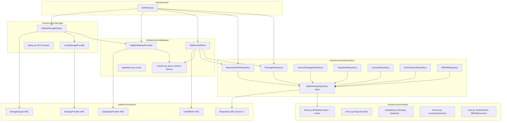
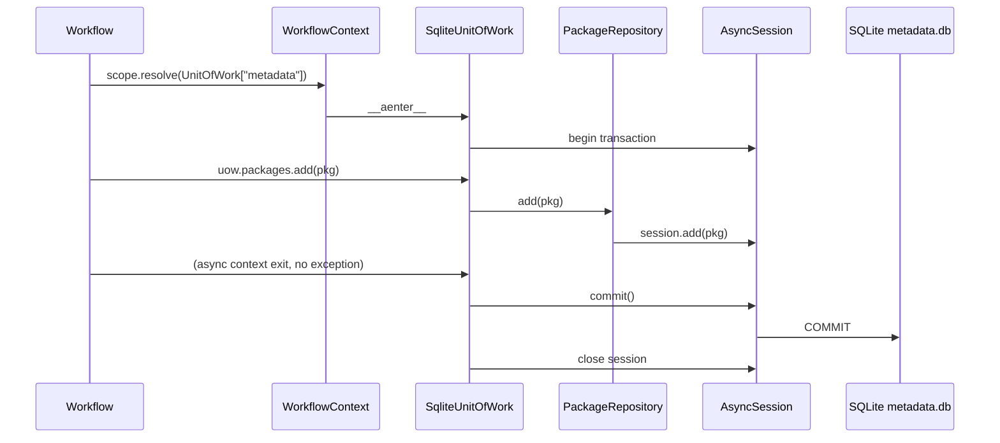
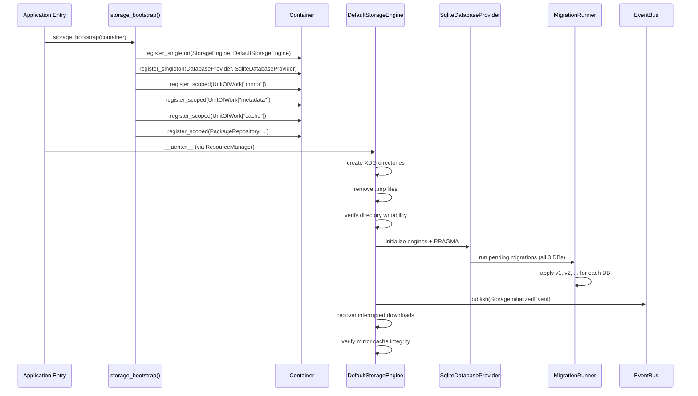

# Design Document: M2 Storage Layer

## Overview

Milestone M2 delivers the persistence infrastructure for DebCraft. It sits between the domain model and the three SQLite databases, exposing a clean collection-like API that business logic consumes without ever touching a SQLAlchemy session directly.

M2 builds entirely on top of M1's runtime kernel. It contributes:

- **Storage Engine** — manages the XDG-compliant filesystem layout, directory initialization, lifecycle, and path resolution.
- **Database Provider** — wraps SQLAlchemy async engines and session factories behind an abstract interface, one engine per logical database.
- **Repository pattern (DDD)** — typed, generic collection interfaces for all aggregate roots, hiding SQL mechanics behind `add / get_by_id / find / update / delete`.
- **Unit of Work** — transaction coordinator scoped to one workflow × one logical database, exposed through `WorkflowContext`.
- **Entity models** — SQLAlchemy 2.0 ORM mapped classes with `Mapped[]` annotations, surrogate integer keys, natural-key constraints, and UTC timestamps.
- **Migrations** — lightweight forward-only versioned Python functions, one independent track per database.
- **Recovery** — interrupted-download recovery, temporary-file cleanup, cache integrity verification.
- **Bootstrap** — a single `storage_bootstrap()` function registers all services in the M1 `Container`.

Design principles:
- **Contracts-first** — abstract interfaces in `platform/contracts/`, implementations in `infrastructure/`.
- **No direct session access outside infrastructure** — business logic and workflows never import SQLAlchemy.
- **Import-linter clean** — domain cannot import infrastructure; contracts cannot import kernel/infrastructure.
- **Async-native** — all I/O uses `async def` and `await`; SQLAlchemy 2.0 `AsyncSession` throughout.
- **Minimal dependencies** — SQLAlchemy + aiosqlite only; no Alembic, no additional ORMs.
- **Cross-platform** — `pathlib.Path` everywhere; XDG variables on Linux with fallbacks for macOS and Windows.

---

## Architecture



### Component Interaction: Workflow Accessing Persistence



### Startup Sequence



---

## Components and Interfaces

### 1. Storage Contracts (`platform/contracts/storage.py`)

```python
from abc import ABC, abstractmethod
from pathlib import Path
from typing import Literal

StoragePurpose = Literal["mirror", "workspace", "outputs", "logs", "cache", "database", "config"]


class StorageProvider(ABC):
    """Abstraction over the physical storage backend."""

    @abstractmethod
    async def create_directory(self, path: Path) -> None:
        """Create directory and all parents; no-op if it already exists."""
        ...

    @abstractmethod
    async def remove_matching(self, directory: Path, pattern: str) -> None:
        """Remove files/dirs in directory matching glob pattern."""
        ...

    @abstractmethod
    def resolve_path(self, purpose: StoragePurpose, relative: str = "") -> Path:
        """Return absolute Path for a storage purpose."""
        ...

    @abstractmethod
    async def check_writable(self, path: Path) -> bool:
        """Return True if path is writable by the current process."""
        ...


class StorageEngine(ABC):
    """Manages filesystem layout, lifecycle, and path resolution."""

    @abstractmethod
    async def initialize(self) -> None:
        """Create directories, remove temporaries, verify permissions."""
        ...

    @abstractmethod
    async def shutdown(self) -> None:
        """Flush pending writes and release resources (30-second limit)."""
        ...

    @abstractmethod
    def get_path(self, purpose: StoragePurpose, relative: str = "") -> Path:
        """Return absolute Path for a named storage purpose."""
        ...

    @abstractmethod
    async def __aenter__(self) -> "StorageEngine":
        """Enter async context: calls initialize()."""
        ...

    @abstractmethod
    async def __aexit__(self, *exc: object) -> None:
        """Exit async context: calls shutdown()."""
        ...
```

### 2. Persistence Contracts (`platform/contracts/persistence.py`)

```python
from abc import ABC, abstractmethod
from typing import Generic, TypeVar

T = TypeVar("T")


class Repository(ABC, Generic[T]):
    """Collection-like access to aggregate root entities."""

    @abstractmethod
    async def add(self, entity: T) -> T:
        """Insert entity; return the persisted instance with surrogate key set."""
        ...

    @abstractmethod
    async def get_by_id(self, entity_id: int) -> T:
        """Lookup by surrogate key; raises StorageError if not found."""
        ...

    @abstractmethod
    async def find(self, **filters: object) -> list[T]:
        """Query returning zero or more entities matching keyword filters."""
        ...

    @abstractmethod
    async def update(self, entity: T) -> T:
        """Persist modifications; raises StorageError on immutable entities."""
        ...

    @abstractmethod
    async def delete(self, entity_id: int) -> None:
        """Remove entity by surrogate key."""
        ...


class UnitOfWork(ABC):
    """Transaction coordinator for a single logical database."""

    @abstractmethod
    async def commit(self) -> None:
        """Persist all tracked changes as one atomic transaction."""
        ...

    @abstractmethod
    async def rollback(self) -> None:
        """Discard all pending changes."""
        ...

    @abstractmethod
    async def __aenter__(self) -> "UnitOfWork":
        ...

    @abstractmethod
    async def __aexit__(self, exc_type: object, exc_val: object, exc_tb: object) -> bool:
        ...


class DatabaseProvider(ABC):
    """Manages engines and sessions for the three logical databases."""

    @abstractmethod
    async def get_session(self, db_name: Literal["mirror", "metadata", "cache"]) -> AsyncSession:
        """Return an open async session bound to the named database."""
        ...

    @abstractmethod
    async def dispose(self) -> None:
        """Close all connection pools within 10 seconds."""
        ...

    @abstractmethod
    async def health_check(self) -> dict[str, bool]:
        """Return liveness status keyed by database name."""
        ...
```

### 3. XDG Path Resolution (`infrastructure/storage/paths.py`)

Path resolution follows [XDG Base Directory Specification](https://specifications.freedesktop.org/basedir-spec/latest/) on Linux and applies platform-appropriate fallbacks elsewhere.

| Purpose       | XDG Variable      | Linux default               | macOS fallback             | Windows fallback                    |
|---------------|-------------------|-----------------------------|----------------------------|-------------------------------------|
| `mirror`      | `XDG_CACHE_HOME`  | `~/.cache/debcraft/mirror/` | `~/Library/Caches/debcraft/mirror/` | `%LOCALAPPDATA%\debcraft\cache\mirror\` |
| `workspace`   | `XDG_CACHE_HOME`  | `~/.cache/debcraft/workspace/` | (same pattern) | (same pattern) |
| `outputs`     | `XDG_CACHE_HOME`  | `~/.cache/debcraft/outputs/` | | |
| `logs`        | `XDG_CACHE_HOME`  | `~/.cache/debcraft/logs/`   | | |
| `cache`       | `XDG_CACHE_HOME`  | `~/.cache/debcraft/cache/`  | | |
| `database`    | `XDG_DATA_HOME`   | `~/.local/share/debcraft/`  | `~/Library/Application Support/debcraft/` | `%APPDATA%\debcraft\` |
| `config`      | `XDG_CONFIG_HOME` | `~/.config/debcraft/`       | `~/Library/Preferences/debcraft/` | `%APPDATA%\debcraft\config\` |

Detection uses `sys.platform`: `"linux"` → XDG; `"darwin"` → macOS paths; `"win32"` → Windows paths. `os.environ` is consulted for XDG variables; if absent the defaults above apply. All resulting values are returned as `pathlib.Path`.

### 4. SQLite Database Provider (`infrastructure/database/provider.py`)

`SqliteDatabaseProvider` creates one `AsyncEngine` per logical database and applies PRAGMA configuration at engine creation:

```python
PRAGMA foreign_keys = ON;
PRAGMA journal_mode = WAL;
PRAGMA synchronous = NORMAL;
```

Connection pooling uses `QueuePool` with `pool_size=5`, `max_overflow=0`. Each engine is created lazily on first access and cached. The async session factory for each engine is stored as a `async_sessionmaker` configured with `expire_on_commit=False` so that entity attributes remain accessible after a commit within the same unit of work.

**Error mapping**: `OperationalError` with "disk I/O error" or "database disk image is malformed" → `StorageError` with `corruption` label; "unable to open" or ENOENT → `not found`; EACCES/EPERM → `permission denied`.

### 5. Unit of Work (`infrastructure/database/unit_of_work.py`)

`SqliteUnitOfWork` is parameterised by logical database name. It holds a single `AsyncSession` and exposes typed repository properties:

```python
class SqliteUnitOfWork(UnitOfWork):
    def __init__(self, db_provider: DatabaseProvider, db_name: str) -> None: ...

    @property
    def packages(self) -> PackageRepository: ...

    @property
    def source_packages(self) -> SourcePackageRepository: ...

    @property
    def repository_files(self) -> RepositoryFileRepository: ...

    @property
    def snapshots(self) -> RepositorySnapshotRepository: ...

    @property
    def licenses(self) -> LicenseRepository: ...

    @property
    def scan_sessions(self) -> ScanSessionRepository: ...

    @property
    def sbom_documents(self) -> SBOMRepository: ...
```

All repository instances are constructed lazily, sharing `self._session`. The `__aexit__` implementation:

1. If `exc_type is None` → call `commit()`; on `SQLAlchemyError` during commit → rollback then raise `StorageError`.
2. If `exc_type is not None` → call `rollback()` then re-raise.

The `CancellationToken` is checked before each `commit()` call; if cancelled, rollback is performed and a `StorageError` is raised.

### 6. Repository Base (`infrastructure/repositories/base.py`)

`SqlAlchemyRepository[T]` is a generic base providing default implementations of `add`, `get_by_id`, `find`, `update`, and `delete` using the injected `AsyncSession`:

- `add`: `session.add(entity)` + `session.flush()` to populate the surrogate key without committing.
- `get_by_id`: `session.get(model_class, entity_id)` → raises `StorageError` if `None`.
- `find`: constructs `select(model_class).where(...)` from `**filters`; returns empty list if no results.
- `update`: `session.merge(entity)` + `session.flush()`.
- `delete`: `session.execute(delete(model_class).where(id == entity_id))`.

Concrete repositories subclass this base and add domain-specific query methods.

### 7. Migration Runner (`infrastructure/database/migrations.py`)

Migrations are plain Python `async` functions named `migrate_v{N}(session: AsyncSession) -> None`. Each database has its own subdirectory (`migrations/mirror/`, `migrations/metadata/`, `migrations/cache/`) containing numbered modules.

**History table schema** (created on first run):

```sql
CREATE TABLE IF NOT EXISTS _migration_history (
    version     INTEGER PRIMARY KEY,
    applied_at  TEXT NOT NULL,   -- ISO-8601 UTC timestamp
    duration_ms INTEGER NOT NULL
);
```

The runner:
1. Creates `_migration_history` if absent.
2. Reads `SELECT version FROM _migration_history` to build a set of applied versions.
3. Scans the migration directory, collects file names matching `v{N}_*.py`, sorts ascending.
4. For each unapplied version: starts a savepoint, calls `migrate_vN(session)`, records into `_migration_history`, releases savepoint.
5. If a migration raises, rolls back to savepoint, raises `StorageError(migration_id=N, cause=...)`, halts for that database.

### 8. Storage Events

Three frozen dataclass events extend `DomainEvent` and are published via `EventBus`:

```python
@dataclass(frozen=True)
class StorageInitializedEvent(DomainEvent):
    event_type: str = "storage.initialized"
    base_path: str = ""

@dataclass(frozen=True)
class StorageShutdownEvent(DomainEvent):
    event_type: str = "storage.shutdown"

@dataclass(frozen=True)
class MigrationAppliedEvent(DomainEvent):
    event_type: str = "storage.migration_applied"
    db_name: str = ""
    version: int = 0
    duration_ms: int = 0
```

### 9. Bootstrap (`infrastructure/bootstrap.py`)

```python
async def storage_bootstrap(container: Container) -> None:
    """Register all M2 storage services in the M1 Container."""
```

Registrations:

| Service | Interface | Lifetime |
|---|---|---|
| `DefaultStorageEngine` | `StorageEngine` | singleton |
| `SqliteDatabaseProvider` | `DatabaseProvider` | singleton |
| `SqliteUnitOfWork("mirror")` | `UnitOfWork` | scoped |
| `SqliteUnitOfWork("metadata")` | `UnitOfWork` | scoped |
| `SqliteUnitOfWork("cache")` | `UnitOfWork` | scoped |
| `SqlAlchemyRepositoryFileRepository` | `RepositoryFileRepository` | scoped |
| `SqlAlchemyPackageRepository` | `PackageRepository` | scoped |
| `SqlAlchemySourcePackageRepository` | `SourcePackageRepository` | scoped |
| `SqlAlchemySnapshotRepository` | `RepositorySnapshotRepository` | scoped |
| `SqlAlchemyLicenseRepository` | `LicenseRepository` | scoped |
| `SqlAlchemyScanSessionRepository` | `ScanSessionRepository` | scoped |
| `SqlAlchemySBOMRepository` | `SBOMRepository` | scoped |

The `StorageEngine` is also passed to `ResourceManager.acquire_async()` so that M1 invokes `__aenter__` / `__aexit__` in deterministic order.

---

## Data Models

### Base (`infrastructure/models/base.py`)

```python
from datetime import UTC, datetime
from sqlalchemy import DateTime, Integer, func
from sqlalchemy.orm import DeclarativeBase, Mapped, mapped_column


class Base(DeclarativeBase):
    pass


class TimestampMixin:
    created_at: Mapped[datetime] = mapped_column(
        DateTime(timezone=True),
        server_default=func.now(),
        nullable=False,
    )
    updated_at: Mapped[datetime] = mapped_column(
        DateTime(timezone=True),
        server_default=func.now(),
        onupdate=lambda: datetime.now(UTC),
        nullable=False,
    )
```

All entity models inherit from `Base` and `TimestampMixin`. Primary keys use `Integer` with `autoincrement=True`.

### mirror.db (`infrastructure/models/mirror.py`)

**RepositoryFile** — one row per file discovered in a remote Debian repository.

| Column | Type | Constraints |
|---|---|---|
| `id` | `Integer` | PK, autoincrement |
| `url` | `String(2048)` | NOT NULL, UNIQUE, INDEX |
| `sha256` | `String(64)` | NOT NULL, INDEX |
| `size_bytes` | `BigInteger` | NOT NULL |
| `state` | `Enum(RepositoryFileState)` | NOT NULL, INDEX |
| `retry_count` | `Integer` | NOT NULL, DEFAULT 0 |
| `local_path` | `String(4096)` | NULLABLE |
| `created_at` | `DateTime` | NOT NULL |
| `updated_at` | `DateTime` | NOT NULL |

`RepositoryFileState` enum values: `DISCOVERED`, `QUEUED`, `DOWNLOADING`, `DOWNLOADED`, `VERIFIED`, `INDEXED`, `FAILED`.

### metadata.db (`infrastructure/models/metadata.py`)

**Repository** — a Debian package repository (e.g. `debian bookworm main`).

| Column | Type | Constraints |
|---|---|---|
| `id` | `Integer` | PK |
| `name` | `String(512)` | NOT NULL, UNIQUE |
| `base_url` | `String(2048)` | NOT NULL |
| `suite` | `String(128)` | NOT NULL |
| `component` | `String(128)` | NOT NULL |

**RepositorySnapshot** — immutable point-in-time capture.

| Column | Type | Constraints |
|---|---|---|
| `id` | `Integer` | PK |
| `repository_id` | `Integer` | FK → Repository.id, INDEX |
| `schema_version` | `Integer` | NOT NULL |
| `captured_at` | `DateTime` | NOT NULL |
| `published` | `Boolean` | NOT NULL, DEFAULT False |

**PackageInstance** — binary package identified by name + version + arch + filename.

| Column | Type | Constraints |
|---|---|---|
| `id` | `Integer` | PK |
| `package_name` | `String(256)` | NOT NULL, INDEX |
| `version` | `String(128)` | NOT NULL |
| `architecture` | `String(64)` | NOT NULL |
| `filename` | `String(1024)` | NOT NULL |
| `sha256` | `String(64)` | NOT NULL, INDEX |
| `size_bytes` | `BigInteger` | NOT NULL |
| `snapshot_id` | `Integer` | FK → RepositorySnapshot.id, INDEX |
| UNIQUE | (`package_name`, `version`, `architecture`, `filename`) | |

**SourcePackage** — Debian source package.

| Column | Type | Constraints |
|---|---|---|
| `id` | `Integer` | PK |
| `name` | `String(256)` | NOT NULL |
| `version` | `String(128)` | NOT NULL |
| `maintainer` | `String(512)` | NULLABLE |
| UNIQUE | (`name`, `version`) | |

**LicenseExpression** — SPDX license expression linked to a package.

| Column | Type | Constraints |
|---|---|---|
| `id` | `Integer` | PK |
| `package_id` | `Integer` | FK → PackageInstance.id, INDEX |
| `expression` | `String(1024)` | NOT NULL |
| `source` | `String(64)` | NOT NULL (e.g. `dep5`, `spdx`, `inferred`) |

**ScanSession** — complete analysis run.

| Column | Type | Constraints |
|---|---|---|
| `id` | `Integer` | PK |
| `snapshot_id` | `Integer` | FK → RepositorySnapshot.id, INDEX |
| `state` | `Enum(ScanState)` | NOT NULL, INDEX |
| `started_at` | `DateTime` | NOT NULL |
| `completed_at` | `DateTime` | NULLABLE |

**SBOMDocument** — generated Software Bill of Materials.

| Column | Type | Constraints |
|---|---|---|
| `id` | `Integer` | PK |
| `scan_session_id` | `Integer` | FK → ScanSession.id, INDEX |
| `format` | `String(32)` | NOT NULL (`spdx`, `cyclonedx`) |
| `content_path` | `String(4096)` | NOT NULL |
| `sha256` | `String(64)` | NOT NULL, INDEX |

### cache.db (`infrastructure/models/cache.py` — not listed in module layout but implied)

Cache models store recomputable derived data:

- `ParsedDep5` — cached DEP-5 AST keyed by source SHA256.
- `NormalizedLicense` — normalized SPDX expression keyed by raw expression string.
- `ChecksumCache` — pre-computed SHA256 for expensive-to-hash content blobs.

All cache models include a `valid` boolean column; the storage engine sets this to `False` when a conflict with `metadata.db` is detected.

---

## Correctness Properties

*A property is a characteristic or behavior that should hold true across all valid executions of a system — essentially, a formal statement about what the system should do. Properties serve as the bridge between human-readable specifications and machine-verifiable correctness guarantees.*

### Property 1: XDG Path Resolution Correctness

*For any* combination of platform identifier (`linux`, `darwin`, `win32`) and set of XDG environment variables (present or absent), and *for any* valid `StoragePurpose`, `get_path()` SHALL return an absolute `pathlib.Path` rooted in the expected platform-specific base directory with the correct subdirectory suffix appended.

**Validates: Requirements 1.4, 1.6**

### Property 2: Temporary File Cleanup

*For any* set of files in the workspace directory where some files have a `.tmp` suffix or match the configurable temporary prefix (`tmp_`), after `StorageEngine.initialize()` completes, all files matching the temporary naming convention SHALL have been removed and all other files SHALL remain untouched.

**Validates: Requirements 1.8, 7.4**

### Property 3: Invalid Database Name Rejection

*For any* string that is not one of `"mirror"`, `"metadata"`, or `"cache"`, requesting a session from `DatabaseProvider` SHALL raise a `StorageError` identifying the unrecognized database name.

**Validates: Requirements 2.9**

### Property 4: Repository Round-Trip (Surrogate Key)

*For any* valid domain entity (PackageInstance, RepositoryFile, SourcePackage, LicenseExpression, ScanSession, SBOMDocument), storing it via `repository.add()` then retrieving it via `repository.get_by_id()` with the assigned surrogate key SHALL yield an entity with equivalent field values.

**Validates: Requirements 3.2, 11.10**

### Property 5: Repository Round-Trip (Natural Key)

*For any* valid PackageInstance with a unique combination of (package_name, version, architecture, filename), storing it via `repository.add()` then retrieving it via `repository.get_by_natural_key()` SHALL yield an entity with equivalent field values.

**Validates: Requirements 3.9**

### Property 6: Repository State Filtering

*For any* collection of RepositoryFile entities persisted with varying lifecycle states, querying by a specific state `S` SHALL return exactly the subset of entities whose state equals `S` and no others.

**Validates: Requirements 3.10**

### Property 7: Empty Find Returns Empty List

*For any* filter criteria that match no stored entities, `repository.find(**filters)` SHALL return an empty list rather than raising an exception.

**Validates: Requirements 3.11**

### Property 8: Missing Entity Lookup Raises StorageError

*For any* surrogate key value that does not exist in the database, `repository.get_by_id(key)` SHALL raise a `StorageError` identifying the entity type, key name, and requested key value.

**Validates: Requirements 3.7**

### Property 9: Published Snapshot Immutability

*For any* `RepositorySnapshot` entity whose `published` field is `True`, calling `update()` or `delete()` on that entity SHALL raise a `StorageError` indicating that published snapshots are immutable.

**Validates: Requirements 3.12, 5.5**

### Property 10: Commit Atomicity

*For any* set of N entities added to repositories within a single `UnitOfWork`, before `commit()` is called none SHALL be visible in an independent session, and after `commit()` completes successfully all N entities SHALL be retrievable from a fresh session.

**Validates: Requirements 3.3, 4.2**

### Property 11: Rollback Discards All Changes

*For any* set of entities added to repositories within a `UnitOfWork`, after `rollback()` is called, none of those entities SHALL be retrievable from a fresh session, and the UnitOfWork SHALL accept subsequent operations.

**Validates: Requirements 4.3**

### Property 12: Cancellation Prevents Commit

*For any* `UnitOfWork` whose associated `CancellationToken` has been cancelled, calling `commit()` SHALL roll back any uncommitted changes and raise a `StorageError`, preventing data persistence.

**Validates: Requirements 4.9, 9.8**

### Property 13: Auto-Incrementing Surrogate Keys

*For any* sequence of entities inserted into a repository, each entity SHALL receive a unique integer surrogate key, and keys SHALL be assigned in strictly ascending order within a single session.

**Validates: Requirements 5.1**

### Property 14: Natural Key Uniqueness Enforcement

*For any* PackageInstance, inserting a second entity with an identical combination of (package_name, version, architecture, filename) SHALL raise an integrity error via `StorageError`.

**Validates: Requirements 5.2**

### Property 15: Timestamp Invariants

*For any* entity, after creation `created_at` SHALL be set to a UTC timestamp and `updated_at` SHALL equal `created_at`. After any subsequent `update()`, `updated_at` SHALL be greater than or equal to the previous `updated_at` value, and `created_at` SHALL remain unchanged.

**Validates: Requirements 5.8**

### Property 16: Migration Ordering and Idempotence

*For any* set of migration files with version identifiers, the migration runner SHALL apply them in strictly ascending version order, and *for any* migration whose version is already recorded in the history table, re-running the migration system SHALL skip it without re-execution.

**Validates: Requirements 6.2, 6.9**

### Property 17: Migration History Recording

*For any* migration that executes successfully, the migration history table SHALL contain a row with the migration's version identifier, a valid ISO-8601 UTC timestamp, and a non-negative duration in milliseconds.

**Validates: Requirements 6.3**

### Property 18: Download Recovery State Machine

*For any* RepositoryFile in `DOWNLOADING` state when the StorageEngine initializes: if `retry_count < 3`, the state SHALL transition to `QUEUED` with `retry_count` incremented by 1; if `retry_count >= 3`, the state SHALL transition to `FAILED`.

**Validates: Requirements 7.1**

### Property 19: Cache Integrity Verification

*For any* file in the mirror cache directory whose computed SHA256 does not match the stored checksum in mirror.db, the file SHALL be removed from the filesystem during initialization.

**Validates: Requirements 7.5**

### Property 20: Cache Corruption Marking

*For any* cache.db entry detected as corrupt (SHA256 mismatch between stored and computed values), the entry SHALL be marked as requiring recomputation rather than raising an error to the caller.

**Validates: Requirements 7.3**

### Property 21: Batched Insert Correctness

*For any* list of N valid entities passed to `batch_add()`, after the containing UnitOfWork commits, all N entities SHALL be individually retrievable by their assigned surrogate keys.

**Validates: Requirements 8.1**

### Property 22: Lifecycle Event Publication

*For any* storage lifecycle action (initialization, shutdown, or migration application), the `EventBus` SHALL receive a `DomainEvent` of the corresponding type (`StorageInitializedEvent`, `StorageShutdownEvent`, or `MigrationAppliedEvent`).

**Validates: Requirements 9.6**

### Property 23: cache.db Deletion Recovery

*For any* system state, deleting cache.db and reinitializing the StorageEngine SHALL succeed without error, recreating an empty cache.db, and SHALL not affect data in mirror.db or metadata.db.

**Validates: Requirements 10.5**

### Property 24: Cache/Metadata Conflict Resolution

*For any* entity present in both cache.db and metadata.db where the cached value differs from the metadata value, the cache entry SHALL be marked invalid and metadata.db SHALL remain authoritative and unchanged.

**Validates: Requirements 10.6**

### Property 25: Error Wrapping

*For any* filesystem `PermissionError` or database connection failure encountered during a storage operation, the storage layer SHALL raise a domain-specific `StorageError` rather than propagating the underlying platform exception directly.

**Validates: Requirements 11.11**

---


## Error Handling

### Error Hierarchy

```python
# Extends M1's PlatformError
class StorageError(PlatformError):
    """Base exception for all storage layer errors."""

    def __init__(self, message: str, cause: Exception | None = None) -> None:
        super().__init__(message)
        self.__cause__ = cause


class DatabaseConnectionError(StorageError):
    """Raised when a database engine or session cannot be created."""
    db_name: str
    failure_type: str  # "corruption" | "permission_denied" | "not_found"


class EntityNotFoundError(StorageError):
    """Raised when get_by_id or get_by_natural_key finds no match."""
    entity_type: str
    key_name: str
    key_value: object


class ImmutableEntityError(StorageError):
    """Raised when update/delete is attempted on a published snapshot."""
    entity_type: str
    entity_id: int


class MigrationError(StorageError):
    """Raised when a migration fails execution."""
    migration_version: int
    db_name: str


class StorageTimeoutError(StorageError):
    """Raised when shutdown or disposal exceeds the configured timeout."""
    timeout_seconds: float
```

### Error Mapping Strategy

All infrastructure-layer exceptions (SQLAlchemy `OperationalError`, `IntegrityError`, filesystem `PermissionError`, `FileNotFoundError`, etc.) are caught at the boundary of each infrastructure component and translated into the appropriate `StorageError` subclass. The original exception is preserved as `__cause__` for debugging.

| Source Exception | Target StorageError | Condition |
|---|---|---|
| `sqlalchemy.exc.OperationalError` ("malformed") | `DatabaseConnectionError(failure_type="corruption")` | Database file corrupt |
| `sqlalchemy.exc.OperationalError` ("unable to open") | `DatabaseConnectionError(failure_type="not_found")` | File missing |
| `PermissionError` / EACCES | `DatabaseConnectionError(failure_type="permission_denied")` | No write access |
| `sqlalchemy.exc.IntegrityError` (unique) | `StorageError` ("duplicate natural key") | Unique constraint violation |
| `asyncio.TimeoutError` | `StorageTimeoutError` | Shutdown/disposal timeout |
| Any exception during `UoW.commit()` | `StorageError` (wrapping original) | Commit failure |

### Recovery Error Handling

- **Recoverable**: Downloading state entries → retry up to 3 times, then mark FAILED.
- **Recoverable**: Cache integrity mismatch → mark invalid, schedule recomputation.
- **Unrecoverable**: Database file won't open after 3 attempts → raise `StorageError` with path, request manual intervention.
- **Partial commit failure**: If one UoW commits but another fails in a multi-db operation → log which DBs committed, raise `StorageError` with full details, leave committed data intact (no attempt to undo).

---

## Testing Strategy

### Dual Testing Approach

The M2 storage layer uses both unit tests and property-based tests for comprehensive coverage.

**Unit tests** (`@pytest.mark.unit`, `@pytest.mark.storage`):
- Verify specific examples and edge cases
- Test error conditions (corrupt DB, permission denied, immutable entity)
- Test integration wiring (bootstrap registers all services)
- Test context manager protocol behavior
- Test configuration/PRAGMA settings

**Database tests** (`@pytest.mark.database`):
- Test actual SQLite operations with real in-memory or temp-file databases
- Test migration execution and history recording
- Test connection pooling behavior

**Property-based tests** (Hypothesis, `@pytest.mark.unit`, `@pytest.mark.storage`):
- Verify universal correctness properties across randomized inputs
- Each test references its design document property via tag comment
- Minimum 200 examples per test (`@settings(max_examples=200)`)

### Property-Based Testing Configuration

- **Library**: Hypothesis (already in dev dependencies, version ≥6.100)
- **Minimum iterations**: 200 examples per property test (`@settings(max_examples=200)`)
- **Tag format**: `# Feature: m2-storage-layer, Property {N}: {title}`

### Property Test Implementation Plan

Each correctness property maps to one Hypothesis test function:

| Property | Hypothesis Strategy | Key Generators |
|---|---|---|
| 1: Path resolution | `st.sampled_from(["linux","darwin","win32"])` × `st.dictionaries` for env vars | Platform + env combinations |
| 2: Temp file cleanup | `st.lists(st.tuples(st.text(), st.booleans()))` for (filename, is_tmp) | File sets with mixed suffixes |
| 3: Invalid DB name | `st.text().filter(lambda s: s not in {"mirror","metadata","cache"})` | Random non-valid strings |
| 4: Surrogate key round-trip | Custom strategies per entity type | Randomized entity fields |
| 5: Natural key round-trip | `st.builds(PackageInstance, ...)` | Random package metadata |
| 6: State filtering | `st.lists(st.builds(RepositoryFile, state=st.sampled_from(states)))` | Mixed-state file lists |
| 7: Empty find | `st.dictionaries(st.text(), st.text())` for filters | Random filter criteria |
| 8: Missing entity | `st.integers(min_value=1)` for non-existent IDs | Random positive integers |
| 9: Snapshot immutability | `st.builds(RepositorySnapshot, published=st.just(True))` | Published snapshots |
| 10: Commit atomicity | `st.lists(entity_strategy, min_size=1, max_size=20)` | Entity batches |
| 11: Rollback | Same as 10 | Entity batches |
| 12: Cancellation | Entity strategy + cancelled token | Entities with cancelled token |
| 13: Auto-increment keys | `st.lists(entity_strategy, min_size=2, max_size=50)` | Ordered inserts |
| 14: Natural key uniqueness | `st.builds(PackageInstance)` (duplicated) | Two entities same natural key |
| 15: Timestamps | Entity strategy + update strategy | Entity create/update cycles |
| 16: Migration ordering | `st.permutations(range(1, N))` for version lists | Shuffled version sets |
| 17: Migration history | Single migration execution | Version + timing verification |
| 18: Download recovery | `st.builds(RepositoryFile, state=DOWNLOADING, retry_count=st.integers(0,5))` | Varied retry counts |
| 19: Cache integrity | `st.binary()` for file content + stored hash | Content/hash pairs |
| 20: Cache corruption | `st.builds(CacheEntry)` with mismatched SHA | Corrupt entries |
| 21: Batch insert | `st.lists(entity_strategy, min_size=1, max_size=100)` | Entity lists |
| 22: Lifecycle events | Mock EventBus + lifecycle actions | Init/shutdown/migrate |
| 23: cache.db recovery | Full system state | Delete + reinit |
| 24: Conflict resolution | Entities in both cache and metadata with differing values | Conflicting data |
| 25: Error wrapping | `st.sampled_from([PermissionError, ...])` | Injected exceptions |

### Cross-Platform Testing

Tests marked `@pytest.mark.cross_platform` SHALL:
- Use `pathlib.Path` exclusively (no hardcoded separators)
- Use `tmp_path` pytest fixture for isolated filesystem operations
- Run in CI matrix on Linux, macOS, and Windows

### Test Fixtures

- **In-memory SQLite databases** for fast unit and property tests (`sqlite+aiosqlite:///:memory:`)
- **Temporary directory fixtures** (`tmp_path`) for filesystem tests
- **Mocked EventBus** for verifying event publication without side effects
- **Mocked StorageProvider** for testing StorageEngine logic without filesystem
- **Pre-seeded databases** for migration and recovery tests

### Test Organization

```
tests/
├── unit/
│   └── infrastructure/
│       ├── test_storage_engine.py
│       ├── test_database_provider.py
│       ├── test_unit_of_work.py
│       ├── test_migrations.py
│       ├── test_repositories.py
│       ├── test_path_resolution.py
│       ├── test_recovery.py
│       └── test_bootstrap.py
├── properties/
│   └── infrastructure/
│       ├── test_repository_roundtrip.py
│       ├── test_entity_invariants.py
│       ├── test_uow_transactions.py
│       ├── test_path_resolution_props.py
│       ├── test_migration_props.py
│       └── test_recovery_props.py
└── integration/
    └── infrastructure/
        ├── test_storage_lifecycle.py
        ├── test_database_operations.py
        └── test_cross_platform.py
```
