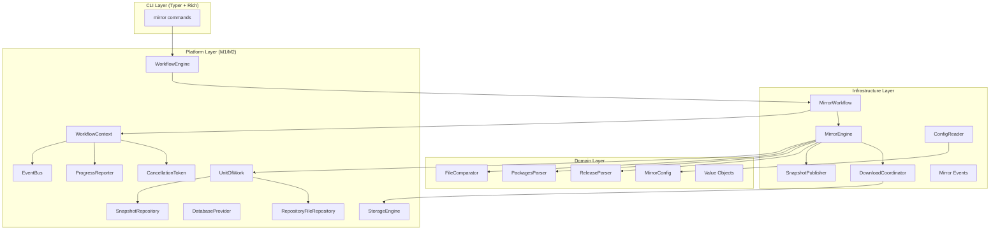
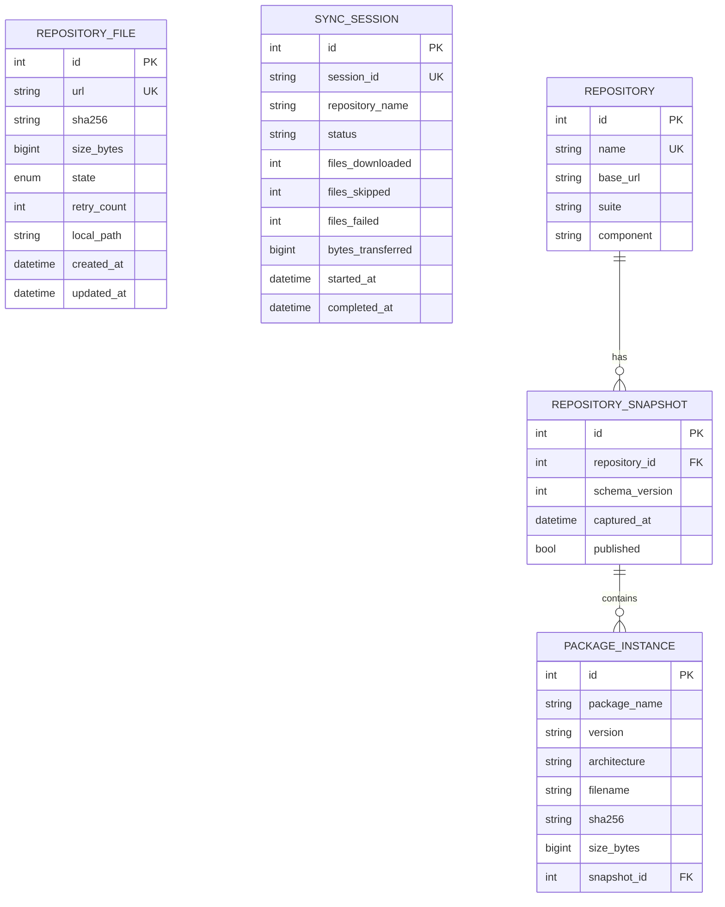
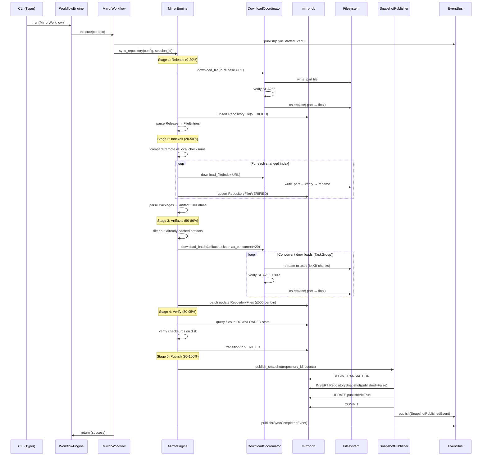

# Design Document: Repository Mirror (M3)

## Overview

The Repository Mirror feature implements a native Python mirroring engine that downloads, verifies, and caches remote Debian repositories locally. It operates as a `MirrorWorkflow` (a concrete `Workflow` implementation) orchestrated by the existing M1 `WorkflowEngine`, persists state in the M2 `mirror.db` via SQLAlchemy, and exposes CLI commands through Typer.

The engine performs incremental synchronization: it downloads Release files, compares SHA256 checksums to detect changes, downloads only new/modified index files and package artifacts, and publishes an immutable `RepositorySnapshot` upon successful completion. All I/O is asynchronous (aiohttp for HTTP, aiosqlite for SQLite), downloads are concurrent with configurable parallelism, and the entire pipeline is interruptible via the M1 `CancellationToken`.

### Key Design Decisions

1. **Pipeline architecture**: Synchronization proceeds through discrete stages (Release → Index → Artifact → Verify → Publish), each separated by cancellation checkpoints. This enables clean interruption and progress reporting.

2. **Domain layer for mirror logic**: Core synchronization logic (Release parsing, checksum comparison, file queuing) lives in `domain/mirror/` as pure functions and value objects. The infrastructure layer handles I/O (HTTP, filesystem, database).

3. **Download Coordinator as a scoped service**: The `DownloadCoordinator` manages aiohttp session lifecycle within a workflow scope, providing connection pooling, retry, and backoff.

4. **Configuration via TOML**: Repository definitions live in `mirrors.toml` at the XDG config path, parsed at startup with validation.

5. **Batch database commits**: State transitions are committed in batches of ≤500 entities to bound memory usage while maintaining atomicity within each batch.

## Architecture



### Layer Responsibilities

| Layer | Responsibility |
|-------|---------------|
| `platform/contracts` | ABCs for Workflow, Storage, Persistence, Events |
| `platform/kernel` | WorkflowEngine, EventBus implementation |
| `domain/mirror` | Release/Packages parsing, checksum logic, config model, value objects |
| `infrastructure/mirror` | MirrorWorkflow, MirrorEngine, DownloadCoordinator, events, bootstrap |
| `cli` | Typer command group for `debcraft mirror *` |

## Components and Interfaces

### Module/File Structure

```
src/debcraft/
├── domain/
│   └── mirror/
│       ├── __init__.py
│       ├── config.py            # MirrorConfig, RepositoryConfig dataclasses
│       ├── release_parser.py    # Parse Release/InRelease files
│       ├── packages_parser.py   # Parse Packages index files
│       ├── comparator.py        # SHA256 comparison logic for incremental sync
│       └── values.py            # Value objects: FileEntry, SyncDecision, etc.
├── infrastructure/
│   └── mirror/
│       ├── __init__.py
│       ├── bootstrap.py         # mirror_bootstrap(container) registration
│       ├── workflow.py          # MirrorWorkflow (Workflow impl)
│       ├── engine.py            # MirrorEngine (orchestrates stages)
│       ├── download.py          # DownloadCoordinator (aiohttp, retry, backoff)
│       ├── publisher.py         # SnapshotPublisher (atomic snapshot creation)
│       ├── config_reader.py     # TOML config reading + validation
│       ├── events.py            # Mirror domain events
│       └── errors.py            # Mirror-specific error types
├── cli/
│   ├── __init__.py              # (existing) app definition
│   └── mirror.py                # mirror command group
```

### Key Classes

#### `domain/mirror/config.py`

```python
@dataclass(frozen=True)
class RepositoryConfig:
    """Configuration for a single repository to mirror."""
    name: str                    # Unique 1-128 chars
    base_url: str                # HTTPS URL
    suites: list[str]            # 1-20 entries
    components: list[str]        # 1-50 entries
    architectures: list[str]     # 1-20 entries

@dataclass(frozen=True)
class MirrorConfig:
    """Top-level mirror configuration."""
    repositories: list[RepositoryConfig]
    download_timeout: int = 300          # seconds, 30-3600
    max_connections_per_repo: int = 20
    max_total_connections: int = 60
```

#### `domain/mirror/values.py`

```python
@dataclass(frozen=True)
class FileEntry:
    """A file listed in Release or Packages metadata."""
    relative_path: str
    sha256: str
    size_bytes: int

@dataclass(frozen=True)
class SyncDecision:
    """Result of comparing remote vs local file state."""
    file_entry: FileEntry
    action: Literal["download", "skip", "verify"]
    reason: str

@dataclass(frozen=True)
class DownloadResult:
    """Outcome of a single file download attempt."""
    url: str
    success: bool
    sha256_verified: bool
    bytes_transferred: int
    error: str | None = None
    retry_count: int = 0
```

#### `domain/mirror/release_parser.py`

```python
class ReleaseParser:
    """Parses Debian Release/InRelease files."""

    def parse(self, content: str) -> ReleaseMetadata:
        """Extract SHA256 entries from a Release file.

        Returns:
            ReleaseMetadata containing file entries with checksums.

        Raises:
            ReleaseParseError: If content is malformed or missing SHA256Sums.
        """
        ...

@dataclass(frozen=True)
class ReleaseMetadata:
    """Parsed content of a Release file."""
    files: list[FileEntry]
    # Additional metadata fields (Date, Codename, etc.)
    date: str | None = None
    codename: str | None = None
```

#### `domain/mirror/packages_parser.py`

```python
class PackagesParser:
    """Parses Debian Packages index files (decompressed)."""

    def parse(self, content: str) -> list[FileEntry]:
        """Extract package file entries with SHA256, size, and filename.

        Returns:
            List of FileEntry for each package in the index.
        """
        ...
```

#### `domain/mirror/comparator.py`

```python
class FileComparator:
    """Determines which files need downloading based on SHA256 comparison."""

    def compute_sync_decisions(
        self,
        remote_entries: list[FileEntry],
        local_checksums: dict[str, str],  # relative_path → sha256
    ) -> list[SyncDecision]:
        """Compare remote metadata against local state.

        Returns download/skip decisions for each remote entry.
        """
        ...
```

#### `infrastructure/mirror/workflow.py`

```python
class MirrorWorkflow(Workflow):
    """Concrete Workflow implementing the mirror synchronization lifecycle."""

    @property
    def name(self) -> str:
        return "mirror-sync"

    async def execute(self, context: WorkflowContext) -> None:
        """Execute the full mirror synchronization pipeline.

        Stages:
        1. Load configuration
        2. For each repository: Release → Index → Artifact → Verify → Publish
        3. Report summary

        Checks CancellationToken between each stage.
        """
        ...
```

#### `infrastructure/mirror/engine.py`

```python
class MirrorEngine:
    """Orchestrates synchronization stages for a single repository."""

    def __init__(
        self,
        download_coordinator: DownloadCoordinator,
        db_provider: DatabaseProvider,
        storage_engine: StorageEngine,
        event_bus: EventBus,
        cancellation_token: CancellationToken,
        progress: ProgressReporter,
        logger: Logger,
    ) -> None: ...

    async def sync_repository(
        self,
        config: RepositoryConfig,
        session_id: str,
    ) -> SyncResult:
        """Run full sync pipeline for one repository.

        Returns:
            SyncResult with counts of downloaded/skipped/failed files.
        """
        ...

    async def _stage_release(self, config: RepositoryConfig, suite: str) -> ReleaseMetadata | None:
        """Download and parse Release file. Returns None if up-to-date."""
        ...

    async def _stage_indexes(self, config: RepositoryConfig, suite: str, release: ReleaseMetadata) -> list[FileEntry]:
        """Download changed index files, return package entries."""
        ...

    async def _stage_artifacts(self, config: RepositoryConfig, entries: list[FileEntry]) -> None:
        """Download package artifacts concurrently."""
        ...

    async def _stage_publish(self, config: RepositoryConfig) -> None:
        """Publish RepositorySnapshot for verified files."""
        ...
```

#### `infrastructure/mirror/download.py`

```python
class DownloadCoordinator:
    """Manages concurrent HTTP downloads with retry and backoff."""

    def __init__(
        self,
        storage_engine: StorageEngine,
        config: MirrorConfig,
    ) -> None: ...

    async def start(self) -> None:
        """Initialize aiohttp session with connection pooling."""
        ...

    async def close(self) -> None:
        """Close the aiohttp session."""
        ...

    async def download_file(
        self,
        url: str,
        dest_path: Path,
        expected_sha256: str,
        expected_size: int,
        timeout: int | None = None,
    ) -> DownloadResult:
        """Download a single file with SHA256 verification.

        Writes to .part file, verifies hash, atomically renames on success.
        Retries up to 3 times with exponential backoff for 5xx/network errors.
        """
        ...

    async def download_batch(
        self,
        tasks: list[DownloadTask],
        max_concurrent: int,
    ) -> list[DownloadResult]:
        """Download multiple files concurrently using asyncio.TaskGroup."""
        ...

    async def check_conditional(
        self,
        url: str,
        etag: str | None = None,
        last_modified: str | None = None,
    ) -> bool:
        """Send conditional request, return True if content is unchanged (304)."""
        ...
```

#### `infrastructure/mirror/publisher.py`

```python
class SnapshotPublisher:
    """Publishes atomic RepositorySnapshots after successful sync."""

    def __init__(
        self,
        db_provider: DatabaseProvider,
        event_bus: EventBus,
    ) -> None: ...

    async def publish_snapshot(
        self,
        repository_id: int,
        verified_file_count: int,
        failed_file_count: int,
    ) -> RepositorySnapshot | None:
        """Create and publish a RepositorySnapshot atomically.

        Returns None if no verified files exist (publishes failure event instead).
        The snapshot creation, file association, and published=True flag are
        persisted in a single transaction.
        """
        ...
```

#### `infrastructure/mirror/config_reader.py`

```python
class ConfigReader:
    """Reads and validates mirrors.toml configuration."""

    def __init__(self, storage_engine: StorageEngine) -> None: ...

    def read(self) -> MirrorConfig:
        """Read configuration from XDG config path.

        Falls back to default eLxr configuration if file doesn't exist.

        Raises:
            ConfigurationError: If TOML is invalid or fields fail validation.
        """
        ...

    def validate(self, config: MirrorConfig) -> list[str]:
        """Validate config entries, returning list of error messages."""
        ...
```

#### `infrastructure/mirror/bootstrap.py`

```python
async def mirror_bootstrap(container: Container) -> None:
    """Register M3 mirror services in the DI container.

    Singleton:
        - MirrorWorkflow
        - ConfigReader

    Scoped:
        - DownloadCoordinator
        - MirrorEngine
        - SnapshotPublisher

    Follows the same pattern as storage_bootstrap().
    """
    ...
```

## Data Models

### Existing Models (M2, unchanged)

- **`RepositoryFile`** (`mirror.db`): Tracks individual files through lifecycle states (DISCOVERED → QUEUED → DOWNLOADING → DOWNLOADED → VERIFIED → INDEXED → FAILED). Keyed by URL (unique constraint).

- **`Repository`** (`metadata.db`): Represents a configured repository with name, base_url, suite, component.

- **`RepositorySnapshot`** (`metadata.db`): Immutable point-in-time capture, linked to a Repository. Has `published` flag and `schema_version`.

- **`PackageInstance`** (`metadata.db`): Binary package linked to a snapshot.

### New Model: `SyncSession` (mirror.db)

```python
class SyncSession(Base, TimestampMixin):
    """Tracks a synchronization session for observability and resumption."""

    __tablename__ = "sync_sessions"

    id: Mapped[int] = mapped_column(Integer, primary_key=True, autoincrement=True)
    session_id: Mapped[str] = mapped_column(String(64), nullable=False, unique=True)
    repository_name: Mapped[str] = mapped_column(String(128), nullable=False)
    status: Mapped[str] = mapped_column(String(32), nullable=False)  # running, completed, failed, cancelled
    files_downloaded: Mapped[int] = mapped_column(Integer, nullable=False, default=0)
    files_skipped: Mapped[int] = mapped_column(Integer, nullable=False, default=0)
    files_failed: Mapped[int] = mapped_column(Integer, nullable=False, default=0)
    bytes_transferred: Mapped[int] = mapped_column(BigInteger, nullable=False, default=0)
    started_at: Mapped[datetime] = mapped_column(DateTime(timezone=True), nullable=False)
    completed_at: Mapped[datetime | None] = mapped_column(DateTime(timezone=True), nullable=True)
```

### Database Schema Relationships



### Mirror Cache Filesystem Layout

```
~/.cache/debcraft/mirror/
└── mirror.elxr.dev/
    └── elxr/
        ├── dists/
        │   └── elxr3/
        │       ├── InRelease
        │       ├── Release
        │       ├── main/
        │       │   ├── binary-amd64/
        │       │   │   └── Packages.gz
        │       │   └── binary-arm64/
        │       │       └── Packages.gz
        │       └── ...
        └── pool/
            └── main/
                └── l/
                    └── libssl3/
                        └── libssl3_3.0.2-0ubuntu1_amd64.deb
```

## Data Flow: Synchronization Pipeline



## Integration with Existing M1/M2 Infrastructure

### Workflow Engine Integration

`MirrorWorkflow` implements the `Workflow` ABC from `platform/contracts/workflow.py`. The existing `KernelWorkflowEngine` handles:
- State transitions (CREATED → RUNNING → COMPLETED/FAILED/CANCELLED)
- SIGINT handling → `CancellationToken.cancel()`
- Timeout enforcement via `ExecutionPolicy`
- Lifecycle event publishing (`WorkflowStartedEvent`, etc.)

The workflow is run via:
```python
engine = container.resolve(WorkflowEngine)
summary = await engine.run(container.resolve(MirrorWorkflow))
```

### Storage Engine Integration

- `StorageEngine.get_path("mirror")` resolves the XDG-compliant mirror cache root
- `StorageEngine.get_path("config")` resolves the XDG config directory for `mirrors.toml`
- The existing `.part` file cleanup in `DefaultStorageEngine.initialize()` handles orphaned downloads on startup

### Database Integration

- `DatabaseProvider.get_session("mirror")` provides sessions for `RepositoryFile` and `SyncSession` entities
- `DatabaseProvider.get_session("metadata")` provides sessions for `RepositorySnapshot` publication
- `SqliteUnitOfWork` manages transactions with the existing commit/rollback/cancellation pattern
- `RepositoryFileRepository` (already exists) provides state-based queries

### DI Container Registration

`mirror_bootstrap(container)` follows the same pattern as `storage_bootstrap(container)`:
```python
async def mirror_bootstrap(container: Container) -> None:
    container.register_singleton(MirrorWorkflow)
    container.register_singleton(ConfigReader)
    container.register_scoped(DownloadCoordinator)
    container.register_scoped(MirrorEngine)
    container.register_scoped(SnapshotPublisher)
```

### Event Bus Integration

Mirror events are published through the existing `EventBus` (resolved from `WorkflowContext`). The mirror publishes its own domain events alongside the workflow lifecycle events published by `KernelWorkflowEngine`.

## Configuration Format (`mirrors.toml`)

Location: `{XDG_CONFIG_HOME}/debcraft/mirrors.toml`

```toml
# Global download settings
[settings]
download_timeout = 300          # seconds per file (30-3600)
max_connections_per_repo = 20   # concurrent connections per repo
max_total_connections = 60      # total concurrent connections

# Repository definitions
[[repository]]
name = "elxr"
base_url = "https://mirror.elxr.dev/elxr"
suites = ["elxr3"]
components = ["main"]
architectures = ["amd64", "arm64"]

[[repository]]
name = "debian-bookworm"
base_url = "https://deb.debian.org/debian"
suites = ["bookworm", "bookworm-updates"]
components = ["main", "contrib"]
architectures = ["amd64"]
```

### Default Configuration (when `mirrors.toml` doesn't exist)

```python
DEFAULT_CONFIG = MirrorConfig(
    repositories=[
        RepositoryConfig(
            name="elxr",
            base_url="https://mirror.elxr.dev/elxr",
            suites=["elxr3"],
            components=["main"],
            architectures=["amd64", "arm64"],
        )
    ],
    download_timeout=300,
    max_connections_per_repo=20,
    max_total_connections=60,
)
```

### Validation Rules

| Field | Rule |
|-------|------|
| `name` | 1-128 chars, unique across all entries |
| `base_url` | Valid HTTP or HTTPS URL |
| `suites` | 1-20 non-empty strings |
| `components` | 1-50 non-empty strings |
| `architectures` | 1-20 non-empty strings |
| `download_timeout` | 30-3600 seconds |

## Domain Events

All mirror events extend `DomainEvent` from `platform/contracts/events.py`:

```python
@dataclass(frozen=True)
class MirrorSyncStartedEvent(DomainEvent):
    """Published when a synchronization session begins."""
    event_type: str = "mirror.sync.started"
    repository_name: str = ""
    session_id: str = ""
    suites: tuple[str, ...] = ()

@dataclass(frozen=True)
class MirrorSyncCompletedEvent(DomainEvent):
    """Published when synchronization completes successfully."""
    event_type: str = "mirror.sync.completed"
    repository_name: str = ""
    session_id: str = ""
    files_downloaded: int = 0
    files_skipped: int = 0
    files_failed: int = 0
    bytes_transferred: int = 0
    duration_seconds: float = 0.0

@dataclass(frozen=True)
class MirrorSyncFailedEvent(DomainEvent):
    """Published when synchronization fails."""
    event_type: str = "mirror.sync.failed"
    repository_name: str = ""
    session_id: str = ""
    error_message: str = ""
    files_failed: int = 0

@dataclass(frozen=True)
class SnapshotPublishedEvent(DomainEvent):
    """Published when a RepositorySnapshot is published."""
    event_type: str = "mirror.snapshot.published"
    snapshot_id: int = 0
    repository_name: str = ""
    captured_at: str = ""  # ISO format
    verified_file_count: int = 0
    failed_file_count: int = 0
```

## Error Handling

### Error Hierarchy

```python
class MirrorError(PlatformError):
    """Base for all mirror-specific errors."""

class ConfigurationError(MirrorError):
    """Invalid mirrors.toml content."""
    line_number: int | None  # TOML parse error location

class ReleaseParseError(MirrorError):
    """Malformed Release file content."""
    url: str

class DownloadError(MirrorError):
    """Base for download failures."""
    url: str
    retry_count: int

class HttpClientError(DownloadError):
    """4xx response — non-retriable."""
    status_code: int

class HttpServerError(DownloadError):
    """5xx response — retriable."""
    status_code: int

class NetworkError(DownloadError):
    """Connection refused/timeout — retriable."""

class ChecksumMismatchError(DownloadError):
    """SHA256 verification failed."""
    expected: str
    actual: str

class SizeMismatchError(DownloadError):
    """File size doesn't match metadata."""
    expected_bytes: int
    actual_bytes: int

class DiskSpaceError(MirrorError):
    """Insufficient disk space."""
    required_bytes: int
    available_bytes: int
```

### Error Handling Strategy

| Error Type | Action | Retry? |
|-----------|--------|--------|
| Network timeout/refused | Retry with exponential backoff | Yes (3x) |
| HTTP 4xx | Mark FAILED, delete .part | No |
| HTTP 5xx | Retry with exponential backoff | Yes (3x) |
| SHA256 mismatch | Delete .part, retry | Yes (3x) |
| Size mismatch | Delete .part, retry | Yes (3x) |
| Disk space exhaustion | Stop all downloads, cleanup .parts, report | No |
| TOML parse error | Refuse to start, report line number | No |
| Release parse error | Mark suite as failed, continue others | No |

### Retry with Exponential Backoff

```
delay = min(base * 2^attempt, max_backoff) + random_jitter
```
- Base: 1 second
- Max backoff: 30 seconds
- Jitter: up to 25% of computed delay
- Max attempts: 3

## Concurrency Model

### Connection Pooling

```python
# Per-repository connector with limit
connector = aiohttp.TCPConnector(
    limit_per_host=config.max_connections_per_repo,  # 20
    limit=config.max_total_connections,               # 60
    enable_cleanup_closed=True,
    ttl_dns_cache=300,
)
session = aiohttp.ClientSession(connector=connector)
```

### Structured Concurrency (TaskGroup)

All download tasks are children of a single `asyncio.TaskGroup` owned by the `MirrorEngine`. When the `CancellationToken` is triggered:

1. New tasks stop being submitted
2. In-progress tasks complete their current 64KB chunk write
3. A 30-second grace period allows graceful completion
4. After timeout, remaining connections are forcefully closed
5. State transitions are committed to mirror.db

```python
async with asyncio.TaskGroup() as tg:
    semaphore = asyncio.Semaphore(max_concurrent)
    for task in download_tasks:
        if cancellation_token.is_cancelled:
            break
        await semaphore.acquire()
        tg.create_task(self._download_with_semaphore(task, semaphore))
```

### Database Serialization

SQLite write operations are serialized through the `SqliteUnitOfWork`:
- One active transaction per logical database at a time
- Batch commits (≤500 entities) prevent lock contention
- Read operations can proceed concurrently (SQLite WAL mode)

### Memory Management

- Downloads stream to disk in 64KB chunks (no buffering entire files)
- Packages index files are parsed line-by-line via generator
- Batch database commits bound the number of in-memory ORM objects

## Correctness Properties

*A property is a characteristic or behavior that should hold true across all valid executions of a system — essentially, a formal statement about what the system should do. Properties serve as the bridge between human-readable specifications and machine-verifiable correctness guarantees.*

### Property 1: Release file parsing round-trip

*For any* valid Release file content containing SHA256Sums entries, parsing the content SHALL produce a list of FileEntry objects where each entry's sha256, size_bytes, and relative_path exactly match the corresponding line in the SHA256Sums section, and the count of parsed entries equals the count of lines in the SHA256Sums section.

**Validates: Requirements 1.2**

### Property 2: Malformed Release content is always rejected

*For any* string that does not contain a well-formed `SHA256:` or `SHA256Sums:` section header followed by indented hash entries, the ReleaseParser SHALL raise a ReleaseParseError and produce no FileEntry output.

**Validates: Requirements 1.7**

### Property 3: Matching checksums produce skip decisions

*For any* FileEntry and local cache state where the locally stored SHA256 for that file's relative path equals the FileEntry's sha256, the FileComparator SHALL produce a SyncDecision with action="skip".

**Validates: Requirements 1.3, 2.2, 3.2**

### Property 4: Mismatched or absent checksums produce download decisions

*For any* FileEntry and local cache state where either no local file exists for that relative path, or the local SHA256 differs from the FileEntry's sha256, the FileComparator SHALL produce a SyncDecision with action="download".

**Validates: Requirements 2.1, 3.1**

### Property 5: Component × architecture Cartesian product path generation

*For any* non-empty list of components and non-empty list of architectures, the generated index paths SHALL contain exactly `len(components) * len(architectures)` entries, and each entry SHALL correspond to a unique (component, architecture) pair formatted as `{component}/binary-{architecture}/Packages.gz`.

**Validates: Requirements 2.3**

### Property 6: SHA256 verification accepts correct hashes and rejects incorrect ones

*For any* byte sequence and its computed SHA256 digest, the verification function SHALL return True when the expected hash equals the computed hash, and SHALL return False for any expected hash that differs from the computed hash by at least one character.

**Validates: Requirements 2.5, 5.3**

### Property 7: Atomic download lifecycle (.part file safety)

*For any* download operation to a destination path: (a) during transfer, only a `.part`-suffixed file exists at the destination directory; (b) on successful verification, the `.part` file is atomically renamed to the final path and no `.part` file remains; (c) on verification failure or terminal error, the `.part` file is deleted and the final path is never created or modified.

**Validates: Requirements 4.1, 4.2, 4.7, 12.7**

### Property 8: Verified files are never overwritten

*For any* RepositoryFile entity in VERIFIED or INDEXED state that has a file on disk at its recorded local_path, no download operation SHALL modify, overwrite, or delete that file — regardless of whether the operation succeeds, fails, or is interrupted.

**Validates: Requirements 4.4, 4.5**

### Property 9: Startup cleanup removes all orphaned .part files

*For any* set of files with `.part` suffix discovered in the mirror cache directory tree during StorageEngine initialization, all such files SHALL be removed from disk, and any corresponding RepositoryFile entity in DOWNLOADING state SHALL be transitioned to QUEUED (if retry_count < 3) or FAILED (if retry_count >= 3).

**Validates: Requirements 4.6, 6.8**

### Property 10: Local path derivation from base URL

*For any* valid HTTP/HTTPS base URL, the derived local mirror path SHALL be `{mirror_root}/{hostname}/{url_path}/` where hostname is the host portion and url_path is the path portion of the URL. *For any* two distinct base URLs, the derived local paths SHALL be distinct (no collisions).

**Validates: Requirements 5.1, 5.4**

### Property 11: Relative path preservation

*For any* file with a relative path declared in repository metadata, the local filesystem path SHALL end with that exact relative path appended to the repository's local root directory.

**Validates: Requirements 5.2**

### Property 12: RepositoryFile state machine transitions are forward-only

*For any* sequence of operations on a RepositoryFile entity, state transitions SHALL follow the order DISCOVERED → QUEUED → DOWNLOADING → DOWNLOADED → VERIFIED → INDEXED, with the sole exception of transitions to FAILED state (from any state) and cancellation rollbacks (QUEUED→DISCOVERED, DOWNLOADING→QUEUED). No backward transition other than these exceptions SHALL occur.

**Validates: Requirements 6.2, 6.3, 6.4, 6.5, 6.6**

### Property 13: URL uniqueness constraint (upsert idempotency)

*For any* URL encountered N times across synchronization sessions (N ≥ 1), the mirror.db SHALL contain exactly one RepositoryFile entity with that URL. Subsequent encounters update the existing entity rather than creating duplicates.

**Validates: Requirements 6.9**

### Property 14: Batch commit size limit

*For any* set of RepositoryFile entity state transitions committed to mirror.db, each individual database transaction SHALL contain no more than 500 entity modifications.

**Validates: Requirements 6.7**

### Property 15: Snapshot publication atomicity

*For any* snapshot publication attempt, either ALL of the following persist atomically (snapshot entity created, file associations recorded, published=True set) or NONE persist. No intermediate state (snapshot with published=False and no subsequent update) SHALL remain in metadata.db after the publication method returns.

**Validates: Requirements 7.6**

### Property 16: Configuration validation rejects all invalid inputs

*For any* MirrorConfig where at least one of these conditions holds — a name is empty or exceeds 128 characters, a name is duplicated, base_url is not a valid HTTP/HTTPS URL, suites/components/architectures contains an empty string, suites has >20 entries, components has >50 entries, or architectures has >20 entries — the validation function SHALL return one or more error messages and the config SHALL NOT be accepted.

**Validates: Requirements 8.6**

### Property 17: Valid configuration is always accepted

*For any* MirrorConfig where all names are unique 1-128 character strings, all base_urls are valid HTTP/HTTPS URLs, all suites/components/architectures are non-empty strings within their count limits, the validation function SHALL return zero errors.

**Validates: Requirements 8.1**

### Property 18: Repository isolation on failure

*For any* set of configured repositories where one or more repositories fail during synchronization, the remaining repositories SHALL still complete their synchronization independently — their resulting RepositoryFile entity states and RepositorySnapshot publications SHALL be identical to what they would produce if the failing repositories were not configured.

**Validates: Requirements 8.3, 8.5**

### Property 19: Cancellation state rollback rules

*For any* set of RepositoryFile entities in various states when the CancellationToken is triggered: all entities in QUEUED state SHALL transition to DISCOVERED, all entities in DOWNLOADING state SHALL transition to QUEUED (preserving .part files), and all entities in DOWNLOADED/VERIFIED/INDEXED/FAILED states SHALL remain unchanged.

**Validates: Requirements 9.3**

### Property 20: Exponential backoff delay bounds

*For any* retry attempt number N (0-indexed, 0 ≤ N < 3), the computed backoff delay SHALL be within the range `[base * 2^N * 0.75, min(base * 2^N * 1.25, 30)]` seconds, where base=1 second, accounting for up to 25% random jitter.

**Validates: Requirements 11.3**

### Property 21: HTTP error classification

*For any* HTTP response with status code in [400, 499], the DownloadCoordinator SHALL immediately mark the download as FAILED without retry. *For any* HTTP response with status code in [500, 599], the DownloadCoordinator SHALL retry up to 3 times before marking as FAILED.

**Validates: Requirements 12.2, 12.3**

### Property 22: Size mismatch detection

*For any* downloaded file whose size in bytes differs from the size declared in repository metadata, the download SHALL be treated as a verification failure (same behavior as SHA256 mismatch: delete .part, increment retry_count, re-queue).

**Validates: Requirements 12.5**

## Testing Strategy

### Property-Based Testing (Hypothesis)

This feature is well-suited for property-based testing because:
- Release and Packages parsers transform structured text into typed objects (round-trip properties)
- The `FileComparator` implements pure logic over arbitrary file sets (invariant properties)
- Configuration validation must reject all invalid inputs (error condition properties)
- State transitions follow strict ordering rules (state machine properties)
- Backoff calculations are pure arithmetic functions
- Path derivation is a pure function over URLs

**Library**: Hypothesis (already in dev dependencies, `>=6.100`)
**Minimum iterations**: 100 per property test
**Tag format**: `Feature: repository-mirror, Property {N}: {title}`

Each correctness property above maps to a single `@given(...)` test that exercises the property across randomized inputs. Generators will produce:
- Random valid/invalid Release file content (Property 1, 2)
- Random FileEntry lists with varying local states (Properties 3, 4)
- Random component × architecture combinations (Property 5)
- Random byte sequences with correct/incorrect hashes (Property 6)
- Random RepositoryFile entity state sequences (Property 12)
- Random URLs for path derivation (Properties 10, 11)
- Random MirrorConfig instances (Properties 16, 17)
- Random retry attempt numbers (Property 20)
- Random HTTP status codes (Property 21)

### Unit Tests

- Specific examples for each parser with known Debian repository content (real Release/Packages file snippets)
- Edge cases: empty Release files, missing SHA256Sums section, huge file counts
- Error conditions: malformed TOML, invalid URLs, permission errors
- Mock-based tests for `DownloadCoordinator` (mock aiohttp responses)
- Snapshot publication with simulated transaction failures
- Cancellation at various pipeline stages

### Integration Tests

- Full sync against a local test HTTP server (pytest-httpserver or similar)
- Database state verification after complete sync cycles
- Cancellation behavior with concurrent downloads
- Filesystem layout verification against expected Debian structure
- CLI command output verification (exit codes, progress display, error messages)
- Multi-repository sync with partial failures
