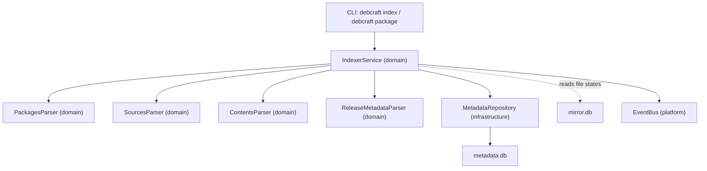

# Design Document: Repository Indexer

## Overview

The Repository Indexer (M4) transforms raw Debian repository metadata files cached by the mirror system into structured, queryable domain objects persisted in `metadata.db`. It operates on four file types—Packages, Sources, Contents, and Release—parsing full metadata from each and creating PackageInstance, SourcePackage, FileOwnership, Repository, and RepositorySnapshot records.

The indexer bridges the mirror pipeline (which downloads and verifies files) with the compliance analysis pipeline (which queries package metadata). It supports incremental indexing via parser versioning and SHA256 matching, publishes lifecycle events, and provides CLI commands for operators.

### Key Design Decisions

1. **New domain module `domain/indexer/`** — separates indexing domain logic from the mirror domain. The mirror parsers extract only what's needed for download orchestration (Filename/SHA256/Size); the indexer parsers extract full metadata for compliance queries.
2. **Parser versioning** — each parser carries a `PARSER_VERSION` constant. When bumped, previously-indexed files are re-parsed.
3. **Snapshot-per-run** — each indexing run produces an immutable RepositorySnapshot. File ownership records are replaced per-snapshot (not appended).
4. **Domain value objects → infrastructure mapping** — parsers emit frozen dataclasses; a dedicated mapper in the infrastructure layer converts them to SQLAlchemy models.

## Architecture



### Layer Responsibilities

| Layer | Component | Responsibility |
|-------|-----------|----------------|
| Domain | `domain/indexer/packages_parser.py` | Parse Packages file → `PackageMetadata` value objects |
| Domain | `domain/indexer/sources_parser.py` | Parse Sources file → `SourcePackageMetadata` value objects |
| Domain | `domain/indexer/contents_parser.py` | Parse Contents file → `FileOwnership` value objects |
| Domain | `domain/indexer/release_metadata_parser.py` | Parse Release file → `RepositoryIdentity` value object |
| Domain | `domain/indexer/values.py` | Frozen dataclasses for all value objects |
| Domain | `domain/indexer/errors.py` | Domain-specific parse/index errors |
| Domain | `domain/indexer/service.py` | Orchestrates parsing, deduplication, event publishing |
| Infrastructure | `infrastructure/indexer/repository.py` | Persists value objects as SQLAlchemy models |
| Infrastructure | `infrastructure/indexer/mapper.py` | Maps domain value objects to/from ORM models |
| Infrastructure | `infrastructure/indexer/file_reader.py` | Reads and decompresses cached metadata files |
| Infrastructure | `infrastructure/database/migrations/metadata/v2_add_indexer_columns.py` | Schema migration for new columns and tables |
| CLI | `cli/index.py` | `debcraft index` and `debcraft package` commands |

## Components and Interfaces

### Domain Layer: `domain/indexer/`

#### PackagesParser

```python
class PackagesParser:
    """Parses full binary package metadata from decompressed Packages file content."""

    PARSER_VERSION: int = 1

    def parse(self, content: str) -> list[PackageMetadata]:
        """Parse all valid package stanzas into PackageMetadata value objects.

        Stanzas missing required fields (Package, Version, Architecture,
        Filename, SHA256, Size) are skipped with a debug log.
        """
        ...

    def format(self, metadata: PackageMetadata) -> str:
        """Format a PackageMetadata back into a Packages stanza string.

        Used for round-trip verification in property-based tests.
        """
        ...
```

#### SourcesParser

```python
class SourcesParser:
    """Parses source package metadata from decompressed Sources file content."""

    PARSER_VERSION: int = 1

    def parse(self, content: str) -> list[SourcePackageMetadata]:
        """Parse all valid source stanzas into SourcePackageMetadata objects."""
        ...

    def format(self, metadata: SourcePackageMetadata) -> str:
        """Format a SourcePackageMetadata back into a Sources stanza string."""
        ...
```

#### ContentsParser

```python
class ContentsParser:
    """Parses file-to-package ownership mappings from Contents files."""

    PARSER_VERSION: int = 1

    def parse(self, content: str) -> list[FileOwnership]:
        """Parse Contents file lines into FileOwnership value objects.

        Handles optional header section. Lines mapping one path to
        multiple packages produce multiple FileOwnership records.
        """
        ...
```

#### ReleaseMetadataParser

```python
class ReleaseMetadataParser:
    """Extracts repository identity from Release file content."""

    def parse(self, content: str) -> RepositoryIdentity:
        """Extract suite, codename, origin, label, architectures, components, date.

        Falls back to codename if suite is absent. Raises if neither present.
        """
        ...
```

#### IndexerService

```python
class IndexerService:
    """Orchestrates the indexing workflow for a repository.

    Receives all dependencies via constructor injection:
    - file_reader: reads and decompresses cached files
    - metadata_repository: persists domain objects
    - mirror_file_repository: queries/updates RepositoryFile states
    - event_bus: publishes lifecycle events
    - logger: structured logging
    """

    def __init__(
        self,
        file_reader: FileReader,
        metadata_repository: MetadataRepository,
        mirror_file_repository: MirrorFileRepository,
        event_bus: EventBus,
        logger: Logger,
    ) -> None: ...

    async def index_repository(
        self,
        repository_name: str,
        base_url: str,
        suite: str,
        component: str,
    ) -> IndexResult: ...

    async def index_all(self) -> list[IndexResult]: ...
```

### Infrastructure Layer

#### FileReader Protocol

```python
class FileReader(Protocol):
    """Reads and decompresses cached metadata files."""

    async def read_file(self, local_path: str) -> str:
        """Read a cached file, decompressing .gz/.xz/.bz2 as needed."""
        ...
```

#### MetadataRepository Protocol

```python
class MetadataRepository(Protocol):
    """Persistence interface for indexer domain objects."""

    async def find_or_create_repository(self, name: str, base_url: str, suite: str, component: str) -> int:
        """Return repository ID, creating if needed."""
        ...

    async def create_snapshot(self, repository_id: int, schema_version: int) -> int:
        """Create a new RepositorySnapshot, return its ID."""
        ...

    async def publish_snapshot(self, snapshot_id: int) -> None:
        """Set snapshot.published = True."""
        ...

    async def add_package_instances(self, snapshot_id: int, packages: list[PackageMetadata]) -> int:
        """Bulk insert PackageInstance records, skipping duplicates. Returns count."""
        ...

    async def add_source_packages(self, packages: list[SourcePackageMetadata]) -> int:
        """Upsert SourcePackage records. Returns count of new records."""
        ...

    async def replace_file_ownerships(self, snapshot_id: int, ownerships: list[FileOwnership]) -> int:
        """Delete existing ownerships for snapshot, insert new ones. Returns count."""
        ...

    async def get_package_metadata(self, package_name: str) -> PackageMetadata | None:
        """Look up latest indexed metadata for a package by name."""
        ...
```

#### MirrorFileRepository Protocol

```python
class MirrorFileRepository(Protocol):
    """Interface for querying/updating RepositoryFile states in mirror.db."""

    async def get_verified_files(self, repository_name: str | None = None) -> list[RepositoryFileInfo]:
        """Return files in VERIFIED state, optionally filtered by repository."""
        ...

    async def get_indexing_record(self, file_id: int) -> IndexingRecord | None:
        """Return the indexing metadata for a file (parser version, sha256 at index time)."""
        ...

    async def mark_indexed(self, file_id: int, parser_version: int) -> None:
        """Transition file state to INDEXED and record parser version."""
        ...
```

### Event Definitions

```python
@dataclass(frozen=True)
class IndexingStarted(DomainEvent):
    event_type: str = "indexing.started"
    repository_name: str
    snapshot_id: int


@dataclass(frozen=True)
class IndexingCompleted(DomainEvent):
    event_type: str = "indexing.completed"
    repository_name: str
    snapshot_id: int
    packages_indexed: int


@dataclass(frozen=True)
class IndexingFailed(DomainEvent):
    event_type: str = "indexing.failed"
    repository_name: str
    snapshot_id: int
    error: str
```

## Data Models

### New Domain Value Objects (`domain/indexer/values.py`)

```python
@dataclass(frozen=True)
class PackageMetadata:
    """Full binary package metadata extracted from a Packages file."""

    package_name: str
    version: str
    architecture: str
    filename: str
    sha256: str
    size_bytes: int
    source_package: str  # inferred from Package name if Source absent
    source_version: str  # inferred from version if Source has no parens
    homepage: str | None = None
    maintainer: str | None = None
    depends: str | None = None
    provides: str | None = None
    section: str | None = None
    priority: str | None = None
    description: str | None = None


@dataclass(frozen=True)
class SourcePackageMetadata:
    """Source package metadata extracted from a Sources file."""

    name: str
    version: str
    maintainer: str | None = None
    uploaders: list[str] = field(default_factory=list)
    section: str | None = None
    homepage: str | None = None
    build_depends: str | None = None
    binary_packages: list[str] = field(default_factory=list)


@dataclass(frozen=True)
class FileOwnership:
    """Mapping from a filesystem path to the owning package."""

    path: str
    qualified_package_name: str  # e.g. "libs/libfoo"


@dataclass(frozen=True)
class RepositoryIdentity:
    """Repository-level metadata from Release file."""

    suite: str
    codename: str | None = None
    origin: str | None = None
    label: str | None = None
    architectures: list[str] = field(default_factory=list)
    components: list[str] = field(default_factory=list)
    date: str | None = None


@dataclass(frozen=True)
class IndexResult:
    """Summary of an indexing run for one repository."""

    repository_name: str
    snapshot_id: int
    packages_indexed: int
    source_packages_indexed: int
    file_ownerships_indexed: int
    files_skipped: int
    success: bool
    error: str | None = None
```

### Database Schema Changes

#### New Table: `file_ownerships`

```sql
CREATE TABLE file_ownerships (
    id INTEGER PRIMARY KEY AUTOINCREMENT,
    snapshot_id INTEGER NOT NULL REFERENCES repository_snapshots(id),
    file_path TEXT NOT NULL,
    package_name TEXT NOT NULL,
    created_at TEXT NOT NULL DEFAULT (datetime('now')),
    updated_at TEXT NOT NULL DEFAULT (datetime('now'))
);
CREATE INDEX ix_file_ownerships_snapshot_id ON file_ownerships (snapshot_id);
CREATE INDEX ix_file_ownerships_file_path ON file_ownerships (file_path);
CREATE INDEX ix_file_ownerships_package_name ON file_ownerships (package_name);
```

#### New Table: `indexing_records`

Tracks which files have been indexed and with which parser version, enabling incremental indexing:

```sql
CREATE TABLE indexing_records (
    id INTEGER PRIMARY KEY AUTOINCREMENT,
    repository_file_id INTEGER NOT NULL,
    parser_version INTEGER NOT NULL,
    indexed_sha256 TEXT NOT NULL,
    indexed_at TEXT NOT NULL DEFAULT (datetime('now')),
    UNIQUE (repository_file_id)
);
CREATE INDEX ix_indexing_records_file_id ON indexing_records (repository_file_id);
```

#### Extended `package_instances` Columns

```sql
ALTER TABLE package_instances ADD COLUMN source_package TEXT;
ALTER TABLE package_instances ADD COLUMN source_version TEXT;
ALTER TABLE package_instances ADD COLUMN homepage TEXT;
ALTER TABLE package_instances ADD COLUMN maintainer TEXT;
ALTER TABLE package_instances ADD COLUMN depends TEXT;
ALTER TABLE package_instances ADD COLUMN provides TEXT;
ALTER TABLE package_instances ADD COLUMN section TEXT;
ALTER TABLE package_instances ADD COLUMN priority TEXT;
ALTER TABLE package_instances ADD COLUMN description TEXT;
ALTER TABLE package_instances ADD COLUMN download_url TEXT;
```

#### Extended `source_packages` Columns

```sql
ALTER TABLE source_packages ADD COLUMN uploaders TEXT;
ALTER TABLE source_packages ADD COLUMN section TEXT;
ALTER TABLE source_packages ADD COLUMN homepage TEXT;
ALTER TABLE source_packages ADD COLUMN build_depends TEXT;
ALTER TABLE source_packages ADD COLUMN binary_packages TEXT;  -- comma-separated
ALTER TABLE source_packages ADD COLUMN snapshot_id INTEGER REFERENCES repository_snapshots(id);
```


## Correctness Properties

*A property is a characteristic or behavior that should hold true across all valid executions of a system—essentially, a formal statement about what the system should do. Properties serve as the bridge between human-readable specifications and machine-verifiable correctness guarantees.*

### Property 1: PackageMetadata round-trip

*For any* valid `PackageMetadata` value object, formatting it into a Packages stanza string and then parsing that string back SHALL produce a `PackageMetadata` object equivalent to the original.

**Validates: Requirements 1.1, 1.6**

### Property 2: Source field inference rules

*For any* valid Packages stanza, the inferred `source_package` and `source_version` SHALL follow these rules: if the Source field contains `name (version)`, use those values; if Source contains only a name, use that name with the binary version; if Source is absent, use the binary package name and binary version.

**Validates: Requirements 1.3, 1.4, 1.5**

### Property 3: Invalid Packages stanzas are skipped

*For any* Packages stanza that is missing at least one required field (Package, Version, Architecture, Filename, SHA256, or Size), parsing SHALL produce no `PackageMetadata` output for that stanza and the parser SHALL not raise an exception.

**Validates: Requirements 1.2**

### Property 4: SourcePackageMetadata round-trip

*For any* valid `SourcePackageMetadata` value object, formatting it into a Sources stanza string and then parsing that string back SHALL produce a `SourcePackageMetadata` object equivalent to the original.

**Validates: Requirements 2.1, 2.4**

### Property 5: Invalid Sources stanzas are skipped

*For any* Sources stanza that is missing the Package or Version field, parsing SHALL produce no `SourcePackageMetadata` output for that stanza and the parser SHALL not raise an exception.

**Validates: Requirements 2.2**

### Property 6: Binary field comma splitting

*For any* list of package name strings, when joined with commas and optional whitespace into a Binary field value and embedded in a valid Sources stanza, parsing SHALL produce a `SourcePackageMetadata` with `binary_packages` equal to the original list (each name trimmed of whitespace).

**Validates: Requirements 2.3**

### Property 7: Contents parsing correctness

*For any* valid Contents file line consisting of a path followed by whitespace and one or more comma-separated qualified package names, parsing SHALL produce exactly one `FileOwnership` record per package, each with the correct path and qualified package name.

**Validates: Requirements 3.1, 3.2**

### Property 8: Contents header invariance

*For any* valid Contents file body, prepending an arbitrary header section (lines that don't match the `path  packages` format) SHALL not change the set of `FileOwnership` records produced by parsing.

**Validates: Requirements 3.4**

### Property 9: Release metadata extraction with suite fallback

*For any* Release file content containing at least one of Suite or Codename, parsing SHALL produce a `RepositoryIdentity` where `suite` equals the Suite field value if present, otherwise the Codename field value.

**Validates: Requirements 4.1, 4.2**

### Property 10: Incremental indexing decision

*For any* repository file with a recorded indexing state (sha256, parser_version), the indexer SHALL skip re-parsing if and only if the file state is INDEXED AND the current file SHA256 matches the recorded SHA256 AND the current parser version equals the recorded parser version.

**Validates: Requirements 5.1, 5.2, 5.3**

### Property 11: Deterministic processing order

*For any* set of pending repository files, the indexer SHALL process them in the same order regardless of insertion order, specifically sorted by (repository_name, file_type, file_path) ascending.

**Validates: Requirements 5.4**

### Property 12: Duplicate natural key skipping

*For any* list of `PackageMetadata` objects containing entries with duplicate natural keys (package_name, version, architecture, filename), persisting them into a snapshot SHALL result in exactly one `PackageInstance` record per unique natural key.

**Validates: Requirements 6.2**

### Property 13: Download URL computation

*For any* repository base URL (without trailing slash) and package filename (relative path), the computed `download_url` SHALL equal the base URL joined with `"/"` and the filename.

**Validates: Requirements 6.4**

## Error Handling

### Parser Errors

| Scenario | Behavior |
|----------|----------|
| Empty or whitespace-only content | Return empty list (no error raised) |
| Stanza missing required fields | Skip stanza, log at DEBUG level |
| Invalid field values (non-integer Size) | Skip stanza, log at DEBUG level |
| Malformed Contents line | Skip line, log at DEBUG level |
| Release missing Suite + Codename | Raise `ReleaseParseError` with descriptive message |

### Indexer Service Errors

| Scenario | Behavior |
|----------|----------|
| File read failure (I/O error, decompression failure) | Log error, publish `IndexingFailed` event, leave snapshot unpublished |
| Database write failure | Rollback transaction, log error, publish `IndexingFailed` event |
| Partial indexing (some files succeed, some fail) | Publish snapshot with whatever succeeded, log failures |
| No VERIFIED files to index | Return early with zero-count `IndexResult`, no snapshot created |

### CLI Error Handling

| Scenario | Behavior |
|----------|----------|
| `debcraft index` with no VERIFIED files | Print informational message, exit 0 |
| `debcraft index` with database failure | Print error with suggested fix, exit 1 |
| `debcraft package <name>` not found | Print "Package not found" message, exit 1 |

### Error Propagation Strategy

- **Domain parsers** never raise on malformed input — they skip and log. Only structural impossibilities (empty Release lacking identity) raise.
- **Infrastructure layer** catches SQLAlchemy exceptions, wraps them in domain-friendly `IndexingError` or `StorageError`.
- **IndexerService** catches all errors per-file, allowing other files to proceed. Only total failures (database unreachable) abort the entire run.

## Testing Strategy

### Property-Based Tests (Hypothesis)

The project already uses Hypothesis (configured in `pyproject.toml`). Each correctness property maps to a single property-based test with minimum 100 iterations.

**Library**: `hypothesis` (already in dev dependencies)
**Configuration**: `@settings(max_examples=200)` for parser round-trips, `@settings(max_examples=100)` for service-level properties.

Each property test is tagged with a comment:
```python
# Feature: repository-indexer, Property 1: PackageMetadata round-trip
```

**Test organization**:
- `tests/unit/domain/indexer/test_packages_parser_properties.py` — Properties 1, 2, 3
- `tests/unit/domain/indexer/test_sources_parser_properties.py` — Properties 4, 5, 6
- `tests/unit/domain/indexer/test_contents_parser_properties.py` — Properties 7, 8
- `tests/unit/domain/indexer/test_release_metadata_parser_properties.py` — Property 9
- `tests/unit/domain/indexer/test_indexer_service_properties.py` — Properties 10, 11, 12, 13

### Unit Tests (pytest)

Example-based tests for:
- Specific edge cases (empty strings, Unicode package names, very long descriptions)
- Event publishing (mock EventBus, verify correct event types and fields)
- Snapshot lifecycle (published=true on success, published=false on failure)
- CLI output formatting

### Integration Tests

Tests with real SQLite databases (in-memory or tmpdir):
- Full indexing pipeline: read file → parse → persist → query
- Schema migration: v2 migration applies cleanly on top of v1
- Incremental indexing: second run skips already-indexed files
- CLI commands end-to-end (using Typer's `CliRunner`)

### Architecture Tests

- Import linter contracts already configured in `pyproject.toml` verify domain independence
- Ensure `domain/indexer/` does not import from `infrastructure/`
