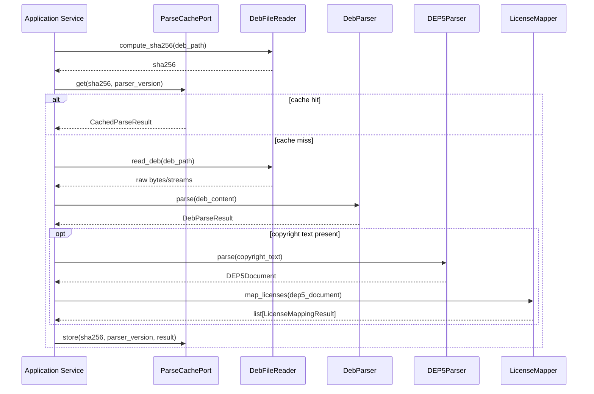

# Design Document: Package Intelligence

## Overview

Package Intelligence is the core analysis subsystem of DebCraft (Milestone 5) that transforms raw `.deb` binary package archives into rich, normalized metadata suitable for SBOM generation and compliance auditing. It provides:

1. **Binary package extraction** — parses `.deb` archives (ar format) to extract control metadata, copyright text, and file listings without requiring root or dpkg tools.
2. **DEP-5 copyright parsing** — converts machine-readable copyright files into a structured document model with round-trip serialization.
3. **SPDX expression analysis** — tokenizes and parses SPDX license expression strings into an AST with correct operator precedence, supporting round-trip printing.
4. **License mapping** — resolves Debian license identifiers to canonical SPDX expressions using a cascade of algorithms (exact, alias, normalized, fuzzy) with confidence metadata.
5. **Symlink resolution** — resolves `/usr/share/doc/*/copyright` symbolic links using Contents index file-ownership data.
6. **Download location construction** — builds fully-qualified download URLs from repository base URLs and package filename fields.
7. **PURL generation** — produces Package URL identifiers in the `pkg:deb` scheme.
8. **Permanent parse cache** — SHA256-keyed cache ensuring identical packages are never parsed twice.

All components follow DebCraft's layered architecture: pure domain parsers have no infrastructure imports, while the cache adapter lives in the infrastructure layer and is injected via Protocol-typed ports.

## Architecture

### Layer Placement

```
┌─────────────────────────────────────────────────────────────────────┐
│                        CLI / Application                             │
│   (orchestrates parsing workflow, coordinates domain services)       │
└─────────────────────┬───────────────────────────────────────────────┘
                      │ calls
┌─────────────────────▼───────────────────────────────────────────────┐
│                     Domain Layer                                      │
│  src/debcraft/domain/package_intelligence/                           │
│                                                                       │
│  ┌──────────────┐  ┌──────────────┐  ┌──────────────────────────┐  │
│  │ Deb Parser   │  │ DEP5 Parser  │  │ SPDX Tokenizer + Parser  │  │
│  │              │  │ DEP5 Printer │  │ SPDX Printer             │  │
│  └──────────────┘  └──────────────┘  └──────────────────────────┘  │
│                                                                       │
│  ┌──────────────┐  ┌────────────────┐  ┌────────────────────────┐  │
│  │License Mapper│  │Symlink Resolver│  │Download Location Resolvr│  │
│  └──────────────┘  └────────────────┘  └────────────────────────┘  │
│                                                                       │
│  ┌──────────────┐  ┌──────────────────────────────────────────────┐ │
│  │PURL Generator│  │ Value Objects / Errors / Ports (Protocols)    │ │
│  └──────────────┘  └──────────────────────────────────────────────┘ │
└─────────────────────┬───────────────────────────────────────────────┘
                      │ depends on (via Protocols)
┌─────────────────────▼───────────────────────────────────────────────┐
│                  Infrastructure Layer                                 │
│  src/debcraft/infrastructure/package_intelligence/                    │
│                                                                       │
│  ┌──────────────────────────────┐  ┌────────────────────────────┐   │
│  │ Parse Cache (SQLAlchemy)     │  │ File System Adapter        │   │
│  └──────────────────────────────┘  └────────────────────────────┘   │
│                                                                       │
│  SQLAlchemy model: ParsedDebPackage in cache.db                      │
└─────────────────────────────────────────────────────────────────────┘
```

### Design Decisions

1. **New domain sub-package**: All package intelligence domain code lives under `src/debcraft/domain/package_intelligence/`, following the same pattern as `domain/indexer/` and `domain/mirror/`.

2. **Pure parsers as classes with `PARSER_VERSION`**: Following the existing `ContentsParser` pattern, each parser class carries a `PARSER_VERSION: int` class attribute for cache invalidation.

3. **CPU-heavy parsing via ProcessPoolExecutor**: The `.deb` extraction (decompression, tar traversal) runs in a `ProcessPoolExecutor` at the application layer. Domain parsers themselves are synchronous and pure.

4. **Protocol-based dependency injection**: The `DebParser` depends on a `DebFileReader` protocol (for file I/O) and a `ParseCachePort` protocol (for cache lookup/store). These are defined in `ports.py`.

5. **Value objects as frozen dataclasses**: All parsed results are immutable `@dataclass(frozen=True)` objects consistent with the existing `PackageMetadata` and `FileOwnership` patterns.

6. **Error hierarchy**: Domain errors extend `PlatformError` following the existing `ReleaseParseError` / `IndexingError` patterns.

7. **SPDX license data as embedded JSON resource**: The SPDX license list (identifiers + full names) is bundled as a static JSON file in the domain package, avoiding network dependencies during mapping.

### Sequence Diagram: .deb Parse Workflow



## Components and Interfaces

### Domain Components (`src/debcraft/domain/package_intelligence/`)

#### Module Layout

```
domain/package_intelligence/
├── __init__.py
├── errors.py              # Domain error types
├── ports.py               # Protocol interfaces for infrastructure
├── values.py              # Immutable value objects
├── deb_parser.py          # .deb archive parser
├── dep5_parser.py         # DEP-5 copyright parser
├── dep5_printer.py        # DEP-5 serializer
├── spdx_tokenizer.py     # SPDX expression lexer
├── spdx_parser.py        # SPDX expression recursive-descent parser
├── spdx_printer.py       # SPDX AST serializer
├── license_mapper.py     # Debian → SPDX license resolution
├── symlink_resolver.py   # Copyright symlink resolution
├── download_location.py  # Download URL construction
├── purl_generator.py     # Package URL generation
└── data/
    └── spdx_licenses.json  # Embedded SPDX license list
```

#### `deb_parser.py` — DebParser

```python
class DebParser:
    """Extracts metadata from .deb binary package archives."""

    PARSER_VERSION: int = 1

    def __init__(self, file_reader: DebFileReader) -> None: ...

    def parse(self, deb_path: str) -> DebParseResult:
        """Parse a .deb file into structured metadata.

        Raises:
            DebParseError: If the file is malformed or missing required members.
        """
        ...
```

#### `dep5_parser.py` — DEP5Parser

```python
class DEP5Parser:
    """Parses DEP-5 machine-readable copyright files."""

    PARSER_VERSION: int = 1

    def parse(self, text: str) -> DEP5Document:
        """Parse DEP-5 formatted text into a structured document.

        Raises:
            DEP5ParseError: If the input is not valid DEP-5.
        """
        ...
```

#### `dep5_printer.py` — DEP5Printer

```python
class DEP5Printer:
    """Serializes DEP5Document back to DEP-5 formatted text."""

    def print(self, document: DEP5Document) -> str:
        """Format a DEP5Document as valid DEP-5 text."""
        ...
```

#### `spdx_tokenizer.py` — SPDXTokenizer

```python
class SPDXTokenizer:
    """Tokenizes SPDX license expression strings."""

    def tokenize(self, expression: str) -> list[SPDXToken]:
        """Convert expression string to typed token sequence.

        Raises:
            SPDXTokenizeError: If invalid characters are encountered.
        """
        ...
```

#### `spdx_parser.py` — SPDXExpressionParser

```python
class SPDXExpressionParser:
    """Recursive-descent parser for SPDX expressions."""

    MAX_NESTING_DEPTH: int = 32

    def parse(self, tokens: list[SPDXToken]) -> SPDXNode:
        """Parse token sequence into AST with correct precedence.

        Precedence: WITH > AND > OR

        Raises:
            SPDXParseError: If the expression is malformed.
        """
        ...
```

#### `spdx_printer.py` — SPDXPrinter

```python
class SPDXPrinter:
    """Serializes SPDX AST to canonical expression strings."""

    def print(self, node: SPDXNode) -> str:
        """Format an SPDX AST as a canonical expression string."""
        ...
```

#### `license_mapper.py` — LicenseMapper

```python
class LicenseMapper:
    """Maps Debian license identifiers to SPDX expressions."""

    def __init__(self, spdx_license_data: SPDXLicenseData) -> None: ...

    def map(self, debian_identifier: str, license_text: str | None = None) -> LicenseMappingResult:
        """Resolve a Debian license identifier to an SPDX expression.

        Algorithms applied in precedence order:
        ExactSPDX → DebianAlias → NormalizedSpelling → SPDXFullName → LicenseTextHash → FuzzySimilarity → Unmapped
        """
        ...
```

#### `symlink_resolver.py` — SymlinkResolver

```python
class SymlinkResolver:
    """Resolves copyright symlinks using Contents file-ownership data."""

    MAX_RESOLUTION_DEPTH: int = 10

    def __init__(self, contents_lookup: ContentsLookupPort) -> None: ...

    def resolve(self, symlink_target: str, source_dir: str) -> SymlinkResolutionResult:
        """Resolve a symlink target to the owning package's copyright.

        Raises no exceptions; returns failure result on unresolvable links.
        """
        ...
```

#### `download_location.py` — Pure Functions

```python
def resolve_download_location(base_url: str | None, filename: str | None) -> str:
    """Construct download URL or return NOASSERTION."""
    ...
```

#### `purl_generator.py` — Pure Functions

```python
def generate_purl(
    package_name: str,
    version: str,
    architecture: str,
    distro: str | None = None,
) -> str:
    """Generate pkg:deb PURL string.

    Raises:
        PURLGenerationError: If required fields are missing.
    """
    ...
```

### Port Interfaces (`ports.py`)

```python
class DebFileReader(Protocol):
    """Reads and decompresses .deb archive members."""

    def read_ar_member(self, deb_path: str, member_prefix: str) -> bytes: ...
    def compute_sha256(self, file_path: str) -> str: ...


class ParseCachePort(Protocol):
    """Permanent parse cache keyed by SHA256."""

    async def get(self, sha256: str, parser_version: int) -> DebParseResult | None: ...
    async def store(self, sha256: str, parser_version: int, result: DebParseResult) -> None: ...


class ContentsLookupPort(Protocol):
    """Queries file ownership from Contents index data."""

    def find_owner(self, file_path: str) -> str | None:
        """Return the qualified package name owning the given file path, or None."""
        ...

    def get_copyright_content(self, package_name: str) -> str | None:
        """Return the copyright text for a package, or None if not available."""
        ...
```

### Infrastructure Components (`src/debcraft/infrastructure/package_intelligence/`)

```
infrastructure/package_intelligence/
├── __init__.py
├── cache_adapter.py      # SQLAlchemy ParseCachePort implementation
├── file_reader.py        # DebFileReader implementation (ar/tar extraction)
└── contents_adapter.py   # ContentsLookupPort implementation
```

### SQLAlchemy Model Addition (`infrastructure/models/cache.py`)

```python
class ParsedDebPackage(Base, TimestampMixin):
    """Cached .deb parse result keyed by file SHA256."""

    __tablename__ = "parsed_deb_packages"
    __table_args__ = (Index("ix_parsed_deb_sha256", "sha256", unique=True),)

    id: Mapped[int] = mapped_column(Integer, primary_key=True, autoincrement=True)
    sha256: Mapped[str] = mapped_column(String(64), nullable=False, unique=True)
    parser_version: Mapped[int] = mapped_column(Integer, nullable=False)
    control_metadata: Mapped[str] = mapped_column(Text, nullable=False)  # JSON
    copyright_text: Mapped[str | None] = mapped_column(Text, nullable=True)
    file_listing: Mapped[str] = mapped_column(Text, nullable=False)  # JSON array
```

## Data Models

### Value Objects (`values.py`)

```python
@dataclass(frozen=True)
class DebParseResult:
    """Complete parse result from a .deb archive."""

    package_name: str
    version: str
    architecture: str
    control_fields: dict[str, str]
    dependencies: list[DependencyRelation]
    file_listing: list[str]
    copyright_text: str | None


@dataclass(frozen=True)
class DependencyRelation:
    """A single dependency relationship (possibly with alternatives)."""

    package: str
    version_constraint: str | None = None  # e.g. ">= 2.17"
    alternatives: list[DependencyRelation] = field(default_factory=list)


@dataclass(frozen=True)
class DEP5Document:
    """Structured DEP-5 copyright document."""

    header: DEP5Header
    files_paragraphs: list[DEP5FilesParagraph]
    license_paragraphs: list[DEP5LicenseParagraph]


@dataclass(frozen=True)
class DEP5Header:
    """Header paragraph of a DEP-5 document."""

    format_url: str
    upstream_name: str | None = None
    upstream_contact: str | None = None
    source: str | None = None
    comment: str | None = None
    extra_fields: dict[str, str] = field(default_factory=dict)


@dataclass(frozen=True)
class DEP5FilesParagraph:
    """Files paragraph in a DEP-5 document."""

    files: list[str]  # glob patterns
    copyright: str
    license_name: str
    license_text: str | None = None
    comment: str | None = None
    extra_fields: dict[str, str] = field(default_factory=dict)


@dataclass(frozen=True)
class DEP5LicenseParagraph:
    """Standalone License paragraph in a DEP-5 document."""

    license_name: str
    license_text: str
    comment: str | None = None
    extra_fields: dict[str, str] = field(default_factory=dict)


# --- SPDX AST Nodes ---


@dataclass(frozen=True)
class SimpleNode:
    """Leaf node: a single SPDX license identifier."""

    identifier: str
    or_later: bool = False  # True for GPL-2.0+


@dataclass(frozen=True)
class WithNode:
    """License WITH exception."""

    license: SPDXNode
    exception: str


@dataclass(frozen=True)
class AndNode:
    """Conjunction of two license expressions."""

    left: SPDXNode
    right: SPDXNode


@dataclass(frozen=True)
class OrNode:
    """Disjunction of two license expressions."""

    left: SPDXNode
    right: SPDXNode


# Union type for all AST nodes
SPDXNode = SimpleNode | WithNode | AndNode | OrNode


# --- SPDX Tokens ---


class SPDXTokenType(Enum):
    """Token types for SPDX expression lexer."""

    LICENSE_ID = "LICENSE_ID"
    OR_LATER = "OR_LATER"  # GPL-2.0+ → identifier with +
    AND = "AND"
    OR = "OR"
    WITH = "WITH"
    LPAREN = "LPAREN"
    RPAREN = "RPAREN"
    DOCUMENT_REF = "DOCUMENT_REF"  # DocumentRef-xxx:LicenseRef-yyy
    LICENSE_REF = "LICENSE_REF"  # LicenseRef-xxx


@dataclass(frozen=True)
class SPDXToken:
    """A typed token from the SPDX expression lexer."""

    type: SPDXTokenType
    value: str
    offset: int  # zero-based character offset in original string


# --- License Mapping ---


class MappingAlgorithm(Enum):
    """Algorithms used by the License Mapper."""

    EXACT_SPDX = "ExactSPDX"
    DEBIAN_ALIAS = "DebianAlias"
    NORMALIZED_SPELLING = "NormalizedSpelling"
    SPDX_FULL_NAME = "SPDXFullName"
    FUZZY_SIMILARITY = "FuzzySimilarity"
    LICENSE_TEXT_HASH = "LicenseTextHash"
    UNMAPPED = "Unmapped"


@dataclass(frozen=True)
class LicenseMappingResult:
    """Result of mapping a Debian license identifier to SPDX."""

    spdx_expression: str
    confidence: int  # 0–100
    algorithm: MappingAlgorithm
    rationale: str


# --- Symlink Resolution ---


@dataclass(frozen=True)
class SymlinkResolutionResult:
    """Result of resolving a copyright symlink."""

    resolved: bool
    target_path: str | None = None
    owning_package: str | None = None
    copyright_content: str | None = None
    failure_reason: str | None = None
```

### Error Types (`errors.py`)

```python
class DebParseError(PlatformError):
    """Raised when a .deb archive cannot be parsed."""

    def __init__(self, file_path: str, reason: str, cause: Exception | None = None) -> None: ...


class DEP5ParseError(PlatformError):
    """Raised when a DEP-5 document cannot be parsed."""

    def __init__(self, message: str, paragraph_index: int | None = None) -> None: ...


class SPDXTokenizeError(PlatformError):
    """Raised when SPDX expression tokenization fails."""

    def __init__(self, message: str, offset: int) -> None: ...


class SPDXParseError(PlatformError):
    """Raised when SPDX expression parsing fails."""

    def __init__(self, message: str, token_position: int) -> None: ...


class PURLGenerationError(PlatformError):
    """Raised when PURL generation fails due to missing fields."""

    def __init__(self, missing_field: str) -> None: ...


class DependencyParseError(PlatformError):
    """Raised when a dependency field cannot be parsed."""

    def __init__(self, package_name: str, field_name: str, reason: str) -> None: ...
```


## Correctness Properties

*A property is a characteristic or behavior that should hold true across all valid executions of a system — essentially, a formal statement about what the system should do. Properties serve as the bridge between human-readable specifications and machine-verifiable correctness guarantees.*

### Property 1: DEP-5 Parse–Print Round-Trip

*For any* valid DEP5Document, printing it with DEP5Printer and then parsing the resulting text with DEP5Parser SHALL produce a DEP5Document that is structurally equal to the original (same paragraph types in same order, same field names and values in each paragraph).

**Validates: Requirements 2.1, 2.2, 2.3, 2.4, 2.5, 2.7, 3.1, 3.2, 3.3, 3.4**

### Property 2: DEP-5 Printer Trailing Newline Invariant

*For any* valid DEP5Document, the output of DEP5Printer SHALL end with exactly one newline character (`\n`) and SHALL NOT end with two or more consecutive newline characters.

**Validates: Requirements 3.5**

### Property 3: SPDX Expression Round-Trip

*For any* valid SPDXNode AST, printing it with SPDXPrinter, tokenizing the result with SPDXTokenizer, and parsing the tokens with SPDXExpressionParser SHALL produce an SPDXNode that is structurally identical to the original (same node types, same license identifiers, same tree shape).

**Validates: Requirements 4.1, 4.2, 4.4, 4.6, 5.1, 5.2, 5.3, 5.4, 5.6, 6.1, 6.2, 6.3, 6.4, 6.5**

### Property 4: SPDX Tokenizer Error Offset Accuracy

*For any* string containing at least one character outside the valid SPDX character set, the SPDX_Tokenizer SHALL produce an error identifying a zero-based character offset that points to a character which is indeed invalid in an SPDX expression.

**Validates: Requirements 4.3**

### Property 5: SPDX Parser Rejects Malformed Input

*For any* malformed token sequence (unbalanced parentheses, consecutive operators, missing operands, or nesting depth exceeding 32), the SPDX_Expression_Parser SHALL return an SPDXParseError containing the error category and a token position within the valid index range of the input sequence.

**Validates: Requirements 5.5**

### Property 6: License Mapper Result Invariant

*For any* input string (including empty, whitespace, or arbitrary text), the License_Mapper SHALL return a LicenseMappingResult where: spdx_expression is at most 1024 characters, confidence is an integer in [0, 100], algorithm is a valid MappingAlgorithm variant, and rationale is a non-empty string of at most 512 characters.

**Validates: Requirements 7.8**

### Property 7: License Mapper Exact Match Confidence

*For any* identifier drawn from the SPDX license list (case-insensitive), the License_Mapper SHALL return confidence 100 and algorithm ExactSPDX.

**Validates: Requirements 7.1, 7.9**

### Property 8: License Mapper Normalized Spelling

*For any* known SPDX identifier with arbitrary case changes and removed hyphens/underscores/dots/spaces, the License_Mapper SHALL return confidence 99 and algorithm NormalizedSpelling (provided the spelling variation does not also produce an exact or alias match).

**Validates: Requirements 7.3**

### Property 9: License Mapper Unmapped Fallback

*For any* input string that does not match any SPDX identifier, alias, normalized spelling, full name, text hash, or fuzzy threshold, the License_Mapper SHALL return a result with spdx_expression matching the pattern `LicenseRef-debcraft-*`, confidence 0, and algorithm Unmapped.

**Validates: Requirements 7.7**

### Property 10: License Mapper Fuzzy Confidence Clamping

*For any* input that produces a FuzzySimilarity match, the returned confidence SHALL be in the range [90, 97].

**Validates: Requirements 7.5**

### Property 11: Download Location URL Join

*For any* non-empty, non-whitespace base URL and non-empty, non-whitespace filename, the Download_Location_Resolver SHALL produce a URL where the base URL and filename are separated by exactly one `/` character (no double-slash at the join boundary).

**Validates: Requirements 9.1, 9.2, 9.3, 9.5**

### Property 12: Download Location NOASSERTION for Missing Inputs

*For any* input where the filename is absent, empty, or whitespace-only, OR the base URL is null or empty, the Download_Location_Resolver SHALL return the string `NOASSERTION`.

**Validates: Requirements 9.4**

### Property 13: PURL Format Conformance

*For any* valid (non-empty) package name, version, and architecture, the PURL_Generator SHALL produce a string matching the pattern `pkg:deb/<distro>/<name>@<version>?arch=<architecture>` where special characters in name and version are percent-encoded per the PURL specification, and distro is the lowercased distribution or "debian" if unspecified.

**Validates: Requirements 10.1, 10.2, 10.4, 10.5**

### Property 14: PURL Generation Error for Missing Fields

*For any* input where at least one required field (package name, version, or architecture) is absent or empty, the PURL_Generator SHALL raise a PURLGenerationError identifying the missing field.

**Validates: Requirements 10.6**

### Property 15: Symlink Resolution Terminates Within Bounds

*For any* symlink chain of depth n, the Symlink_Resolver SHALL either successfully resolve the target (when n ≤ 10 and no cycles exist) or return a failure result (when n > 10 or a cycle is detected), and SHALL never enter an infinite loop.

**Validates: Requirements 8.5, 8.7**

### Property 16: Symlink Relative Path Resolution

*For any* relative symlink target and source directory, the Symlink_Resolver SHALL resolve the target to an absolute path that is equivalent to joining the source directory with the relative target and normalizing the result (resolving `..` components).

**Validates: Requirements 8.2**

### Property 17: Control File Field Extraction

*For any* valid Debian control file text containing a set of known fields (Package, Version, Architecture, etc.), the control file parser SHALL extract each present field with its exact value and represent absent fields as None.

**Validates: Requirements 1.10**

### Property 18: Dependency String Parsing Preservation

*For any* valid dependency string containing package names with version constraints and alternatives, parsing SHALL produce a list of DependencyRelation objects that preserve all package names, version operators, version numbers, and alternative groupings from the input.

**Validates: Requirements 1.11**

### Property 19: Invalid Input Rejection by Deb Parser

*For any* byte sequence that does not begin with the `!<arch>\n` magic bytes (valid ar archive signature), the Deb_Parser SHALL raise a DebParseError.

**Validates: Requirements 1.6**

### Property 20: Cache Store on Success, Skip on Failure

*For any* .deb file that parses successfully, the cache SHALL receive a store call with the correct SHA256 and parser version. *For any* .deb file that fails to parse, the cache SHALL NOT receive a store call.

**Validates: Requirements 11.1, 11.5**

### Property 21: Cache Hit Returns Cached Result Without Re-Extraction

*For any* SHA256 that exists in the cache with a parser version matching the current version, the Deb_Parser SHALL return the cached result without invoking the file reader for extraction.

**Validates: Requirements 11.2**

### Property 22: Cache Invalidation on Version Change

*For any* cache entry whose stored parser version differs from the current parser version, the Deb_Parser SHALL ignore the cached entry and re-parse the file.

**Validates: Requirements 11.3**

## Error Handling

### Error Categories and Recovery

| Component | Error Type | Recovery Strategy |
|-----------|-----------|-------------------|
| DebParser | `DebParseError` | Log error, skip package, continue indexing run |
| DEP5Parser | `DEP5ParseError` | Store raw copyright text, mark as unparseable |
| SPDXTokenizer | `SPDXTokenizeError` | Fall back to `LicenseRef-debcraft-*` |
| SPDXExpressionParser | `SPDXParseError` | Fall back to `LicenseRef-debcraft-*` |
| LicenseMapper | Never raises (always returns result) | N/A — Unmapped algorithm is the fallback |
| SymlinkResolver | Never raises (returns failure result) | Use failure reason in audit log |
| PURLGenerator | `PURLGenerationError` | Log warning, omit PURL from SBOM |
| DependencyParser | `DependencyParseError` | Log error, store raw dependency string |

### Error Propagation Rules

1. **Domain errors do not leak infrastructure details**: Error messages reference domain concepts (file paths, field names) not SQL or I/O internals.
2. **Parsing errors are non-fatal at the workflow level**: A single malformed package does not abort the entire indexing run.
3. **Cache errors are transparent**: If the cache is unavailable (disk full, corruption), the system falls back to re-parsing without surfacing errors to the user.
4. **All errors carry context**: Every error includes the file path or identifier that caused the failure, enabling debugging without re-running.

### Error Response Format

All domain errors extend `PlatformError` and carry:
- `message: str` — human-readable description
- `cause: Exception | None` — optional wrapped lower-level exception (set via `__cause__`)

Component-specific errors add contextual fields:
- `DebParseError`: `file_path`, `reason`
- `DEP5ParseError`: `paragraph_index`
- `SPDXTokenizeError`: `offset` (zero-based character position)
- `SPDXParseError`: `token_position` (zero-based token index)
- `DependencyParseError`: `package_name`, `field_name`, `reason`
- `PURLGenerationError`: `missing_field`

## Testing Strategy

### Test Organization

```
tests/
├── properties/domain/package_intelligence/
│   ├── test_dep5_round_trip.py          # Properties 1, 2
│   ├── test_spdx_round_trip.py          # Properties 3, 4, 5
│   ├── test_license_mapper_properties.py # Properties 6, 7, 8, 9, 10
│   ├── test_download_location_properties.py # Properties 11, 12
│   ├── test_purl_properties.py          # Properties 13, 14
│   ├── test_symlink_resolver_properties.py  # Properties 15, 16
│   ├── test_deb_parser_properties.py    # Properties 17, 18, 19
│   └── test_cache_properties.py         # Properties 20, 21, 22
├── unit/domain/package_intelligence/
│   ├── test_dep5_parser.py              # Edge cases: empty input, missing fields
│   ├── test_spdx_tokenizer.py           # Edge cases: empty input, DocumentRef
│   ├── test_spdx_parser.py              # Edge cases: empty tokens, depth limit
│   ├── test_license_mapper.py           # Examples: known mappings, empty input
│   ├── test_download_location.py        # Examples: specific URL patterns
│   ├── test_purl_generator.py           # Examples: arch=all, default distro
│   └── test_deb_parser.py              # Edge cases: missing members
└── integration/package_intelligence/
    ├── test_deb_extraction.py           # Real .deb fixtures
    └── test_cache_persistence.py        # SQLAlchemy round-trip
```

### Property-Based Testing Configuration

- **Library**: Hypothesis (already in dev dependencies, version ≥ 6.100)
- **Minimum iterations**: 100 per property (Hypothesis default `max_examples=100`)
- **Tag format**: `# Feature: package-intelligence, Property {N}: {title}`
- **Markers**: `@pytest.mark.unit` + `@pytest.mark.package`

### Generator Strategy

Key Hypothesis strategies needed:

1. **DEP5Document generator**: Composite strategy producing valid DEP5Header + list of DEP5FilesParagraph + list of DEP5LicenseParagraph with arbitrary field values.
2. **SPDXNode generator**: Recursive strategy producing valid AST trees (SimpleNode | WithNode | AndNode | OrNode) with depth control to avoid unbounded recursion.
3. **Dependency string generator**: Strategy producing valid dependency specifications with optional version constraints and alternatives.
4. **Control file text generator**: Strategy producing valid Debian control file text with random field names and values.
5. **URL/filename generators**: Strategies for valid base URLs (with/without trailing slash) and package filenames (with/without leading slash).
6. **PURL input generators**: Strategies for package names, versions (with special characters), architectures, and distributions.
7. **Symlink chain generators**: Strategy producing chains of symlinks with configurable depth and optional cycles.

### Unit Test Focus

Unit tests cover:
- Specific known DEP-5 documents from real Debian packages
- Known SPDX expression strings (e.g., `MIT`, `GPL-2.0-only WITH Classpath-exception-2.0`, `(MIT OR Apache-2.0) AND BSD-3-Clause`)
- Known Debian→SPDX mappings (e.g., `GPL-2+` → `GPL-2.0-or-later`)
- Edge cases explicitly listed in requirements (empty input, whitespace, missing fields)
- Real `.deb` fixture files for integration testing of the extraction pipeline

### Integration Test Focus

Integration tests cover:
- Full `.deb` extraction pipeline with real Debian package fixtures
- Cache persistence via SQLAlchemy (write then read back)
- Architecture compliance via import-linter (already configured)
