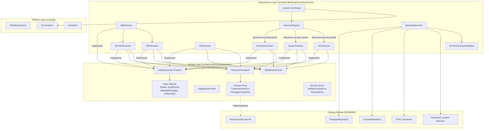
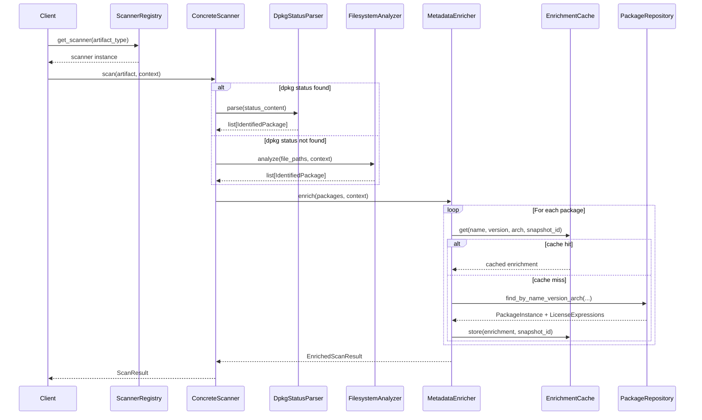
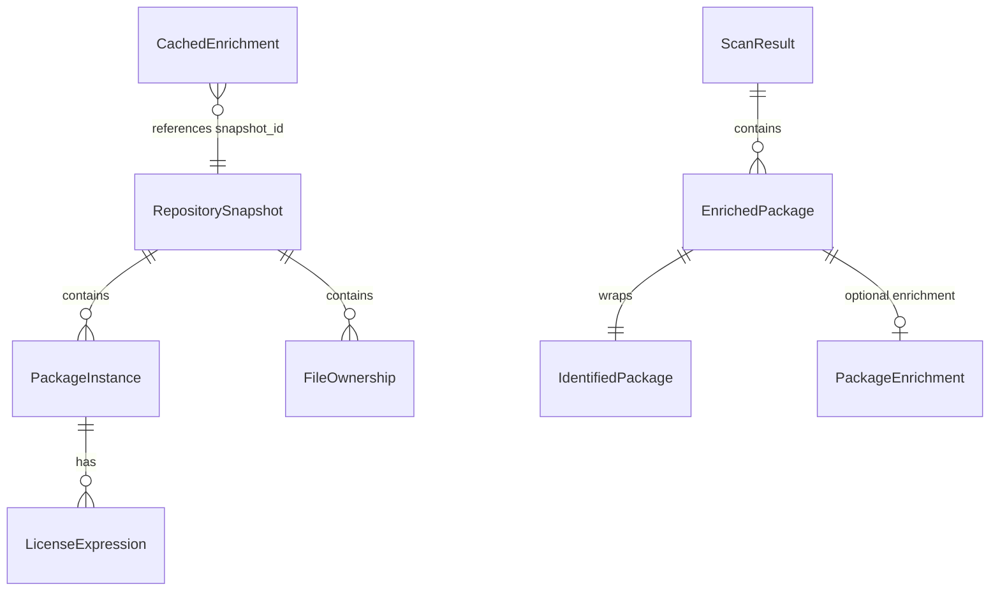

# Design Document: M6 Artifact Scanners

## Overview

The Artifact Scanners subsystem provides a plugin-based scanning architecture that identifies installed Debian packages inside various artifact types (directories, Docker images, OCI layouts, ISO images, QCOW2 disks, raw disk images, and AMI images). The design follows DebCraft's clean architecture: Protocol interfaces and value objects reside in the domain layer, concrete scanner implementations reside in the infrastructure layer, and the Scanner Registry discovers scanners via `importlib.metadata` entry points.

The scanning pipeline follows a three-stage approach:
1. **Extraction** — Access the artifact's filesystem (direct access, tar extraction, or guestfs inspection)
2. **Identification** — Locate and parse `/var/lib/dpkg/status` or fall back to filesystem analysis via the Contents index
3. **Enrichment** — Cross-reference identified packages against M3/M4/M5 metadata for license, PURL, and dependency data

All scanners share a common `ArtifactScanner` protocol, produce uniform `ScanResult` values, support cooperative cancellation via `WorkflowContext`, and operate without root privileges.

## Architecture

### High-Level Component Diagram



### Scan Pipeline Sequence Diagram



### Design Decisions

| Decision | Choice | Rationale |
|----------|--------|-----------|
| Protocol vs ABC for scanner interface | Python `Protocol` (structural typing) | Consistent with existing `ContentsLookupPort`, `ParseCachePort` patterns; allows mocking without inheritance |
| Scanner discovery | `importlib.metadata` entry points | Consistent with requirements; enables third-party scanner packages |
| dpkg parser as pure function | Stateless module-level function | Maximizes testability; no file I/O dependency |
| Layer merging for Docker/OCI | In-memory virtual filesystem dict | Avoids temp file extraction; O(n) memory in total file count |
| Guestfs for QCOW2/IMG | Constructor-injected dependency | Allows test substitution; graceful degradation when unavailable |
| Enrichment cache location | cache.db (recomputable) | Follows existing pattern (ParsedDebPackage, NormalizedLicense in cache.db) |
| AMI scanner as delegator | Delegates to QCOW2Scanner or IMGScanner | Format detection + delegation avoids code duplication |

## Components and Interfaces

### Domain Layer: `src/debcraft/domain/scanner/`

#### Value Objects (`values.py`)

```python
"""Value objects for the artifact scanner domain layer."""

from __future__ import annotations

from dataclasses import dataclass, field
from enum import Enum


class ArtifactType(Enum):
    """Enumeration of supported artifact formats."""

    DIRECTORY = "directory"
    DOCKER = "docker"
    OCI = "oci"
    ISO = "iso"
    QCOW2 = "qcow2"
    IMG = "img"
    AMI = "ami"


class ScanningStrategy(Enum):
    """How packages were identified."""

    DPKG_METADATA = "dpkg_metadata"
    FILESYSTEM_ANALYSIS = "filesystem_analysis"


VALID_PACKAGE_STATUSES = frozenset(
    {
        "installed",
        "config-files",
        "half-installed",
        "unpacked",
        "half-configured",
        "triggers-awaited",
        "triggers-pending",
        "not-installed",
        "inferred",
    }
)
```

```python
@dataclass(frozen=True)
class Artifact:
    """Describes a target to scan.

    Attributes:
        type: The artifact format type.
        path: Filesystem path to the artifact (max 4096 chars).
        options: Scanner-specific configuration (max 64 entries).
    """

    type: ArtifactType
    path: str
    options: dict[str, str] = field(default_factory=dict)


@dataclass(frozen=True)
class IdentifiedPackage:
    """A single package found during scanning.

    Attributes:
        name: Package name (non-empty).
        version: Package version string (non-empty).
        architecture: Target architecture (non-empty, or "" if unknown).
        status: Installation status from VALID_PACKAGE_STATUSES.
    """

    name: str
    version: str
    architecture: str
    status: str


@dataclass(frozen=True)
class PackageEnrichment:
    """Metadata enrichment data for an identified package.

    Attributes:
        source_package: Source package name.
        maintainer: Package maintainer.
        homepage: Upstream homepage URL.
        depends: Runtime dependencies string.
        section: Archive section.
        priority: Package priority.
        description: Short package description.
        sha256: SHA256 of the .deb file.
        download_url: Fully-qualified download URL.
        purl: Package URL (PURL) string.
        license_expressions: List of (spdx_expression, source_algorithm) tuples.
        local_deb_path: Path to cached .deb file in local mirror, if available.
    """

    source_package: str | None = None
    maintainer: str | None = None
    homepage: str | None = None
    depends: str | None = None
    section: str | None = None
    priority: str | None = None
    description: str | None = None
    sha256: str | None = None
    download_url: str | None = None
    purl: str | None = None
    license_expressions: list[tuple[str, str]] = field(default_factory=list)
    local_deb_path: str | None = None
```

```python
@dataclass(frozen=True)
class EnrichedPackage:
    """An identified package with optional enrichment metadata.

    Attributes:
        package: The base identified package.
        enrichment: Optional enrichment data from M3/M4/M5.
    """

    package: IdentifiedPackage
    enrichment: PackageEnrichment | None = None


@dataclass(frozen=True)
class ScanResult:
    """Uniform result produced by every scanner.

    Attributes:
        packages: Identified packages (zero or more).
        strategy: How packages were identified.
        diagnostics: Diagnostic/warning messages.
        duration_seconds: Scan duration (non-negative float).
        artifact_path: Path that was scanned.
        enriched_packages: Packages with enrichment (populated post-enrichment).
    """

    packages: list[IdentifiedPackage]
    strategy: str
    diagnostics: list[str]
    duration_seconds: float
    artifact_path: str
    enriched_packages: list[EnrichedPackage] = field(default_factory=list)
```

#### Protocol Interface (`ports.py`)

```python
"""Port interfaces for the artifact scanner domain."""

from __future__ import annotations

from typing import TYPE_CHECKING, Protocol

if TYPE_CHECKING:
    from debcraft.domain.scanner.values import (
        Artifact,
        IdentifiedPackage,
        ScanResult,
    )
    from debcraft.platform.contracts.workflow import WorkflowContext


class ArtifactScanner(Protocol):
    """Protocol that all scanner implementations must satisfy."""

    async def scan(self, artifact: Artifact, context: WorkflowContext) -> ScanResult:
        """Scan an artifact and return identified packages.

        Args:
            artifact: The artifact descriptor (type, path, options).
            context: Workflow context providing cancellation, progress, logging.

        Returns:
            ScanResult with identified packages and metadata.

        Raises:
            ArtifactAccessError: If the artifact path is inaccessible.
        """
        ...
```

```python
class ContentsIndexPort(Protocol):
    """Queries file ownership from Contents index data (domain port)."""

    async def find_owners(self, file_paths: list[str], snapshot_id: int) -> dict[str, str]:
        """Map filesystem paths to owning package names.

        Args:
            file_paths: List of filesystem paths to look up.
            snapshot_id: RepositorySnapshot to query against.

        Returns:
            Dict mapping path -> qualified package name for found entries.
        """
        ...


class PackageLookupPort(Protocol):
    """Queries package metadata for filesystem analysis enrichment."""

    async def find_by_name(self, package_name: str, snapshot_id: int) -> tuple[str, str, str] | None:
        """Look up package version and architecture by name.

        Returns:
            Tuple of (version, architecture, status) or None if not found.
        """
        ...


class GuestfsInspector(Protocol):
    """Abstraction over libguestfs for disk image inspection."""

    def open_image(self, path: str, readonly: bool = True) -> None:
        """Open a disk image for inspection."""
        ...

    def inspect_os(self) -> list[str]:
        """Inspect the image and return root filesystem device paths."""
        ...

    def mount_readonly(self, device: str, mountpoint: str) -> None:
        """Mount a device read-only at the given mountpoint."""
        ...

    def read_file(self, path: str) -> bytes:
        """Read file contents from the mounted filesystem."""
        ...

    def ls(self, directory: str) -> list[str]:
        """List directory contents."""
        ...

    def close(self) -> None:
        """Close the image and release resources."""
        ...
```

#### Domain Errors (`errors.py`)

```python
"""Domain-specific errors for the scanner subsystem."""


class ScannerError(Exception):
    """Base error for all scanner domain errors."""


class ArtifactAccessError(ScannerError):
    """Raised when the artifact path is inaccessible."""

    def __init__(self, path: str, reason: str) -> None:
        self.path = path
        self.reason = reason
        super().__init__(f"Cannot access artifact at '{path}': {reason}")


class UnsupportedArtifactTypeError(ScannerError):
    """Raised when no scanner is registered for an artifact type."""

    def __init__(self, artifact_type: str, registered: list[str]) -> None:
        self.artifact_type = artifact_type
        self.registered = registered
        super().__init__(f"No scanner for artifact type '{artifact_type}'. Registered types: {registered}")
```

#### dpkg Status Parser (`dpkg_parser.py`)

```python
"""Pure-function parser for dpkg status files."""

from __future__ import annotations

from dataclasses import dataclass, field


@dataclass(frozen=True)
class DpkgStanza:
    """A parsed dpkg status stanza preserving all fields and order.

    Attributes:
        fields: Ordered list of (field_name, field_value) tuples.
    """

    fields: list[tuple[str, str]] = field(default_factory=list)

    def get(self, name: str) -> str | None:
        """Get field value by name (case-insensitive)."""
        lower = name.lower()
        for k, v in self.fields:
            if k.lower() == lower:
                return v
        return None
```

```python
@dataclass(frozen=True)
class DpkgParseResult:
    """Result of parsing a dpkg status file.

    Attributes:
        packages: Successfully parsed IdentifiedPackage entries.
        diagnostics: Warning messages for skipped/malformed stanzas.
        stanzas: Raw parsed stanzas (for round-trip printing).
    """

    packages: list[IdentifiedPackage]
    diagnostics: list[str]
    stanzas: list[DpkgStanza]


def parse_dpkg_status(content: str) -> DpkgParseResult:
    """Parse dpkg status file content into identified packages.

    Pure function: no I/O, no side effects, deterministic output.

    Algorithm:
    1. Split content on blank lines into stanza texts
    2. For each stanza text, parse field:value lines with continuation handling
    3. Extract Package, Version, Architecture, Status fields
    4. Filter: include only packages with desired action "install" or "hold"
       AND current state "installed" or "config-files"
    5. Exclude packages with desired action "deinstall" or "purge"

    Args:
        content: Raw text content of a dpkg status file.

    Returns:
        DpkgParseResult with packages, diagnostics, and raw stanzas.
    """
    ...


def _split_stanzas(content: str) -> list[str]:
    """Split content into stanza text blocks on blank lines.

    Yields stanza text blocks lazily to support large files
    without O(n²) memory.
    """
    ...


def _parse_stanza_fields(stanza_text: str) -> list[tuple[str, str]]:
    """Parse a single stanza into ordered (field_name, value) pairs.

    Handles continuation lines (leading space/tab) by appending
    to the previous field value with a newline separator.
    """
    ...


def _classify_package(stanza: DpkgStanza, stanza_index: int) -> tuple[IdentifiedPackage | None, str | None]:
    """Classify a stanza into an IdentifiedPackage or diagnostic.

    Returns:
        (package, None) for included packages.
        (None, diagnostic) for excluded/skipped stanzas.
        (None, None) for silently excluded stanzas (deinstall/purge).
    """
    ...
```

#### dpkg Status Printer (`dpkg_printer.py`)

```python
"""Serializer for dpkg status stanzas (round-trip support)."""

from __future__ import annotations

from typing import TYPE_CHECKING

if TYPE_CHECKING:
    from debcraft.domain.scanner.dpkg_parser import DpkgStanza


def format_dpkg_status(stanzas: list[DpkgStanza]) -> str:
    """Format parsed stanzas back into dpkg status file text.

    Rules:
    - Each field emitted as "Field-Name: value\\n"
    - Multiline values use continuation lines (leading space)
    - Empty lines in multiline values become " .\\n"
    - Stanzas separated by exactly one blank line
    - Output ends with exactly one trailing newline
    - Empty stanza list returns empty string
    - Field order preserved as encountered during parsing

    Args:
        stanzas: List of DpkgStanza objects from the parser.

    Returns:
        Valid dpkg status file text representation.
    """
    ...


def _format_stanza(stanza: DpkgStanza) -> str:
    """Format a single stanza to text."""
    ...


def _format_field_value(value: str) -> str:
    """Format a field value, handling multiline continuation syntax."""
    ...
```

#### Filesystem Analyzer (`filesystem_analyzer.py`)

```python
"""Fallback package identification via filesystem path matching."""

from __future__ import annotations

from dataclasses import dataclass
from typing import TYPE_CHECKING

if TYPE_CHECKING:
    from debcraft.domain.scanner.ports import ContentsIndexPort, PackageLookupPort
    from debcraft.domain.scanner.values import IdentifiedPackage


@dataclass(frozen=True)
class FilesystemAnalysisResult:
    """Result of filesystem-based package identification.

    Attributes:
        packages: Identified packages with status "inferred".
        diagnostics: Warnings about unresolved paths or limits.
    """

    packages: list[IdentifiedPackage]
    diagnostics: list[str]
```

```python
async def analyze_filesystem(
    file_paths: list[str],
    contents_port: ContentsIndexPort,
    package_port: PackageLookupPort,
    snapshot_id: int,
    max_paths: int = 100_000,
) -> FilesystemAnalysisResult:
    """Identify packages by matching filesystem paths against Contents index.

    Algorithm:
    1. Truncate file_paths to max_paths (record diagnostic if truncated)
    2. Batch-query ContentsIndexPort for path->package mappings
    3. Deduplicate: one IdentifiedPackage per unique package name
    4. For each unique package, query PackageLookupPort for version/arch
    5. Skip packages with no PackageInstance (record diagnostic)
    6. Set status to "inferred" for all results

    Args:
        file_paths: Observed filesystem paths in the artifact.
        contents_port: Port for Contents index lookups.
        package_port: Port for package metadata lookups.
        snapshot_id: RepositorySnapshot ID for consistent queries.
        max_paths: Maximum paths to process (default 100,000).

    Returns:
        FilesystemAnalysisResult with identified packages and diagnostics.
    """
    ...
```

### Infrastructure Layer: `src/debcraft/infrastructure/scanners/`

#### Scanner Registry (`registry.py`)

```python
"""Plugin registry for scanner discovery via entry points."""

from __future__ import annotations

import importlib.metadata
from typing import TYPE_CHECKING

if TYPE_CHECKING:
    from debcraft.domain.scanner.ports import ArtifactScanner
    from debcraft.domain.scanner.values import ArtifactType


class ScannerRegistry:
    """Discovers and manages scanner implementations.

    Loads scanners from the 'debcraft.scanners' entry point group.
    Validates protocol conformance at registration time.
    Supports priority-based selection for multiple implementations
    of the same ArtifactType.
    """

    def __init__(self) -> None:
        self._scanners: dict[ArtifactType, ArtifactScanner] = {}
        self._diagnostics: list[str] = []

    @property
    def diagnostics(self) -> list[str]:
        """Warnings generated during scanner loading."""
        return list(self._diagnostics)

    @property
    def registered_types(self) -> list[ArtifactType]:
        """Currently registered artifact types."""
        return list(self._scanners.keys())
```

```python
def load_from_entry_points(self) -> None:
    """Discover and register scanners from entry points.

    Algorithm:
    1. Query importlib.metadata for 'debcraft.scanners' group
    2. For each entry point:
       a. Attempt to load the entry point
       b. Validate it has an async 'scan' method with correct signature
       c. Map entry point name to ArtifactType enum
       d. Register, respecting priority (higher wins, then lexicographic)
    3. Record diagnostics for failures without stopping
    """
    ...


def get_scanner(self, artifact_type: ArtifactType) -> ArtifactScanner:
    """Get the registered scanner for an artifact type.

    Args:
        artifact_type: The type to look up.

    Returns:
        The scanner implementation.

    Raises:
        UnsupportedArtifactTypeError: If no scanner registered.
    """
    ...


def _validate_protocol(self, scanner_class: type) -> bool:
    """Validate a class conforms to the ArtifactScanner protocol."""
    ...
```

#### Directory Scanner (`directory.py`)

```python
"""Scanner for local directory (rootfs) artifacts."""

from __future__ import annotations

import os
import time
from typing import TYPE_CHECKING

if TYPE_CHECKING:
    from debcraft.domain.scanner.ports import ContentsIndexPort, PackageLookupPort
    from debcraft.domain.scanner.values import Artifact, ScanResult
    from debcraft.platform.contracts.workflow import WorkflowContext


class DirectoryScanner:
    """Scans local directories for installed Debian packages.

    Looks for /var/lib/dpkg/status within the directory root.
    Falls back to FilesystemAnalyzer if dpkg metadata unavailable.
    Does not follow symlinks that escape the artifact root.
    """

    def __init__(
        self,
        contents_port: ContentsIndexPort,
        package_port: PackageLookupPort,
    ) -> None:
        self._contents_port = contents_port
        self._package_port = package_port

    async def scan(self, artifact: Artifact, context: WorkflowContext) -> ScanResult:
        """Scan a directory artifact.

        Steps:
        1. Validate directory exists and is accessible
        2. Check for <path>/var/lib/dpkg/status
        3. If found and readable: parse with DpkgStatusParser
        4. If not found or unreadable: fall back to FilesystemAnalyzer
        5. Check cancellation between package entries
        6. Report progress
        """
        ...

    def _is_safe_path(self, root: str, target: str) -> bool:
        """Check that resolved target stays within root (symlink safety)."""
        ...
```

#### Docker Scanner (`docker.py`)

```python
"""Scanner for Docker image tarballs (docker save format)."""

from __future__ import annotations

import json
import tarfile
from typing import TYPE_CHECKING

if TYPE_CHECKING:
    from debcraft.domain.scanner.values import Artifact, ScanResult
    from debcraft.platform.contracts.workflow import WorkflowContext


class DockerScanner:
    """Scans Docker image tarballs for installed Debian packages.

    Reads manifest.json, extracts layers bottom-to-top,
    applies whiteout files, locates dpkg status.
    Operates without Docker daemon or root privileges.
    """

    def __init__(
        self,
        contents_port: ContentsIndexPort,
        package_port: PackageLookupPort,
    ) -> None:
        self._contents_port = contents_port
        self._package_port = package_port

    async def scan(self, artifact: Artifact, context: WorkflowContext) -> ScanResult:
        """Scan a Docker image tarball.

        Steps:
        1. Open tarball, read manifest.json
        2. Select first image entry from manifest
        3. For each layer (bottom to top):
           a. Check cancellation token
           b. Extract layer tar entries into virtual filesystem dict
           c. Apply whiteout files (.wh.* and .wh..wh..opq)
        4. Look for var/lib/dpkg/status in merged filesystem
        5. If found: parse, else: fall back to FilesystemAnalyzer
        """
        ...

    def _apply_whiteouts(self, vfs: dict[str, bytes], layer_entries: list[str]) -> None:
        """Apply Docker whiteout semantics to the virtual filesystem."""
        ...

    def _merge_layer(self, vfs: dict[str, bytes], layer_tar: tarfile.TarFile) -> list[str]:
        """Merge a layer's files into the virtual filesystem."""
        ...
```

#### OCI Scanner (`oci.py`)

```python
"""Scanner for OCI image layout directories."""

from __future__ import annotations

from typing import TYPE_CHECKING

if TYPE_CHECKING:
    from debcraft.domain.scanner.values import Artifact, ScanResult
    from debcraft.platform.contracts.workflow import WorkflowContext


class OCIScanner:
    """Scans OCI image layout directories for installed Debian packages.

    Reads index.json and oci-layout, extracts layers from blobs/,
    supports tar+gzip and tar+zstd media types.
    """

    SUPPORTED_MEDIA_TYPES = frozenset(
        {
            "application/vnd.oci.image.layer.v1.tar+gzip",
            "application/vnd.oci.image.layer.v1.tar+zstd",
        }
    )

    async def scan(self, artifact: Artifact, context: WorkflowContext) -> ScanResult:
        """Scan an OCI image layout directory.

        Steps:
        1. Validate oci-layout file (imageLayoutVersion == "1.0.0")
        2. Read index.json for manifest descriptors
        3. Read image manifest for layer descriptors
        4. For each layer blob (bottom to top):
           a. Check cancellation token
           b. Decompress (gzip or zstd) and extract tar
           c. Merge into virtual filesystem with whiteout handling
        5. Look for var/lib/dpkg/status
        6. Parse if found; return empty + diagnostic if not
        """
        ...
```

#### ISO Scanner (`iso.py`)

```python
"""Scanner for ISO 9660 image files."""

from __future__ import annotations

from typing import TYPE_CHECKING, Protocol

if TYPE_CHECKING:
    from debcraft.domain.scanner.values import Artifact, ScanResult
    from debcraft.platform.contracts.workflow import WorkflowContext


class ISOReader(Protocol):
    """Abstraction over ISO 9660 reading library."""

    def open(self, path: str) -> None: ...
    def list_dir(self, path: str) -> list[str]: ...
    def read_file(self, path: str) -> bytes: ...
    def close(self) -> None: ...


class SquashfsReader(Protocol):
    """Abstraction over squashfs reading library."""

    def open(self, data: bytes) -> None: ...
    def read_file(self, path: str) -> bytes: ...
    def list_dir(self, path: str) -> list[str]: ...
    def close(self) -> None: ...


class ISOScanner:
    """Scans ISO 9660 images for installed Debian packages.

    Searches known squashfs paths, decompresses squashfs to access rootfs.
    Falls back to direct rootfs structure if no squashfs found.
    No mount operations or root privileges required.
    """

    SQUASHFS_SEARCH_PATHS = [
        "live/filesystem.squashfs",
        "casper/filesystem.squashfs",
        "install/filesystem.squashfs",
    ]

    def __init__(
        self,
        iso_reader: ISOReader,
        squashfs_reader: SquashfsReader,
        contents_port: ContentsIndexPort,
        package_port: PackageLookupPort,
    ) -> None:
        self._iso_reader = iso_reader
        self._squashfs_reader = squashfs_reader
        self._contents_port = contents_port
        self._package_port = package_port

    async def scan(self, artifact: Artifact, context: WorkflowContext) -> ScanResult:
        """Scan an ISO 9660 image.

        Steps:
        1. Open ISO, check cancellation
        2. Search for squashfs at known paths
        3. If squashfs found: extract, check cancellation, read rootfs
        4. If no squashfs: look for direct var/lib/dpkg/status
        5. Parse dpkg status or fall back to FilesystemAnalyzer
        """
        ...
```

#### QCOW2 Scanner (`qcow2.py`)

```python
"""Scanner for QCOW2 virtual machine disk images."""

from __future__ import annotations

from typing import TYPE_CHECKING

if TYPE_CHECKING:
    from debcraft.domain.scanner.ports import GuestfsInspector
    from debcraft.domain.scanner.values import Artifact, ScanResult
    from debcraft.platform.contracts.workflow import WorkflowContext


QCOW2_MAGIC = b"QFI\xfb"


class QCOW2Scanner:
    """Scans QCOW2 disk images for installed Debian packages.

    Uses guestfs (constructor-injected) to inspect the image,
    mount the OS root read-only, and extract dpkg status.
    """

    def __init__(
        self,
        guestfs_inspector: GuestfsInspector | None,
        contents_port: ContentsIndexPort,
        package_port: PackageLookupPort,
    ) -> None:
        self._guestfs = guestfs_inspector
        self._contents_port = contents_port
        self._package_port = package_port

    async def scan(self, artifact: Artifact, context: WorkflowContext) -> ScanResult:
        """Scan a QCOW2 disk image.

        Steps:
        1. Check guestfs availability (return diagnostic if None)
        2. Validate QCOW2 magic bytes at offset 0
        3. Open image via guestfs, check cancellation
        4. Inspect OS roots, check cancellation
        5. Mount first root read-only
        6. Read /var/lib/dpkg/status, check cancellation
        7. Parse or fall back to filesystem analysis
        8. Report progress throughout
        """
        ...
```

#### Raw Disk Image Scanner (`img.py`)

```python
"""Scanner for raw disk image files."""

from __future__ import annotations

from typing import TYPE_CHECKING

if TYPE_CHECKING:
    from debcraft.domain.scanner.ports import GuestfsInspector
    from debcraft.domain.scanner.values import Artifact, ScanResult
    from debcraft.platform.contracts.workflow import WorkflowContext


class IMGScanner:
    """Scans raw disk images for installed Debian packages.

    Uses guestfs to inspect partitions, supports multi-partition images.
    Checks partitions in table order, uses first with dpkg status.
    """

    def __init__(
        self,
        guestfs_inspector: GuestfsInspector | None,
        contents_port: ContentsIndexPort,
        package_port: PackageLookupPort,
    ) -> None:
        self._guestfs = guestfs_inspector
        self._contents_port = contents_port
        self._package_port = package_port

    async def scan(self, artifact: Artifact, context: WorkflowContext) -> ScanResult:
        """Scan a raw disk image.

        Steps:
        1. Check guestfs availability
        2. Open image, enumerate partitions, check cancellation
        3. For each partition:
           a. Mount read-only, check for /var/lib/dpkg/status
           b. If found: parse, break
           c. Check cancellation between partitions
        4. If no dpkg status on any partition: fall back to FilesystemAnalyzer
        """
        ...
```

#### AMI Scanner (`ami.py`)

```python
"""Scanner for AWS AMI images (raw or QCOW2 format)."""

from __future__ import annotations

from typing import TYPE_CHECKING

if TYPE_CHECKING:
    from debcraft.domain.scanner.values import Artifact, ScanResult
    from debcraft.platform.contracts.workflow import WorkflowContext


class AMIScanner:
    """Scans AMI disk images by detecting format and delegating.

    Detects QCOW2 vs raw format via magic bytes, then delegates
    to QCOW2Scanner or IMGScanner. No AWS credentials required.
    """

    def __init__(
        self,
        qcow2_scanner: QCOW2Scanner,
        img_scanner: IMGScanner,
    ) -> None:
        self._qcow2_scanner = qcow2_scanner
        self._img_scanner = img_scanner

    async def scan(self, artifact: Artifact, context: WorkflowContext) -> ScanResult:
        """Scan an AMI image by detecting format and delegating.

        Steps:
        1. Check cancellation token
        2. Read first 4 bytes of the file
        3. If QCOW2 magic: delegate to QCOW2Scanner
        4. Otherwise: delegate to IMGScanner
        5. Propagate ScanResult from delegate unchanged
        """
        ...
```

#### Metadata Enricher (`enricher.py`)

```python
"""Enriches identified packages with M3/M4/M5 metadata."""

from __future__ import annotations

from typing import TYPE_CHECKING

if TYPE_CHECKING:
    from debcraft.domain.scanner.values import (
        EnrichedPackage,
        IdentifiedPackage,
        PackageEnrichment,
    )
    from debcraft.platform.contracts.workflow import WorkflowContext


class MetadataEnricher:
    """Cross-references identified packages against metadata database.

    Uses PackageRepository and LicenseRepository (resolved from
    WorkflowContext scope) for lookups. Generates PURL and download
    URLs when the respective M5 services are available. Caches
    enrichment results keyed by (name, version, arch, snapshot_id).
    """

    def __init__(
        self,
        cache_adapter: EnrichmentCacheAdapter,
    ) -> None:
        self._cache = cache_adapter

    async def enrich(
        self,
        packages: list[IdentifiedPackage],
        context: WorkflowContext,
    ) -> tuple[list[EnrichedPackage], list[str]]:
        """Enrich identified packages with metadata.

        Steps:
        1. Resolve latest published RepositorySnapshot ID
        2. If no published snapshot: skip enrichment, return diagnostic
        3. For each package:
           a. Check cache (name, version, arch, snapshot_id)
           b. If cache hit: use cached enrichment
           c. If cache miss: query PackageRepository, LicenseRepository
           d. Generate PURL and download URL if services available
           e. Store in cache
        4. Return enriched packages and diagnostics

        Returns:
            Tuple of (enriched_packages, diagnostics).
        """
        ...
```

#### Enrichment Cache Adapter (`cache_adapter.py`)

```python
"""SQLAlchemy adapter for scan result enrichment cache in cache.db."""

from __future__ import annotations

from typing import TYPE_CHECKING

if TYPE_CHECKING:
    from sqlalchemy.ext.asyncio import AsyncSession, async_sessionmaker

    from debcraft.domain.scanner.values import PackageEnrichment


class EnrichmentCacheAdapter:
    """Persists enrichment results in cache.db.

    Keyed by (package_name, version, architecture, snapshot_id).
    Entries are invalid when snapshot_id differs from current published.
    """

    def __init__(self, session_factory: async_sessionmaker[AsyncSession]) -> None:
        self._session_factory = session_factory

    async def get(
        self,
        package_name: str,
        version: str,
        architecture: str,
        snapshot_id: int,
    ) -> PackageEnrichment | None:
        """Retrieve cached enrichment if snapshot matches."""
        ...

    async def store(
        self,
        package_name: str,
        version: str,
        architecture: str,
        snapshot_id: int,
        enrichment: PackageEnrichment,
    ) -> None:
        """Store enrichment result in cache."""
        ...
```

#### Scanner Bootstrap (`bootstrap.py`)

```python
"""Bootstrap function for M6 artifact scanners."""

from __future__ import annotations

from debcraft.infrastructure.scanners.registry import ScannerRegistry
from debcraft.platform.contracts.container import Container


async def scanner_bootstrap(container: Container) -> None:
    """Register M6 scanner services in the DI container.

    Singleton registrations:
        - ScannerRegistry (loads entry points on creation)

    Scoped registrations:
        - MetadataEnricher
        - EnrichmentCacheAdapter
        - ContentsIndexAdapter (implements ContentsIndexPort)
        - PackageLookupAdapter (implements PackageLookupPort)

    Args:
        container: The M1 dependency injection container.
    """
    # Create and load registry
    registry = ScannerRegistry()
    registry.load_from_entry_points()

    # Register as singleton (one registry for all scopes)
    container.register_instance(ScannerRegistry, registry)

    # Scoped adapters for enrichment
    container.register_scoped(EnrichmentCacheAdapter)
    container.register_scoped(MetadataEnricher)
```

### Entry Point Configuration (`pyproject.toml`)

```toml
[project.entry-points."debcraft.scanners"]
directory = "debcraft.infrastructure.scanners.directory:DirectoryScanner"
docker = "debcraft.infrastructure.scanners.docker:DockerScanner"
oci = "debcraft.infrastructure.scanners.oci:OCIScanner"
iso = "debcraft.infrastructure.scanners.iso:ISOScanner"
qcow2 = "debcraft.infrastructure.scanners.qcow2:QCOW2Scanner"
img = "debcraft.infrastructure.scanners.img:IMGScanner"
ami = "debcraft.infrastructure.scanners.ami:AMIScanner"
```

## Data Models

### New Cache Model: `CachedEnrichment` (in `cache.db`)

```python
"""Entity model for scan enrichment cache in cache.db."""

from sqlalchemy import Index, Integer, String, Text, UniqueConstraint
from sqlalchemy.orm import Mapped, mapped_column

from debcraft.infrastructure.models.base import Base, TimestampMixin


class CachedEnrichment(Base, TimestampMixin):
    """Cached package enrichment keyed by (name, version, arch, snapshot_id).

    Stored in cache.db (recomputable). Invalidated when the referenced
    snapshot_id no longer matches the latest published snapshot.
    """

    __tablename__ = "cached_enrichments"
    __table_args__ = (
        UniqueConstraint(
            "package_name",
            "version",
            "architecture",
            "snapshot_id",
            name="uq_cached_enrichment_key",
        ),
        Index("ix_cached_enrichment_pkg", "package_name", "version"),
    )

    id: Mapped[int] = mapped_column(Integer, primary_key=True, autoincrement=True)
    package_name: Mapped[str] = mapped_column(String(256), nullable=False)
    version: Mapped[str] = mapped_column(String(128), nullable=False)
    architecture: Mapped[str] = mapped_column(String(64), nullable=False)
    snapshot_id: Mapped[int] = mapped_column(Integer, nullable=False, index=True)

    # Enrichment fields (JSON-serialized where needed)
    source_package: Mapped[str | None] = mapped_column(String(256), nullable=True)
    maintainer: Mapped[str | None] = mapped_column(String(512), nullable=True)
    homepage: Mapped[str | None] = mapped_column(String(2048), nullable=True)
    depends: Mapped[str | None] = mapped_column(String(4096), nullable=True)
    section: Mapped[str | None] = mapped_column(String(64), nullable=True)
    priority: Mapped[str | None] = mapped_column(String(32), nullable=True)
    description: Mapped[str | None] = mapped_column(String(4096), nullable=True)
    sha256: Mapped[str | None] = mapped_column(String(64), nullable=True)
    download_url: Mapped[str | None] = mapped_column(String(2048), nullable=True)
    purl: Mapped[str | None] = mapped_column(String(512), nullable=True)
    license_expressions_json: Mapped[str | None] = mapped_column(Text, nullable=True)
    local_deb_path: Mapped[str | None] = mapped_column(String(4096), nullable=True)
```

### Database Schema Summary

| Database | Table | Purpose |
|----------|-------|---------|
| cache.db | `cached_enrichments` | Per-package enrichment cache keyed by (name, version, arch, snapshot_id) |

No new tables in metadata.db — we reuse existing `PackageInstance`, `LicenseExpression`, `FileOwnership`, `RepositorySnapshot` for lookups.

### Relationship to Existing Models



## Correctness Properties

*A property is a characteristic or behavior that should hold true across all valid executions of a system—essentially, a formal statement about what the system should do. Properties serve as the bridge between human-readable specifications and machine-verifiable correctness guarantees.*

### Property 1: dpkg Status Round-Trip

*For any* valid dpkg status file text, parsing it with `parse_dpkg_status` into stanzas, formatting with `format_dpkg_status`, and parsing again SHALL produce an `IdentifiedPackage` list equal to the first parse result (same names, versions, architectures, and statuses in the same order).

**Validates: Requirements 3.1, 3.2, 3.3, 3.4, 3.5**

### Property 2: dpkg Parser Classification Correctness

*For any* dpkg status stanza with a Status field where the desired action is "install" or "hold" and the current state is "installed", the parser SHALL include that package in the result with status "installed". *For any* stanza with desired action "deinstall" or "purge", the parser SHALL exclude it from the result list.

**Validates: Requirements 2.1, 2.2, 2.3, 2.7, 2.9**

### Property 3: Scanner Statelessness

*For any* valid Artifact and WorkflowContext (without cancellation), calling `scan(artifact, context)` twice on the same scanner instance SHALL produce ScanResult values with identical `packages` lists, identical `strategy` strings, and identical `artifact_path` fields.

**Validates: Requirements 1.7**

### Property 4: Cancellation Produces Valid Subset

*For any* scan that is cancelled at an arbitrary point during processing, the packages in the partial ScanResult SHALL be a prefix (ordered subset) of the packages that would have been returned by a full uncancelled scan of the same artifact, and the ScanResult SHALL contain a diagnostic message indicating cancellation.

**Validates: Requirements 4.5, 13.1, 13.2, 13.3**

### Property 5: Progress Monotonicity

*For any* sequence of progress reports emitted during a scan, each subsequent percentage value SHALL be greater than or equal to the previous value (monotonically non-decreasing), the initial report SHALL be >= 0.0, and upon successful completion without cancellation the final report SHALL be exactly 100.0.

**Validates: Requirements 13.4, 13.5**

### Property 6: Symlink Containment

*For any* directory scan where a symbolic link within the artifact root resolves to a path outside the artifact root directory, the scanner SHALL skip that link and the resolved target SHALL NOT be accessed or included in the scan results.

**Validates: Requirements 4.7**

### Property 7: Layer Merge with Whiteouts

*For any* sequence of container image layers applied bottom-to-top, if a file `F` exists in layer N and a whiteout marker `.wh.F` exists in layer M (where M > N), then file `F` SHALL NOT appear in the merged virtual filesystem. If an opaque whiteout `.wh..wh..opq` exists in a directory in layer M, then all files in that directory from layers below M SHALL NOT appear in the merged filesystem.

**Validates: Requirements 5.2, 5.3, 6.6**

### Property 8: AMI Format Detection Correctness

*For any* file whose first 4 bytes are the QCOW2 magic `QFI\xfb`, the AMI scanner SHALL delegate to the QCOW2 scanner. *For any* file whose first 4 bytes are NOT the QCOW2 magic, the AMI scanner SHALL delegate to the IMG scanner. The resulting ScanResult SHALL be the unmodified result from the delegate.

**Validates: Requirements 10.1, 10.2, 10.3, 10.4**

### Property 9: Filesystem Analyzer Output Invariants

*For any* input set of filesystem paths, the FilesystemAnalyzer output SHALL satisfy: (a) no two IdentifiedPackage entries have the same package name (deduplication), and (b) every IdentifiedPackage in the result has status equal to "inferred".

**Validates: Requirements 11.3, 11.4**

### Property 10: Filesystem Analyzer Path Limit

*For any* input list of filesystem paths with length L exceeding the configured maximum N, the FilesystemAnalyzer SHALL process exactly N paths and SHALL include a diagnostic message indicating (L - N) paths were skipped.

**Validates: Requirements 11.6, 11.8**

### Property 11: Scanner Registry Priority Selection

*For any* set of scanner registrations where multiple scanners claim the same ArtifactType, the registry SHALL select the one with the highest priority integer. If two scanners have equal priority for the same type, the registry SHALL select the one whose entry point name is lexicographically first.

**Validates: Requirements 12.8**

### Property 12: Cache Equivalence

*For any* identified package where a cache entry exists with a snapshot_id matching the current latest published RepositorySnapshot ID, the cached PackageEnrichment SHALL be byte-equivalent to the enrichment that would be produced by a fresh query against the PackageRepository and LicenseRepository for the same package.

**Validates: Requirements 17.1, 17.2, 17.3, 17.5**

## Error Handling

### Error Hierarchy

```
ScannerError (base)
├── ArtifactAccessError        — path does not exist or is not readable
├── UnsupportedArtifactTypeError — no scanner registered for the type
├── ScannerDependencyError     — required external tool unavailable (guestfs)
└── ArtifactFormatError        — file is not valid for its declared type
```

### Error Handling Strategy

| Scenario | Behavior | Requirement |
|----------|----------|-------------|
| Artifact path doesn't exist | Raise `ArtifactAccessError` | 1.8 |
| Invalid Docker tarball | Return empty ScanResult + diagnostic | 5.6 |
| Invalid OCI layout | Return empty ScanResult + diagnostic | 6.5 |
| Invalid ISO format | Return empty ScanResult + diagnostic | 7.5 |
| Invalid QCOW2 magic | Return empty ScanResult + diagnostic | 8.4 |
| Guestfs unavailable | Return empty ScanResult + diagnostic | 8.10, 9.9 |
| Entry point load failure | Skip + record warning, continue | 12.3 |
| Protocol validation failure | Skip + record warning, continue | 12.7 |
| No published snapshot | Skip enrichment + diagnostic | 14.9 |
| Cache database unavailable | Fall through to direct query + warning | 17.7 |
| Cancellation requested | Return partial ScanResult + diagnostic | 13.2, 13.3 |

### Design Principle

Scanners distinguish between two categories:
1. **Fatal errors** (ArtifactAccessError): The artifact cannot be accessed at all. These raise exceptions that propagate to the caller.
2. **Graceful degradation** (format errors, missing tools, missing metadata): The scanner returns an empty or partial `ScanResult` with diagnostic messages explaining what went wrong. This allows the scan workflow to continue processing other artifacts.

## Testing Strategy

### Testing Approach

The M6 testing strategy uses a dual approach:

1. **Property-based tests** (Hypothesis) — Verify universal correctness properties across generated inputs
2. **Example-based unit tests** (pytest) — Verify specific scenarios, edge cases, integration points

### Property-Based Testing

**Library:** Hypothesis (already in dev dependencies, version >= 6.100)

**Configuration:** Minimum 100 iterations per property test (`@settings(max_examples=100)`)

**Tag format:** `Feature: m6-artifact-scanners, Property {N}: {title}`

| Property | Test File | Key Generators |
|----------|-----------|----------------|
| 1: Round-trip | `tests/unit/scanner/test_dpkg_roundtrip.py` | `st_dpkg_stanza()`, `st_dpkg_status_file()` |
| 2: Classification | `tests/unit/scanner/test_dpkg_classification.py` | `st_dpkg_stanza_with_status()` |
| 3: Statelessness | `tests/unit/scanner/test_scanner_stateless.py` | `st_artifact()`, mock WorkflowContext |
| 4: Cancellation subset | `tests/unit/scanner/test_cancellation.py` | `st_dpkg_status_file()`, random cancel point |
| 5: Progress monotonicity | `tests/unit/scanner/test_progress.py` | `st_dpkg_status_file()`, progress recorder |
| 6: Symlink containment | `tests/unit/scanner/test_symlink_safety.py` | `st_symlink_target()`, temp directory |
| 7: Layer merge whiteouts | `tests/unit/scanner/test_layer_merge.py` | `st_layer_sequence()`, `st_whiteout()` |
| 8: AMI format detection | `tests/unit/scanner/test_ami_detection.py` | `st_file_header()` |
| 9: FS analyzer invariants | `tests/unit/scanner/test_fs_analyzer.py` | `st_file_paths()`, mock ContentsIndexPort |
| 10: Path limit | `tests/unit/scanner/test_fs_limit.py` | `st.lists(st_file_path(), min_size=N+1)` |
| 11: Registry priority | `tests/unit/scanner/test_registry_priority.py` | `st_scanner_registrations()` |
| 12: Cache equivalence | `tests/unit/scanner/test_cache_equiv.py` | `st_identified_package()`, mock repos |

### Key Hypothesis Strategies (Generators)

```python
"""Custom Hypothesis strategies for scanner testing."""

from hypothesis import strategies as st


# Generate valid dpkg status stanza field tuples
def st_field_name():
    return st.from_regex(r"[A-Z][A-Za-z0-9-]*", fullmatch=True)


def st_field_value():
    """Single-line or multiline field values."""
    single = st.text(
        alphabet=st.characters(blacklist_characters="\n"),
        min_size=1,
        max_size=200,
    )
    multiline = st.lists(single, min_size=2, max_size=5).map("\n".join)
    return st.one_of(single, multiline)
```

```python
def st_dpkg_stanza():
    """Generate a valid dpkg status stanza."""
    return st.fixed_dictionaries(
        {
            "Package": st.from_regex(r"[a-z][a-z0-9.+\-]+", fullmatch=True),
            "Version": st.from_regex(r"[0-9]+\.[0-9]+(\.[0-9]+)?(-[a-z0-9]+)?", fullmatch=True),
            "Architecture": st.sampled_from(["amd64", "arm64", "i386", "all", "armhf"]),
            "Status": st.sampled_from(
                [
                    "install ok installed",
                    "install ok config-files",
                    "deinstall ok config-files",
                    "purge ok not-installed",
                    "install ok half-installed",
                    "hold ok installed",
                ]
            ),
        }
    )


def st_dpkg_status_file(min_stanzas=1, max_stanzas=50):
    """Generate a complete dpkg status file text."""
    return st.lists(st_dpkg_stanza(), min_size=min_stanzas, max_size=max_stanzas).map(_stanzas_to_text)


def st_layer_sequence(min_layers=1, max_layers=5):
    """Generate a sequence of container image layers."""
    return st.lists(
        st.dictionaries(
            keys=st.from_regex(r"[a-z/]+\.[a-z]+", fullmatch=True),
            values=st.binary(min_size=0, max_size=100),
            min_size=1,
            max_size=20,
        ),
        min_size=min_layers,
        max_size=max_layers,
    )


def st_whiteout_entries():
    """Generate whiteout file entries (.wh.* and .wh..wh..opq)."""
    regular = st.from_regex(r"[a-z]+/\.wh\.[a-z]+", fullmatch=True)
    opaque = st.from_regex(r"[a-z]+/\.wh\.\.wh\.\.opq", fullmatch=True)
    return st.one_of(regular, opaque)
```

### Example-Based Unit Tests

| Area | Test Coverage |
|------|--------------|
| Artifact/ScanResult dataclass structure | Frozen, required fields, defaults |
| Empty/whitespace dpkg status | Returns empty list (Req 2.6) |
| Missing Architecture field | Included with empty string (Req 2.10) |
| Specific Docker whiteout scenarios | Known tar structures |
| OCI media type validation | Reject unsupported types (Req 6.11) |
| Registry error handling | ImportError, protocol failure |
| Enrichment with no snapshot | Skip + diagnostic (Req 14.9) |
| Cache miss then hit | Verify stored and retrieved |

### Integration Tests

| Area | Test Coverage |
|------|--------------|
| DirectoryScanner with temp dirs | Real filesystem, dpkg status present/absent |
| DockerScanner with crafted tarballs | Minimal valid Docker image |
| OCI Scanner with crafted layout | Minimal valid OCI structure |
| MetadataEnricher with SQLite | Real cache.db + metadata.db |
| ScannerRegistry with real entry points | Package installed in test env |
| import-linter compliance | Architecture rule enforcement |

### Test Directory Structure

```
tests/
├── unit/
│   └── scanner/
│       ├── __init__.py
│       ├── conftest.py               # Shared fixtures and strategies
│       ├── test_dpkg_roundtrip.py    # Property 1
│       ├── test_dpkg_classification.py # Property 2
│       ├── test_scanner_stateless.py # Property 3
│       ├── test_cancellation.py      # Property 4
│       ├── test_progress.py          # Property 5
│       ├── test_symlink_safety.py    # Property 6
│       ├── test_layer_merge.py       # Property 7
│       ├── test_ami_detection.py     # Property 8
│       ├── test_fs_analyzer.py       # Property 9
│       ├── test_fs_limit.py          # Property 10
│       ├── test_registry_priority.py # Property 11
│       ├── test_cache_equiv.py       # Property 12
│       ├── test_values.py            # Value object structure
│       └── test_enricher.py          # Enrichment unit tests
└── integration/
    └── scanner/
        ├── __init__.py
        ├── test_directory_scanner.py
        ├── test_docker_scanner.py
        ├── test_oci_scanner.py
        └── test_enrichment_cache.py
```
