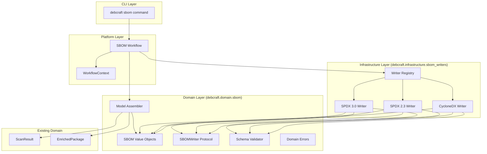
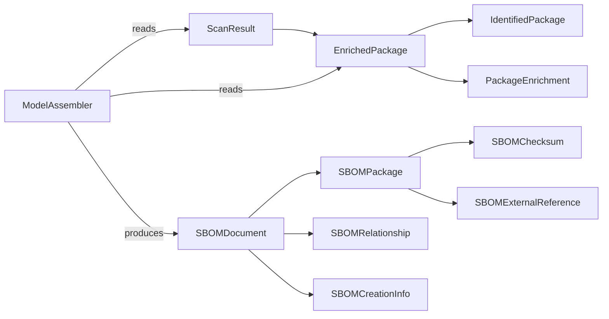

# Design Document: SBOM Writers

## Overview

The SBOM Writers subsystem (Milestone 7) implements the complete SBOM generation pipeline for DebCraft. It introduces a format-independent internal SBOM domain model, a model assembler that transforms scan results into that model, and a set of writer plugins that serialize the model into SPDX 3.0 JSON-LD, SPDX 2.3 JSON, and CycloneDX 1.5 JSON formats.

The design follows the existing hexagonal architecture: the internal model and writer protocol live in the domain layer (`debcraft.domain.sbom`), writers are infrastructure adapters discovered via entry points, and the SBOM workflow orchestrates the pipeline using platform contracts. This mirrors the existing scanner subsystem pattern where `ArtifactScanner` is a domain protocol and `ScannerRegistry` is an infrastructure plugin loader.

### Key Design Decisions

1. **Single internal model, multiple outputs**: One `SBOMDocument` value object feeds all writers, avoiding format-specific domain logic.
2. **Domain purity via AC-04**: The internal model uses SPDX 3.0 *concepts* (relationships, elements, packages) but imports no SPDX or CycloneDX libraries. Format-specific mapping is purely in infrastructure writers.
3. **Plugin architecture**: Writers use `debcraft.sbom_writers` entry points, exactly like scanners use `debcraft.scanners`, enabling third-party format additions.
4. **Schema validation as a domain service**: Validation logic is format-independent (takes JSON string + format enum), bundling schemas as package data for offline operation.
5. **Deterministic output**: All writers produce sorted-key, 2-space indented JSON for reproducibility and diffability.

## Architecture



### Layer Responsibilities

| Layer | Module | Responsibility |
|-------|--------|----------------|
| Domain | `domain.sbom.values` | Frozen dataclass value objects (SBOMDocument, SBOMPackage, etc.) |
| Domain | `domain.sbom.assembler` | Transforms ScanResult → SBOMDocument |
| Domain | `domain.sbom.ports` | SBOMWriter Protocol definition |
| Domain | `domain.sbom.errors` | Domain-specific exceptions |
| Domain | `domain.sbom.validator` | JSON schema validation service |
| Infrastructure | `infrastructure.sbom_writers.spdx3` | SPDX 3.0 JSON-LD serialization |
| Infrastructure | `infrastructure.sbom_writers.spdx23` | SPDX 2.3 JSON serialization |
| Infrastructure | `infrastructure.sbom_writers.cyclonedx` | CycloneDX 1.5 JSON serialization |
| Infrastructure | `infrastructure.sbom_writers.registry` | Plugin discovery and management |
| Infrastructure | `infrastructure.sbom_writers.printer` | Deterministic JSON formatting |
| Platform | Workflow in `infrastructure.sbom_writers.workflow` | Pipeline orchestration |
| CLI | `cli` module extension | `debcraft sbom` command |

## Components and Interfaces

### Domain Value Objects (`domain.sbom.values`)

```python
from __future__ import annotations
from dataclasses import dataclass, field
from enum import Enum


class RelationshipType(Enum):
    DESCRIBES = "DESCRIBES"
    CONTAINS = "CONTAINS"
    DEPENDS_ON = "DEPENDS_ON"
    BUILD_TOOL_OF = "BUILD_TOOL_OF"
    OTHER = "OTHER"


class ChecksumAlgorithm(Enum):
    SHA256 = "SHA256"
    SHA1 = "SHA1"
    MD5 = "MD5"


class ExternalReferenceCategory(Enum):
    PACKAGE_MANAGER = "PACKAGE_MANAGER"
    SECURITY_ADVISORY = "SECURITY_ADVISORY"
    OTHER = "OTHER"


class OutputFormat(Enum):
    SPDX_3_0 = "spdx_3_0"
    SPDX_2_3 = "spdx_2_3"
    CYCLONEDX = "cyclonedx"


@dataclass(frozen=True)
class SBOMChecksum:
    algorithm: ChecksumAlgorithm
    value: str  # lowercase hex, length matches algorithm

    def __post_init__(self) -> None:
        expected = {ChecksumAlgorithm.SHA256: 64, ChecksumAlgorithm.SHA1: 40, ChecksumAlgorithm.MD5: 32}
        if len(self.value) != expected[self.algorithm]:
            raise ValueError(...)


@dataclass(frozen=True)
class SBOMExternalReference:
    category: ExternalReferenceCategory
    url: str  # non-empty
    comment: str | None = None


@dataclass(frozen=True)
class SBOMExtractedLicense:
    license_id: str  # matches LicenseRef-[a-zA-Z0-9.-]+
    extracted_text: str  # non-empty
    name: str | None = None
    cross_references: list[str] = field(default_factory=list)


@dataclass(frozen=True)
class SBOMCreationInfo:
    tools: list[str]  # ["Tool: name-version", ...], at least one
    created: str  # ISO 8601 UTC
    creators: list[str]  # non-empty strings
    license_list_version: str | None = None


@dataclass(frozen=True)
class SBOMPackage:
    spdx_id: str  # SPDXRef-[a-zA-Z0-9.-]+
    name: str  # non-empty
    version: str | None = None
    supplier: str | None = None
    download_location: str | None = None
    checksums: list[SBOMChecksum] = field(default_factory=list)
    package_url: str | None = None
    concluded_license: str | None = None
    declared_license: str | None = None
    copyright_text: str | None = None
    description: str | None = None
    external_references: list[SBOMExternalReference] = field(default_factory=list)


@dataclass(frozen=True)
class SBOMRelationship:
    source_id: str  # SPDXRef-[a-zA-Z0-9.-]+
    target_id: str  # SPDXRef-[a-zA-Z0-9.-]+
    relationship_type: RelationshipType


@dataclass(frozen=True)
class SBOMDocument:
    namespace: str  # non-empty
    name: str  # non-empty, max 255 chars
    creation_info: SBOMCreationInfo
    root_package: SBOMPackage
    packages: list[SBOMPackage] = field(default_factory=list)
    relationships: list[SBOMRelationship] = field(default_factory=list)
    extracted_licenses: list[SBOMExtractedLicense] = field(default_factory=list)
    comment: str | None = None
    provenance_tool: str | None = None
    provenance_timestamp: str | None = None
```

All value objects use `__post_init__` to validate constraints at construction time, raising `ValueError` with descriptive messages on failure.

### Writer Protocol (`domain.sbom.ports`)

```python
from pathlib import Path
from typing import Protocol


@dataclass(frozen=True)
class WriterResult:
    output_path: Path
    format: OutputFormat
    sha256: str  # 64-char hex
    file_size: int  # non-negative, matches actual file
    diagnostics: list[str] = field(default_factory=list)  # max 1000


class SBOMWriter(Protocol):
    async def write(self, document: SBOMDocument, output_path: Path, context: WorkflowContext) -> WriterResult: ...
```

### Model Assembler (`domain.sbom.assembler`)

```python
class ModelAssembler:
    def assemble(
        self,
        scan_result: ScanResult,
        enriched_packages: list[EnrichedPackage],
    ) -> SBOMDocument:
        """Transform scan results into an SBOMDocument.

        - Generates unique SPDX IDs with collision suffix
        - Maps enrichment fields (purl, sha256, licenses, depends)
        - Creates DESCRIBES relationships from root to all components
        - Creates DEPENDS_ON relationships from dependency parsing
        - Generates namespace with artifact path hash + UUID4
        """
        ...
```

The assembler is a pure domain service with no I/O. It reads `importlib.metadata` only for the debcraft version string (acceptable in domain as it reads own package metadata).

### Schema Validator (`domain.sbom.validator`)

```python
class SchemaValidator:
    def validate(self, json_string: str, format: OutputFormat) -> list[str]:
        """Validate JSON against the specified format schema.

        Returns empty list for valid documents, list of error messages otherwise.
        Each error: "<json_pointer>: <constraint> (got: <truncated_value>)"

        Raises:
            SchemaUnavailableError: if schema file is missing/corrupt.
        """
        ...
```

Uses `jsonschema` library with bundled schema files loaded from package data via `importlib.resources`. Schemas are stored in `domain/sbom/schemas/` (or `infrastructure/sbom_writers/schemas/` — see rationale below).

**Design Decision — Schema file location**: Schemas are reference data (like the SPDX license list data already in `domain/package_intelligence/data/`). They're placed in `domain/sbom/schemas/` to keep the validator as a pure domain service with no infrastructure imports. The validator uses `importlib.resources` to load them, which is stdlib.

### Writer Implementations (Infrastructure)

Each writer follows the same internal structure:

```
infrastructure/sbom_writers/
├── __init__.py
├── spdx3.py          # SPDX3Writer class
├── spdx23.py         # SPDX23Writer class
├── cyclonedx.py      # CycloneDXWriter class
├── registry.py       # WriterRegistry (plugin loader)
├── printer.py        # SBOMPrinter (deterministic JSON formatting)
└── workflow.py        # SBOMWorkflow (pipeline orchestration)
```

Each writer:
1. Accepts an `SBOMDocument` and `Path`
2. Calls an internal serializer method to produce a Python dict
3. Passes the dict to `SBOMPrinter.print()` for deterministic JSON output
4. Validates the JSON string against the schema via `SchemaValidator`
5. Writes the bytes to disk (creating parent dirs if needed)
6. Computes SHA-256 of written bytes
7. Returns `WriterResult`

### Writer Registry (`infrastructure.sbom_writers.registry`)

```python
class WriterRegistry:
    def __init__(self) -> None:
        self._writers: dict[OutputFormat, SBOMWriter] = {}
        self._diagnostics: list[str] = []

    def load_from_entry_points(self) -> None:
        """Discover writers from 'debcraft.sbom_writers' entry point group."""
        ...

    def get_writer(self, format: OutputFormat) -> SBOMWriter:
        """Get writer for format. Raises UnsupportedFormatError if not found."""
        ...
```

Mirrors `ScannerRegistry` pattern exactly — same error handling, same protocol validation approach using `inspect.iscoroutinefunction`.

### SBOM Workflow (`infrastructure.sbom_writers.workflow`)

```python
class SBOMWorkflow(Workflow):
    @property
    def name(self) -> str:
        return "sbom"

    async def execute(self, context: WorkflowContext) -> None:
        # 1. Scan artifact (25%)
        # 2. Enrich packages (50%)
        # 3. Assemble SBOMDocument (75%)
        # 4. Write all requested formats (90%)
        # 5. Persist SBOMDocument records (100%)
        ...
```

Resolves dependencies from `context.scope`: scanner registry, enricher, model assembler, writer registry, SBOM repository.

### CLI Extension

Adds a `sbom` subcommand to the existing Typer app:

```python
@app.command()
def sbom(
    artifact_path: Path,
    format: list[str] = Option(default=None, help="Output format(s)"),
    output_dir: Path = Option(default=Path("."), help="Output directory"),
    type: str | None = Option(default=None, help="Artifact type"),
    quiet: bool = Option(default=False, help="Suppress progress"),
) -> None: ...
```

### Entry Points Configuration

```toml
[project.entry-points."debcraft.sbom_writers"]
spdx_3_0 = "debcraft.infrastructure.sbom_writers.spdx3:SPDX3Writer"
spdx_2_3 = "debcraft.infrastructure.sbom_writers.spdx23:SPDX23Writer"
cyclonedx = "debcraft.infrastructure.sbom_writers.cyclonedx:CycloneDXWriter"
```

## Data Models

### Domain Value Objects (Summary)

| Value Object | Key Fields | Validation |
|---|---|---|
| `SBOMDocument` | namespace, name, creation_info, root_package, packages, relationships | namespace non-empty, name 1-255 chars |
| `SBOMPackage` | spdx_id, name, version, checksums, package_url, licenses | spdx_id matches `SPDXRef-[a-zA-Z0-9.-]+`, name non-empty |
| `SBOMRelationship` | source_id, target_id, relationship_type | IDs match SPDX pattern, type from enum |
| `SBOMChecksum` | algorithm, value | Hash length matches algorithm (64/40/32) |
| `SBOMCreationInfo` | tools, created, creators | tools non-empty list, "Tool: " format |
| `SBOMExtractedLicense` | license_id, extracted_text | ID matches `LicenseRef-[a-zA-Z0-9.-]+`, text non-empty |
| `SBOMExternalReference` | category, url | url non-empty |
| `WriterResult` | output_path, format, sha256, file_size, diagnostics | sha256 64 chars, file_size ≥ 0 |

### Existing Database Model (unchanged)

The `SBOMDocument` SQLAlchemy model in `infrastructure/models/scan.py` is already defined and stores:
- `id` (PK)
- `scan_session_id` (FK → scan_sessions)
- `format` (string, e.g., "spdx_3_0")
- `content_path` (path to written file)
- `sha256` (hash of written file)

No schema migrations are needed — the existing model already accommodates M7 requirements.

### Relationship to Existing Domain Types



## Correctness Properties

*A property is a characteristic or behavior that should hold true across all valid executions of a system — essentially, a formal statement about what the system should do. Properties serve as the bridge between human-readable specifications and machine-verifiable correctness guarantees.*

### Property 1: Model construction preserves valid inputs

*For any* set of field values that conform to the stated constraints (non-empty strings where required, SPDX ID pattern `SPDXRef-[a-zA-Z0-9.-]+`, hash lengths matching algorithms, license ID pattern `LicenseRef-[a-zA-Z0-9.-]+`), constructing an SBOM value object SHALL succeed and all fields SHALL be accessible with the exact values provided.

**Validates: Requirements 1.2, 1.3, 1.4, 1.5, 1.6, 1.7, 1.8**

### Property 2: Model construction rejects invalid inputs

*For any* field value that violates a stated constraint (empty string for a required non-empty field, SPDX identifier not matching the required pattern, hash value length not matching the specified algorithm), constructing the value object SHALL raise a `ValueError` whose message identifies the failing field and violated constraint.

**Validates: Requirements 1.9**

### Property 3: Model assembler field mapping correctness

*For any* `ScanResult` containing one or more `EnrichedPackage` entries, the `ModelAssembler` SHALL produce an `SBOMDocument` where: (a) there is exactly one `SBOMPackage` per input `EnrichedPackage` with name, version, and description correctly mapped; (b) packages with non-null purl have correct `package_url` and a PACKAGE_MANAGER external reference; (c) packages with non-null sha256 have a SHA256 checksum; (d) packages with license_expressions have concluded_license set; (e) a DESCRIBES relationship exists from root to each component; (f) DEPENDS_ON relationships are generated for dependencies matching other packages; and (g) the document namespace matches the format `https://debcraft.io/spdxdocs/<16-hex>-<uuid4>`.

**Validates: Requirements 2.1, 2.2, 2.3, 2.4, 2.5, 2.6, 2.10**

### Property 4: Model assembler SPDX ID uniqueness

*For any* set of `EnrichedPackage` entries (including sets where multiple packages would produce the same sanitized name-version string), the `ModelAssembler` SHALL produce `SBOMPackage` values whose `spdx_id` fields are all unique within the containing `SBOMDocument`.

**Validates: Requirements 2.7**

### Property 5: Serialization determinism

*For any* valid `SBOMDocument`, serializing the document with any writer twice SHALL produce byte-identical output. The output SHALL use 2-space indentation, sorted keys, UTF-8 encoding without BOM, and a trailing newline character.

**Validates: Requirements 3.5, 10.1, 10.5**

### Property 6: Writer result integrity

*For any* valid `SBOMDocument` written by any writer, the `WriterResult.sha256` field SHALL equal the SHA-256 hash independently computed from the written file's bytes, and `WriterResult.file_size` SHALL equal the actual byte count of the written file.

**Validates: Requirements 3.6**

### Property 7: SPDX 2.3 round-trip data preservation

*For any* valid `SBOMDocument` (including documents with Unicode characters in package names, None optional fields, and varying numbers of components), when serialized by the SPDX23Writer and the resulting JSON is parsed back into a dictionary, the dictionary SHALL contain all package names, versions, SPDX identifiers, relationship types, and checksum values present in the original `SBOMDocument` with exact string equality. Optional fields set to None SHALL use "NOASSERTION" sentinel or be omitted per SPDX 2.3 rules, and parsing back SHALL not introduce spurious values.

**Validates: Requirements 10.2, 10.6, 10.7**

### Property 8: SPDX 3.0 round-trip data preservation

*For any* valid `SBOMDocument` (including documents with Unicode characters and None optional fields), when serialized by the SPDX3Writer and the resulting JSON is parsed back into a dictionary, the dictionary SHALL contain all package names, versions, element identifiers, relationship types, and hash values present in the original `SBOMDocument` with exact string equality.

**Validates: Requirements 10.3, 10.6, 10.7**

### Property 9: CycloneDX round-trip data preservation

*For any* valid `SBOMDocument` (including documents with Unicode characters and None optional fields), when serialized by the CycloneDXWriter and the resulting JSON is parsed back into a dictionary, the dictionary SHALL contain all component names, versions, PURLs, hash values, and dependency references (set equality) present in the original `SBOMDocument`.

**Validates: Requirements 10.4, 10.6, 10.7**

### Property 10: Schema validation error message format

*For any* JSON string that fails validation against any supported schema (SPDX 3.0, SPDX 2.3, or CycloneDX 1.5), each error message returned by the `SchemaValidator` SHALL contain the JSON path of the failing element (RFC 6901 JSON Pointer), the constraint that was violated, and the actual value that failed (truncated to 200 characters if longer).

**Validates: Requirements 7.6**

## Error Handling

### Domain Error Hierarchy

```python
class SBOMError(PlatformError):
    """Base error for all SBOM domain errors."""


class ModelValidationError(SBOMError):
    """Raised when SBOM value object construction fails validation."""


class WriterError(SBOMError):
    """Base for writer-specific errors."""


class OutputPathError(WriterError):
    """Raised when the output path is not writable."""


class WriterCancellationError(WriterError):
    """Raised when a write operation is cancelled."""


class DocumentValidationError(WriterError):
    """Raised when document is None or has no root package."""


class UnsupportedFormatError(SBOMError):
    """Raised when no writer is registered for a requested format."""


class SchemaUnavailableError(SBOMError):
    """Raised when a schema file is missing or unparseable."""
```

### Error Handling Strategy

| Scenario | Behavior |
|---|---|
| Invalid value object construction | `ValueError` raised immediately at `__post_init__` |
| Output path not writable | `OutputPathError` raised, no partial file left |
| Cancellation during write | Partial file removed, `WriterCancellationError` raised |
| Schema validation failure | File still written, diagnostics added to `WriterResult` |
| Entry point load failure | Warning logged, entry point skipped, others continue |
| Workflow step failure | `WorkflowSummary` with FAILED state and step+error details |
| Partial write step failure | Successful formats persisted, failed ones in error_details |

### Cancellation Contract

Writers check `context.cancellation_token.is_cancelled` before I/O operations. If cancelled:
1. Any partial output file at `output_path` is deleted
2. `WriterCancellationError` is raised
3. The workflow catches this and transitions to CANCELLED state

## Testing Strategy

### Property-Based Tests (Hypothesis)

Property-based testing is highly applicable to this feature because the core logic involves:
- Pure data transformations (assembler: ScanResult → SBOMDocument)
- Serialization round-trips (document → JSON → verify data preservation)
- Validation of universal invariants (uniqueness, format constraints, determinism)

**Library**: Hypothesis (already in dev dependencies)
**Minimum iterations**: 100 per property
**Tag format**: `# Feature: sbom-writers, Property N: <property_text>`

Properties to implement:
1. **Model construction validity** — generate valid field values, verify construction succeeds
2. **Model construction rejection** — generate invalid field values, verify ValueError
3. **Assembler field mapping** — generate ScanResults with enriched packages, verify output
4. **Assembler SPDX ID uniqueness** — generate duplicate-prone package sets, verify uniqueness
5. **Serialization determinism** — generate documents, serialize twice, verify byte equality
6. **Writer result integrity** — generate documents, write to temp files, verify hash/size
7. **SPDX 2.3 round-trip** — generate documents, serialize, parse back, verify fields
8. **SPDX 3.0 round-trip** — generate documents, serialize, parse back, verify fields
9. **CycloneDX round-trip** — generate documents, serialize, parse back, verify fields
10. **Schema validation error format** — generate invalid JSON, verify error message structure

### Hypothesis Strategy (Generators)

A shared `tests/properties/domain/sbom/strategies.py` module will provide composite strategies:

```python
from hypothesis import strategies as st

# Base strategies
spdx_ids = st.from_regex(r"SPDXRef-[a-zA-Z0-9.\-]{1,64}", fullmatch=True)
license_refs = st.from_regex(r"LicenseRef-[a-zA-Z0-9.\-]{1,64}", fullmatch=True)
sha256_hashes = st.from_regex(r"[0-9a-f]{64}", fullmatch=True)
sha1_hashes = st.from_regex(r"[0-9a-f]{40}", fullmatch=True)
md5_hashes = st.from_regex(r"[0-9a-f]{32}", fullmatch=True)

# Composite strategies
sbom_checksums = st.one_of(
    st.builds(SBOMChecksum, algorithm=st.just(ChecksumAlgorithm.SHA256), value=sha256_hashes),
    st.builds(SBOMChecksum, algorithm=st.just(ChecksumAlgorithm.SHA1), value=sha1_hashes),
    st.builds(SBOMChecksum, algorithm=st.just(ChecksumAlgorithm.MD5), value=md5_hashes),
)

# Full document strategy with Unicode support
sbom_documents = st.builds(SBOMDocument, ...)
```

Generators will include:
- Unicode text (CJK, Arabic, emoji, combining characters) in string fields
- None values for optional fields
- Empty and large package lists
- Duplicate name/version pairs (to exercise suffix deduplication)

### Unit Tests

Unit tests cover:
- Specific examples for each writer's field mapping (e.g., known package → expected JSON structure)
- Edge cases: empty package list, zero components, missing optional fields
- Error conditions: non-writable paths, cancellation, schema failures
- Registry behavior: unrecognized entry points, load failures, duplicate formats
- CLI argument validation and output formatting
- Workflow step sequencing and event publishing

### Integration Tests

Integration tests cover:
- Full workflow execution with real scanners and database
- CLI end-to-end with subprocess invocation
- Schema validation with official schemas against real outputs
- Entry point discovery from installed package

### Test File Structure

```
tests/
├── properties/domain/sbom/
│   ├── __init__.py
│   ├── strategies.py           # Shared Hypothesis strategies
│   ├── test_model_properties.py      # Properties 1, 2
│   ├── test_assembler_properties.py  # Properties 3, 4
│   ├── test_serialization_properties.py  # Properties 5, 6
│   ├── test_spdx23_roundtrip.py     # Property 7
│   ├── test_spdx3_roundtrip.py      # Property 8
│   ├── test_cyclonedx_roundtrip.py  # Property 9
│   └── test_validator_properties.py  # Property 10
├── unit/domain/sbom/
│   ├── test_values.py
│   ├── test_assembler.py
│   └── test_validator.py
├── unit/infrastructure/sbom_writers/
│   ├── test_spdx3_writer.py
│   ├── test_spdx23_writer.py
│   ├── test_cyclonedx_writer.py
│   ├── test_registry.py
│   └── test_printer.py
└── integration/sbom/
    ├── test_workflow.py
    └── test_cli.py
```
