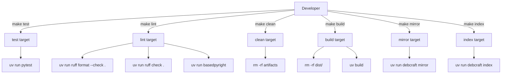

# Design Document: Makefile Tasks

## Overview

This design specifies a GNU Make-based task runner for the debcraft project. The Makefile provides six targets (`test`, `lint`, `clean`, `build`, `mirror`, `index`) that wrap the project's development commands behind short, memorable invocations. Each target delegates to `uv run` for environment-managed execution, maintaining consistency with the project's use of `uv` as the Python package manager.

The Makefile is a single file at the project root (`Makefile`) with no external dependencies beyond GNU Make and `uv`.

## Architecture

The Makefile follows a flat, single-file architecture with no target dependencies between the six primary targets. Each target is independent and can be invoked in isolation.

### Design Decisions

1. **`.PHONY` declaration for all targets** — None of the targets produce files matching their name, so all must be declared phony to avoid conflicts with directories/files named `test`, `build`, etc.

2. **No inter-target dependencies** — Targets like `build` do not depend on `lint` or `test`. This gives developers explicit control and avoids unexpected execution chains. A developer wanting lint-then-build can run `make lint build`.

3. **Sequential lint execution with early exit** — The `lint` target chains the three tools with `&&` so that the first failure stops execution. This matches the CI behavior and provides fast feedback.

4. **Pre-clean in `build`** — The `build` target removes `dist/` before invoking `uv build` to ensure only current artifacts are present, matching Requirement 4.4.

5. **Suppressed errors in `clean`** — Uses `rm -rf` which naturally succeeds when targets don't exist, satisfying the requirement for silent no-op on missing artifacts. The `find` command for `__pycache__` uses `-exec rm -rf {} +` pattern.

## Components and Interfaces

### Component: Makefile

**Location:** `./Makefile` (project root)

**Interface:** GNU Make CLI (`make <target>`)

| Target | Command(s) | Exit Behavior |
|--------|-----------|---------------|
| `test` | `uv run pytest` | Propagates pytest exit code |
| `lint` | `uv run ruff format --check .` → `uv run ruff check .` → `uv run basedpyright` | Stops at first failure, propagates exit code |
| `clean` | Series of `rm -rf` and `find -delete` commands | Always exits 0 |
| `build` | `rm -rf dist/` then `uv build` | Propagates uv build exit code |
| `mirror` | `uv run debcraft mirror` | Propagates CLI exit code |
| `index` | `uv run debcraft index` | Propagates CLI exit code |

### Default Target

No default target is set. Running bare `make` will execute the first target defined in the file. The first target will be `test` as the most common developer action.

## Data Models

Not applicable — the Makefile is a static configuration file with no runtime data structures.

## Error Handling

| Scenario | Behavior |
|----------|----------|
| `uv` not found on PATH | Shell returns "command not found" with exit code 127, which Make propagates as a non-zero exit |
| Lint tool fails | `&&` chain short-circuits; Make propagates the failing tool's exit code |
| `clean` targets don't exist | `rm -rf` on non-existent paths is a no-op (exit 0); `find` with no matches also exits 0 |
| `build` fails | `uv build` exit code propagated directly |
| CLI subcommand fails | Exit code from `uv run debcraft <cmd>` propagated directly |

Make's default behavior (exit on recipe failure) handles exit code propagation without additional scripting. The `.DELETE_ON_ERROR` directive is not needed since no targets produce file output.

## Correctness Properties

*A property is a characteristic or behavior that should hold true across all valid executions of a system — essentially, a formal statement about what the system should do. Properties serve as the bridge between human-readable specifications and machine-verifiable correctness guarantees.*

*Note: Property-based testing is not applicable to this feature. The Makefile is a static build automation artifact with fixed shell commands — there are no pure functions, data transformations, or input spaces to generate properties against. This is analogous to Infrastructure as Code where snapshot tests and smoke checks are the appropriate verification strategy. The following invariants are manually verifiable through inspection and dry-run execution.*

### Property 1: All targets are declared .PHONY

_For any_ target defined in the Makefile (`test`, `lint`, `clean`, `build`, `mirror`, `index`), it SHALL be listed in the `.PHONY` declaration so that Make never skips execution due to a same-named file or directory existing in the project root.

**Validates: Requirements 1.1, 2.1, 3.1, 4.1, 5.1, 6.1**

### Property 2: Clean always exits zero

_For any_ invocation of `make clean`, regardless of whether the targeted artifacts exist or not, the target SHALL complete with exit code 0 and produce no error output to stderr.

**Validates: Requirements 3.7, 3.8**

### Property 3: Lint stops on first failure

_For any_ invocation of `make lint` where the first or second tool returns a non-zero exit code, the Makefile SHALL skip execution of subsequent tools and propagate the non-zero exit code to the caller.

**Validates: Requirements 2.2**

### Property 4: Build pre-cleans dist directory

_For any_ invocation of `make build`, the Makefile SHALL remove the `dist/` directory before invoking `uv build`, ensuring only artifacts from the current build are present.

**Validates: Requirements 4.4**

### Property 5: Exit code propagation

_For any_ target other than `clean`, if the underlying command returns a non-zero exit code, the Makefile SHALL propagate that same non-zero exit code to the caller without masking the failure.

**Validates: Requirements 1.3, 1.4, 2.2, 4.3, 5.2, 6.2**

## Testing Strategy

**Why PBT does not apply:** This feature produces a static Makefile — a configuration/build automation artifact with fixed shell commands. There are no pure functions, data transformations, or varying inputs to test properties against. This is analogous to IaC configuration.

### Recommended Testing Approach

1. **Manual smoke tests** — Verify each target runs successfully in a development environment:
   - `make test` runs and reports pytest results
   - `make lint` runs all three linters in order
   - `make clean` removes artifacts without errors
   - `make build` produces `.tar.gz` and `.whl` in `dist/`
   - `make mirror` and `make index` invoke the CLI subcommands

2. **CI integration** — The Makefile targets can optionally be used in `.github/workflows/ci.yml` to replace the inline commands, providing a consistency check that the Makefile works as documented.

3. **Syntax validation** — Run `make -n <target>` (dry-run) to verify the Makefile parses correctly without executing commands.

4. **Example-based verification:**
   - Run `make clean` on a workspace with no artifacts — verify exit code 0 and no stderr
   - Run `make clean` on a workspace with all artifact types — verify all are removed
   - Run `make lint` with a formatting error — verify it stops before ruff check
   - Run `make build` twice — verify only one set of artifacts in `dist/`
