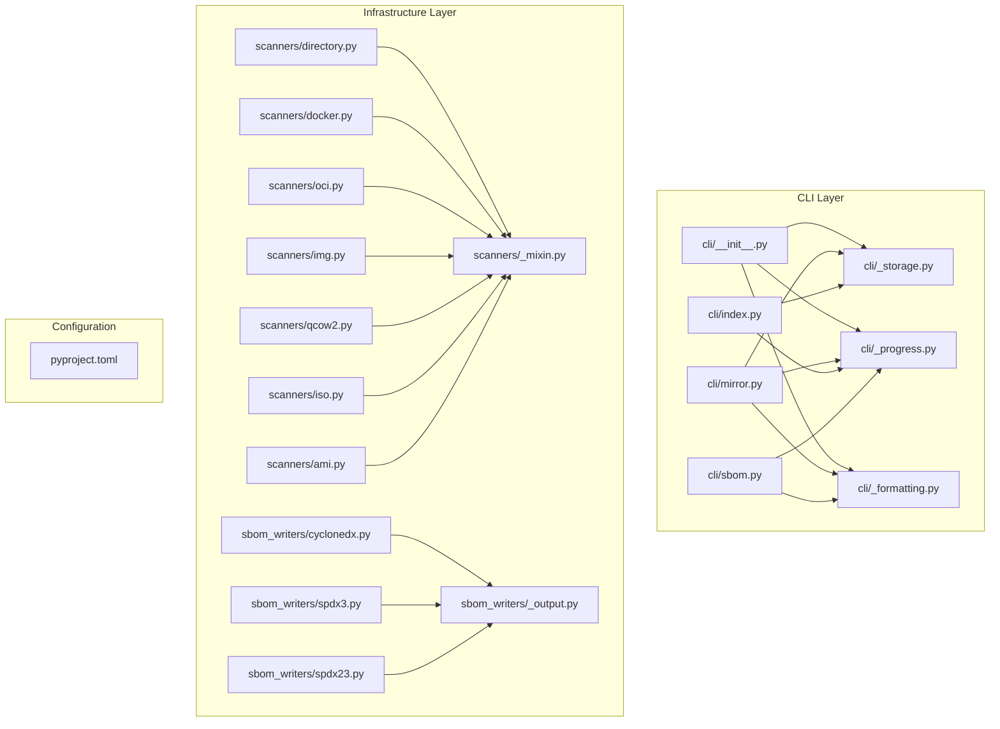

# Design Document: Pylint Cleanup

## Overview

This design addresses the systematic cleanup of pylint findings in the debcraft codebase to raise the score from 9.58/10 to ≥9.90/10. The approach groups changes into five categories:

1. **Structural consolidation** — Extract shared code (scanner mixin, CLI storage engine, SBOM output helper, progress bar factory, format_bytes utility) to eliminate R0801 duplicate-code warnings.
2. **Function decomposition** — Break apart large functions in engine.py, oci.py, docker.py, qcow2.py, service.py, and CLI modules to resolve R0914/R0915/R0912/R0911 complexity warnings.
3. **Exception narrowing** — Replace broad `except Exception` with specific types (W0718).
4. **Configuration tuning** — Globally suppress intentional patterns (W2301, C0415, W0622) and add inline suppressions for known false positives (E1102, E1128).
5. **Minor style fixes** — Resolve R1705, R1714, R1721, W0706, C0121, C2801, R1732, W0246, W0611, W0613, C0301, C0413.

All changes preserve external behavior. The existing test suite, mypy, and ruff must continue to pass without modification.

## Architecture

The refactoring stays within the existing hexagonal/ports-and-adapters boundaries:



**Key design decisions:**

- New shared modules use underscore-prefixed names (`_storage.py`, `_progress.py`, `_mixin.py`, `_output.py`) to signal internal/private status.
- The scanner mixin is a standard mixin class (not an ABC) to avoid changing the plugin contract.
- The SBOM output helper is a plain function, not a class — it has no state.
- All consolidations are additive: existing module public APIs remain unchanged.

## Components and Interfaces

### 1. Scanner Base Mixin (`src/debcraft/infrastructure/scanners/_mixin.py`)

```python
from debcraft.domain.scanner.values import IdentifiedPackage
from debcraft.platform.contracts.workflow import WorkflowContext


class ScannerMixin:
    """Shared boilerplate for scanner implementations."""

    def _check_cancellation(self, context: WorkflowContext, artifact_path: str, step: str) -> None:
        """Check cancellation token; raise ScannerError if cancelled."""
        ...

    async def _run_filesystem_analysis(
        self,
        file_paths: list[str],
        contents_port: ContentsIndexPort,
        package_port: PackageLookupPort,
        snapshot_id: int,
        context: WorkflowContext,
    ) -> tuple[list[IdentifiedPackage], list[str]]:
        """Run analyze_filesystem with cancellation check and progress reporting."""
        ...

    def _report_progress(self, context: WorkflowContext, percentage: float, message: str) -> None:
        """Delegate to context.progress.report with argument validation."""
        ...
```

Each of the 7 scanner classes will inherit from `ScannerMixin` alongside their current definition, replacing inlined cancellation guards, direct `analyze_filesystem` calls, and `context.progress.report` calls with mixin methods.

### 2. CLI Shared Storage Engine (`src/debcraft/cli/_storage.py`)

```python
from debcraft.platform.contracts.storage import StorageEngine, StoragePurpose
from pathlib import Path


class MinimalStorageEngine(StorageEngine):
    """XDG-compliant storage engine for CLI context (no full platform bootstrap)."""

    def __init__(self) -> None: ...
    async def initialize(self) -> None: ...
    async def shutdown(self) -> None: ...
    def get_path(self, purpose: StoragePurpose, relative: str = "") -> Path: ...
    async def __aenter__(self) -> "MinimalStorageEngine": ...
    async def __aexit__(self, *exc: object) -> None: ...
```

The implementation is identical to the current `_MinimalStorageEngine` in `mirror.py` (which supports `config` and `mirror` purposes). Both `index.py` and `mirror.py` will import from this shared module.

### 3. SBOM Output Helper (`src/debcraft/infrastructure/sbom_writers/_output.py`)

```python
from pathlib import Path


def write_sbom_output(output_bytes: bytes, output_path: Path) -> tuple[str, int]:
    """Write SBOM bytes to disk with cleanup and hash computation.

    Creates parent directories, writes bytes, computes SHA-256.
    Removes partial file on OS error.

    Returns:
        (sha256_hex, file_size) tuple.

    Raises:
        OutputPathError: On OS errors during mkdir or write.
    """
    ...
```

All three SBOM writers (CycloneDX, SPDX 2.3, SPDX 3.0) will replace their inline directory-creation + write + cleanup + hash logic with a call to this function.

### 4. CLI Progress Bar Factory (`src/debcraft/cli/_progress.py`)

```python
from rich.progress import Progress


def create_progress_bar(*, disabled: bool = False) -> Progress:
    """Create a Rich Progress with standard debcraft column configuration.

    Columns: SpinnerColumn, TextColumn (description), BarColumn,
    TextColumn (percentage), TimeElapsedColumn.
    """
    ...
```

### 5. CLI Byte Formatting Utility (`src/debcraft/cli/_formatting.py`)

```python
def format_bytes(n: int) -> str:
    """Format a non-negative byte count as a human-readable IEC string.

    Returns values like "0 B", "1.5 KiB", "42.3 MiB", "1.2 GiB".
    """
    ...
```

### 6. Function Decomposition Strategy

Functions triggering R0914/R0915/R0912/R0911 will be decomposed by extracting logically cohesive blocks into underscore-prefixed helper methods within the same module. Public signatures are unchanged.

| Module | Function | Primary Issue | Decomposition Approach |
|--------|----------|--------------|----------------------|
| `cli/mirror.py` | `_run_sync` | R0914 (22 locals) | Extract inner classes to module-level; extract loop body |
| `cli/mirror.py` | `verify` | R0914 (28), R0915 (57 stmts) | Extract DB query, checksum loop, result display |
| `cli/mirror.py` | `status` | R0914 (23) | Extract DB stat gathering into helper |
| `cli/index.py` | `_run_index` | R0914 (26), R0912 (13 branches) | Extract repo discovery, indexing loop |
| `scanners/oci.py` | `scan` | R0914/R0915 | Extract validation, layer extraction, dpkg parse |
| `scanners/docker.py` | `scan` | R0914/R0915 | Extract validation, manifest parsing, layer loop |
| `engine.py` | complex methods | R0914/R0912 | Extract workflow steps |
| `service.py` | complex methods | R0914/R0912 | Extract orchestration steps |

### 7. Pylint Configuration Changes (`pyproject.toml`)

```toml
[tool.pylint.messages_control]
disable = [
    # ... existing ...
    "unnecessary-ellipsis",       # W2301 — intentional in ABCs/protocols
    "import-outside-toplevel",    # C0415 — lazy imports for startup perf
    "redefined-builtin",          # W0622 — 'format' param in SBOM APIs
]

[tool.pylint.main]
fail-under = 9.90
```

### 8. Inline Suppression Strategy

| Code | Location Pattern | Suppression |
|------|-----------------|-------------|
| E1102 | `func.now()`, `func.count()` calls | `# pylint: disable=not-callable` (end-of-line) |
| E1128 | `license_mapper.py` return sites | `# pylint: disable=assignment-from-none` (end-of-line) |
| W0718 | Top-level CLI handlers, event bus dispatch | `# pylint: disable=broad-exception-caught` + justification comment |

## Data Models

No new data models are introduced. This refactoring does not change any persistent data structures, database schemas, or wire formats.

The only "model" changes are:
- New Python modules containing extracted classes/functions (described in Components above).
- Configuration additions to `pyproject.toml` (described above).

## Correctness Properties

*A property is a characteristic or behavior that should hold true across all valid executions of a system — essentially, a formal statement about what the system should do. Properties serve as the bridge between human-readable specifications and machine-verifiable correctness guarantees.*

### Property 1: Cancellation check raises for cancelled tokens

*For any* valid artifact path string and any step description string, when the mixin's cancellation-check method is called with a WorkflowContext whose `cancellation_token.is_cancelled` is `True`, the method SHALL raise a `ScannerError` subclass whose message contains both the artifact path and the step description. Conversely, when `is_cancelled` is `False`, the method SHALL return without raising.

**Validates: Requirements 1.1**

### Property 2: Progress delegation preserves arguments

*For any* percentage value in the range [0.0, 100.0] and any descriptive message string of at most 256 characters, the mixin's progress-report method SHALL invoke `context.progress.report` with exactly those same percentage and message values, unmodified.

**Validates: Requirements 1.3**

### Property 3: MinimalStorageEngine path resolution correctness

*For any* storage purpose in `{"config", "mirror"}` and any relative path string containing only valid path characters, the `MinimalStorageEngine.get_path(purpose, relative)` method SHALL return a path whose parent is the XDG-compliant base directory for that purpose and whose final component matches the relative path suffix.

**Validates: Requirements 2.4**

### Property 4: format_bytes IEC binary unit correctness

*For any* non-negative integer `n`, `format_bytes(n)` SHALL return a string that:
- Uses "B" when `n < 1024`
- Uses "KiB" when `1024 ≤ n < 1024²`
- Uses "MiB" when `1024² ≤ n < 1024³`
- Uses "GiB" when `n ≥ 1024³`
- Contains a numeric value that, when parsed and multiplied by the unit's byte count, is within 0.1 of the unit of the original value `n`

**Validates: Requirements 5.1**

## Error Handling

### SBOM Output Helper Errors

When `write_sbom_output` encounters an `OSError` during:
- **Directory creation** (`mkdir`): raises `OutputPathError(path, description)` immediately.
- **File writing** (`write_bytes`): removes any partial file via `unlink(missing_ok=True)`, then raises `OutputPathError(path, description)`.

This matches the existing behavior in each SBOM writer — the helper centralizes it.

### Scanner Mixin Cancellation

The `_check_cancellation` method raises a `ScannerError` subclass (e.g., `ScanCancelled`) that includes:
- The artifact path (for log correlation)
- A diagnostic message identifying the step at which cancellation was detected

Callers (scanner `scan()` methods) should let this propagate — the scan workflow already handles `ScannerError` gracefully.

### Broad Exception Catching Strategy

Remaining `except Exception` blocks (≤10) are retained only at:
- CLI top-level error handlers (in `index`, `mirror sync`, `sbom` commands)
- Event bus dispatch (swallows exceptions to not crash other handlers)
- Plugin loaders (prevents one bad plugin from taking down the system)

Each receives an inline `# pylint: disable=broad-exception-caught` with a brief justification.

## Testing Strategy

### Approach

This refactoring is primarily **behavior-preserving** — the existing test suite is the primary regression safety net. New tests target the newly extracted modules/functions.

### Unit Tests (example-based)

| Target | Test Focus |
|--------|-----------|
| `ScannerMixin._run_filesystem_analysis` | Verify delegation to `analyze_filesystem`, progress report at 100%, cancellation check |
| `write_sbom_output` | Happy path (bytes → file + hash), OS error → cleanup + OutputPathError |
| `create_progress_bar` | Returns Progress instance, disabled mode uses `disable=True` |
| `MinimalStorageEngine` | Specific purpose/path combos, ValueError on unsupported purpose |

### Property Tests (Hypothesis)

Library: **Hypothesis** (already in dev dependencies)

Each property test runs a minimum of 100 iterations and is tagged with its design property reference.

| Property | Generator Strategy |
|----------|-------------------|
| P1: Cancellation raises | `st.text()` for artifact_path and step; `st.booleans()` for is_cancelled |
| P2: Progress passthrough | `st.floats(0.0, 100.0)` for percentage; `st.text(max_size=256)` for message |
| P3: Path resolution | `st.sampled_from(["config", "mirror"])` for purpose; `st.from_regex(r'[a-zA-Z0-9_/.-]{0,50}')` for relative |
| P4: format_bytes correctness | `st.integers(min_value=0, max_value=2**50)` for byte count |

Tag format: `# Feature: pylint-cleanup, Property {N}: {title}`

### Regression Tests

- Full existing test suite via `uv run pytest` — must pass without modification.
- `uv run pylint src/` — must score ≥9.90.
- `uv run mypy` — zero errors.
- `uv run ruff check .` and `uv run ruff format --check .` — zero errors.

### Smoke Tests (CI validation)

- Verify pylint reports zero findings for: R0801 (in affected modules), W2301, C0415, W0622, E1102, E1128, R1705, R1714, R1721, W0706, C0121, C2801, R1732, W0246, W0611, W0613, C0301, C0413.
- Verify `fail-under=9.90` is configured in `pyproject.toml`.
