# Design Document: Pylint Refactoring

## Overview

This design describes the structural refactoring of the debcraft Python codebase to eliminate all remaining pylint warnings and achieve a 10.00/10 score. The refactoring is purely internal — no public APIs change behavior, only signatures and code organization. The work falls into three tracks:

1. **Complexity reduction** — splitting large modules, reducing argument counts, extracting helper methods
2. **Deduplication** — extracting shared utilities for stanza parsing, scan-result construction, and SBOM write-with-cancellation patterns
3. **Style fixes** — narrow exception types, public accessors for private members, import cleanup

All changes are behavior-preserving. The existing test suite (unit, property-based, integration) serves as the correctness oracle.

## Architecture

The refactoring introduces three new shared utility modules and modifies existing modules in-place. No new external dependencies are added.

```mermaid
graph TD
    subgraph "New Shared Utilities"
        SP[domain/_stanza_parser.py]
        SM[infrastructure/scanners/_mixin.py<br>extended methods]
        WU[infrastructure/sbom_writers/_write_utils.py]
    end

    subgraph "Consumers - Stanza Parsing"
        MP[domain/mirror/packages_parser.py]
        IP[domain/indexer/packages_parser.py]
        IS[domain/indexer/sources_parser.py]
        DP[domain/scanner/dpkg_parser.py]
    end

    subgraph "Consumers - Scanner Mixin"
        DIR[scanners/directory.py]
        Q2[scanners/qcow2.py]
        ISO[scanners/iso.py]
        IMG[scanners/img.py]
        AMI[scanners/ami.py]
    end

    subgraph "Consumers - Write Utils"
        CDX[sbom_writers/cyclonedx.py]
        S23[sbom_writers/spdx23.py]
    end

    MP --> SP
    IP --> SP
    IS --> SP
    DP --> SP

    DIR --> SM
    Q2 --> SM
    ISO --> SM
    IMG --> SM
    AMI --> SM

    CDX --> WU
    S23 --> WU
```



### Module Split Strategy (Requirement 1)

The `infrastructure/mirror/engine.py` (1170 lines) will be split by extracting logically cohesive groups of private methods into underscore-prefixed modules:

| Extracted Module | Responsibility | Approximate Lines |
|---|---|---|
| `_persistence.py` | `_upsert_repository_file`, `_batch_create_repository_files`, `_batch_update_state`, `_batch_mark_failed` | ~200 |
| `_checksums.py` | `_get_local_checksums`, `_get_artifact_checksums`, `_deduplicate_entries` | ~150 |
| `_staging.py` | `_stage_release`, `_check_release_unchanged`, `_parse_and_store_release`, `_download_release_file` | ~200 |

The `MirrorEngine` class remains in `engine.py` with its public API (`sync_repository`, `SyncResult`), delegating to the extracted modules via composition or module-level function calls.

## Components and Interfaces

### 1. Shared Stanza Parser (`domain/_stanza_parser.py`)

A pure-function utility providing stanza splitting and field extraction.

```python
def split_stanzas(content: str) -> list[str]:
    """Split content into stanza blocks separated by blank lines.

    Returns list of non-empty stanza text blocks.
    """
    ...


def parse_stanza_fields(stanza: str, *, preserve_continuations: bool = False) -> dict[str, str]:
    """Parse key-value fields from a single stanza.

    Args:
        stanza: A single stanza block (no blank lines within).
        preserve_continuations: If True, append continuation lines to field values.
                                If False, skip continuation lines.

    Returns:
        Dictionary mapping field names to their values.
    """
    ...


def parse_stanza_fields_ordered(stanza: str) -> list[tuple[str, str]]:
    """Parse key-value fields preserving order (for dpkg_parser compatibility).

    Returns ordered list of (field_name, field_value) tuples with
    continuation lines appended to the preceding field.
    """
    ...
```

**Design decision:** Three variants are needed because:
- `mirror/packages_parser` skips continuation lines and only keeps first occurrence
- `indexer/packages_parser` and `sources_parser` append continuations with newline prefix
- `scanner/dpkg_parser` preserves order as a list of tuples (for round-trip printing)

The `preserve_continuations` flag handles the first two cases. The ordered variant handles dpkg.

### 2. Extended Scanner Mixin (`infrastructure/scanners/_mixin.py`)

Three new methods added to the existing `ScannerMixin`:

```python
def _build_cancellation_result(
    self,
    *,
    step: str,
    start_time: float,
    strategy: str,
    artifact_path: str,
    diagnostics: list[str],
) -> ScanResult:
    """Build a ScanResult for early-exit on cancellation."""
    ...


def _iterate_packages_with_cancellation(
    self,
    packages: list[IdentifiedPackage],
    context: WorkflowContext,
    start_time: float,
    strategy: str,
    artifact_path: str,
    diagnostics: list[str],
) -> ScanResult:
    """Iterate packages checking cancellation between entries.

    Returns a ScanResult containing all packages if not cancelled,
    or partial packages + cancellation diagnostic if cancelled.
    """
    ...


def _build_success_result(
    self,
    *,
    packages: list[IdentifiedPackage],
    strategy: str,
    diagnostics: list[str],
    start_time: float,
    artifact_path: str,
) -> ScanResult:
    """Build a ScanResult for successful scan completion."""
    ...
```

**Design decision:** Using keyword-only arguments for clarity at call sites and to satisfy the positional-argument-count constraint.

### 3. Write-With-Cancellation Utility (`infrastructure/sbom_writers/_write_utils.py`)

```python
async def write_with_cancellation(
    *,
    output_bytes: bytes,
    output_path: Path,
    cancellation_token: CancellationToken,
    output_format: OutputFormat,
    diagnostics: list[str],
) -> WriterResult:
    """Perform the standard write-with-cancellation sequence.

    Sequence:
    1. Pre-write cancellation check → raises WriterCancellationError
    2. Write to disk via write_sbom_output → returns (sha256, file_size)
    3. Post-write cancellation check → unlinks file, raises WriterCancellationError
    4. Construct and return WriterResult

    Raises:
        WriterCancellationError: If cancellation is signalled before or after write.
    """
    ...
```

### 4. Argument Count Reduction Strategy

For each function exceeding 5 positional arguments:

| Function | Strategy |
|---|---|
| `MirrorEngine.__init__` | Convert to keyword-only args after `download_coordinator` |
| `_attempt_download` | Bundle `expected_sha256`, `expected_size`, `timeout` into `DownloadSpec` dataclass |
| `_sync_single_repository` | Bundle infrastructure deps into `SyncContext` dataclass |
| `_run_sbom` | Convert `quiet`, `progress`, `task_id` to keyword-only |
| `WorkflowContext.__init__` | Convert `resource_manager`, `logger`, `event_bus` to keyword-only |
| `_upsert_repository_file` | Already uses keyword defaults for optional params; convert `state` to keyword-only |

**Design decision:** Keyword-only arguments (via `*` separator) are preferred over configuration dataclasses for internal functions where the parameters are heterogeneous and unlikely to be reused. Dataclasses are used where the parameter bundle has independent semantic meaning (e.g., `DownloadSpec` groups verification parameters that travel together).

### 5. Complexity Reduction Patterns

**Branch reduction for `_validate_oci_artifact`:** Extract each validation step (oci-layout check, index.json check, manifest read) into a separate private method that returns either a success value or a diagnostic string. The main method chains these with early returns.

**Branch reduction for `SPDXTokenizer.tokenize`:** Extract character-class dispatch into a dictionary mapping or if-elif chain with extracted helper methods (e.g., `_consume_identifier`, `_try_document_ref`, `_try_license_ref`).

**Statement/variable reduction for `DockerScanner.scan`:** Already partially decomposed. Further extract the VFS-to-dpkg-parse step and the fallback-to-filesystem step into separate methods.

**Statement reduction for `SBOMWorkflow.execute`:** Extract the per-format write loop and the result collection into a `_write_all_formats` helper.

## Data Models

### New Dataclasses

```python
@dataclass(frozen=True)
class DownloadSpec:
    """Verification parameters for a single download attempt."""

    expected_sha256: str
    expected_size: int
    timeout: int


@dataclass(frozen=True)
class SyncContext:
    """Infrastructure dependencies bundled for repository sync."""

    download_coordinator: DownloadCoordinator
    db_provider: DatabaseProvider
    storage_engine: StorageEngine
    event_bus: EventBus
    cancellation_token: CancellationToken
    progress_reporter: ProgressReporter
    logger: Logger
```

These dataclasses are internal to the `cli/mirror.py` and `infrastructure/mirror/download.py` modules respectively. They have no persistence or serialization requirements.

## Correctness Properties

*A property is a characteristic or behavior that should hold true across all valid executions of a system — essentially, a formal statement about what the system should do. Properties serve as the bridge between human-readable specifications and machine-verifiable correctness guarantees.*

### Property 1: Stanza Parsing Equivalence

*For any* valid stanza-formatted content string, the shared `split_stanzas` utility followed by `parse_stanza_fields(preserve_continuations=True)` SHALL produce identical field dictionaries to the original `PackagesParser._parse_stanza_fields` and `SourcesParser._parse_stanza_fields` implementations for the same input.

**Validates: Requirements 6.3**

### Property 2: ScanResult Construction Equivalence

*For any* valid combination of packages list, strategy string, diagnostics list, start_time float, and artifact_path string, the `_build_success_result` mixin method SHALL produce a `ScanResult` with `packages` equal to the input list, `strategy` equal to the input string, `diagnostics` equal to the input list, `duration_seconds` equal to `time.perf_counter() - start_time`, and `artifact_path` equal to the input path.

**Validates: Requirements 5.3**

### Property 3: Package-Iteration Cancellation Correctness

*For any* package list of length M and any cancellation position N (where 0 ≤ N < M), the `_iterate_packages_with_cancellation` method SHALL return a `ScanResult` containing exactly the first N packages, plus a diagnostic message stating that N of M packages were processed before cancellation.

**Validates: Requirements 5.4**

### Property 4: Write Utility Hash and Size Correctness

*For any* non-empty byte sequence and any output path (on a writable filesystem) with cancellation not triggered, the `write_with_cancellation` utility SHALL return a `WriterResult` where `sha256` equals `hashlib.sha256(output_bytes).hexdigest()` and `file_size` equals `len(output_bytes)`.

**Validates: Requirements 7.1, 7.3**

### Property 5: Write Utility Pre-Cancellation Safety

*For any* byte sequence and any output path, if the cancellation token is already cancelled before the utility is called, then `write_with_cancellation` SHALL raise `WriterCancellationError` and no file SHALL exist at the output path after the call.

**Validates: Requirements 7.4**

## Error Handling

The refactoring does not introduce new error types or change error-handling semantics. Specific considerations:

1. **Broad exception catches (Req 8.1, 8.2):** The `except Exception` at `sbom_writers/workflow.py:381` is an intentional boundary catch for third-party writer plugins that may raise arbitrary errors. It will receive a `# pylint: disable=broad-exception-caught` suppression with justification. The same applies to `platform/kernel/workflow.py:302` which catches errors from user-provided workflow implementations.

2. **Protected member access (Req 8.3, 8.4):** Replace `engine._config` access with a new `@property` exposing the config as read-only. Replace `container._registrations` access with a public `registrations` property or a `get_registrations()` method.

3. **Import cleanup (Req 8.5):** The `ReleaseParseError as ReleaseParseError` identity alias exists to re-export the error from the `mirror/errors.py` public namespace. Replace with direct import + explicit `__all__` list.

4. **Shared utility error propagation:** The new shared utilities do not swallow exceptions. `write_with_cancellation` propagates `OutputPathError` from the disk-write helper. Scanner mixin methods propagate `ScannerError` on cancellation as before.

## Testing Strategy

### Approach

The project uses **pytest** with **Hypothesis** (≥6.100) for property-based testing. The existing test suite already has comprehensive property tests for parsers and scanners. This refactoring adds targeted property tests for the new shared utilities and relies on the existing suite for regression coverage.

### Property-Based Tests (Hypothesis)

Each correctness property above maps to a property-based test:

- **Property 1** → `tests/properties/domain/test_stanza_parser_properties.py` — generates random stanza content, runs both old and new implementations, asserts equivalence.
- **Property 2** → `tests/properties/infrastructure/scanners/test_mixin_properties.py` — generates random ScanResult inputs, asserts field equality.
- **Property 3** → same file as Property 2 — generates random package lists and cancellation positions, asserts partial result correctness.
- **Property 4** → `tests/properties/infrastructure/sbom_writers/test_write_utils_properties.py` — generates random byte sequences, writes to temp dir, asserts hash/size.
- **Property 5** → same file as Property 4 — generates random bytes, pre-cancels token, asserts exception and no file on disk.

**Configuration:**
- Minimum 100 examples per property test (`@settings(max_examples=200)` to match project convention)
- Tag format: `Feature: pylint-refactoring, Property {N}: {title}`

### Unit Tests (Example-Based)

- Verify `SyncContext` and `DownloadSpec` dataclass construction
- Verify public API imports still work from original paths after module split
- Verify `_validate_oci_artifact` refactored sub-methods produce correct diagnostics for known OCI layouts
- Verify `SPDXTokenizer.tokenize` still passes all existing example tests after branch extraction

### Regression Tests

- Full existing test suite (`pytest tests/`) must pass with zero modifications to test assertions
- Pylint run on `src/debcraft` must produce 10.00/10 with zero violations of: C0302, R0917, R0914, R0915, R0911, R0912, R0801, W0718, W0212, C0414, W0611

### Test Execution

```bash
# Property tests for new utilities
pytest tests/properties/ -k "stanza_parser or mixin_properties or write_utils" --tb=short

# Full regression
pytest tests/ --tb=short

# Pylint verification
pylint src/debcraft --score=yes
```
