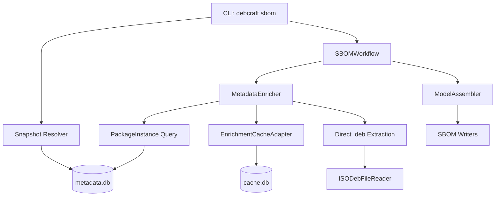
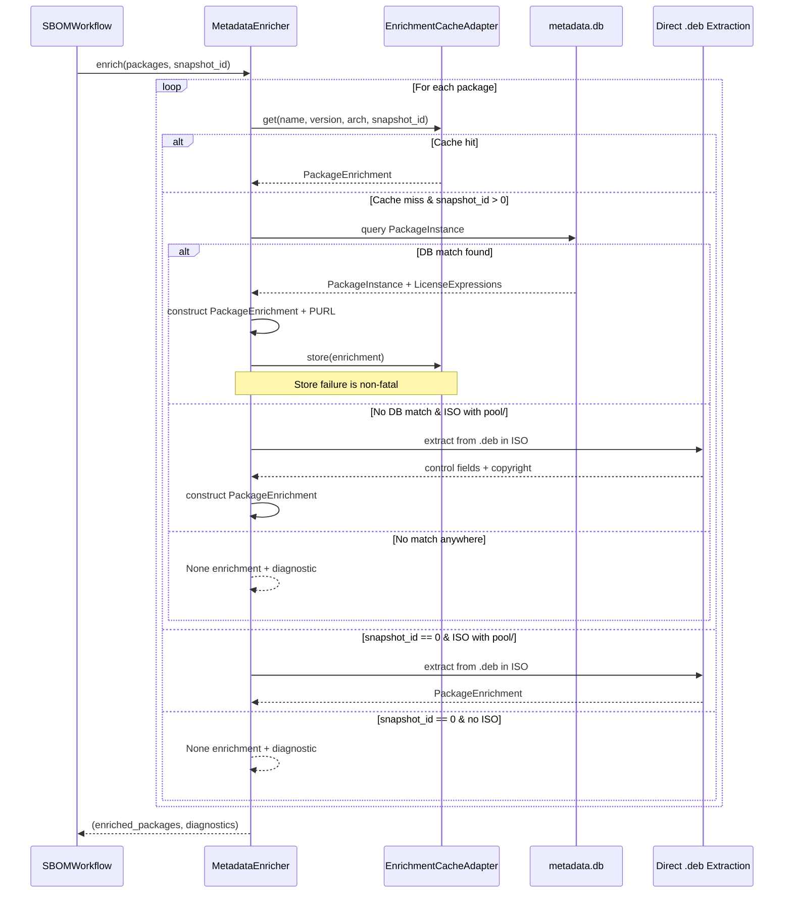
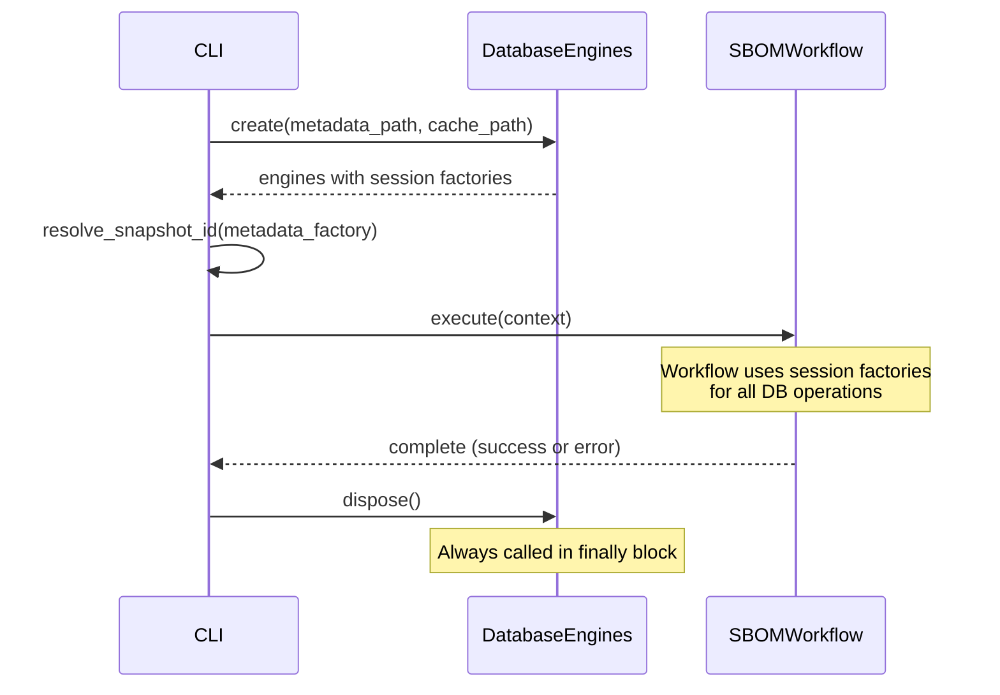

# Design Document: SBOM Enrichment Pipeline

## Overview

This design connects the `debcraft sbom` CLI command to the real enrichment infrastructure, replacing no-op stubs with production adapters. The key changes are:

1. **Snapshot ID resolution** — query metadata.db for the latest published `RepositorySnapshot` or accept a `--snapshot-id` CLI flag
2. **Real cache wiring** — replace `_NoOpCacheAdapter` with `EnrichmentCacheAdapter` backed by cache.db
3. **Metadata.db fallback** — extend `MetadataEnricher` to query `PackageInstance` on cache miss
4. **Direct .deb extraction** — add an `ISODebFileReader` adapter and fallback path for ISOs without a repository index
5. **Enrichment data flow** — ensure `ModelAssembler` maps `PackageEnrichment` fields (download_url, maintainer, purl) to `SBOMPackage`

The result is that SBOM documents contain real metadata (license expressions, PURLs, download URLs, supplier info) instead of "NOASSERTION" placeholders.

## Architecture



### Enrichment Fallback Chain



## Components and Interfaces

### 1. Snapshot Resolver

A new pure function in the CLI module that resolves the snapshot_id:

```python
async def resolve_snapshot_id(
    session_factory: async_sessionmaker[AsyncSession] | None,
    explicit_id: int | None,
) -> int:
    """Resolve the snapshot_id to use for enrichment.

    Args:
        session_factory: Async session factory for metadata.db, or None if unavailable.
        explicit_id: Explicit --snapshot-id value from CLI, or None.

    Returns:
        The resolved snapshot_id (0 means skip enrichment).
    """
```

Logic:
- If `explicit_id` is provided → return it directly (no existence check)
- If `session_factory` is None → return 0, log warning
- Query: `SELECT id FROM repository_snapshots WHERE published = TRUE ORDER BY id DESC LIMIT 1`
- If result → return `id`
- If no result → return 0, log warning

### 2. Database Engine Factory

A new helper in the CLI module that creates async engines for both databases:

```python
@dataclass
class DatabaseEngines:
    """Holds async SQLAlchemy engines for both databases."""

    metadata_engine: AsyncEngine | None
    cache_engine: AsyncEngine | None
    metadata_session_factory: async_sessionmaker[AsyncSession] | None
    cache_session_factory: async_sessionmaker[AsyncSession] | None

    async def dispose(self) -> None:
        """Dispose all engines."""
```

Path resolution:
- `metadata.db` → `resolve_xdg_path("database") / "metadata.db"`
- `cache.db` → `resolve_xdg_path("cache") / "cache.db"`

Schema initialization for cache.db uses `Base.metadata.create_all()` targeting only the `CachedEnrichment` table.

### 3. Extended MetadataEnricher

The existing `MetadataEnricher` class gains two new dependencies and a three-tier fallback:

```python
class MetadataEnricher:
    def __init__(
        self,
        cache_adapter: EnrichmentCacheAdapter,
        metadata_session_factory: async_sessionmaker[AsyncSession] | None = None,
        deb_extractor: DebExtractor | None = None,
    ) -> None:
```

New method for metadata.db fallback:

```python
async def _query_metadata_db(
    self,
    pkg: IdentifiedPackage,
    snapshot_id: int,
) -> PackageEnrichment | None:
    """Query PackageInstance table for enrichment data."""
```

Query logic:
```sql
SELECT pi.*, le.expression, le.source
FROM package_instances pi
LEFT JOIN license_expressions le ON le.package_id = pi.id
WHERE pi.package_name = :name
  AND pi.version = :version
  AND pi.architecture = :arch
  AND pi.snapshot_id = :snapshot_id
ORDER BY pi.id DESC
LIMIT 1
```

### 4. ISODebFileReader

A new adapter implementing the `DebFileReader` protocol that reads .deb archives from within an ISO:

```python
class ISODebFileReader:
    """Reads .deb archive members from files within an ISO filesystem.

    Implements the DebFileReader protocol using an ISOReader instance
    to read file bytes, then delegates ar parsing and decompression
    to the same logic as LocalDebFileReader.
    """

    def __init__(self, iso_reader: ISOReader) -> None:
        self._iso_reader = iso_reader

    def read_ar_member(self, deb_path: str, member_prefix: str) -> bytes:
        """Read an ar member from a .deb file within the ISO.

        Args:
            deb_path: Path within the ISO filesystem to the .deb file.
            member_prefix: Prefix of the ar member to extract.
        """

    def compute_sha256(self, file_path: str) -> str:
        """Compute SHA256 of a file within the ISO."""
```

The `deb_path` parameter is interpreted as a path within the ISO (e.g., `pool/main/l/libc6/libc6_2.40-1_amd64.deb`). The reader calls `self._iso_reader.read_file(deb_path)` to get the full .deb bytes, then performs ar parsing in memory.

### 5. DebExtractor

A new service that orchestrates direct .deb extraction from an ISO:

```python
class DebExtractor:
    """Extracts enrichment metadata directly from .deb files in an ISO."""

    def __init__(
        self,
        iso_reader: ISOReader,
        deb_parser: DebParser,
        dep5_parser: DEP5Parser,
        license_mapper: LicenseMapper,
    ) -> None:

    def extract_enrichment(
        self,
        pkg: IdentifiedPackage,
    ) -> PackageEnrichment | None:
        """Attempt to extract enrichment from a .deb in the ISO's pool/ directory."""
```

#### Pool Directory Discovery

The `.deb` file path is discovered by walking `pool/` in the ISO:
1. List `pool/` subdirectories (typically `main/`, `contrib/`, `non-free/`)
2. For each component, navigate to the package's letter directory:
   - Single-char packages → `pool/{component}/{first_letter}/{name}/`
   - `lib*` packages → `pool/{component}/{first_four_chars}/{name}/`
3. List .deb files in that directory
4. Match by `{name}_{version}_{arch}.deb` filename pattern

### 6. Updated _create_di_scope

The CLI's `_create_di_scope()` function is updated to:

1. Create `DatabaseEngines` with real async engines
2. Resolve snapshot_id via `resolve_snapshot_id()`
3. Create `EnrichmentCacheAdapter` with cache session factory (or fallback to `_NoOpCacheAdapter`)
4. Create `MetadataEnricher` with real cache adapter and metadata session factory
5. Register all in CLI scope
6. Return both the scope and engines (for cleanup)

### 7. Updated ModelAssembler._build_single_package

Extended to map additional enrichment fields:

```python
# New field mappings:
if enrichment.download_url is not None:
    download_location = enrichment.download_url

if enrichment.maintainer is not None:
    supplier = enrichment.maintainer
```

## Data Models

### Existing Models Used

| Model | Database | Role |
|-------|----------|------|
| `RepositorySnapshot` | metadata.db | Query `published=True, ORDER BY id DESC` for snapshot resolution |
| `PackageInstance` | metadata.db | Fallback enrichment source (name, version, arch, snapshot_id) |
| `LicenseExpression` | metadata.db | SPDX expressions linked to PackageInstance |
| `CachedEnrichment` | cache.db | Enrichment cache keyed by (name, version, arch, snapshot_id) |

### PackageEnrichment Field Mapping

| Source Field (PackageInstance) | Target Field (PackageEnrichment) |
|-------------------------------|----------------------------------|
| `source_package` | `source_package` |
| `maintainer` | `maintainer` |
| `homepage` | `homepage` |
| `depends` | `depends` |
| `section` | `section` |
| `priority` | `priority` |
| `description` | `description` |
| `sha256` | `sha256` |
| `download_url` | `download_url` |
| Generated via `generate_purl()` | `purl` |
| `LicenseExpression.expression, .source` | `license_expressions` |

### SBOMPackage Field Mapping

| Source Field (PackageEnrichment) | Target Field (SBOMPackage) |
|----------------------------------|---------------------------|
| `license_expressions[0][0]` | `concluded_license` |
| `license_expressions[0][0]` | `declared_license` |
| `download_url` | `download_location` |
| `maintainer` | `supplier` |
| `purl` | `package_url` |
| `purl` | `external_references[PACKAGE_MANAGER]` |
| `sha256` | `checksums[SHA256]` |

## Correctness Properties

*A property is a characteristic or behavior that should hold true across all valid executions of a system — essentially, a formal statement about what the system should do. Properties serve as the bridge between human-readable specifications and machine-verifiable correctness guarantees.*

### Property 1: Snapshot Resolution Returns Highest Published ID

*For any* non-empty list of `RepositorySnapshot` records where at least one has `published=True`, the `resolve_snapshot_id` function SHALL return the `id` of the published snapshot with the highest `id` value. For any list containing only unpublished snapshots (or an empty list), the function SHALL return 0.

**Validates: Requirements 1.1, 1.3**

### Property 2: Snapshot ID Input Validation

*For any* string input to the `--snapshot-id` CLI parameter, the parser SHALL accept the input if and only if it represents a positive integer in the range [1, 2,147,483,647]. All other inputs (negative integers, zero, floats, non-numeric strings, empty strings) SHALL be rejected with a non-zero exit code.

**Validates: Requirements 1.2, 1.5**

### Property 3: PackageInstance to PackageEnrichment Field Preservation

*For any* `PackageInstance` record with associated `LicenseExpression` records, the `MetadataEnricher`'s mapping function SHALL produce a `PackageEnrichment` where: every non-None field from the `PackageInstance` appears unchanged in the corresponding `PackageEnrichment` field, the `license_expressions` list contains all `(expression, source)` pairs from the associated `LicenseExpression` records, and the `purl` field equals `generate_purl(package_name, version, architecture)` (or None if generation fails).

**Validates: Requirements 3.1, 3.3, 4.1, 4.4**

### Property 4: ModelAssembler Enrichment-to-SBOMPackage Mapping

*For any* `EnrichedPackage` with a non-None `PackageEnrichment`, the `ModelAssembler._build_single_package` function SHALL produce an `SBOMPackage` where: `download_location` equals `enrichment.download_url` (if non-None), `supplier` equals `enrichment.maintainer` (if non-None), `package_url` equals `enrichment.purl` (if non-None), `concluded_license` and `declared_license` both equal `enrichment.license_expressions[0][0]` (if the list is non-empty), and all None enrichment fields result in None in the corresponding SBOMPackage fields.

**Validates: Requirements 7.1, 7.2, 7.3, 7.4, 7.5, 7.6**

### Property 5: ISODebFileReader Ar Member Extraction

*For any* valid ar archive stored within an ISO filesystem, the `ISODebFileReader.read_ar_member` function SHALL return identical decompressed bytes as `LocalDebFileReader.read_ar_member` would for the same archive content on the local filesystem. That is, reading a .deb file from an ISO produces the same parsed result as reading the same .deb from disk.

**Validates: Requirements 8.8**

### Property 6: Direct .deb Extraction Produces Valid Enrichment

*For any* valid .deb archive containing a control file with `Package`, `Version`, and `Architecture` fields, the `DebExtractor.extract_enrichment` function SHALL produce a `PackageEnrichment` where all control fields present in the .deb are mapped to the corresponding enrichment fields, and if a valid DEP5 copyright file is present, the `license_expressions` list is non-empty.

**Validates: Requirements 8.2, 8.3, 8.5**

## Error Handling

### Graceful Degradation Strategy

The design follows a "best-effort enrichment" principle. No database or extraction failure should prevent SBOM generation — the output degrades to "NOASSERTION" rather than failing entirely.

| Failure Scenario | Behavior | Log Level |
|-----------------|----------|-----------|
| metadata.db doesn't exist | snapshot_id = 0, skip enrichment | WARNING |
| metadata.db query fails | None enrichment for that package, continue | WARNING |
| cache.db doesn't exist | Create it with schema | INFO |
| cache.db connection fails | Fall back to _NoOpCacheAdapter | WARNING |
| Cache store fails after successful lookup | Return enrichment anyway | WARNING |
| .deb file not found in ISO pool/ | None enrichment + diagnostic | DEBUG |
| .deb parsing fails (corrupt archive) | None enrichment, continue | WARNING |
| DEP5 parsing fails | Empty license_expressions | DEBUG |
| PURL generation fails | purl = None | DEBUG |
| Engine disposal fails | Swallow exception, log | WARNING |

### Database Session Lifecycle



Sessions are created per-operation via session factories (not held open for the workflow duration). Each enrichment lookup opens and closes its own session, preventing connection starvation.

## Testing Strategy

### Property-Based Tests (Hypothesis)

Property-based testing is appropriate for this feature because:
- The enrichment mapping logic is pure (input → output with no side effects beyond caching)
- The input space is large (arbitrary package names, versions, architectures, field values)
- Universal properties exist (field preservation, correct snapshot selection)

**Configuration:**
- Library: [Hypothesis](https://hypothesis.readthedocs.io/)
- Minimum iterations: 100 per property
- Tag format: `Feature: sbom-enrichment-pipeline, Property {N}: {title}`

Each correctness property maps to a single property-based test:
1. **Snapshot resolution** — generates random lists of snapshots with varying published states
2. **Input validation** — generates random strings and integers for snapshot_id parsing
3. **PackageInstance mapping** — generates random PackageInstance-like data with license expressions
4. **ModelAssembler mapping** — generates random EnrichedPackage values with varying enrichment
5. **ISODebFileReader** — generates random valid ar archives, stores in mock ISO reader
6. **DebExtractor pipeline** — generates random valid .deb control + copyright content

### Unit Tests (pytest)

Focused on specific examples and edge cases:
- Snapshot resolution with empty DB, only unpublished snapshots
- Cache.db creation when file doesn't exist
- Fallback to `_NoOpCacheAdapter` on permission error
- Multiple PackageInstance matches → highest ID wins
- Cache store failure doesn't affect return value
- DEP5 vs free-form copyright handling
- Pool directory path construction (`lib*` prefix vs single char)
- `--snapshot-id` with invalid values (0, -1, "abc", overflow)

### Integration Tests

- End-to-end: CLI invocation → real cache.db + metadata.db → enriched SBOM output
- ISO scanning with pool/ structure → .deb extraction → enriched packages
- Database engine lifecycle: create → use → dispose (verify no leaked handles)
