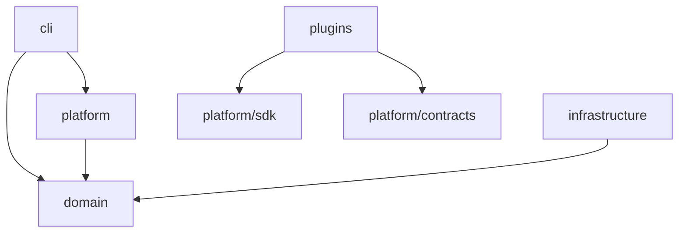

# Architecture

DebCraft follows a layered architecture with strict dependency rules enforced by automated tests.

## Layers

### Layer Responsibilities

| Layer | Responsibility | May Depend On |
|-------|---------------|---------------|
| `cli` | User interaction, command parsing, output formatting | platform, domain |
| `domain` | Core business logic, value objects, domain services | nothing (independent) |
| `platform` | Platform services, contracts, SDK | domain |
| `infrastructure` | External systems, storage, network | domain |
| `plugins` | Extensible functionality via SDK | platform/sdk, platform/contracts |

## Dependency Rules

These rules are enforced by `import-linter` contracts and architecture tests:

1. **Domain independence** — `domain` never imports from `infrastructure`
2. **Contracts purity** — `platform.contracts` has no implementation dependencies
3. **Plugin isolation** — Plugins cannot cross-import other plugins
4. **No mutable globals** — Module-level mutable state (`list`, `dict`, `set`) is prohibited without `Final`

## Platform Internals

The `platform` package is subdivided into:

- **`contracts/`** — Abstract interfaces and protocol definitions
- **`kernel/`** — Core platform services (registry, lifecycle, configuration)
- **`sdk/`** — Public API for plugin developers

## Technology Stack

| Concern | Tool |
|---------|------|
| Package management | uv |
| CLI framework | Typer + Rich |
| Type checking | BasedPyright |
| Linting/formatting | Ruff |
| Testing | pytest |
| Documentation | MkDocs + Material |
| ORM | SQLAlchemy |
| HTTP | aiohttp |
