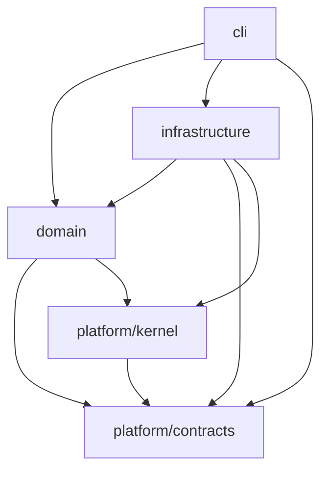

# Architecture

DebCraft follows a layered architecture. A few dependency rules are machine-enforced by `import-linter`
contracts and architecture tests; everything else is convention that nothing checks. Each rule below says
which it is, so treat only the enforced ones as guarantees.

## Layers


```mermaid
graph TD
    CLI[cli] --> DOMAIN[domain]
    CLI --> INFRA[infrastructure]
    CLI --> CONTRACTS[platform/contracts]
    INFRA --> DOMAIN
    INFRA --> CONTRACTS
    INFRA --> KERNEL[platform/kernel]
    DOMAIN --> CONTRACTS
    DOMAIN --> KERNEL
    KERNEL --> CONTRACTS
```

### Layer Responsibilities

The last column is the dependency graph as it exists in `src/debcraft/` today, not an aspiration.
`platform` is split because the rules differ between its subpackages: `platform.contracts` is
import-pure, `platform.kernel` is not.

| Layer | Responsibility | Imports today |
|-------|---------------|---------------|
| `cli` | User interaction, command parsing, output formatting | `domain`, `infrastructure`, `platform.contracts` |
| `domain` | Core business logic, value objects, ports, domain services | `platform.contracts`, `platform.kernel.errors` — never `infrastructure` |
| `platform.contracts` | Abstract interfaces and plain value types | nothing outside `platform.contracts` |
| `platform.kernel` | DI container, workflow engine, lifecycle, config, `PlatformError` | `platform.contracts` |
| `platform.sdk` | Intended public API for plugin authors — a stub today | nothing |
| `infrastructure` | Adapters for external systems: storage, network, database, format writers | `domain`, `platform.contracts`, `platform.kernel` |
| `plugins` | Reserved for extensions — empty today | nothing |

Two consequences worth spelling out, because they are easy to get wrong:

- `domain` is independent of `infrastructure`, **not** of `platform`. Every domain `errors.py` subclasses
  `PlatformError` from `platform/kernel/errors.py`, and domain modules import `platform.contracts.events`
  and `platform.contracts.workflow` (the latter only under `if TYPE_CHECKING:`).
- `cli` imports `infrastructure` directly — `cli/sbom.py`, `cli/index.py`, `cli/mirror.py` and
  `cli/_sbom_db.py` all wire up concrete adapters themselves. There is no intervening service layer.

## Dependency Rules

| Rule | Enforcement |
|------|-------------|
| **Domain independence** — `debcraft.domain` must not import `debcraft.infrastructure` | `import-linter` contract `Domain independence`, plus `test_architecture.py::test_domain_does_not_import_infrastructure` |
| **Contracts purity** — `debcraft.platform.contracts` must not import `infrastructure`, `plugins` or `platform.kernel` | `import-linter` contract `Contracts purity`, plus `test_contracts_have_no_implementation_dependencies` and `TestContractPurity` |
| **Plugin isolation** — plugins must not cross-import sibling plugins | `import-linter` contract `Plugin isolation`, plus `test_plugins_do_not_cross_import`. Vacuous today: `plugins` is empty |
| **No mutable globals** — module-level `list`/`dict`/`set` or mutable calls in `domain`, `platform`, `infrastructure`, `plugins` unless `Final`-annotated, ALL_CAPS or `__all__` | Architecture tests only, no `import-linter` contract |
| **ABC implementation mapping** — every ABC in `platform/contracts` has a concrete subclass in `platform/kernel` or `infrastructure` (`Workflow` exempt) | Architecture tests only, no `import-linter` contract |

Not enforced, and so not something to rely on: that `platform` stays free of `domain` imports (true today,
nothing checks it), that `cli` avoids `infrastructure` (it does not), and any restriction on `domain`
importing `platform`.

Check both mechanisms yourself:

```bash
uv run lint-imports            # 3 contracts, all kept
uv run pytest -m architecture  # 17 tests
```

## Platform Internals

The `platform` package is subdivided into:

- **`contracts/`** — Abstract base classes and plain value/enum types. Domain ports live in
  `domain/*/ports.py` as `Protocol`s instead
- **`kernel/`** — Core platform services (DI container, workflow engine, lifecycle, configuration, errors)
- **`sdk/`** — Intended public API for plugin developers; currently a docstring-only stub

## Technology Stack

| Concern | Tool |
|---------|------|
| Package management | uv |
| CLI framework | Typer + Rich |
| Type checking | BasedPyright + mypy |
| Linting/formatting | Ruff |
| Testing | pytest |
| Documentation | MkDocs + Material |
| ORM | SQLAlchemy |
| HTTP | aiohttp |
