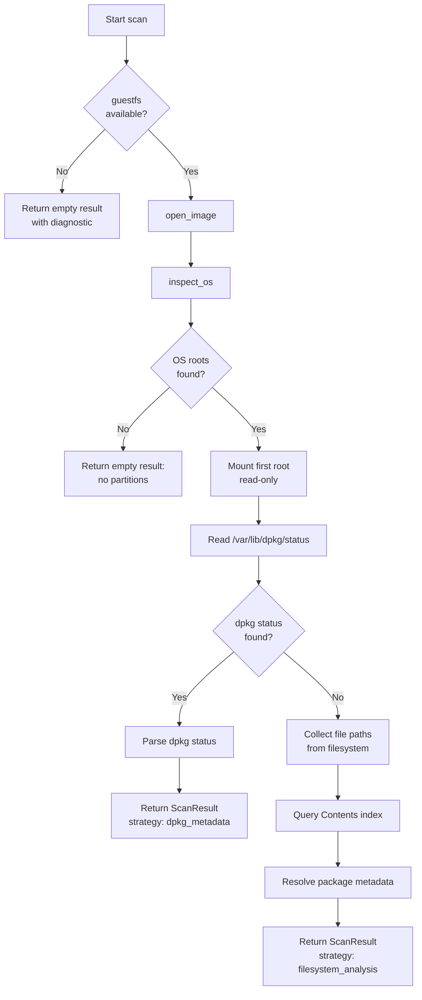

# Disk Image Scanner (IMG / QCOW2)

## Introduction

The `IMGScanner` and `QCOW2Scanner` identify Debian packages installed within raw
disk images and QCOW2 virtual disk images respectively. Both scanners use the
`GuestfsInspector` protocol to inspect partitions, mount filesystems read-only, and
extract the dpkg status file — all without root privileges or actual mount
operations.

Use the IMG scanner when you need to inventory a raw ext4/ext3 disk image (e.g.,
embedded Linux build output, Raspberry Pi images). Use the QCOW2 scanner for
virtual machine disk images in QCOW2 format (e.g., libvirt/QEMU VMs). Both scanners
share the same two-stage fallback strategy: dpkg metadata extraction first,
filesystem analysis second.

The scanners live in:

- `src/debcraft/infrastructure/scanners/img.py` — `IMGScanner`
- `src/debcraft/infrastructure/scanners/qcow2.py` — `QCOW2Scanner`

Both implement the same `scan()` interface as other debcraft scanners.

## Prerequisites

Before running the code example on this page you need two things:

1. **Generate the test fixture disk images:**

    ```bash
    fixtures/build-img.sh
    fixtures/build-qcow2.sh
    ```

    The first script produces `fixtures/images/test.img` — a 4 MB raw ext4 image
    containing a single synthetic package entry (`base-files 13.5 amd64`). It
    requires `dd`, `mkfs.ext4`, and `debugfs` (install with
    `apt install e2fsprogs`).

    The second script produces `fixtures/images/test.qcow2` — a QCOW2 image
    converted from `test.img`. It requires `qemu-img` (install with
    `apt install qemu-utils`). If `test.img` does not exist, the script invokes
    `build-img.sh` automatically.

2. **Install debugfs** (used by the example's stub `GuestfsInspector` to read the
   ext4 image without mounting):

    ```bash
    apt install e2fsprogs
    ```

    The code example uses `debugfs` to simulate what libguestfs would do — reading
    files directly from the ext4 filesystem without mounting.

## How It Works

Both scanners use a two-stage fallback strategy to locate package metadata inside
a disk image. They try each stage in order and stop at the first one that succeeds.

### IMGScanner

The `IMGScanner` handles raw disk images (no container format). Its constructor
accepts three dependencies:

```python
class IMGScanner:
    def __init__(
        self,
        guestfs_inspector: GuestfsInspector | None,
        contents_port: ContentsIndexPort,
        package_port: PackageLookupPort,
    ) -> None:
```

- **`guestfs_inspector`** — Abstraction over libguestfs for disk inspection. If
  `None`, the scanner returns immediately with a diagnostic explaining that guestfs
  is unavailable.
- **`contents_port`** — Port for Contents index lookups (used in the filesystem
  analysis fallback).
- **`package_port`** — Port for package metadata lookups (used in the filesystem
  analysis fallback).

### QCOW2Scanner

The `QCOW2Scanner` handles QCOW2 virtual disk images. It has the same constructor
signature as `IMGScanner`:

```python
class QCOW2Scanner:
    def __init__(
        self,
        guestfs_inspector: GuestfsInspector | None,
        contents_port: ContentsIndexPort,
        package_port: PackageLookupPort,
    ) -> None:
```

The QCOW2 scanner adds one extra pre-check before opening the image: it validates
the QCOW2 magic bytes (`QFI\xfb`) at offset 0 of the file. If the magic bytes are
missing, the scanner returns immediately with a diagnostic identifying the invalid
format.

### GuestfsInspector Protocol

Both scanners depend on the `GuestfsInspector` protocol defined in
`debcraft.domain.scanner.ports`:

```python
class GuestfsInspector(Protocol):
    def open_image(self, path: str, readonly: bool = True) -> None: ...
    def inspect_os(self) -> list[str]: ...
    def mount_readonly(self, device: str, mountpoint: str) -> None: ...
    def read_file(self, path: str) -> bytes: ...
    def ls(self, directory: str) -> list[str]: ...
    def close(self) -> None: ...
```

This protocol abstracts away the libguestfs C library, making the scanners testable
with any implementation that satisfies the interface.

### Stage 1 — Partition Inspection and dpkg Status Extraction

1. Open the disk image via `open_image(path, readonly=True)`
2. Call `inspect_os()` to enumerate OS root filesystem device paths
3. For each root device (in table order):
   - Mount read-only at `/`
   - Attempt to read `/var/lib/dpkg/status`
   - If found: parse the dpkg status file and return the result
4. Use the first partition where dpkg status is found

### Stage 2 — Filesystem Analysis Fallback

When no dpkg metadata is found on any partition:

1. List all files from the mounted filesystem using `ls()`
2. Query the `ContentsIndexPort` to map file paths to package names
3. Resolve each package's metadata through the `PackageLookupPort`
4. Return a `ScanResult` with `strategy="filesystem_analysis"`

This fallback infers packages from file paths rather than authoritative dpkg
metadata, so results may be less precise.

### Fallback Flow



The scanner checks for cancellation between each major step, so long-running scans
can be interrupted cleanly.

## Code Example

The following self-contained script scans the test fixture IMG using the
`IMGScanner` with a stub `GuestfsInspector` that reads the ext4 filesystem via
`debugfs` (no libguestfs required). It prints each identified package.

```python
"""Self-contained example: scan the test fixture IMG with IMGScanner."""

from __future__ import annotations

import asyncio
import os
import subprocess
import sys

from debcraft.domain.scanner.ports import GuestfsInspector  # noqa: F401
from debcraft.domain.scanner.values import Artifact, ArtifactType
from debcraft.infrastructure.scanners.img import IMGScanner
from debcraft.platform.contracts.workflow import (
    CancellationToken,
    ProgressReporter,
    WorkflowContext,
)

# ---------------------------------------------------------------------------
# Step 1: File-existence check
# ---------------------------------------------------------------------------

IMG_PATH = "fixtures/images/test.img"

if not os.path.isfile(IMG_PATH):
    print(
        f"Error: '{IMG_PATH}' not found.\nRun fixtures/build-img.sh to generate the fixture image.",
        file=sys.stderr,
    )
    sys.exit(1)

# ---------------------------------------------------------------------------
# Step 2: Implement a stub GuestfsInspector using debugfs
# ---------------------------------------------------------------------------


class DebugfsGuestfsInspector:
    """GuestfsInspector stub backed by debugfs (e2fsprogs).

    Reads files from an ext4 image without mounting, simulating what
    libguestfs would do. Only supports the operations needed for the
    dpkg status extraction path.
    """

    def __init__(self) -> None:
        self._image_path: str | None = None

    def open_image(self, path: str, readonly: bool = True) -> None:
        """Open a disk image for inspection."""
        if not os.path.isfile(path):
            raise FileNotFoundError(f"Image not found: {path}")
        self._image_path = path

    def inspect_os(self) -> list[str]:
        """Return a synthetic root device path.

        In a real guestfs implementation this would inspect the partition
        table. For our ext4 fixture (no partition table, bare filesystem)
        we return a single synthetic device.
        """
        return ["/dev/sda"]

    def mount_readonly(self, device: str, mountpoint: str) -> None:
        """No-op mount — debugfs reads directly from the image file."""
        pass

    def read_file(self, path: str) -> bytes:
        """Read a file from the ext4 image using debugfs.

        Uses 'debugfs -R "cat <path>" <image>' to extract file contents
        without mounting.
        """
        if self._image_path is None:
            raise RuntimeError("Image not opened")
        result = subprocess.run(
            ["debugfs", "-R", f"cat {path}", self._image_path],
            capture_output=True,
        )
        if result.returncode != 0 or not result.stdout:
            raise FileNotFoundError(f"{path} not found in image")
        return result.stdout

    def ls(self, directory: str) -> list[str]:
        """List directory contents from the ext4 image using debugfs."""
        if self._image_path is None:
            raise RuntimeError("Image not opened")
        result = subprocess.run(
            ["debugfs", "-R", f"ls {directory}", self._image_path],
            capture_output=True,
            text=True,
        )
        if result.returncode != 0:
            raise FileNotFoundError(f"{directory} not found in image")
        entries = []
        for line in result.stdout.strip().split("\n"):
            # debugfs ls output has inode numbers followed by names
            parts = line.split()
            if parts:
                name = parts[-1]
                if name not in (".", ".."):
                    entries.append(name)
        return entries

    def close(self) -> None:
        """Release resources."""
        self._image_path = None


# ---------------------------------------------------------------------------
# Step 3: Implement stub ContentsIndexPort and PackageLookupPort
# ---------------------------------------------------------------------------


class StubContentsIndex:
    """Stub ContentsIndexPort — returns empty mapping (never reached here)."""

    async def find_owners(self, file_paths: list[str], snapshot_id: int) -> dict[str, str]:
        return {}


class StubPackageLookup:
    """Stub PackageLookupPort — returns None (never reached here)."""

    async def find_by_name(self, package_name: str, snapshot_id: int) -> tuple[str, str, str] | None:
        return None


# ---------------------------------------------------------------------------
# Step 4: Build a minimal WorkflowContext stub
# ---------------------------------------------------------------------------


class NoOpProgress(ProgressReporter):
    """No-op progress reporter — prints nothing."""

    def report(self, percentage: float, message: str = "") -> None:
        pass


class _Stub:
    """Generic stub satisfying any attribute access (scope, resources, etc.)."""

    def __getattr__(self, name: str) -> "_Stub":
        return self


def build_context() -> WorkflowContext:
    """Construct a WorkflowContext with no-op/stub services."""
    stub = _Stub()
    return WorkflowContext(
        scope=stub,  # type: ignore[arg-type]
        cancellation_token=CancellationToken(),
        progress_reporter=NoOpProgress(),
        resource_manager=stub,  # type: ignore[arg-type]
        logger=stub,  # type: ignore[arg-type]
        event_bus=stub,  # type: ignore[arg-type]
    )


# ---------------------------------------------------------------------------
# Step 5: Construct Artifact and invoke the scanner
# ---------------------------------------------------------------------------


async def main() -> None:
    # Instantiate all dependencies
    guestfs = DebugfsGuestfsInspector()
    contents_port = StubContentsIndex()
    package_port = StubPackageLookup()

    # Build the scanner with its dependency ports
    scanner = IMGScanner(guestfs, contents_port, package_port)

    # Construct the artifact pointing at our fixture IMG
    artifact = Artifact(type=ArtifactType.IMG, path=IMG_PATH)

    # Create a minimal workflow context (no-op progress, uncancelled token)
    context = build_context()

    # Run the scan — this reads the ext4 image and parses var/lib/dpkg/status
    result = await scanner.scan(artifact, context)

    # Print each identified package
    for pkg in result.packages:
        print(f"{pkg.name} {pkg.version} {pkg.architecture}")


# Entry point — run the async scan with asyncio
if __name__ == "__main__":
    asyncio.run(main())
```

## Running the Example

1. **Generate the fixture disk images** (requires `e2fsprogs` and optionally
   `qemu-utils`):

    ```bash
    fixtures/build-img.sh
    fixtures/build-qcow2.sh
    ```

2. **Run the code example** — save the code from the Code Example section above to
   a file and execute it:

    ```bash
    python docs/developer/disk_image_scanner_example.py
    ```

    Or run it inline from the project root:

    ```bash
    python -c "
    import sys; sys.path.insert(0, 'src')
    exec(open('docs/developer/disk_image_scanner_example.py').read())
    "
    ```

    Expected output:

    ```
    base-files 13.5 amd64
    ```

## Extending

The code example uses stubs for several components. Here is how to replace them
with real implementations.

### Real GuestfsInspector

The stub uses `debugfs` to read from the ext4 image. For production use, implement
`GuestfsInspector` using the `guestfs` Python bindings:

```python
import guestfs


class LibguestfsInspector:
    def __init__(self) -> None:
        self._g: guestfs.GuestFS | None = None

    def open_image(self, path: str, readonly: bool = True) -> None:
        self._g = guestfs.GuestFS(python_return_dict=True)
        self._g.add_drive_opts(path, readonly=readonly)
        self._g.launch()

    def inspect_os(self) -> list[str]:
        return self._g.inspect_os()

    def mount_readonly(self, device: str, mountpoint: str) -> None:
        self._g.mount_ro(device, mountpoint)

    def read_file(self, path: str) -> bytes:
        return self._g.read_file(path)

    def ls(self, directory: str) -> list[str]:
        return self._g.ls(directory)

    def close(self) -> None:
        if self._g is not None:
            self._g.close()
            self._g = None
```

Install the bindings with `apt install python3-guestfs` (system package) or ensure
the `guestfs` module is importable in your Python environment.

### Real ContentsIndexPort

The `ContentsIndexPort.find_owners()` method maps file paths to package names. A
real implementation could:

- Query a local SQLite database populated from Debian/Ubuntu `Contents-<arch>.gz`
  index files.
- Call a REST API that serves Contents data (e.g., the
  [Debian Sources API](https://sources.debian.org/doc/api/) or a custom service).

The method receives a list of file paths and a `snapshot_id` and returns a dict of
`{path: package_name}` for any paths that matched.

### Real PackageLookupPort

The `PackageLookupPort.find_by_name()` method resolves a package name to its
version, architecture, and status. A real implementation could:

- Query the same database or API used by `ContentsIndexPort`.
- Parse a local `Packages.gz` index file for the target distribution.

The method returns a `(version, architecture, status)` tuple or `None` if the
package is not found.

### Scanning QCOW2 Images

The `QCOW2Scanner` has the same constructor interface and fallback logic as
`IMGScanner`. To scan a QCOW2 image, substitute `ArtifactType.QCOW2` and point at
a `.qcow2` file:

```python
from debcraft.domain.scanner.values import Artifact, ArtifactType
from debcraft.infrastructure.scanners.qcow2 import QCOW2Scanner

scanner = QCOW2Scanner(guestfs, contents_port, package_port)
artifact = Artifact(type=ArtifactType.QCOW2, path="fixtures/images/test.qcow2")
result = await scanner.scan(artifact, context)
```

Note that `QCOW2Scanner` validates the QCOW2 magic bytes (`QFI\xfb`) before
proceeding, so it rejects non-QCOW2 files early. For the code example, using
`debugfs` as the `GuestfsInspector` stub only works with raw ext4 images — a real
libguestfs implementation is needed for QCOW2 images since `qemu-img` handles the
QCOW2 container format transparently.

### General Tips

- Start with the IMG scanner and the dpkg status path (stage 1) for testing — it
  requires only a `GuestfsInspector` and no Contents infrastructure.
- Add the filesystem analysis fallback incrementally: implement `ContentsIndexPort`
  and `PackageLookupPort` after the primary path works.
- The scanner checks for cancellation between steps via `WorkflowContext`, so
  long-running port queries won't block shutdown.
- Both scanners accept `guestfs_inspector=None` gracefully, returning an empty
  result with a diagnostic. This makes them safe to instantiate in environments
  where libguestfs is not installed.
