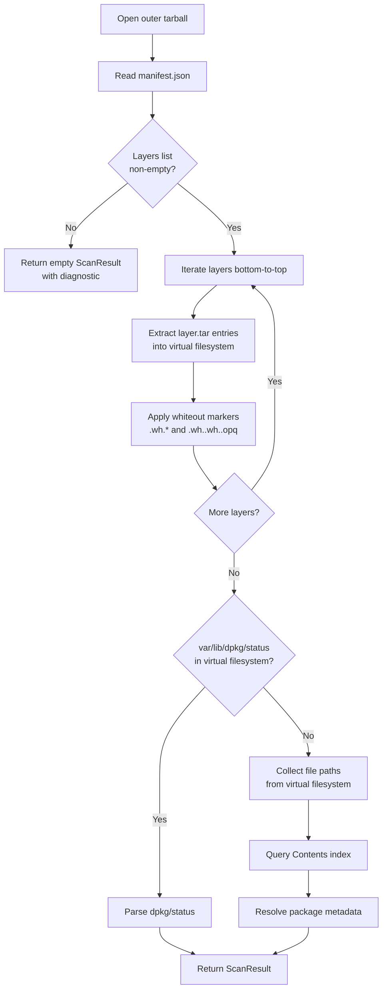

# Docker Scanner

## Introduction

The `DockerScanner` identifies Debian packages installed within Docker image
tarballs — the kind produced by `docker save`. It reads the tarball directly (no
Docker daemon, no root privileges) and returns a structured list of packages with
their names, versions, and architectures.

Use the Docker scanner when you need to inventory a container image exported as a
tarball. The scanner handles the Docker image format automatically: it parses the
manifest, merges layers bottom-to-top with whiteout semantics, and locates the dpkg
status file in the resulting virtual filesystem. When no dpkg metadata is found, it
falls back to filesystem analysis via the Contents index.

The scanner lives in
`src/debcraft/infrastructure/scanners/docker.py`
and implements the same `scan()` interface as other debcraft scanners.

## Prerequisites

Before running the code example on this page you need one thing:

1. **Generate the test fixture tarball:**

    ```bash
    fixtures/build-docker.sh
    ```

    This produces `fixtures/images/test.tar` — a minimal Docker-format tarball
    containing two layers and a synthetic package entry (`base-files 13.5 amd64`).
    The script requires only `tar` (coreutils) — no Docker installation needed.

No external Python dependencies beyond the standard library are required to run
the code sample.

## How It Works

The scanner uses a three-stage process to extract package metadata from a Docker
image tarball.

### Stage 1 — Manifest parsing

The scanner opens the outer tarball and reads `manifest.json` from the root. This
file is a JSON array where each entry describes an image. The scanner uses the first
entry and extracts its `Layers` list — an ordered array of paths to layer tarballs
within the outer tar (e.g., `a1b2c3.../layer.tar`).

### Stage 2 — Layer extraction with whiteout

Layers are iterated bottom-to-top (in manifest order). For each layer:

1. The layer tarball is opened from within the outer tar
2. All regular file entries are merged into a virtual filesystem dictionary
   (keyed by normalized path, valued by file content bytes)
3. Whiteout markers are applied after merging:
   - **`.wh.<filename>`** — removes the named file from the virtual filesystem
     (undoes a file added by a lower layer)
   - **`.wh..wh..opq`** — removes all files in the containing directory that came
     from lower layers, while preserving files added in the same layer

This merge-then-whiteout approach mirrors how Docker's overlay filesystem works at
runtime.

### Stage 3 — dpkg metadata parsing

After all layers are merged, the scanner checks for `var/lib/dpkg/status` in the
virtual filesystem. If found, its contents are parsed using the standard dpkg status
format parser, which extracts package name, version, architecture, and installation
status from each stanza.

### Fallback — Filesystem analysis

When no `var/lib/dpkg/status` exists in the merged filesystem (e.g., Alpine-based
images), the scanner falls back to filesystem analysis. It collects all file paths
from the virtual filesystem, queries a Contents index to map paths to package names,
and resolves each package's metadata through a package lookup port.

### Scanning flow



The scanner checks for cancellation between each layer extraction step, so
long-running scans can be interrupted cleanly.

## Code Example

The following self-contained script scans the test fixture tarball and prints each
identified package. It implements minimal protocol-compliant stubs so you can run
it without any infrastructure beyond the Python standard library.

```python
"""Self-contained example: scan the test fixture tarball with DockerScanner."""

from __future__ import annotations

import asyncio
import os
import sys

from debcraft.domain.scanner.values import Artifact, ArtifactType
from debcraft.infrastructure.scanners.docker import DockerScanner
from debcraft.platform.contracts.workflow import (
    CancellationToken,
    ProgressReporter,
    WorkflowContext,
)

# ---------------------------------------------------------------------------
# Step 1: File-existence check
# ---------------------------------------------------------------------------

DOCKER_TAR_PATH = "fixtures/images/test.tar"

if not os.path.isfile(DOCKER_TAR_PATH):
    print(
        f"Error: '{DOCKER_TAR_PATH}' not found.\nRun fixtures/build-docker.sh to generate the fixture tarball.",
        file=sys.stderr,
    )
    sys.exit(1)

# ---------------------------------------------------------------------------
# Step 2: Implement stub ContentsIndexPort and PackageLookupPort
# ---------------------------------------------------------------------------


class StubContentsIndex:
    """Stub ContentsIndexPort — returns empty mapping (never reached here)."""

    async def find_owners(self, file_paths: list[str], snapshot_id: int) -> dict[str, str]:
        return {}


class StubPackageLookup:
    """Stub PackageLookupPort — returns None (never reached here)."""

    async def find_by_name(self, package_name: str, snapshot_id: int) -> tuple[str, str, str] | None:
        return None


# ---------------------------------------------------------------------------
# Step 3: Build a minimal WorkflowContext stub
# ---------------------------------------------------------------------------


class NoOpProgress(ProgressReporter):
    """No-op progress reporter — prints nothing."""

    def report(self, percentage: float, message: str = "") -> None:
        pass


class _Stub:
    """Generic stub satisfying any attribute access (scope, resources, etc.)."""

    def __getattr__(self, name: str) -> "_Stub":
        return self


def build_context() -> WorkflowContext:
    """Construct a WorkflowContext with no-op/stub services."""
    stub = _Stub()
    return WorkflowContext(
        scope=stub,  # type: ignore[arg-type]
        cancellation_token=CancellationToken(),
        progress_reporter=NoOpProgress(),
        resource_manager=stub,  # type: ignore[arg-type]
        logger=stub,  # type: ignore[arg-type]
        event_bus=stub,  # type: ignore[arg-type]
    )


# ---------------------------------------------------------------------------
# Step 4: Construct Artifact and invoke the scanner
# ---------------------------------------------------------------------------


async def main() -> None:
    # Instantiate the port stubs
    contents_port = StubContentsIndex()
    package_port = StubPackageLookup()

    # Build the scanner with its dependency ports
    scanner = DockerScanner(contents_port, package_port)

    # Construct the artifact pointing at our fixture tarball
    artifact = Artifact(type=ArtifactType.DOCKER, path=DOCKER_TAR_PATH)

    # Create a minimal workflow context (no-op progress, uncancelled token)
    context = build_context()

    # Run the scan — this reads manifest.json, merges layers, parses dpkg/status
    result = await scanner.scan(artifact, context)

    # Print each identified package
    for pkg in result.packages:
        print(f"{pkg.name} {pkg.version} {pkg.architecture}")


# Entry point — run the async scan with asyncio
if __name__ == "__main__":
    asyncio.run(main())
```

## Running the Example

1. **Generate the fixture tarball** (requires only `tar`):

    ```bash
    fixtures/build-docker.sh
    ```

2. **Run the code example** — save the code from the Code Example section above to
   a file and execute it:

    ```bash
    python docs/developer/docker_scanner_example.py
    ```

    Or run it inline from the project root:

    ```bash
    python -c "
    import sys; sys.path.insert(0, 'src')
    exec(open('docs/developer/docker_scanner_example.py').read())
    "
    ```

    Expected output:

    ```
    base-files 13.5 amd64
    ```

## Extending

The code example uses stubs for the two dependency ports. Here is how to replace
them with real implementations.

### Real ContentsIndexPort

The `ContentsIndexPort.find_owners()` method maps file paths to package names. A
real implementation could:

- Query a local SQLite database populated from Debian/Ubuntu `Contents-<arch>.gz`
  index files.
- Call a REST API that serves Contents data (e.g., the
  [Debian Sources API](https://sources.debian.org/doc/api/) or a custom service).

The method receives a list of file paths and a `snapshot_id` and returns a dict of
`{path: package_name}` for any paths that matched. This port is only exercised
when no `var/lib/dpkg/status` is found in the merged filesystem.

### Real PackageLookupPort

The `PackageLookupPort.find_by_name()` method resolves a package name to its
version, architecture, and status. A real implementation could:

- Query the same database or API used by `ContentsIndexPort`.
- Parse a local `Packages.gz` index file for the target distribution.

The method returns a `(version, architecture, status)` tuple or `None` if the
package is not found. Like `ContentsIndexPort`, this port is only used in the
filesystem analysis fallback path.

### Whiteout edge cases

When extending the scanner to handle more complex images:

- Images with many layers may have cascading whiteouts — each layer can remove
  files added by any earlier layer.
- Opaque whiteouts (`.wh..wh..opq`) are directory-level resets commonly used
  when a layer replaces an entire directory tree (e.g., reinstalling a package).
- The scanner correctly preserves files added in the same layer as an opaque
  whiteout marker.

### General Tips

- Start with the dpkg metadata path for testing — it requires only a tarball
  with `var/lib/dpkg/status` in one of the layers and no Contents infrastructure.
- The fixture at `fixtures/images/test.tar` exercises this primary path.
- Add filesystem analysis incrementally: implement the Contents and Package ports
  only when you need to scan images without dpkg metadata.
- The scanner checks for cancellation between layers via `WorkflowContext`, so
  long-running port queries won't block shutdown.
