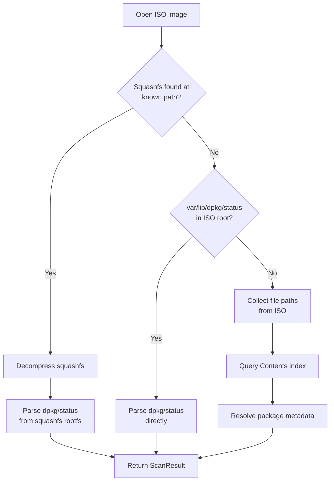

# ISO Scanner

## Introduction

The `ISOScanner` identifies Debian packages installed within ISO 9660 images — the
kind of images used by Debian/Ubuntu installers and live media. It reads the ISO
filesystem directly (no mount operations, no root privileges) and returns a
structured list of packages with their names, versions, and architectures.

Use the ISO scanner when you need to inventory an installer disc, a live image, or
any ISO that embeds a Debian rootfs or squashfs filesystem. The scanner handles
multiple ISO layouts automatically through a fallback chain of detection strategies.

The scanner lives in
`src/debcraft/infrastructure/scanners/iso.py`
and implements the same `scan()` interface as other debcraft scanners.

## Prerequisites

Before running the code example on this page you need two things:

1. **Generate the test fixture ISO:**

    ```bash
    fixtures/build-iso.sh
    ```

    This produces `fixtures/images/test.iso` — a minimal ISO containing a single
    synthetic package entry (`base-files 13.5 amd64`). The script requires
    `genisoimage` (install with `apt install genisoimage` on Debian/Ubuntu).

2. **Install pycdlib** (used by the example's `ISOReader` implementation):

    ```bash
    pip install pycdlib
    ```

## How It Works

The scanner uses a three-stage fallback strategy to locate package metadata inside
an ISO image. It tries each strategy in order and stops at the first one that
succeeds.

### Strategy 1 — Squashfs search

Many live distributions store their root filesystem inside a squashfs image. The
scanner searches for a squashfs file at three well-known paths:

- `live/filesystem.squashfs` (Debian Live)
- `casper/filesystem.squashfs` (Ubuntu Live)
- `install/filesystem.squashfs` (some installer media)

If found, the squashfs is decompressed in memory and the embedded
`var/lib/dpkg/status` is parsed for package entries.

### Strategy 2 — Direct rootfs

Some ISOs contain the rootfs directory structure directly at the top level without a
squashfs wrapper. The scanner checks for `var/lib/dpkg/status` in the ISO root. If
present, it is parsed immediately.

The test fixture at `fixtures/images/test.iso` exercises this strategy — it contains
a bare `var/lib/dpkg/status` at the ISO root level.

### Strategy 3 — Filesystem analysis via Contents index

When neither a squashfs nor a direct dpkg status file exists, the scanner falls back
to filesystem analysis. It collects all file paths from the ISO, queries a Contents
index to map paths to package names, and resolves each package's metadata through a
package lookup port.

### Fallback flow



The scanner checks for cancellation between each major step, so long-running scans
can be interrupted cleanly.

## Code Example

The following self-contained script scans the test fixture ISO and prints each
identified package. It implements minimal protocol-compliant stubs so you can run
it without any infrastructure beyond `pycdlib`.

```python
"""Self-contained example: scan the test fixture ISO with ISOScanner."""

from __future__ import annotations

import asyncio
import os
import sys

import pycdlib

from debcraft.domain.scanner.values import Artifact, ArtifactType
from debcraft.infrastructure.scanners.iso import ISOScanner
from debcraft.platform.contracts.workflow import (
    CancellationToken,
    ProgressReporter,
    WorkflowContext,
)

# ---------------------------------------------------------------------------
# Step 1: File-existence check
# ---------------------------------------------------------------------------

ISO_PATH = "fixtures/images/test.iso"

if not os.path.isfile(ISO_PATH):
    print(
        f"Error: '{ISO_PATH}' not found.\nRun fixtures/build-iso.sh to generate the fixture ISO.",
        file=sys.stderr,
    )
    sys.exit(1)

# ---------------------------------------------------------------------------
# Step 2: Implement a minimal ISOReader using pycdlib
# ---------------------------------------------------------------------------


class PyCdlibISOReader:
    """ISOReader implementation backed by pycdlib (Rock Ridge paths)."""

    def __init__(self) -> None:
        self._iso: pycdlib.PyCdlib | None = None

    def open(self, path: str) -> None:
        """Open an ISO 9660 image for reading."""
        self._iso = pycdlib.PyCdlib()
        self._iso.open(path)

    def list_dir(self, path: str) -> list[str]:
        """List entries in a directory within the ISO (Rock Ridge)."""
        rr_path = "/" + path.strip("/") if path else "/"
        entries: list[str] = []
        try:
            children = list(self._iso.list_children(rr_path=rr_path))  # type: ignore[union-attr]
        except Exception as exc:
            raise FileNotFoundError(f"{path} not found in ISO") from exc
        for child in children:
            name = child.rock_ridge.name() if child.rock_ridge else None
            if name and name not in (b".", b".."):
                entries.append(name.decode())
        return entries

    def read_file(self, path: str) -> bytes:
        """Read a file's contents from the ISO (Rock Ridge)."""
        rr_path = "/" + path.strip("/")
        try:
            with self._iso.open_file_from_iso(rr_path=rr_path) as fh:  # type: ignore[union-attr]
                return fh.read()
        except Exception as exc:
            if isinstance(exc, FileNotFoundError):
                raise
            raise FileNotFoundError(f"{path} not found in ISO") from exc

    def close(self) -> None:
        """Close the ISO image and release resources."""
        if self._iso is not None:
            self._iso.close()
            self._iso = None


# ---------------------------------------------------------------------------
# Step 3: Implement a stub SquashfsReader (raises FileNotFoundError)
# ---------------------------------------------------------------------------


class StubSquashfsReader:
    """Stub SquashfsReader — the fixture ISO has no squashfs layer."""

    def open(self, data: bytes) -> None:
        raise FileNotFoundError("No squashfs support in this example")

    def read_file(self, path: str) -> bytes:
        raise FileNotFoundError("No squashfs support in this example")

    def list_dir(self, path: str) -> list[str]:
        raise FileNotFoundError("No squashfs support in this example")

    def close(self) -> None:
        pass


# ---------------------------------------------------------------------------
# Step 4: Implement stub ContentsIndexPort and PackageLookupPort
# ---------------------------------------------------------------------------


class StubContentsIndex:
    """Stub ContentsIndexPort — returns empty mapping (never reached here)."""

    async def find_owners(self, file_paths: list[str], snapshot_id: int) -> dict[str, str]:
        return {}


class StubPackageLookup:
    """Stub PackageLookupPort — returns None (never reached here)."""

    async def find_by_name(self, package_name: str, snapshot_id: int) -> tuple[str, str, str] | None:
        return None


# ---------------------------------------------------------------------------
# Step 5: Build a minimal WorkflowContext stub
# ---------------------------------------------------------------------------


class NoOpProgress(ProgressReporter):
    """No-op progress reporter — prints nothing."""

    def report(self, percentage: float, message: str = "") -> None:
        pass


class _Stub:
    """Generic stub satisfying any attribute access (scope, resources, etc.)."""

    def __getattr__(self, name: str) -> "_Stub":
        return self


def build_context() -> WorkflowContext:
    """Construct a WorkflowContext with no-op/stub services."""
    stub = _Stub()
    return WorkflowContext(
        scope=stub,  # type: ignore[arg-type]
        cancellation_token=CancellationToken(),
        progress_reporter=NoOpProgress(),
        resource_manager=stub,  # type: ignore[arg-type]
        logger=stub,  # type: ignore[arg-type]
        event_bus=stub,  # type: ignore[arg-type]
    )


# ---------------------------------------------------------------------------
# Step 6: Construct Artifact and invoke the scanner
# ---------------------------------------------------------------------------


async def main() -> None:
    # Instantiate all dependencies
    iso_reader = PyCdlibISOReader()
    squashfs_reader = StubSquashfsReader()
    contents_port = StubContentsIndex()
    package_port = StubPackageLookup()

    # Build the scanner with its dependency ports
    scanner = ISOScanner(iso_reader, squashfs_reader, contents_port, package_port)

    # Construct the artifact pointing at our fixture ISO
    artifact = Artifact(type=ArtifactType.ISO, path=ISO_PATH)

    # Create a minimal workflow context (no-op progress, uncancelled token)
    context = build_context()

    # Run the scan — this reads the ISO and parses var/lib/dpkg/status
    result = await scanner.scan(artifact, context)

    # Print each identified package
    for pkg in result.packages:
        print(f"{pkg.name} {pkg.version} {pkg.architecture}")


# Entry point — run the async scan with asyncio
if __name__ == "__main__":
    asyncio.run(main())
```


## Running the Example

1. **Generate the fixture ISO** (requires `genisoimage`):

    ```bash
    fixtures/build-iso.sh
    ```

2. **Install the example dependency:**

    ```bash
    pip install pycdlib
    ```

3. **Run the code example** — save the code from the Code Example section above to
   a file and execute it:

    ```bash
    python docs/developer/iso_scanner_example.py
    ```

    Or run it inline from the project root:

    ```bash
    python -c "
    import sys; sys.path.insert(0, 'src')
    exec(open('docs/developer/iso_scanner_example.py').read())
    "
    ```

    Expected output:

    ```
    base-files 13.5 amd64
    ```

## Extending

The code example uses stubs for several components. Here is how to replace them
with real implementations.

### Real SquashfsReader

The stub raises `FileNotFoundError` because the fixture ISO has no squashfs layer.
For production use with live images, implement `SquashfsReader` using one of:

- **[`python-squashfs`](https://github.com/psydroid/squashfs-tools-ng-python)** —
  pure-Python squashfs reading. Call `open()` with the raw squashfs bytes and
  implement `read_file()` / `list_dir()` by traversing the parsed filesystem.
- **`unsquashfs` subprocess** — shell out to `unsquashfs -f -d <tmpdir> <file>` to
  extract the squashfs to a temporary directory, then read files from disk.

### Real ContentsIndexPort

The `ContentsIndexPort.find_owners()` method maps file paths to package names. A
real implementation could:

- Query a local SQLite database populated from Debian/Ubuntu `Contents-<arch>.gz`
  index files.
- Call a REST API that serves Contents data (e.g., the
  [Debian Sources API](https://sources.debian.org/doc/api/) or a custom service).

The method receives a list of file paths and a `snapshot_id` and returns a dict of
`{path: package_name}` for any paths that matched.

### Real PackageLookupPort

The `PackageLookupPort.find_by_name()` method resolves a package name to its
version, architecture, and status. A real implementation could:

- Query the same database or API used by `ContentsIndexPort`.
- Parse a local `Packages.gz` index file for the target distribution.

The method returns a `(version, architecture, status)` tuple or `None` if the
package is not found.

### General Tips

- Start with the direct-rootfs path (strategy 2) for testing — it requires only
  `ISOReader` and no squashfs or Contents infrastructure.
- Add strategies incrementally: implement `SquashfsReader` next, then the
  filesystem-analysis ports.
- The scanner checks for cancellation between steps via `WorkflowContext`, so
  long-running port queries won't block shutdown.
